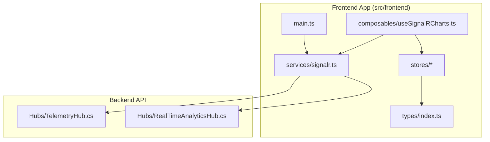
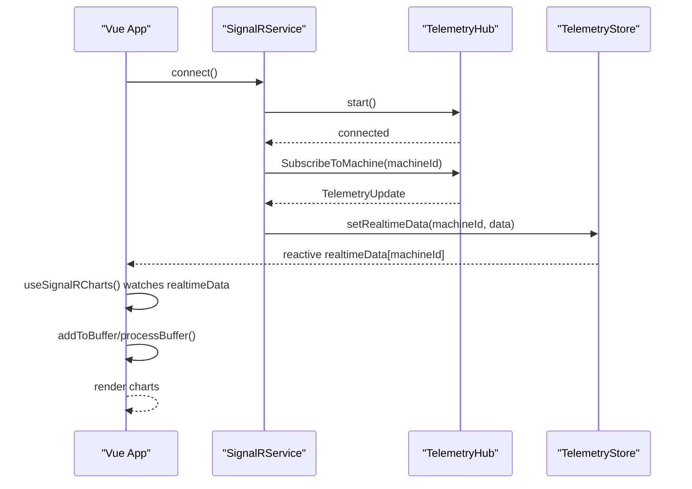
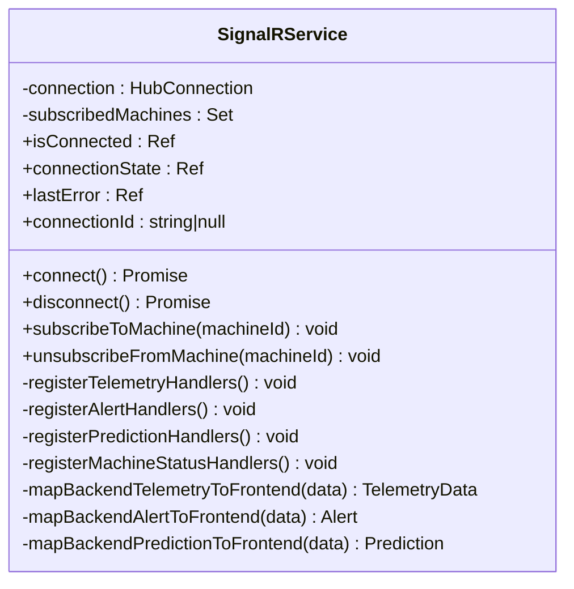
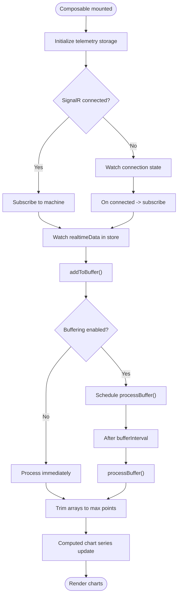
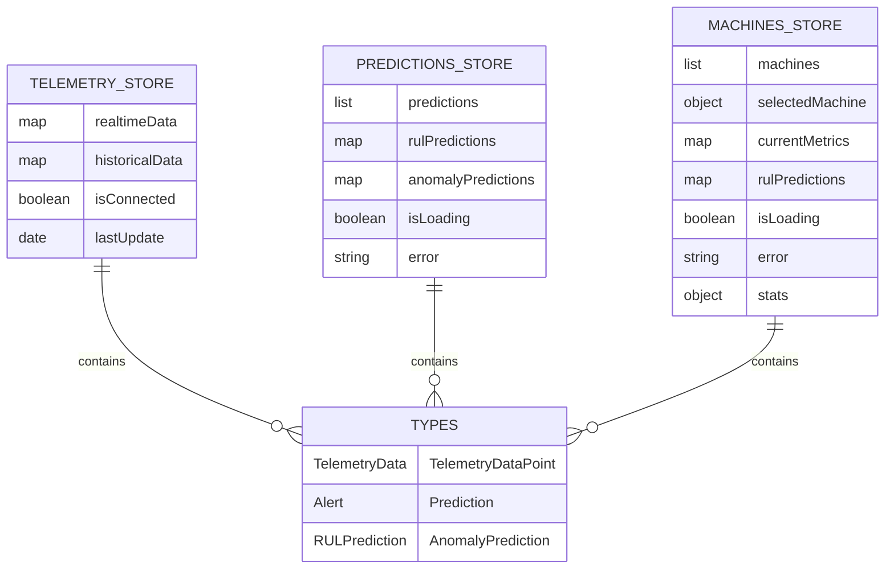
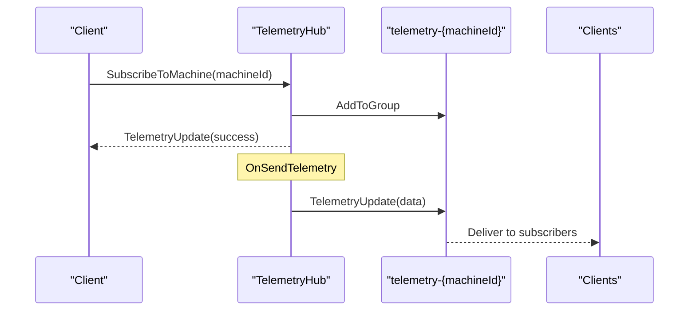
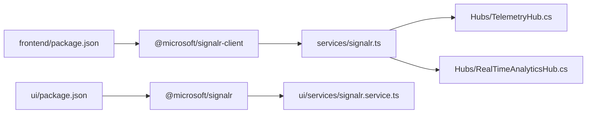

# Client-Side Integration

<cite>
**Referenced Files in This Document**
- [useSignalRCharts.ts](file://src/frontend/src/composables/useSignalRCharts.ts)
- [signalr.ts](file://src/frontend/src/services/signalr.ts)
- [TelemetryHub.cs](file://src/api/DigitalTwinPlatform.API/Hubs/TelemetryHub.cs)
- [RealTimeAnalyticsHub.cs](file://src/api/DigitalTwinPlatform.API/Hubs/RealTimeAnalyticsHub.cs)
- [telemetry.ts](file://src/frontend/src/stores/telemetry.ts)
- [predictions.ts](file://src/frontend/src/stores/predictions.ts)
- [machines.ts](file://src/frontend/src/stores/machines.ts)
- [index.ts](file://src/frontend/src/types/index.ts)
- [Dashboard.vue](file://src/frontend/src/views/Dashboard.vue)
- [main.ts](file://src/frontend/src/main.ts)
- [package.json](file://src/frontend/package.json)
- [signalr.service.ts](file://src/ui/digital-twin-dashboard/src/services/signalr.service.ts)
</cite>

## Table of Contents
1. [Introduction](#introduction)
2. [Project Structure](#project-structure)
3. [Core Components](#core-components)
4. [Architecture Overview](#architecture-overview)
5. [Detailed Component Analysis](#detailed-component-analysis)
6. [Dependency Analysis](#dependency-analysis)
7. [Performance Considerations](#performance-considerations)
8. [Troubleshooting Guide](#troubleshooting-guide)
9. [Conclusion](#conclusion)
10. [Appendices](#appendices)

## Introduction
This document explains client-side SignalR integration and real-time data consumption for the Digital Twin Platform. It covers SignalR client configuration, connection establishment, automatic reconnection handling, Vue.js composables for real-time chart updates, TypeScript services for telemetry consumption and subscription management, and practical examples for dashboard integration. It also addresses browser compatibility, connection state monitoring, graceful degradation strategies, debugging approaches, and performance optimization techniques.

## Project Structure
The client-side integration spans two frontend applications:
- A Vue 3 + Pinia + ApexCharts application under src/frontend
- A separate dashboard application under src/ui/digital-twin-dashboard using ECharts

Both share a common SignalR client service and composable for real-time telemetry and prediction updates. Stores manage reactive state for telemetry, predictions, and machine metrics.

**Diagram sources**
- [main.ts](file://src/frontend/src/main.ts#L1-L35)
- [signalr.ts](file://src/frontend/src/services/signalr.ts#L1-L271)
- [useSignalRCharts.ts](file://src/frontend/src/composables/useSignalRCharts.ts#L1-L352)
- [telemetry.ts](file://src/frontend/src/stores/telemetry.ts#L1-L58)
- [predictions.ts](file://src/frontend/src/stores/predictions.ts#L1-L112)
- [machines.ts](file://src/frontend/src/stores/machines.ts#L1-L238)
- [index.ts](file://src/frontend/src/types/index.ts#L1-L111)
- [TelemetryHub.cs](file://src/api/DigitalTwinPlatform.API/Hubs/TelemetryHub.cs#L1-L211)
- [RealTimeAnalyticsHub.cs](file://src/api/DigitalTwinPlatform.API/Hubs/RealTimeAnalyticsHub.cs#L1-L310)

**Section sources**
- [main.ts](file://src/frontend/src/main.ts#L1-L35)
- [package.json](file://src/frontend/package.json#L1-L44)

## Core Components
- SignalR client service: Manages connection, automatic reconnection, subscription lifecycle, and event handlers for telemetry, alerts, and predictions.
- Vue composable for charts: Buffers and batches real-time updates, exposes reactive chart datasets, and integrates with Pinia stores.
- Pinia stores: Provide reactive state for telemetry, predictions, and machine metrics; consumed by composables and charts.
- Backend hubs: TelemetryHub and RealTimeAnalyticsHub implement server-side groups and broadcasting for real-time updates.

Key responsibilities:
- Establish and maintain SignalR connection with automatic reconnection.
- Subscribe/unsubscribe to machine groups and handle re-subscription after reconnect.
- Map backend DTOs to frontend types and push updates into stores.
- Provide reactive data to charts with buffering and trimming to limit memory usage.

**Section sources**
- [signalr.ts](file://src/frontend/src/services/signalr.ts#L43-L267)
- [useSignalRCharts.ts](file://src/frontend/src/composables/useSignalRCharts.ts#L26-L303)
- [telemetry.ts](file://src/frontend/src/stores/telemetry.ts#L5-L57)
- [predictions.ts](file://src/frontend/src/stores/predictions.ts#L34-L111)
- [machines.ts](file://src/frontend/src/stores/machines.ts#L121-L237)
- [TelemetryHub.cs](file://src/api/DigitalTwinPlatform.API/Hubs/TelemetryHub.cs#L12-L184)
- [RealTimeAnalyticsHub.cs](file://src/api/DigitalTwinPlatform.API/Hubs/RealTimeAnalyticsHub.cs#L14-L244)

## Architecture Overview
The client connects to SignalR hubs and receives real-time events. The SignalR service maps events to frontend models and writes them into stores. The charts composable reads from stores and buffers updates for efficient rendering.

**Diagram sources**
- [signalr.ts](file://src/frontend/src/services/signalr.ts#L55-L110)
- [TelemetryHub.cs](file://src/api/DigitalTwinPlatform.API/Hubs/TelemetryHub.cs#L33-L62)
- [telemetry.ts](file://src/frontend/src/stores/telemetry.ts#L11-L14)
- [useSignalRCharts.ts](file://src/frontend/src/composables/useSignalRCharts.ts#L148-L164)

## Detailed Component Analysis

### SignalR Client Service
Responsibilities:
- Build HubConnection with URL and token factory.
- Configure automatic reconnection with backoff intervals.
- Register event handlers for telemetry, alerts, and predictions.
- Manage subscription lifecycle and resubscribe after reconnection.
- Map backend DTOs to frontend types and dispatch to stores.

Key behaviors:
- Connection state tracking via ref booleans and enums.
- Reconnection callbacks trigger resubscription to all tracked machines.
- Event handlers transform backend payloads into frontend models and update stores.

**Diagram sources**
- [signalr.ts](file://src/frontend/src/services/signalr.ts#L43-L267)

**Section sources**
- [signalr.ts](file://src/frontend/src/services/signalr.ts#L55-L110)
- [signalr.ts](file://src/frontend/src/services/signalr.ts#L122-L146)
- [signalr.ts](file://src/frontend/src/services/signalr.ts#L148-L204)
- [signalr.ts](file://src/frontend/src/services/signalr.ts#L207-L266)

### Vue Composable for Real-Time Charts
Responsibilities:
- Initialize telemetry storage per sensor type.
- Buffer and batch incoming updates to reduce render churn.
- Trim arrays to configured maximum points to prevent memory bloat.
- Watch Pinia store’s realtime data and convert to chart-friendly points.
- Expose single-sensor and multi-sensor chart helpers.

Buffering configuration:
- Max updates per second and batch size control throughput.
- Max data points cap ensures bounded memory usage.

Lifecycle management:
- onMounted subscribes to machine and starts watching.
- onUnmounted clears timeouts and unsubscribes.

**Diagram sources**
- [useSignalRCharts.ts](file://src/frontend/src/composables/useSignalRCharts.ts#L26-L134)
- [useSignalRCharts.ts](file://src/frontend/src/composables/useSignalRCharts.ts#L148-L164)
- [useSignalRCharts.ts](file://src/frontend/src/composables/useSignalRCharts.ts#L66-L92)

**Section sources**
- [useSignalRCharts.ts](file://src/frontend/src/composables/useSignalRCharts.ts#L12-L17)
- [useSignalRCharts.ts](file://src/frontend/src/composables/useSignalRCharts.ts#L57-L63)
- [useSignalRCharts.ts](file://src/frontend/src/composables/useSignalRCharts.ts#L112-L134)
- [useSignalRCharts.ts](file://src/frontend/src/composables/useSignalRCharts.ts#L148-L164)
- [useSignalRCharts.ts](file://src/frontend/src/composables/useSignalRCharts.ts#L249-L276)

### Stores and Data Models
Stores:
- TelemetryStore: holds realtime and historical telemetry keyed by machineId.
- PredictionsStore: holds predictions keyed by machineId and maintains a rolling list.
- MachinesStore: holds machine metadata, current metrics, and RUL predictions.

Data models:
- TelemetryData, TelemetryDataPoint, Alert, Prediction, RULPrediction, AnomalyPrediction.

**Diagram sources**
- [telemetry.ts](file://src/frontend/src/stores/telemetry.ts#L5-L57)
- [predictions.ts](file://src/frontend/src/stores/predictions.ts#L34-L111)
- [machines.ts](file://src/frontend/src/stores/machines.ts#L121-L237)
- [index.ts](file://src/frontend/src/types/index.ts#L21-L110)

**Section sources**
- [telemetry.ts](file://src/frontend/src/stores/telemetry.ts#L11-L25)
- [predictions.ts](file://src/frontend/src/stores/predictions.ts#L77-L90)
- [machines.ts](file://src/frontend/src/stores/machines.ts#L205-L215)
- [index.ts](file://src/frontend/src/types/index.ts#L21-L110)

### Backend Hubs
TelemetryHub:
- Manages machine-specific groups and subscription tracking.
- Confirms subscription/unsubscription and broadcasts telemetry updates.

RealTimeAnalyticsHub:
- Manages groups for predictions, alerts, and system health.
- Broadcasts predictions to clients upon request or periodically.

**Diagram sources**
- [TelemetryHub.cs](file://src/api/DigitalTwinPlatform.API/Hubs/TelemetryHub.cs#L33-L62)
- [TelemetryHub.cs](file://src/api/DigitalTwinPlatform.API/Hubs/TelemetryHub.cs#L109-L118)

**Section sources**
- [TelemetryHub.cs](file://src/api/DigitalTwinPlatform.API/Hubs/TelemetryHub.cs#L33-L103)
- [RealTimeAnalyticsHub.cs](file://src/api/DigitalTwinPlatform.API/Hubs/RealTimeAnalyticsHub.cs#L37-L76)

### Dashboard Integration Example
The main dashboard view demonstrates reactive data consumption from stores and basic connection status indicators. While it currently renders static demo data, the SignalR service and stores are wired to feed real-time updates when connected.

Practical integration steps:
- Initialize SignalRService during app bootstrap.
- Use useSignalRCharts in machine detail or dashboard widgets.
- Bind chart series to computed reactive data from the composable.
- Display connection state and last update timestamps.

**Section sources**
- [Dashboard.vue](file://src/frontend/src/views/Dashboard.vue#L194-L199)
- [main.ts](file://src/frontend/src/main.ts#L10-L21)

## Dependency Analysis
Client-side dependencies relevant to SignalR:
- @microsoft/signalr-client: Used by the primary SignalR service.
- @microsoft/signalr: Used by the secondary dashboard service.
- Vue 3, Pinia, and chart libraries (ApexCharts/ECharts) for rendering.

**Diagram sources**
- [package.json](file://src/frontend/package.json#L19-L19)
- [package.json](file://src/ui/digital-twin-dashboard/package.json#L27-L27)
- [signalr.ts](file://src/frontend/src/services/signalr.ts#L1-L1)
- [signalr.service.ts](file://src/ui/digital-twin-dashboard/src/services/signalr.service.ts#L1-L1)
- [TelemetryHub.cs](file://src/api/DigitalTwinPlatform.API/Hubs/TelemetryHub.cs#L1-L1)
- [RealTimeAnalyticsHub.cs](file://src/api/DigitalTwinPlatform.API/Hubs/RealTimeAnalyticsHub.cs#L1-L1)

**Section sources**
- [package.json](file://src/frontend/package.json#L14-L27)
- [package.json](file://src/ui/digital-twin-dashboard/package.json#L24-L39)

## Performance Considerations
- Buffering and batching: Limit render frequency by batching updates and flushing at a fixed interval.
- Data trimming: Keep only the most recent N data points per sensor to bound memory usage.
- Computed dependencies: Use computed getters to avoid unnecessary recomputations.
- Chart library efficiency: Prefer incremental updates and avoid full dataset replacement.
- Connection backoff: Automatic reconnection reduces manual polling and conserves bandwidth.
- Store normalization: Keep data normalized by machineId to minimize deep-watching overhead.

[No sources needed since this section provides general guidance]

## Troubleshooting Guide
Common issues and remedies:
- Connection fails or drops:
  - Verify VITE_HUB_URL and token availability.
  - Check onreconnecting/onclose logs and lastError state.
  - Ensure automatic reconnection intervals are configured.
- Subscriptions not applied after reconnect:
  - Confirm resubscribe loop runs on reconnected callback.
  - Validate machineId correctness and group naming.
- Charts not updating:
  - Ensure realtimeData watcher is active and addToBuffer is invoked.
  - Confirm buffer flush interval and batch size are appropriate.
- Type mismatches:
  - Validate backend DTOs match frontend types and mapping logic.
- CORS and authentication:
  - Ensure backend allows SignalR transport and JWT token injection.

Debugging tips:
- Inspect connectionState and isConnected refs.
- Log handler registrations and invocation outcomes.
- Monitor store updates and chart series bindings.
- Use browser devtools network tab to observe SignalR negotiation and transport.

**Section sources**
- [signalr.ts](file://src/frontend/src/services/signalr.ts#L70-L91)
- [signalr.ts](file://src/frontend/src/services/signalr.ts#L81-L84)
- [useSignalRCharts.ts](file://src/frontend/src/composables/useSignalRCharts.ts#L128-L133)
- [useSignalRCharts.ts](file://src/frontend/src/composables/useSignalRCharts.ts#L148-L164)

## Conclusion
The client-side SignalR integration leverages a robust service with automatic reconnection, structured subscription management, and efficient buffering to deliver responsive real-time dashboards. The Vue composables and Pinia stores provide a clean separation of concerns, enabling scalable chart rendering and reliable state synchronization. With careful attention to performance and error handling, the system supports smooth real-time experiences across browsers and devices.

[No sources needed since this section summarizes without analyzing specific files]

## Appendices

### Browser Compatibility Notes
- SignalR transports supported by @microsoft/signalr-client and @microsoft/signalr depend on the underlying platform. Ensure modern browsers and Node environments meet transport requirements (WebSockets, Server-Sent Events).
- Polyfills may be necessary for older environments; consult SignalR client documentation for transport compatibility.

[No sources needed since this section provides general guidance]

### Connection State Monitoring
- Observe isConnected, connectionState, and lastError refs from SignalRService.
- Display connection status in UI and provide retry controls.

**Section sources**
- [signalr.ts](file://src/frontend/src/services/signalr.ts#L47-L53)

### Graceful Degradation Strategies
- Fallback to periodic polling if SignalR is unavailable.
- Render static baseline charts while attempting reconnection.
- Disable real-time features and show notifications when connectivity is lost.

[No sources needed since this section provides general guidance]