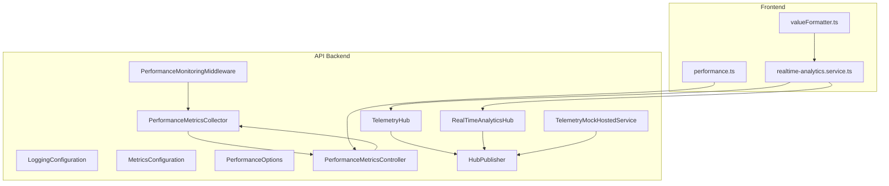
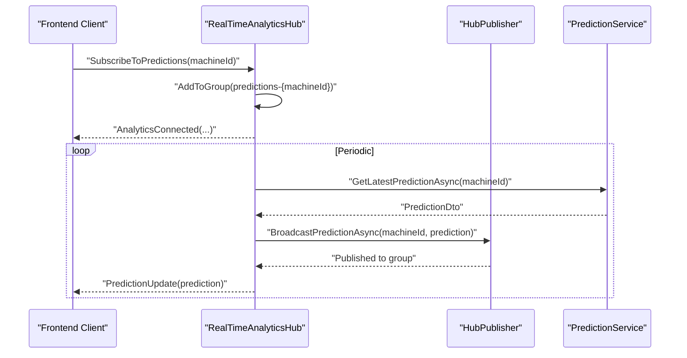
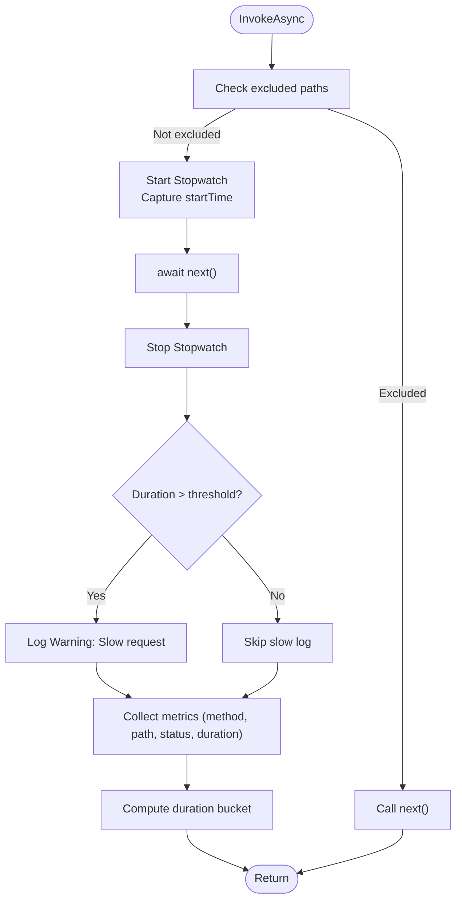
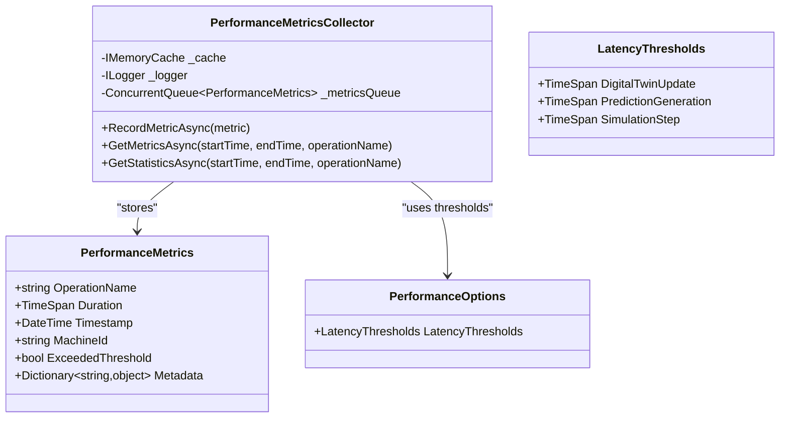
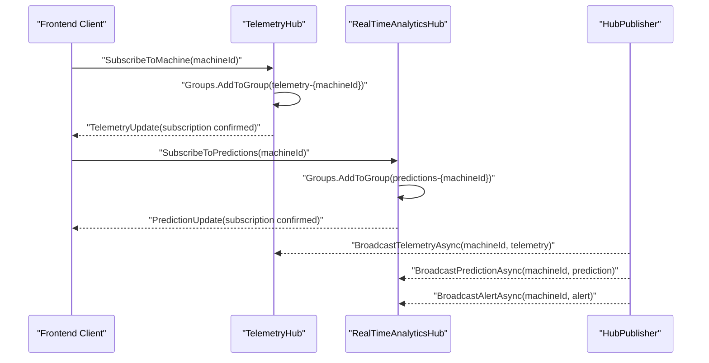
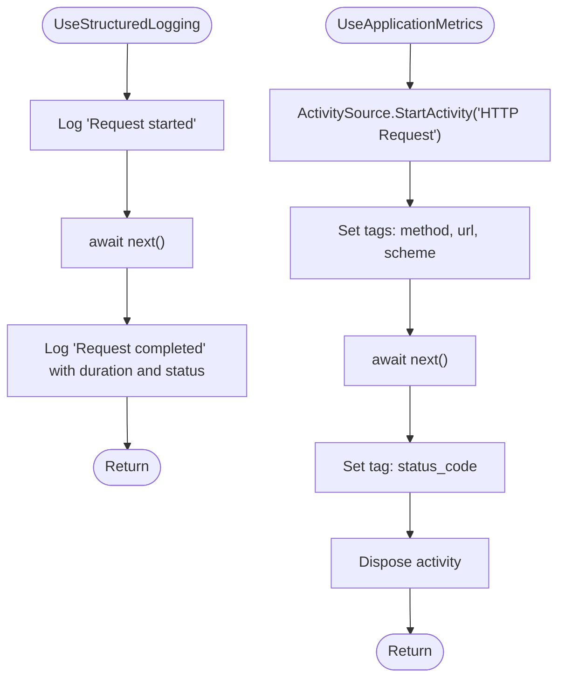
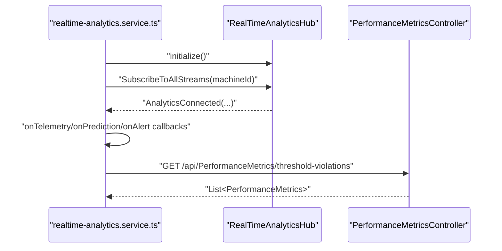
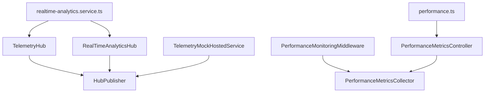

# Performance Monitoring and Optimization

<cite>
**Referenced Files in This Document**
- [PerformanceMonitoringMiddleware.cs](file://src/api/DigitalTwinPlatform.API/Middleware/PerformanceMonitoringMiddleware.cs)
- [LoggingConfiguration.cs](file://src/api/DigitalTwinPlatform.API/Infrastructure/LoggingConfiguration.cs)
- [MetricsConfiguration.cs](file://src/api/DigitalTwinPlatform.API/Infrastructure/MetricsConfiguration.cs)
- [PerformanceMetricsCollector.cs](file://src/api/DigitalTwinPlatform.API/Services/Infrastructure/PerformanceMetricsCollector.cs)
- [PerformanceOptions.cs](file://src/api/DigitalTwinPlatform.API/Services/Infrastructure/PerformanceOptions.cs)
- [PerformanceMetricsController.cs](file://src/api/DigitalTwinPlatform.API/Controllers/PerformanceMetricsController.cs)
- [TelemetryHub.cs](file://src/api/DigitalTwinPlatform.API/Hubs/TelemetryHub.cs)
- [RealTimeAnalyticsHub.cs](file://src/api/DigitalTwinPlatform.API/Hubs/RealTimeAnalyticsHub.cs)
- [HubPublisher.cs](file://src/api/DigitalTwinPlatform.API/Services/Infrastructure/HubPublisher.cs)
- [TelemetryMockHostedService.cs](file://src/api/DigitalTwinPlatform.API/Services/Telemetry/TelemetryMockHostedService.cs)
- [TelemetryController.cs](file://src/api/DigitalTwinPlatform.API/Controllers/TelemetryController.cs)
- [performance.ts](file://src/frontend/src/services/performance.ts)
- [realtime-analytics.service.ts](file://src/ui/digital-twin-dashboard/src/services/realtime-analytics.service.ts)
- [valueFormatter.ts](file://src/ui/digital-twin-dashboard/src/utils/valueFormatter.ts)
- [system-integrity-audit.md](file://system-integrity-audit.md)
</cite>

## Table of Contents
1. [Introduction](#introduction)
2. [Project Structure](#project-structure)
3. [Core Components](#core-components)
4. [Architecture Overview](#architecture-overview)
5. [Detailed Component Analysis](#detailed-component-analysis)
6. [Dependency Analysis](#dependency-analysis)
7. [Performance Considerations](#performance-considerations)
8. [Troubleshooting Guide](#troubleshooting-guide)
9. [Conclusion](#conclusion)
10. [Appendices](#appendices)

## Introduction
This document provides comprehensive guidance for real-time telemetry system performance monitoring and optimization. It explains how performance metrics are collected, how connections are tracked, and how resource utilization is monitored. It documents the middleware implementation for performance monitoring, including request timing, error tracking, and throughput measurement. It also covers logging configuration for telemetry systems, structured logging patterns, and diagnostic information capture. Practical examples demonstrate performance tuning, connection pooling optimization, and memory management strategies. Finally, it addresses scalability planning, load testing approaches, capacity planning for high-frequency telemetry streams, monitoring dashboards, alerting strategies, and troubleshooting methodologies for real-time system performance issues.

## Project Structure
The telemetry and performance monitoring stack spans the API backend, SignalR hubs, hosted services, and the frontend real-time clients. Key areas include:
- Middleware for request timing and slow request detection
- Structured logging and metrics instrumentation
- In-memory performance metrics collector with thresholds
- SignalR hubs for real-time telemetry and analytics
- Hosted service for mock telemetry generation
- Frontend services for real-time analytics and performance metrics retrieval

**Diagram sources**
- [PerformanceMonitoringMiddleware.cs](file://src/api/DigitalTwinPlatform.API/Middleware/PerformanceMonitoringMiddleware.cs#L1-L148)
- [LoggingConfiguration.cs](file://src/api/DigitalTwinPlatform.API/Infrastructure/LoggingConfiguration.cs#L1-L58)
- [MetricsConfiguration.cs](file://src/api/DigitalTwinPlatform.API/Infrastructure/MetricsConfiguration.cs#L1-L72)
- [PerformanceMetricsCollector.cs](file://src/api/DigitalTwinPlatform.API/Services/Infrastructure/PerformanceMetricsCollector.cs#L1-L131)
- [PerformanceOptions.cs](file://src/api/DigitalTwinPlatform.API/Services/Infrastructure/PerformanceOptions.cs#L1-L24)
- [PerformanceMetricsController.cs](file://src/api/DigitalTwinPlatform.API/Controllers/PerformanceMetricsController.cs#L1-L75)
- [TelemetryHub.cs](file://src/api/DigitalTwinPlatform.API/Hubs/TelemetryHub.cs#L1-L211)
- [RealTimeAnalyticsHub.cs](file://src/api/DigitalTwinPlatform.API/Hubs/RealTimeAnalyticsHub.cs#L1-L310)
- [HubPublisher.cs](file://src/api/DigitalTwinPlatform.API/Services/Infrastructure/HubPublisher.cs#L1-L104)
- [TelemetryMockHostedService.cs](file://src/api/DigitalTwinPlatform.API/Services/Telemetry/TelemetryMockHostedService.cs#L1-L173)
- [realtime-analytics.service.ts](file://src/ui/digital-twin-dashboard/src/services/realtime-analytics.service.ts#L109-L311)
- [performance.ts](file://src/frontend/src/services/performance.ts#L53-L60)
- [valueFormatter.ts](file://src/ui/digital-twin-dashboard/src/utils/valueFormatter.ts#L188-L216)

**Section sources**
- [PerformanceMonitoringMiddleware.cs](file://src/api/DigitalTwinPlatform.API/Middleware/PerformanceMonitoringMiddleware.cs#L1-L148)
- [LoggingConfiguration.cs](file://src/api/DigitalTwinPlatform.API/Infrastructure/LoggingConfiguration.cs#L1-L58)
- [MetricsConfiguration.cs](file://src/api/DigitalTwinPlatform.API/Infrastructure/MetricsConfiguration.cs#L1-L72)
- [PerformanceMetricsCollector.cs](file://src/api/DigitalTwinPlatform.API/Services/Infrastructure/PerformanceMetricsCollector.cs#L1-L131)
- [PerformanceOptions.cs](file://src/api/DigitalTwinPlatform.API/Services/Infrastructure/PerformanceOptions.cs#L1-L24)
- [PerformanceMetricsController.cs](file://src/api/DigitalTwinPlatform.API/Controllers/PerformanceMetricsController.cs#L1-L75)
- [TelemetryHub.cs](file://src/api/DigitalTwinPlatform.API/Hubs/TelemetryHub.cs#L1-L211)
- [RealTimeAnalyticsHub.cs](file://src/api/DigitalTwinPlatform.API/Hubs/RealTimeAnalyticsHub.cs#L1-L310)
- [HubPublisher.cs](file://src/api/DigitalTwinPlatform.API/Services/Infrastructure/HubPublisher.cs#L1-L104)
- [TelemetryMockHostedService.cs](file://src/api/DigitalTwinPlatform.API/Services/Telemetry/TelemetryMockHostedService.cs#L1-L173)
- [TelemetryController.cs](file://src/api/DigitalTwinPlatform.API/Controllers/TelemetryController.cs#L1-L202)
- [realtime-analytics.service.ts](file://src/ui/digital-twin-dashboard/src/services/realtime-analytics.service.ts#L109-L311)
- [performance.ts](file://src/frontend/src/services/performance.ts#L53-L60)
- [valueFormatter.ts](file://src/ui/digital-twin-dashboard/src/utils/valueFormatter.ts#L188-L216)

## Core Components
- PerformanceMonitoringMiddleware: Measures request durations, logs slow requests, and collects request metrics for downstream analysis.
- PerformanceMetricsCollector: Stores performance metrics in an in-memory queue and cache, computes latency percentiles, and tracks threshold violations.
- PerformanceOptions: Defines latency thresholds per operation category to drive alerting and diagnostics.
- PerformanceMetricsController: Exposes endpoints to query raw metrics, aggregated statistics, and threshold violations.
- TelemetryHub and RealTimeAnalyticsHub: Provide real-time streaming via SignalR groups and track connection lifecycles.
- HubPublisher: Centralized publisher for telemetry, predictions, and alerts to SignalR hubs.
- TelemetryMockHostedService: Generates periodic mock telemetry for development and load testing.
- LoggingConfiguration and MetricsConfiguration: Provide structured logging and basic metrics tagging via ActivitySource.
- Frontend services: Real-time analytics service manages SignalR subscriptions and connection lifecycle; performance service retrieves metrics; value formatter utilities assist in numeric conversions.

**Section sources**
- [PerformanceMonitoringMiddleware.cs](file://src/api/DigitalTwinPlatform.API/Middleware/PerformanceMonitoringMiddleware.cs#L1-L148)
- [PerformanceMetricsCollector.cs](file://src/api/DigitalTwinPlatform.API/Services/Infrastructure/PerformanceMetricsCollector.cs#L1-L131)
- [PerformanceOptions.cs](file://src/api/DigitalTwinPlatform.API/Services/Infrastructure/PerformanceOptions.cs#L1-L24)
- [PerformanceMetricsController.cs](file://src/api/DigitalTwinPlatform.API/Controllers/PerformanceMetricsController.cs#L1-L75)
- [TelemetryHub.cs](file://src/api/DigitalTwinPlatform.API/Hubs/TelemetryHub.cs#L1-L211)
- [RealTimeAnalyticsHub.cs](file://src/api/DigitalTwinPlatform.API/Hubs/RealTimeAnalyticsHub.cs#L1-L310)
- [HubPublisher.cs](file://src/api/DigitalTwinPlatform.API/Services/Infrastructure/HubPublisher.cs#L1-L104)
- [TelemetryMockHostedService.cs](file://src/api/DigitalTwinPlatform.API/Services/Telemetry/TelemetryMockHostedService.cs#L1-L173)
- [LoggingConfiguration.cs](file://src/api/DigitalTwinPlatform.API/Infrastructure/LoggingConfiguration.cs#L1-L58)
- [MetricsConfiguration.cs](file://src/api/DigitalTwinPlatform.API/Infrastructure/MetricsConfiguration.cs#L1-L72)
- [realtime-analytics.service.ts](file://src/ui/digital-twin-dashboard/src/services/realtime-analytics.service.ts#L109-L311)
- [performance.ts](file://src/frontend/src/services/performance.ts#L53-L60)
- [valueFormatter.ts](file://src/ui/digital-twin-dashboard/src/utils/valueFormatter.ts#L188-L216)

## Architecture Overview
The system integrates middleware-based request profiling, in-memory metrics aggregation, and real-time streaming via SignalR. The frontend connects to hubs for live telemetry and analytics, while backend services publish updates and maintain connection state.

**Diagram sources**
- [RealTimeAnalyticsHub.cs](file://src/api/DigitalTwinPlatform.API/Hubs/RealTimeAnalyticsHub.cs#L1-L310)
- [HubPublisher.cs](file://src/api/DigitalTwinPlatform.API/Services/Infrastructure/HubPublisher.cs#L1-L104)

**Section sources**
- [RealTimeAnalyticsHub.cs](file://src/api/DigitalTwinPlatform.API/Hubs/RealTimeAnalyticsHub.cs#L1-L310)
- [HubPublisher.cs](file://src/api/DigitalTwinPlatform.API/Services/Infrastructure/HubPublisher.cs#L1-L104)

## Detailed Component Analysis

### Performance Monitoring Middleware
The middleware measures request durations, excludes specific paths, logs slow requests, and collects metrics for further analysis. It uses a configurable slow request threshold and duration buckets for classification.

**Diagram sources**
- [PerformanceMonitoringMiddleware.cs](file://src/api/DigitalTwinPlatform.API/Middleware/PerformanceMonitoringMiddleware.cs#L25-L109)

**Section sources**
- [PerformanceMonitoringMiddleware.cs](file://src/api/DigitalTwinPlatform.API/Middleware/PerformanceMonitoringMiddleware.cs#L1-L148)

### Performance Metrics Collection and Aggregation
The collector maintains a bounded in-memory queue and per-operation caches to compute latency percentiles and track threshold violations. It exposes queries for raw metrics and aggregated statistics.

**Diagram sources**
- [PerformanceMetricsCollector.cs](file://src/api/DigitalTwinPlatform.API/Services/Infrastructure/PerformanceMetricsCollector.cs#L1-L131)
- [PerformanceOptions.cs](file://src/api/DigitalTwinPlatform.API/Services/Infrastructure/PerformanceOptions.cs#L1-L24)

**Section sources**
- [PerformanceMetricsCollector.cs](file://src/api/DigitalTwinPlatform.API/Services/Infrastructure/PerformanceMetricsCollector.cs#L1-L131)
- [PerformanceOptions.cs](file://src/api/DigitalTwinPlatform.API/Services/Infrastructure/PerformanceOptions.cs#L1-L24)

### Telemetry Streaming and Connection Tracking
SignalR hubs manage real-time subscriptions and connection lifecycles. Subscriptions are tracked per machine and cleaned up on disconnect. Publishers broadcast telemetry, predictions, and alerts to respective groups.

**Diagram sources**
- [TelemetryHub.cs](file://src/api/DigitalTwinPlatform.API/Hubs/TelemetryHub.cs#L33-L118)
- [RealTimeAnalyticsHub.cs](file://src/api/DigitalTwinPlatform.API/Hubs/RealTimeAnalyticsHub.cs#L37-L172)
- [HubPublisher.cs](file://src/api/DigitalTwinPlatform.API/Services/Infrastructure/HubPublisher.cs#L32-L90)

**Section sources**
- [TelemetryHub.cs](file://src/api/DigitalTwinPlatform.API/Hubs/TelemetryHub.cs#L1-L211)
- [RealTimeAnalyticsHub.cs](file://src/api/DigitalTwinPlatform.API/Hubs/RealTimeAnalyticsHub.cs#L1-L310)
- [HubPublisher.cs](file://src/api/DigitalTwinPlatform.API/Services/Infrastructure/HubPublisher.cs#L1-L104)

### Logging and Metrics Instrumentation
Structured logging captures request lifecycle events with duration and status. Metrics instrumentation tags requests with method, URL, scheme, and status code using ActivitySource.

**Diagram sources**
- [LoggingConfiguration.cs](file://src/api/DigitalTwinPlatform.API/Infrastructure/LoggingConfiguration.cs#L27-L56)
- [MetricsConfiguration.cs](file://src/api/DigitalTwinPlatform.API/Infrastructure/MetricsConfiguration.cs#L18-L46)

**Section sources**
- [LoggingConfiguration.cs](file://src/api/DigitalTwinPlatform.API/Infrastructure/LoggingConfiguration.cs#L1-L58)
- [MetricsConfiguration.cs](file://src/api/DigitalTwinPlatform.API/Infrastructure/MetricsConfiguration.cs#L1-L72)

### Frontend Real-time Analytics and Performance Metrics Retrieval
The frontend service manages SignalR connections, subscribes/unsubscribes to streams, and handles reconnection events. It also retrieves performance metrics and threshold violations from backend APIs.

**Diagram sources**
- [realtime-analytics.service.ts](file://src/ui/digital-twin-dashboard/src/services/realtime-analytics.service.ts#L109-L311)
- [performance.ts](file://src/frontend/src/services/performance.ts#L53-L60)
- [PerformanceMetricsController.cs](file://src/api/DigitalTwinPlatform.API/Controllers/PerformanceMetricsController.cs#L60-L73)

**Section sources**
- [realtime-analytics.service.ts](file://src/ui/digital-twin-dashboard/src/services/realtime-analytics.service.ts#L109-L311)
- [performance.ts](file://src/frontend/src/services/performance.ts#L53-L60)
- [PerformanceMetricsController.cs](file://src/api/DigitalTwinPlatform.API/Controllers/PerformanceMetricsController.cs#L1-L75)

## Dependency Analysis
The following diagram highlights key dependencies among performance monitoring components.

**Diagram sources**
- [PerformanceMonitoringMiddleware.cs](file://src/api/DigitalTwinPlatform.API/Middleware/PerformanceMonitoringMiddleware.cs#L1-L148)
- [PerformanceMetricsCollector.cs](file://src/api/DigitalTwinPlatform.API/Services/Infrastructure/PerformanceMetricsCollector.cs#L1-L131)
- [PerformanceMetricsController.cs](file://src/api/DigitalTwinPlatform.API/Controllers/PerformanceMetricsController.cs#L1-L75)
- [TelemetryHub.cs](file://src/api/DigitalTwinPlatform.API/Hubs/TelemetryHub.cs#L1-L211)
- [RealTimeAnalyticsHub.cs](file://src/api/DigitalTwinPlatform.API/Hubs/RealTimeAnalyticsHub.cs#L1-L310)
- [HubPublisher.cs](file://src/api/DigitalTwinPlatform.API/Services/Infrastructure/HubPublisher.cs#L1-L104)
- [TelemetryMockHostedService.cs](file://src/api/DigitalTwinPlatform.API/Services/Telemetry/TelemetryMockHostedService.cs#L1-L173)
- [realtime-analytics.service.ts](file://src/ui/digital-twin-dashboard/src/services/realtime-analytics.service.ts#L109-L311)
- [performance.ts](file://src/frontend/src/services/performance.ts#L53-L60)

**Section sources**
- [PerformanceMonitoringMiddleware.cs](file://src/api/DigitalTwinPlatform.API/Middleware/PerformanceMonitoringMiddleware.cs#L1-L148)
- [PerformanceMetricsCollector.cs](file://src/api/DigitalTwinPlatform.API/Services/Infrastructure/PerformanceMetricsCollector.cs#L1-L131)
- [PerformanceMetricsController.cs](file://src/api/DigitalTwinPlatform.API/Controllers/PerformanceMetricsController.cs#L1-L75)
- [TelemetryHub.cs](file://src/api/DigitalTwinPlatform.API/Hubs/TelemetryHub.cs#L1-L211)
- [RealTimeAnalyticsHub.cs](file://src/api/DigitalTwinPlatform.API/Hubs/RealTimeAnalyticsHub.cs#L1-L310)
- [HubPublisher.cs](file://src/api/DigitalTwinPlatform.API/Services/Infrastructure/HubPublisher.cs#L1-L104)
- [TelemetryMockHostedService.cs](file://src/api/DigitalTwinPlatform.API/Services/Telemetry/TelemetryMockHostedService.cs#L1-L173)
- [realtime-analytics.service.ts](file://src/ui/digital-twin-dashboard/src/services/realtime-analytics.service.ts#L109-L311)
- [performance.ts](file://src/frontend/src/services/performance.ts#L53-L60)

## Performance Considerations
- Request timing and throughput
  - Use the middleware’s slow request detection and duration buckets to identify hotspots.
  - Monitor throughput via request counts and response sizes captured in middleware metrics.
- Threshold-based alerting
  - Configure latency thresholds in PerformanceOptions to trigger warnings when operations exceed targets.
  - Use PerformanceMetricsController endpoints to surface threshold violations for dashboards.
- Memory management
  - The collector enforces a maximum cached metrics count and bounds the per-operation cache lists to prevent unbounded growth.
- Connection tracking
  - SignalR hubs maintain concurrent dictionaries for subscription tracking and clean up on disconnect to avoid leaks.
- Logging overhead
  - Structured logging adds minimal overhead; ensure log levels are tuned appropriately for production environments.
- Telemetry ingestion
  - Mock telemetry service generates periodic batches; adjust interval and batch size to match load testing targets.

[No sources needed since this section provides general guidance]

## Troubleshooting Guide
Common issues and remedies:
- Slow requests
  - Investigate middleware logs for slow request entries and correlate with backend processing times.
  - Adjust slow request threshold and excluded paths as needed.
- Threshold violations
  - Review aggregated statistics and raw metrics to identify operations exceeding latency thresholds.
  - Use threshold-violations endpoint to pinpoint problematic periods.
- Connection drops
  - Inspect SignalR hub logs for disconnection events and cleanup routines.
  - Verify frontend reconnection callbacks and toast notifications for user feedback.
- Telemetry gaps
  - Confirm mock telemetry service is running in development and repositories are functioning in production.
  - Validate hub publisher broadcasts and group membership for targeted clients.

**Section sources**
- [PerformanceMonitoringMiddleware.cs](file://src/api/DigitalTwinPlatform.API/Middleware/PerformanceMonitoringMiddleware.cs#L46-L55)
- [PerformanceMetricsController.cs](file://src/api/DigitalTwinPlatform.API/Controllers/PerformanceMetricsController.cs#L60-L73)
- [TelemetryHub.cs](file://src/api/DigitalTwinPlatform.API/Hubs/TelemetryHub.cs#L150-L183)
- [RealTimeAnalyticsHub.cs](file://src/api/DigitalTwinPlatform.API/Hubs/RealTimeAnalyticsHub.cs#L227-L244)
- [TelemetryMockHostedService.cs](file://src/api/DigitalTwinPlatform.API/Services/Telemetry/TelemetryMockHostedService.cs#L96-L105)
- [HubPublisher.cs](file://src/api/DigitalTwinPlatform.API/Services/Infrastructure/HubPublisher.cs#L32-L90)

## Conclusion
The system combines middleware-based request profiling, in-memory metrics aggregation, and SignalR-driven real-time streaming to deliver a robust telemetry performance monitoring solution. By leveraging structured logging, configurable thresholds, and centralized publishing, teams can monitor latency, detect anomalies, and scale effectively. The included frontend services enable interactive dashboards and real-time alerts, while hosted services support load testing and development scenarios.

[No sources needed since this section summarizes without analyzing specific files]

## Appendices

### Practical Examples

- Performance tuning
  - Tune slow request threshold and excluded paths in middleware options.
  - Adjust latency thresholds in PerformanceOptions to reflect operational SLAs.
  - Use aggregated statistics to identify bottlenecks and optimize accordingly.

- Connection pooling optimization
  - Monitor active connections via system health broadcasts and hub logs.
  - Scale SignalR backplane and connection limits based on observed concurrency.

- Memory management strategies
  - Keep MaxCachedMetrics and per-operation cache list sizes aligned with retention needs.
  - Monitor queue dequeue behavior to ensure timely removal of stale metrics.

- Scalability planning and load testing
  - Use TelemetryMockHostedService to simulate high-frequency telemetry streams.
  - Gradually increase batch sizes and intervals to assess throughput limits.

- Capacity planning for high-frequency telemetry
  - Track average and percentile latencies to size databases and caching tiers.
  - Plan for peak burst rates by provisioning extra buffer in ingestion and publishing paths.

- Monitoring dashboards and alerting
  - Expose threshold-violations and statistics endpoints to feed dashboards.
  - Configure alerts when exceeded-threshold percentage exceeds predefined thresholds.

- Troubleshooting methodologies
  - Correlate middleware logs with SignalR hub logs for end-to-end visibility.
  - Use frontend reconnection logs to diagnose transient network issues.

**Section sources**
- [PerformanceOptions.cs](file://src/api/DigitalTwinPlatform.API/Services/Infrastructure/PerformanceOptions.cs#L8-L13)
- [TelemetryMockHostedService.cs](file://src/api/DigitalTwinPlatform.API/Services/Telemetry/TelemetryMockHostedService.cs#L21-L22)
- [PerformanceMetricsCollector.cs](file://src/api/DigitalTwinPlatform.API/Services/Infrastructure/PerformanceMetricsCollector.cs#L11-L33)
- [PerformanceMetricsController.cs](file://src/api/DigitalTwinPlatform.API/Controllers/PerformanceMetricsController.cs#L43-L55)
- [TelemetryHub.cs](file://src/api/DigitalTwinPlatform.API/Hubs/TelemetryHub.cs#L138-L183)
- [RealTimeAnalyticsHub.cs](file://src/api/DigitalTwinPlatform.API/Hubs/RealTimeAnalyticsHub.cs#L177-L244)
- [realtime-analytics.service.ts](file://src/ui/digital-twin-dashboard/src/services/realtime-analytics.service.ts#L143-L161)
- [performance.ts](file://src/frontend/src/services/performance.ts#L53-L60)