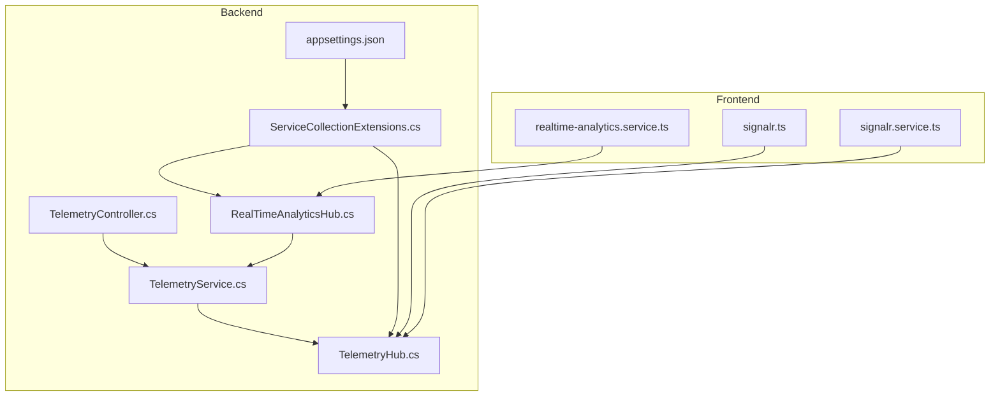
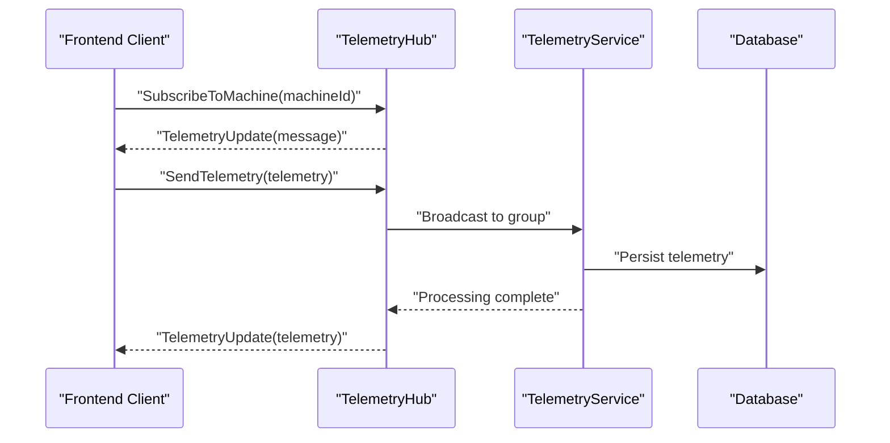
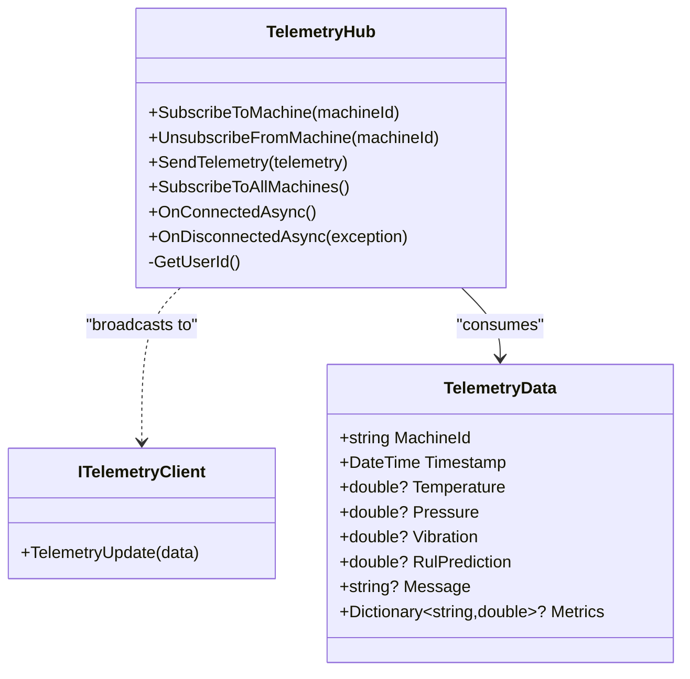
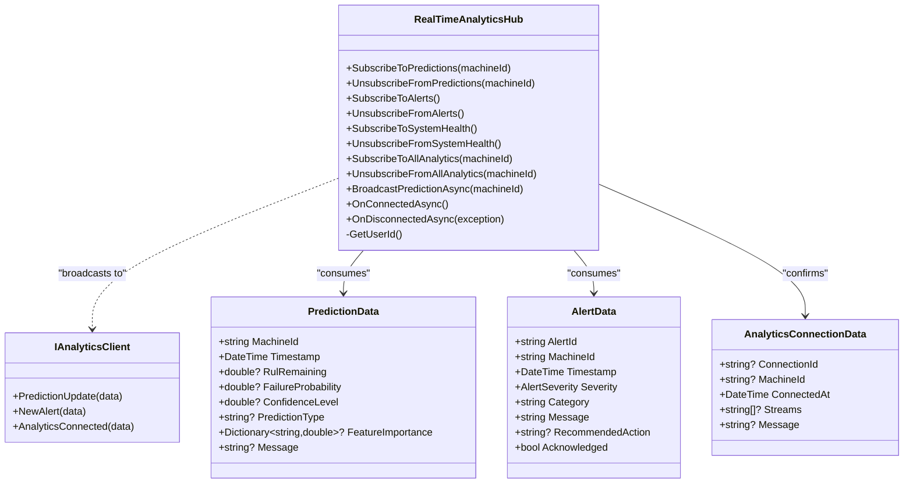
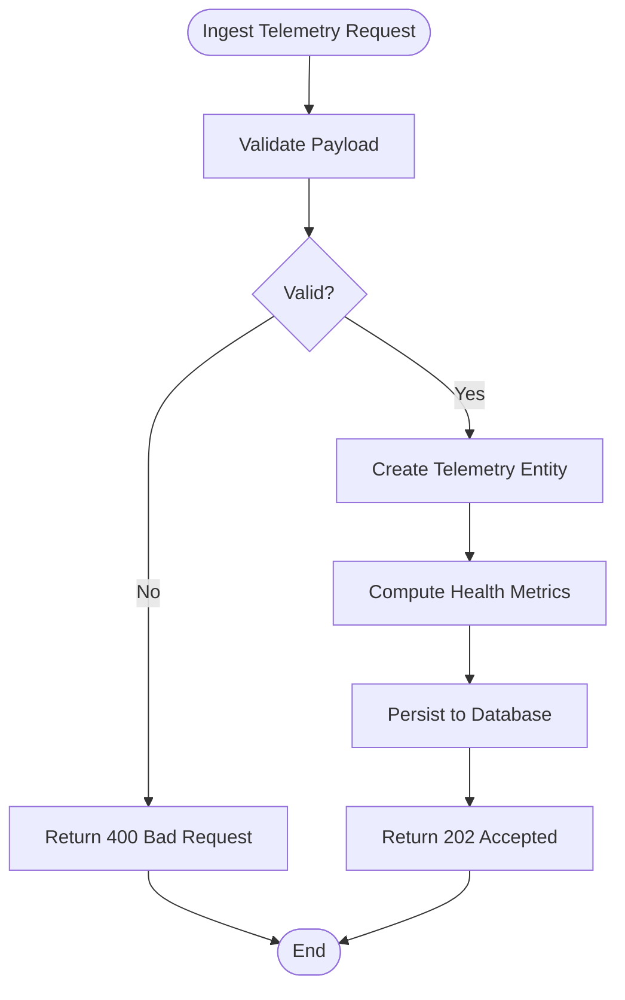
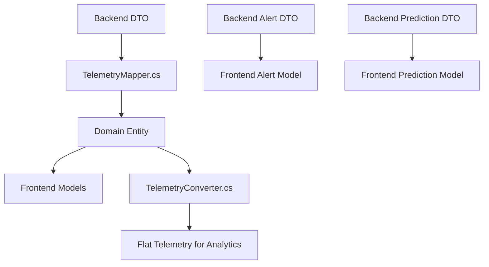
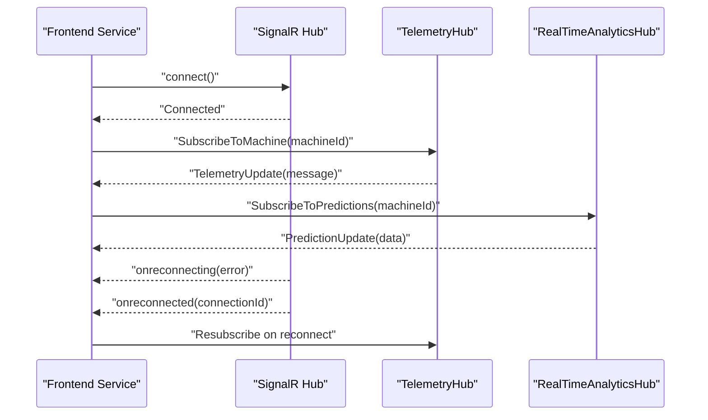
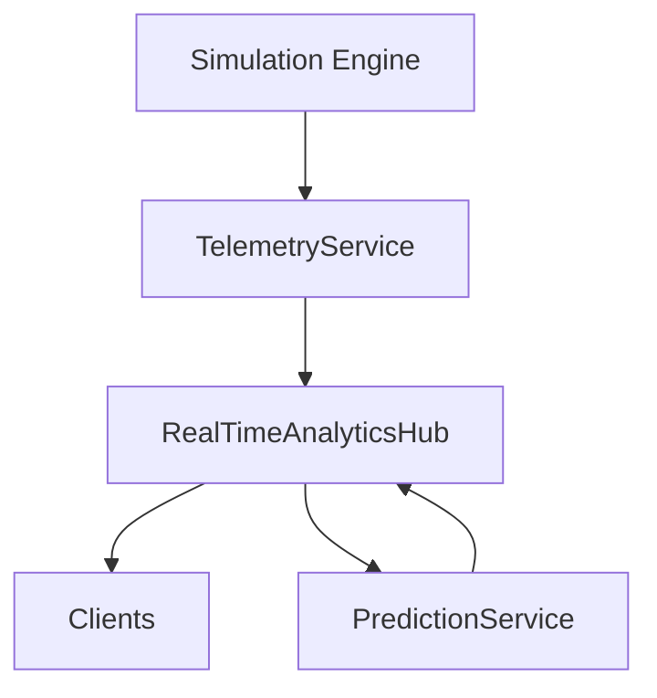
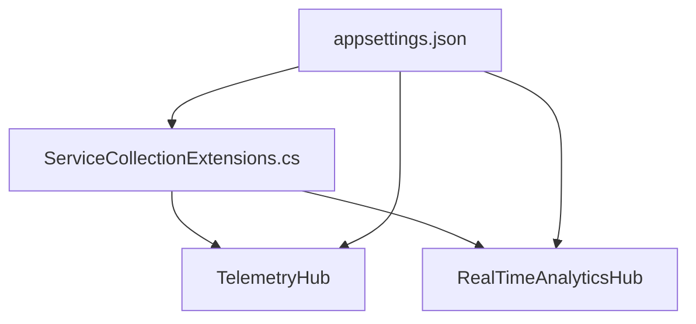

# Real-time Telemetry System

<cite>
**Referenced Files in This Document**
- [TelemetryHub.cs](file://src/api/DigitalTwinPlatform.API/Hubs/TelemetryHub.cs)
- [RealTimeAnalyticsHub.cs](file://src/api/DigitalTwinPlatform.API/Hubs/RealTimeAnalyticsHub.cs)
- [signalr.ts](file://src/frontend/src/services/signalr.ts)
- [signalr.service.ts](file://src/ui/digital-twin-dashboard/src/services/signalr.service.ts)
- [TelemetryController.cs](file://src/api/DigitalTwinPlatform.API/Controllers/TelemetryController.cs)
- [TelemetryService.cs](file://src/api/DigitalTwinPlatform.Application/Services/TelemetryService.cs)
- [ServiceCollectionExtensions.cs](file://src/api/DigitalTwinPlatform.API/Extensions/ServiceCollectionExtensions.cs)
- [appsettings.json](file://src/api/DigitalTwinPlatform.API/appsettings.json)
- [TelemetryMapper.cs](file://src/api/DigitalTwinPlatform.Application/Telemetry/TelemetryMapper.cs)
- [TelemetryValidators.cs](file://src/api/DigitalTwinPlatform.API/Validators/TelemetryValidators.cs)
- [TelemetryValidators.cs](file://src/api/DigitalTwinPlatform.Application/Telemetry/Validators/TelemetryValidators.cs)
- [TelemetryConverter.cs](file://src/api/DigitalTwinPlatform.API/Services/Analytics/Advanced/TelemetryConverter.cs)
- [DataArchivalService.cs](file://src/api/DigitalTwinPlatform.API/Services/Infrastructure/DataArchivalService.cs)
- [realtime-analytics.service.ts](file://src/ui/digital-twin-dashboard/src/services/realtime-analytics.service.ts)
</cite>

## Table of Contents
1. [Introduction](#introduction)
2. [Project Structure](#project-structure)
3. [Core Components](#core-components)
4. [Architecture Overview](#architecture-overview)
5. [Detailed Component Analysis](#detailed-component-analysis)
6. [Dependency Analysis](#dependency-analysis)
7. [Performance Considerations](#performance-considerations)
8. [Troubleshooting Guide](#troubleshooting-guide)
9. [Conclusion](#conclusion)
10. [Appendices](#appendices)

## Introduction
This document describes the real-time telemetry system built on ASP.NET Core SignalR, covering hub architecture, connection management, streaming data broadcasting, ingestion pipeline, data transformation, and performance monitoring. It also documents client-side integration, connection handling, error recovery, telemetry visualization, real-time analytics, dashboard updates, integration with the digital twin simulation engine and prediction systems, scalability considerations, Redis backplane configuration, and monitoring/logging approaches for real-time systems.

## Project Structure
The real-time telemetry system spans three primary areas:
- Backend SignalR hubs for telemetry and analytics streaming
- API controllers for telemetry ingestion and retrieval
- Frontend services for SignalR client connections and real-time updates

**Diagram sources**
- [TelemetryHub.cs](file://src/api/DigitalTwinPlatform.API/Hubs/TelemetryHub.cs#L1-L211)
- [RealTimeAnalyticsHub.cs](file://src/api/DigitalTwinPlatform.API/Hubs/RealTimeAnalyticsHub.cs#L1-L310)
- [TelemetryController.cs](file://src/api/DigitalTwinPlatform.API/Controllers/TelemetryController.cs#L1-L202)
- [TelemetryService.cs](file://src/api/DigitalTwinPlatform.Application/Services/TelemetryService.cs#L1-L189)
- [ServiceCollectionExtensions.cs](file://src/api/DigitalTwinPlatform.API/Extensions/ServiceCollectionExtensions.cs#L105-L131)
- [appsettings.json](file://src/api/DigitalTwinPlatform.API/appsettings.json#L1-L93)
- [signalr.ts](file://src/frontend/src/services/signalr.ts#L1-L271)
- [signalr.service.ts](file://src/ui/digital-twin-dashboard/src/services/signalr.service.ts#L1-L62)
- [realtime-analytics.service.ts](file://src/ui/digital-twin-dashboard/src/services/realtime-analytics.service.ts#L229-L279)

**Section sources**
- [TelemetryHub.cs](file://src/api/DigitalTwinPlatform.API/Hubs/TelemetryHub.cs#L1-L211)
- [RealTimeAnalyticsHub.cs](file://src/api/DigitalTwinPlatform.API/Hubs/RealTimeAnalyticsHub.cs#L1-L310)
- [TelemetryController.cs](file://src/api/DigitalTwinPlatform.API/Controllers/TelemetryController.cs#L1-L202)
- [TelemetryService.cs](file://src/api/DigitalTwinPlatform.Application/Services/TelemetryService.cs#L1-L189)
- [ServiceCollectionExtensions.cs](file://src/api/DigitalTwinPlatform.API/Extensions/ServiceCollectionExtensions.cs#L105-L131)
- [appsettings.json](file://src/api/DigitalTwinPlatform.API/appsettings.json#L1-L93)
- [signalr.ts](file://src/frontend/src/services/signalr.ts#L1-L271)
- [signalr.service.ts](file://src/ui/digital-twin-dashboard/src/services/signalr.service.ts#L1-L62)
- [realtime-analytics.service.ts](file://src/ui/digital-twin-dashboard/src/services/realtime-analytics.service.ts#L229-L279)

## Core Components
- TelemetryHub: Manages machine-specific telemetry subscriptions, broadcasts telemetry updates, and handles connection lifecycle events.
- RealTimeAnalyticsHub: Manages analytics subscriptions (predictions, alerts, system health), orchestrates prediction broadcasts, and manages connection lifecycle.
- TelemetryController: Exposes REST endpoints for telemetry ingestion, retrieval, and search.
- TelemetryService: Persists telemetry, computes health metrics, and coordinates real-time updates.
- SignalR Frontend Services: Establish SignalR connections, manage subscriptions, handle reconnections, and process incoming events.

Key responsibilities:
- Connection management: Automatic reconnection, state tracking, and cleanup on disconnect.
- Streaming patterns: Group-based broadcasting per machine and global streams for alerts/system health.
- Data transformation: Mapping backend DTOs to frontend models and flattening telemetry metrics.
- Performance monitoring: Logging thresholds and warnings for processing latency.

**Section sources**
- [TelemetryHub.cs](file://src/api/DigitalTwinPlatform.API/Hubs/TelemetryHub.cs#L12-L184)
- [RealTimeAnalyticsHub.cs](file://src/api/DigitalTwinPlatform.API/Hubs/RealTimeAnalyticsHub.cs#L14-L244)
- [TelemetryController.cs](file://src/api/DigitalTwinPlatform.API/Controllers/TelemetryController.cs#L20-L201)
- [TelemetryService.cs](file://src/api/DigitalTwinPlatform.Application/Services/TelemetryService.cs#L14-L189)
- [signalr.ts](file://src/frontend/src/services/signalr.ts#L43-L271)

## Architecture Overview
The system follows a hub-and-spoke pattern:
- Clients connect to SignalR hubs and subscribe to groups.
- Backend hubs broadcast messages to subscribed clients.
- Telemetry ingestion flows through REST APIs to the application service layer, which persists data and coordinates real-time updates.

**Diagram sources**
- [TelemetryHub.cs](file://src/api/DigitalTwinPlatform.API/Hubs/TelemetryHub.cs#L33-L118)
- [TelemetryService.cs](file://src/api/DigitalTwinPlatform.Application/Services/TelemetryService.cs#L30-L86)

**Section sources**
- [TelemetryHub.cs](file://src/api/DigitalTwinPlatform.API/Hubs/TelemetryHub.cs#L33-L118)
- [TelemetryService.cs](file://src/api/DigitalTwinPlatform.Application/Services/TelemetryService.cs#L30-L86)

## Detailed Component Analysis

### TelemetryHub Analysis
TelemetryHub implements:
- Subscription management: Adds/removes clients from machine-specific groups and tracks subscriptions.
- Broadcasting: Sends telemetry updates to the machine group.
- Lifecycle hooks: Logs connection/disconnection events and performs cleanup.

**Diagram sources**
- [TelemetryHub.cs](file://src/api/DigitalTwinPlatform.API/Hubs/TelemetryHub.cs#L12-L210)

**Section sources**
- [TelemetryHub.cs](file://src/api/DigitalTwinPlatform.API/Hubs/TelemetryHub.cs#L33-L118)

### RealTimeAnalyticsHub Analysis
RealTimeAnalyticsHub implements:
- Analytics subscriptions: Predictions, alerts, system health, and combined analytics streams.
- Prediction broadcasting: Retrieves latest prediction and broadcasts to subscribed clients.
- Lifecycle hooks: Logs connection/disconnection events.

**Diagram sources**
- [RealTimeAnalyticsHub.cs](file://src/api/DigitalTwinPlatform.API/Hubs/RealTimeAnalyticsHub.cs#L14-L310)

**Section sources**
- [RealTimeAnalyticsHub.cs](file://src/api/DigitalTwinPlatform.API/Hubs/RealTimeAnalyticsHub.cs#L37-L222)

### Telemetry Ingestion Pipeline
The ingestion pipeline:
- Validates incoming telemetry payloads.
- Persists telemetry data.
- Computes health metrics.
- Coordinates real-time updates.

**Diagram sources**
- [TelemetryController.cs](file://src/api/DigitalTwinPlatform.API/Controllers/TelemetryController.cs#L52-L56)
- [TelemetryService.cs](file://src/api/DigitalTwinPlatform.Application/Services/TelemetryService.cs#L30-L86)
- [TelemetryValidators.cs](file://src/api/DigitalTwinPlatform.API/Validators/TelemetryValidators.cs#L6-L14)

**Section sources**
- [TelemetryController.cs](file://src/api/DigitalTwinPlatform.API/Controllers/TelemetryController.cs#L52-L56)
- [TelemetryService.cs](file://src/api/DigitalTwinPlatform.Application/Services/TelemetryService.cs#L30-L86)
- [TelemetryValidators.cs](file://src/api/DigitalTwinPlatform.API/Validators/TelemetryValidators.cs#L6-L14)

### Data Transformation and Flattening
Data transformation occurs at multiple layers:
- Backend DTO mapping to domain entities and telemetry metrics.
- Frontend mapping of backend telemetry/alert/prediction data to UI models.
- Analytics flattening for downstream processing.

**Diagram sources**
- [TelemetryMapper.cs](file://src/api/DigitalTwinPlatform.Application/Telemetry/TelemetryMapper.cs#L7-L37)
- [signalr.ts](file://src/frontend/src/services/signalr.ts#L207-L266)
- [TelemetryConverter.cs](file://src/api/DigitalTwinPlatform.API/Services/Analytics/Advanced/TelemetryConverter.cs#L9-L38)

**Section sources**
- [TelemetryMapper.cs](file://src/api/DigitalTwinPlatform.Application/Telemetry/TelemetryMapper.cs#L7-L37)
- [signalr.ts](file://src/frontend/src/services/signalr.ts#L207-L266)
- [TelemetryConverter.cs](file://src/api/DigitalTwinPlatform.API/Services/Analytics/Advanced/TelemetryConverter.cs#L9-L38)

### Client-side Integration and Connection Handling
Client-side services:
- Establish SignalR connections with automatic reconnection.
- Register handlers for telemetry, alerts, and predictions.
- Manage subscriptions and handle reconnection scenarios.
- Map backend DTOs to frontend models.

**Diagram sources**
- [signalr.ts](file://src/frontend/src/services/signalr.ts#L55-L110)
- [signalr.ts](file://src/frontend/src/services/signalr.ts#L122-L146)
- [realtime-analytics.service.ts](file://src/ui/digital-twin-dashboard/src/services/realtime-analytics.service.ts#L229-L279)

**Section sources**
- [signalr.ts](file://src/frontend/src/services/signalr.ts#L55-L110)
- [signalr.ts](file://src/frontend/src/services/signalr.ts#L122-L146)
- [realtime-analytics.service.ts](file://src/ui/digital-twin-dashboard/src/services/realtime-analytics.service.ts#L229-L279)

### Telemetry Visualization and Dashboard Updates
Visualization and dashboard updates rely on:
- Real-time streaming of telemetry, predictions, and alerts.
- Frontend stores and reactive UI components consuming SignalR events.
- Latest telemetry endpoints for status indicators and historical queries for charts.

Practical examples:
- Dashboard status cards consume latest telemetry metrics.
- Charts subscribe to telemetry batches and render trends.
- Alerts panel displays real-time alerts with severity mapping.

**Section sources**
- [TelemetryController.cs](file://src/api/DigitalTwinPlatform.API/Controllers/TelemetryController.cs#L132-L176)
- [signalr.ts](file://src/frontend/src/services/signalr.ts#L148-L204)

### Integration with Digital Twin Simulation Engine and Prediction Systems
Integration points:
- Predictions are broadcast to clients via RealTimeAnalyticsHub.
- Simulation engine generates synthetic telemetry and predictions.
- Prediction caching and thresholds configured in application settings.

**Diagram sources**
- [RealTimeAnalyticsHub.cs](file://src/api/DigitalTwinPlatform.API/Hubs/RealTimeAnalyticsHub.cs#L196-L222)
- [TelemetryService.cs](file://src/api/DigitalTwinPlatform.Application/Services/TelemetryService.cs#L73-L78)

**Section sources**
- [RealTimeAnalyticsHub.cs](file://src/api/DigitalTwinPlatform.API/Hubs/RealTimeAnalyticsHub.cs#L196-L222)
- [TelemetryService.cs](file://src/api/DigitalTwinPlatform.Application/Services/TelemetryService.cs#L73-L78)

## Dependency Analysis
SignalR configuration and settings:
- JSON protocol with custom serializer options.
- Hub-specific options for keep-alive, handshake timeout, and message size.
- Redis backplane configuration keys present in appsettings.

**Diagram sources**
- [ServiceCollectionExtensions.cs](file://src/api/DigitalTwinPlatform.API/Extensions/ServiceCollectionExtensions.cs#L105-L131)
- [appsettings.json](file://src/api/DigitalTwinPlatform.API/appsettings.json#L19-L23)

**Section sources**
- [ServiceCollectionExtensions.cs](file://src/api/DigitalTwinPlatform.API/Extensions/ServiceCollectionExtensions.cs#L105-L131)
- [appsettings.json](file://src/api/DigitalTwinPlatform.API/appsettings.json#L19-L23)

## Performance Considerations
- Latency targets: Digital twin updates, prediction generation, and simulation steps are configured with thresholds.
- Telemetry processing: Warning logged when processing exceeds 100ms.
- Prediction caching: Enabled with TTL to reduce repeated computations.
- Serialization: Compact JSON protocol settings minimize payload sizes.
- Backplane: Redis connection configured for horizontal scaling.

Recommendations:
- Monitor processing times and adjust thresholds.
- Use prediction caching effectively and tune TTL.
- Enable Redis backplane for multi-instance deployments.
- Optimize frontend rendering for high-frequency updates.

**Section sources**
- [TelemetryService.cs](file://src/api/DigitalTwinPlatform.Application/Services/TelemetryService.cs#L62-L71)
- [appsettings.json](file://src/api/DigitalTwinPlatform.API/appsettings.json#L74-L78)
- [appsettings.json](file://src/api/DigitalTwinPlatform.API/appsettings.json#L58-L62)
- [ServiceCollectionExtensions.cs](file://src/api/DigitalTwinPlatform.API/Extensions/ServiceCollectionExtensions.cs#L108-L128)

## Troubleshooting Guide
Common issues and resolutions:
- Connection failures: Automatic reconnection with exponential backoff; inspect logs for reconnection errors.
- Subscription errors: Verify machine IDs and group membership; ensure clients re-subscribe after reconnection.
- Payload validation: Ensure telemetry DTOs meet validator rules (non-empty machine ID, data type length, and non-null data).
- Prediction broadcasts: Check prediction service availability and error logging in RealTimeAnalyticsHub.
- Data archival: Confirm Parquet writer configuration and compression settings for historical data export.

Debugging tips:
- Enable SignalR logging on the client and server.
- Use structured logs to track connection state transitions and errors.
- Validate Redis connectivity for backplane scenarios.

**Section sources**
- [signalr.ts](file://src/frontend/src/services/signalr.ts#L70-L91)
- [TelemetryValidators.cs](file://src/api/DigitalTwinPlatform.API/Validators/TelemetryValidators.cs#L6-L14)
- [RealTimeAnalyticsHub.cs](file://src/api/DigitalTwinPlatform.API/Hubs/RealTimeAnalyticsHub.cs#L218-L222)
- [DataArchivalService.cs](file://src/api/DigitalTwinPlatform.API/Services/Infrastructure/DataArchivalService.cs#L140-L159)

## Conclusion
The real-time telemetry system leverages SignalR hubs for efficient, scalable streaming of telemetry, predictions, alerts, and system health metrics. The ingestion pipeline integrates REST APIs with application services and persistence, while the frontend services provide robust connection handling and real-time visualization. With configurable SignalR options, Redis backplane support, and performance monitoring, the system supports high-frequency updates and horizontal scaling.

## Appendices

### Configuration Reference
- SignalR settings: KeepAliveInterval, HandshakeTimeout, MaximumReceiveMessageSize, EnableDetailedErrors.
- Redis backplane: SignalRRedis connection string.
- Simulation: IntervalSeconds and MachinesPerBatch.
- ML: Feature weights, thresholds, prediction cache, and uncertainty quantification settings.

**Section sources**
- [ServiceCollectionExtensions.cs](file://src/api/DigitalTwinPlatform.API/Extensions/ServiceCollectionExtensions.cs#L114-L128)
- [appsettings.json](file://src/api/DigitalTwinPlatform.API/appsettings.json#L19-L23)
- [appsettings.json](file://src/api/DigitalTwinPlatform.API/appsettings.json#L24-L28)
- [appsettings.json](file://src/api/DigitalTwinPlatform.API/appsettings.json#L52-L62)