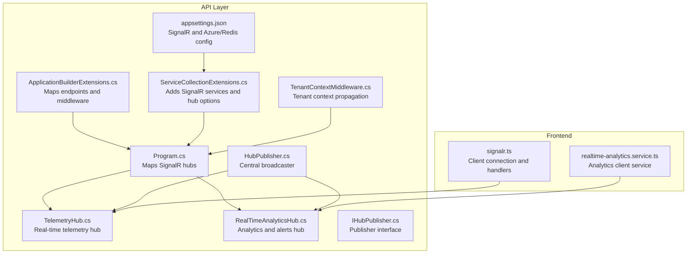
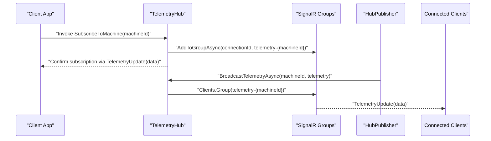
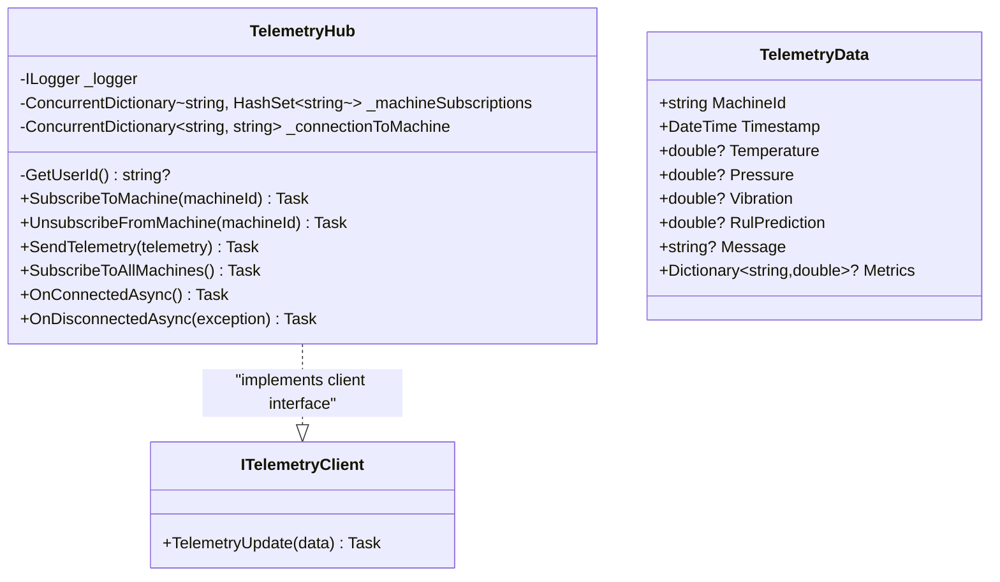
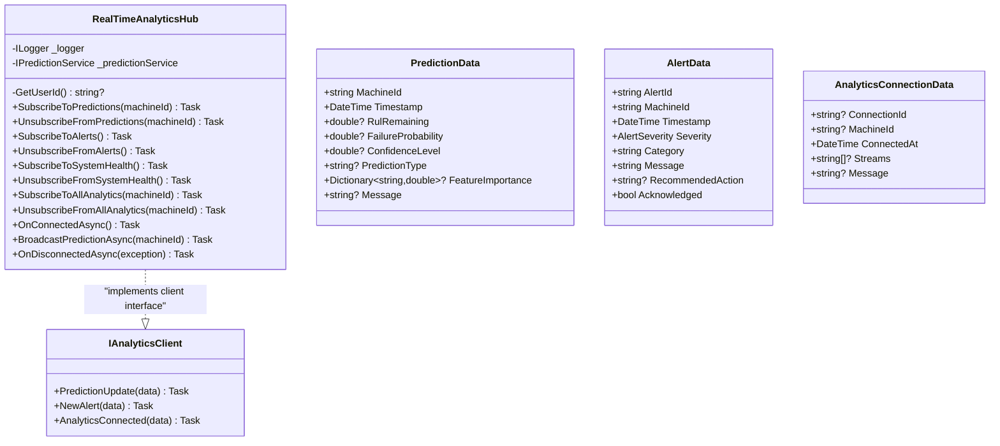
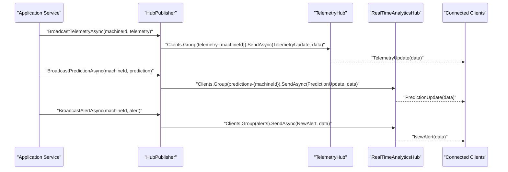
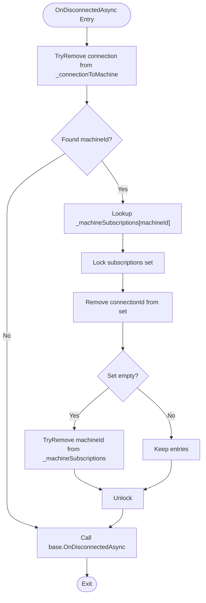
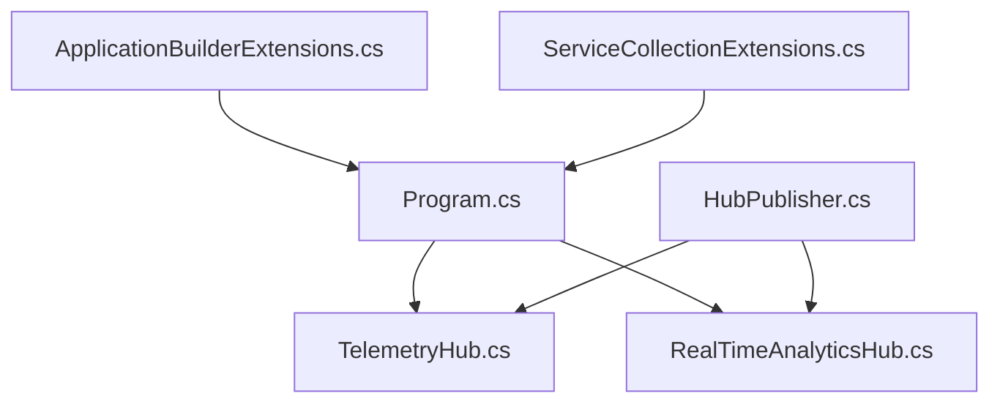

# SignalR Hub Architecture

<cite>
**Referenced Files in This Document**
- [TelemetryHub.cs](file://src/api/DigitalTwinPlatform.API/Hubs/TelemetryHub.cs)
- [RealTimeAnalyticsHub.cs](file://src/api/DigitalTwinPlatform.API/Hubs/RealTimeAnalyticsHub.cs)
- [Program.cs](file://src/api/DigitalTwinPlatform.API/Program.cs)
- [ApplicationBuilderExtensions.cs](file://src/api/DigitalTwinPlatform.API/Extensions/ApplicationBuilderExtensions.cs)
- [ServiceCollectionExtensions.cs](file://src/api/DigitalTwinPlatform.API/Extensions/ServiceCollectionExtensions.cs)
- [HubPublisher.cs](file://src/api/DigitalTwinPlatform.API/Services/Infrastructure/HubPublisher.cs)
- [IHubPublisher.cs](file://src/api/DigitalTwinPlatform.Application/Abstractions/Services/IHubPublisher.cs)
- [appsettings.json](file://src/api/DigitalTwinPlatform.API/appsettings.json)
- [TenantContextMiddleware.cs](file://src/api/DigitalTwinPlatform.API/Middleware/TenantContextMiddleware.cs)
- [signalr.ts](file://src/frontend/src/services/signalr.ts)
- [realtime-analytics.service.ts](file://src/ui/digital-twin-dashboard/src/services/realtime-analytics.service.ts)
</cite>

## Table of Contents
1. [Introduction](#introduction)
2. [Project Structure](#project-structure)
3. [Core Components](#core-components)
4. [Architecture Overview](#architecture-overview)
5. [Detailed Component Analysis](#detailed-component-analysis)
6. [Dependency Analysis](#dependency-analysis)
7. [Performance Considerations](#performance-considerations)
8. [Troubleshooting Guide](#troubleshooting-guide)
9. [Conclusion](#conclusion)

## Introduction
This document explains the SignalR hub architecture used for real-time telemetry and analytics streaming. It focuses on the hub implementation patterns, connection management, group-based subscription handling, and the TelemetryHub class structure. It also covers hub interface definitions, client-server communication patterns, concurrent dictionary usage for subscription tracking, integration with authentication claims and tenant context, and scalability considerations including Redis backplane configuration for multi-instance deployments.

## Project Structure
The SignalR hubs are implemented in the API project under the Hubs folder. They are mapped in the application startup and configured via extension methods. Supporting infrastructure includes a publisher service that broadcasts updates from application services to connected clients.

**Diagram sources**
- [Program.cs](file://src/api/DigitalTwinPlatform.API/Program.cs#L76-L78)
- [ApplicationBuilderExtensions.cs](file://src/api/DigitalTwinPlatform.API/Extensions/ApplicationBuilderExtensions.cs#L65-L71)
- [ServiceCollectionExtensions.cs](file://src/api/DigitalTwinPlatform.API/Extensions/ServiceCollectionExtensions.cs#L105-L131)
- [TelemetryHub.cs](file://src/api/DigitalTwinPlatform.API/Hubs/TelemetryHub.cs#L12-L210)
- [RealTimeAnalyticsHub.cs](file://src/api/DigitalTwinPlatform.API/Hubs/RealTimeAnalyticsHub.cs#L14-L310)
- [HubPublisher.cs](file://src/api/DigitalTwinPlatform.API/Services/Infrastructure/HubPublisher.cs#L15-L91)
- [IHubPublisher.cs](file://src/api/DigitalTwinPlatform.Application/Abstractions/Services/IHubPublisher.cs#L10-L26)
- [TenantContextMiddleware.cs](file://src/api/DigitalTwinPlatform.API/Middleware/TenantContextMiddleware.cs#L5-L16)
- [appsettings.json](file://src/api/DigitalTwinPlatform.API/appsettings.json#L19-L23)
- [signalr.ts](file://src/frontend/src/services/signalr.ts#L78-L110)
- [realtime-analytics.service.ts](file://src/ui/digital-twin-dashboard/src/services/realtime-analytics.service.ts#L229-L279)

**Section sources**
- [Program.cs](file://src/api/DigitalTwinPlatform.API/Program.cs#L76-L78)
- [ApplicationBuilderExtensions.cs](file://src/api/DigitalTwinPlatform.API/Extensions/ApplicationBuilderExtensions.cs#L65-L71)
- [ServiceCollectionExtensions.cs](file://src/api/DigitalTwinPlatform.API/Extensions/ServiceCollectionExtensions.cs#L105-L131)

## Core Components
- TelemetryHub: Manages real-time telemetry subscriptions per machine, group membership, and connection lifecycle events.
- RealTimeAnalyticsHub: Manages predictions, alerts, and system health subscriptions across groups.
- HubPublisher: Centralized broadcaster that routes domain events to SignalR clients via hub contexts.
- SignalR configuration: Adds JSON protocol options and hub-specific options for keep-alive, timeouts, message sizes, and parallel invocations.
- Frontend services: Connect to hubs, register handlers, and invoke hub methods for subscription management.

Key hub capabilities:
- Subscription methods: Subscribe/Unsubscribe to machine telemetry and analytics streams.
- Group-based delivery: Uses SignalR Groups to target subsets of clients.
- Connection lifecycle: Handles OnConnectedAsync and OnDisconnectedAsync for logging and cleanup.
- Authentication integration: Reads user identity from ClaimsPrincipal for auditability.
- Tenant context: Middleware sets tenant context from request headers.

**Section sources**
- [TelemetryHub.cs](file://src/api/DigitalTwinPlatform.API/Hubs/TelemetryHub.cs#L12-L210)
- [RealTimeAnalyticsHub.cs](file://src/api/DigitalTwinPlatform.API/Hubs/RealTimeAnalyticsHub.cs#L14-L310)
- [HubPublisher.cs](file://src/api/DigitalTwinPlatform.API/Services/Infrastructure/HubPublisher.cs#L15-L91)
- [ServiceCollectionExtensions.cs](file://src/api/DigitalTwinPlatform.API/Extensions/ServiceCollectionExtensions.cs#L105-L131)
- [signalr.ts](file://src/frontend/src/services/signalr.ts#L78-L142)
- [realtime-analytics.service.ts](file://src/ui/digital-twin-dashboard/src/services/realtime-analytics.service.ts#L229-L279)

## Architecture Overview
The hubs expose server-side methods that clients invoke to join or leave groups. Publishers send domain events to hub contexts, which deliver messages to group members. Authentication is enforced via JWT bearer tokens, and tenant context is propagated via a middleware component.

**Diagram sources**
- [TelemetryHub.cs](file://src/api/DigitalTwinPlatform.API/Hubs/TelemetryHub.cs#L33-L62)
- [HubPublisher.cs](file://src/api/DigitalTwinPlatform.API/Services/Infrastructure/HubPublisher.cs#L32-L50)

**Section sources**
- [TelemetryHub.cs](file://src/api/DigitalTwinPlatform.API/Hubs/TelemetryHub.cs#L33-L62)
- [HubPublisher.cs](file://src/api/DigitalTwinPlatform.API/Services/Infrastructure/HubPublisher.cs#L32-L50)

## Detailed Component Analysis

### TelemetryHub Analysis
TelemetryHub implements:
- Subscription methods: SubscribeToMachine, UnsubscribeFromMachine, SubscribeToAllMachines.
- Group management: Uses Groups.AddToGroupAsync and Groups.RemoveFromGroupAsync with machine-scoped group names.
- Connection lifecycle: Logs OnConnectedAsync and OnDisconnectedAsync; cleans up subscription tracking dictionaries.
- Error handling: Uses structured logging; no explicit try/catch around group operations indicates reliance on SignalR transport errors.
- Authentication integration: Extracts user ID from ClaimsPrincipal for auditing.
- Concurrent subscription tracking: Maintains two concurrent dictionaries for machine-to-connections and connection-to-machine mapping.

**Diagram sources**
- [TelemetryHub.cs](file://src/api/DigitalTwinPlatform.API/Hubs/TelemetryHub.cs#L12-L210)

**Section sources**
- [TelemetryHub.cs](file://src/api/DigitalTwinPlatform.API/Hubs/TelemetryHub.cs#L12-L210)

### RealTimeAnalyticsHub Analysis
RealTimeAnalyticsHub implements:
- Subscription methods: SubscribeToPredictions, UnsubscribeFromPredictions, SubscribeToAlerts, UnsubscribeFromAlerts, SubscribeToSystemHealth, UnsubscribeFromSystemHealth, SubscribeToAllAnalytics, UnsubscribeFromAllAnalytics.
- Group management: Uses groups like "predictions-{machineId}", "alerts", and "system-health".
- Broadcast: BroadcastPredictionAsync fetches latest prediction and sends to prediction group.
- Connection lifecycle: Logs OnConnectedAsync and OnDisconnectedAsync; confirms connection via AnalyticsConnected.
- Error handling: Wraps broadcast logic in try/catch to log failures.

**Diagram sources**
- [RealTimeAnalyticsHub.cs](file://src/api/DigitalTwinPlatform.API/Hubs/RealTimeAnalyticsHub.cs#L14-L310)

**Section sources**
- [RealTimeAnalyticsHub.cs](file://src/api/DigitalTwinPlatform.API/Hubs/RealTimeAnalyticsHub.cs#L14-L310)

### Hub Publisher and Client Communication Patterns
HubPublisher centralizes broadcasting to hubs:
- BroadcastTelemetryAsync: Converts telemetry DTO to hub TelemetryData and sends to "telemetry-{machineId}" group.
- BroadcastPredictionAsync: Converts prediction DTO to hub PredictionData and sends to "predictions-{machineId}" group.
- BroadcastAlertAsync: Converts alert DTO to hub AlertData and sends to "alerts" group.

Client communication patterns:
- Frontend connects to hubs, registers handlers, and invokes hub methods to manage subscriptions.
- Clients receive typed updates via hub-defined client callbacks.

**Diagram sources**
- [HubPublisher.cs](file://src/api/DigitalTwinPlatform.API/Services/Infrastructure/HubPublisher.cs#L32-L90)
- [TelemetryHub.cs](file://src/api/DigitalTwinPlatform.API/Hubs/TelemetryHub.cs#L109-L118)
- [RealTimeAnalyticsHub.cs](file://src/api/DigitalTwinPlatform.API/Hubs/RealTimeAnalyticsHub.cs#L196-L222)

**Section sources**
- [HubPublisher.cs](file://src/api/DigitalTwinPlatform.API/Services/Infrastructure/HubPublisher.cs#L15-L91)
- [IHubPublisher.cs](file://src/api/DigitalTwinPlatform.Application/Abstractions/Services/IHubPublisher.cs#L10-L26)

### Connection Lifecycle and Cleanup
Both hubs override OnConnectedAsync and OnDisconnectedAsync:
- OnConnectedAsync: Logs connection with user ID and optionally sends a confirmation message to caller.
- OnDisconnectedAsync: Logs disconnection (with optional exception), and performs cleanup:
  - Removes connection from machine-specific group.
  - Updates subscription tracking dictionaries atomically and removes empty entries.

**Diagram sources**
- [TelemetryHub.cs](file://src/api/DigitalTwinPlatform.API/Hubs/TelemetryHub.cs#L150-L183)

**Section sources**
- [TelemetryHub.cs](file://src/api/DigitalTwinPlatform.API/Hubs/TelemetryHub.cs#L138-L183)
- [RealTimeAnalyticsHub.cs](file://src/api/DigitalTwinPlatform.API/Hubs/RealTimeAnalyticsHub.cs#L177-L244)

### Concurrent Dictionary Usage for Subscription Tracking
TelemetryHub maintains:
- _machineSubscriptions: Maps machineId to a thread-safe set of connectionIds.
- _connectionToMachine: Maps connectionId to machineId for reverse lookup during cleanup.

Concurrency considerations:
- AddOrUpdate ensures atomic updates when adding connections.
- Explicit lock around HashSet operations prevents race conditions when removing connections.
- TryRemove is used to clean up empty machine entries.

**Section sources**
- [TelemetryHub.cs](file://src/api/DigitalTwinPlatform.API/Hubs/TelemetryHub.cs#L15-L51)
- [TelemetryHub.cs](file://src/api/DigitalTwinPlatform.API/Hubs/TelemetryHub.cs#L79-L92)

### Practical Examples of Hub Method Implementations
- Subscribing to a machine:
  - Client invokes SubscribeToMachine(machineId).
  - Hub adds connection to "telemetry-{machineId}" group and tracks subscription.
  - Hub confirms subscription via TelemetryUpdate to caller.
- Unsubscribing from a machine:
  - Client invokes UnsubscribeFromMachine(machineId).
  - Hub removes connection from group and cleans up tracking.
- Broadcasting telemetry:
  - Application service calls HubPublisher.BroadcastTelemetryAsync.
  - Hub delivers TelemetryUpdate to all members of the machine group.

**Section sources**
- [TelemetryHub.cs](file://src/api/DigitalTwinPlatform.API/Hubs/TelemetryHub.cs#L33-L62)
- [TelemetryHub.cs](file://src/api/DigitalTwinPlatform.API/Hubs/TelemetryHub.cs#L68-L103)
- [HubPublisher.cs](file://src/api/DigitalTwinPlatform.API/Services/Infrastructure/HubPublisher.cs#L32-L50)

### Group Management and Connection State Handling
- Group naming:
  - Telemetry: "telemetry-{machineId}"
  - Predictions: "predictions-{machineId}"
  - Alerts: "alerts"
  - System health: "system-health"
- Connection state handling:
  - Frontend manages connection state transitions and re-subscription after reconnect.
  - Hubs log connection/disconnection events and perform cleanup.

**Section sources**
- [TelemetryHub.cs](file://src/api/DigitalTwinPlatform.API/Hubs/TelemetryHub.cs#L42-L42)
- [RealTimeAnalyticsHub.cs](file://src/api/DigitalTwinPlatform.API/Hubs/RealTimeAnalyticsHub.cs#L45-L45)
- [RealTimeAnalyticsHub.cs](file://src/api/DigitalTwinPlatform.API/Hubs/RealTimeAnalyticsHub.cs#L88-L88)
- [RealTimeAnalyticsHub.cs](file://src/api/DigitalTwinPlatform.API/Hubs/RealTimeAnalyticsHub.cs#L123-L123)
- [signalr.ts](file://src/frontend/src/services/signalr.ts#L78-L110)

### Integration with Authentication Claims and Tenant Context
- Authentication:
  - JWT bearer authentication is configured; hubs extract user ID from ClaimsPrincipal for logging and auditing.
- Tenant context:
  - TenantContextMiddleware reads X-Tenant-Id from request headers and sets tenant context for downstream services.

**Section sources**
- [ServiceCollectionExtensions.cs](file://src/api/DigitalTwinPlatform.API/Extensions/ServiceCollectionExtensions.cs#L372-L396)
- [TelemetryHub.cs](file://src/api/DigitalTwinPlatform.API/Hubs/TelemetryHub.cs#L26-L27)
- [RealTimeAnalyticsHub.cs](file://src/api/DigitalTwinPlatform.API/Hubs/RealTimeAnalyticsHub.cs#L30-L31)
- [TenantContextMiddleware.cs](file://src/api/DigitalTwinPlatform.API/Middleware/TenantContextMiddleware.cs#L5-L16)

## Dependency Analysis
SignalR configuration and mapping dependencies:

**Diagram sources**
- [Program.cs](file://src/api/DigitalTwinPlatform.API/Program.cs#L76-L78)
- [ApplicationBuilderExtensions.cs](file://src/api/DigitalTwinPlatform.API/Extensions/ApplicationBuilderExtensions.cs#L65-L71)
- [ServiceCollectionExtensions.cs](file://src/api/DigitalTwinPlatform.API/Extensions/ServiceCollectionExtensions.cs#L105-L131)
- [HubPublisher.cs](file://src/api/DigitalTwinPlatform.API/Services/Infrastructure/HubPublisher.cs#L17-L28)

**Section sources**
- [Program.cs](file://src/api/DigitalTwinPlatform.API/Program.cs#L76-L78)
- [ApplicationBuilderExtensions.cs](file://src/api/DigitalTwinPlatform.API/Extensions/ApplicationBuilderExtensions.cs#L65-L71)
- [ServiceCollectionExtensions.cs](file://src/api/DigitalTwinPlatform.API/Extensions/ServiceCollectionExtensions.cs#L105-L131)
- [HubPublisher.cs](file://src/api/DigitalTwinPlatform.API/Services/Infrastructure/HubPublisher.cs#L17-L28)

## Performance Considerations
- Keep-alive and timeouts:
  - KeepAliveInterval and HandshakeTimeout are configurable per hub.
- Message size and parallel invocations:
  - MaximumReceiveMessageSize and MaximumParallelInvocationsPerClient are configured for RealTimeAnalyticsHub to limit resource usage.
- JSON serialization:
  - Custom JSON protocol options reduce payload overhead and enable detailed errors when needed.
- Scalability:
  - Redis backplane is supported via configuration keys for multi-instance deployments.

**Section sources**
- [ServiceCollectionExtensions.cs](file://src/api/DigitalTwinPlatform.API/Extensions/ServiceCollectionExtensions.cs#L114-L128)
- [appsettings.json](file://src/api/DigitalTwinPlatform.API/appsettings.json#L19-L23)

## Troubleshooting Guide
Common issues and remedies:
- Connection failures:
  - Verify JWT authentication is properly configured and tokens are valid.
  - Check SignalR handshake timeout and keep-alive intervals.
- Subscription not receiving updates:
  - Ensure client invoked SubscribeToMachine/SubscribeToPredictions and group membership succeeded.
  - Confirm HubPublisher is broadcasting to correct group names.
- Disconnection cleanup:
  - If clients disconnect unexpectedly, hubs remove them from groups and clean dictionaries; verify logs for warnings.
- Multi-instance deployments:
  - Enable Redis backplane by setting SignalR Redis connection string in configuration.

**Section sources**
- [ServiceCollectionExtensions.cs](file://src/api/DigitalTwinPlatform.API/Extensions/ServiceCollectionExtensions.cs#L114-L128)
- [TelemetryHub.cs](file://src/api/DigitalTwinPlatform.API/Hubs/TelemetryHub.cs#L150-L183)
- [RealTimeAnalyticsHub.cs](file://src/api/DigitalTwinPlatform.API/Hubs/RealTimeAnalyticsHub.cs#L227-L244)
- [appsettings.json](file://src/api/DigitalTwinPlatform.API/appsettings.json#L19-L23)

## Conclusion
The SignalR hub architecture provides a robust foundation for real-time telemetry and analytics streaming. TelemetryHub and RealTimeAnalyticsHub encapsulate subscription and group management, while HubPublisher enables decoupled broadcasting from application services. Authentication and tenant context are integrated into the request pipeline, and configuration supports performance tuning and multi-instance scaling via Redis backplane.