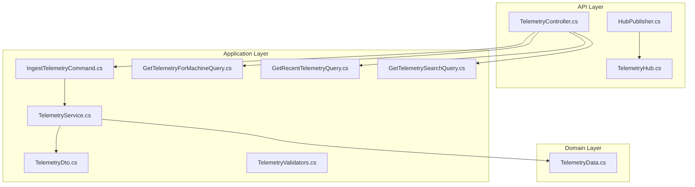
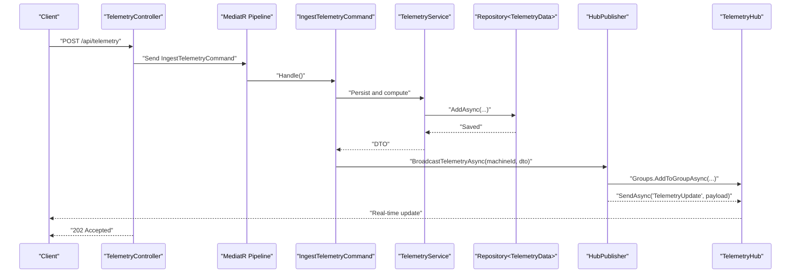
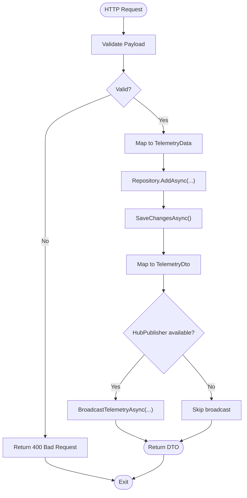
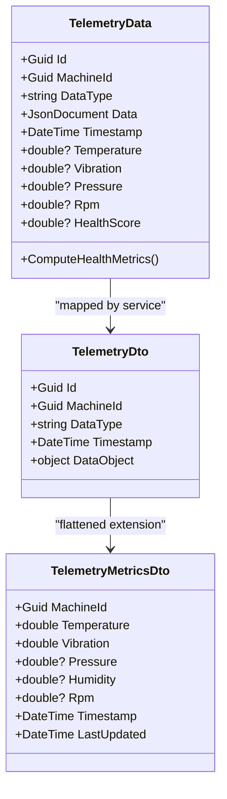
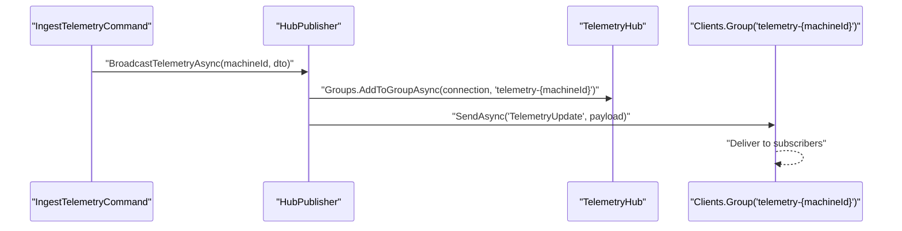
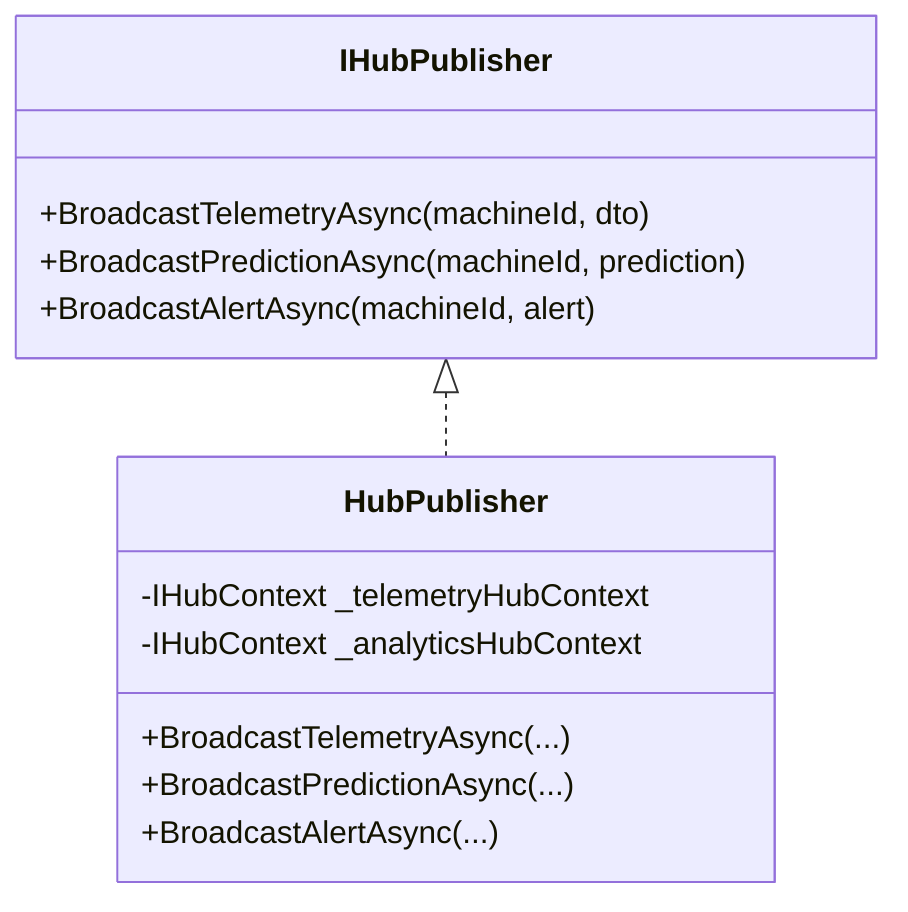
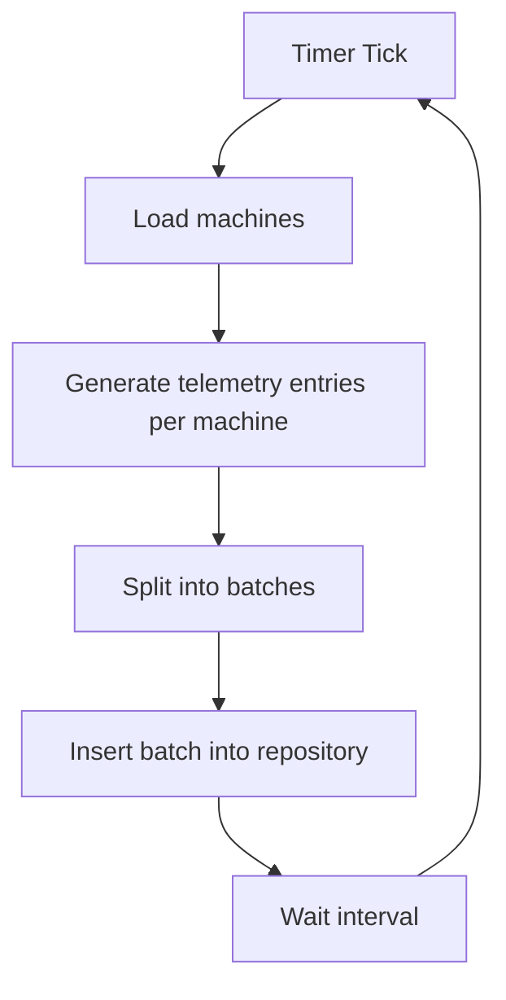
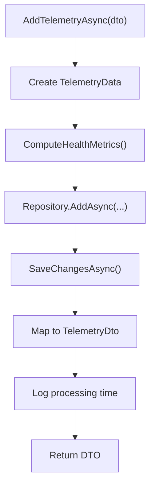
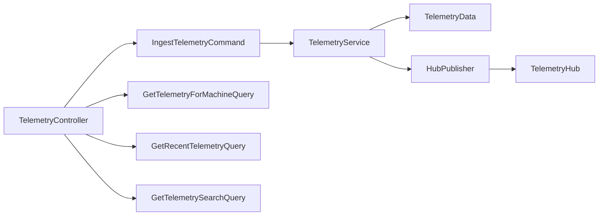

# Telemetry Data Processing

<cite>
**Referenced Files in This Document**
- [TelemetryController.cs](file://src/api/DigitalTwinPlatform.API/Controllers/TelemetryController.cs)
- [IngestTelemetryCommand.cs](file://src/api/DigitalTwinPlatform.Application/Telemetry/Commands/IngestTelemetryCommand.cs)
- [TelemetryValidators.cs](file://src/api/DigitalTwinPlatform.API/Validators/TelemetryValidators.cs)
- [TelemetryDto.cs](file://src/api/DigitalTwinPlatform.Application/Telemetry/Models/TelemetryDto.cs)
- [TelemetryData.cs](file://src/api/DigitalTwinPlatform.Domain/Entities/TelemetryData.cs)
- [TelemetryService.cs](file://src/api/DigitalTwinPlatform.Application/Services/TelemetryService.cs)
- [GetTelemetryForMachineQuery.cs](file://src/api/DigitalTwinPlatform.Application/Telemetry/Queries/GetTelemetryForMachineQuery.cs)
- [GetRecentTelemetryQuery.cs](file://src/api/DigitalTwinPlatform.Application/Telemetry/Queries/GetRecentTelemetryQuery.cs)
- [GetTelemetrySearchQuery.cs](file://src/api/DigitalTwinPlatform.Application/Telemetry/Queries/GetTelemetrySearchQuery.cs)
- [TelemetryHub.cs](file://src/api/DigitalTwinPlatform.API/Hubs/TelemetryHub.cs)
- [HubPublisher.cs](file://src/api/DigitalTwinPlatform.API/Serices/Infrastructure/HubPublisher.cs)
- [IHubPublisher.cs](file://src/api/DigitalTwinPlatform.API/Serices/Infrastructure/IHubPublisher.cs)
- [TelemetryMockHostedService.cs](file://src/api/DigitalTwinPlatform.API/Services/Telemetry/TelemetryMockHostedService.cs)
</cite>

## Table of Contents
1. [Introduction](#introduction)
2. [Project Structure](#project-structure)
3. [Core Components](#core-components)
4. [Architecture Overview](#architecture-overview)
5. [Detailed Component Analysis](#detailed-component-analysis)
6. [Dependency Analysis](#dependency-analysis)
7. [Performance Considerations](#performance-considerations)
8. [Troubleshooting Guide](#troubleshooting-guide)
9. [Conclusion](#conclusion)
10. [Appendices](#appendices)

## Introduction
This document explains the telemetry data processing workflows in the digital twin platform. It covers the ingestion pipeline, data transformation, real-time broadcasting, and the HubPublisher service. It also documents the telemetry mock hosted service for development and testing, the telemetry service layer responsibilities, validation, performance optimization, and strategies for data quality assurance, error handling, and retries.

## Project Structure
The telemetry system spans three layers:
- API layer: HTTP endpoints and SignalR hubs for ingestion and real-time updates
- Application layer: commands, queries, validators, DTOs, and service orchestration
- Domain layer: telemetry entity and core sensor/health metrics computation

**Diagram sources**
- [TelemetryController.cs](file://src/api/DigitalTwinPlatform.API/Controllers/TelemetryController.cs#L52-L56)
- [IngestTelemetryCommand.cs](file://src/api/DigitalTwinPlatform.Application/Telemetry/Commands/IngestTelemetryCommand.cs#L16-L40)
- [TelemetryService.cs](file://src/api/DigitalTwinPlatform.Application/Services/TelemetryService.cs#L30-L86)
- [TelemetryData.cs](file://src/api/DigitalTwinPlatform.Domain/Entities/TelemetryData.cs#L5-L94)
- [TelemetryDto.cs](file://src/api/DigitalTwinPlatform.Application/Telemetry/Models/TelemetryDto.cs#L6-L73)
- [TelemetryHub.cs](file://src/api/DigitalTwinPlatform.API/Hubs/TelemetryHub.cs#L12-L184)
- [HubPublisher.cs](file://src/api/DigitalTwinPlatform.API/Serices/Infrastructure/HubPublisher.cs#L15-L91)

**Section sources**
- [TelemetryController.cs](file://src/api/DigitalTwinPlatform.API/Controllers/TelemetryController.cs#L1-L202)
- [TelemetryService.cs](file://src/api/DigitalTwinPlatform.Application/Services/TelemetryService.cs#L1-L189)
- [TelemetryData.cs](file://src/api/DigitalTwinPlatform.Domain/Entities/TelemetryData.cs#L1-L94)
- [TelemetryDto.cs](file://src/api/DigitalTwinPlatform.Application/Telemetry/Models/TelemetryDto.cs#L1-L73)
- [TelemetryHub.cs](file://src/api/DigitalTwinPlatform.API/Hubs/TelemetryHub.cs#L1-L211)
- [HubPublisher.cs](file://src/api/DigitalTwinPlatform.API/Serices/Infrastructure/HubPublisher.cs#L1-L104)

## Core Components
- TelemetryController: Exposes HTTP endpoints for ingestion and retrieval, and supports real-time subscription via SignalR.
- IngestTelemetryCommand: Handles ingestion requests, persists telemetry, and triggers real-time broadcast.
- TelemetryService: Encapsulates domain logic for telemetry persistence, health metric computation, and cleanup.
- TelemetryData: Domain entity representing sensor readings, flexible JSON payload, and computed health metrics.
- TelemetryDto and TelemetryIngestDto: Application-layer DTOs for ingestion and response, including flattening helpers.
- TelemetryHub: SignalR hub enabling per-machine subscription and real-time updates.
- HubPublisher: Centralized publisher for broadcasting telemetry, predictions, and alerts to SignalR clients.
- TelemetryMockHostedService: Background service generating synthetic telemetry for development/testing.

**Section sources**
- [TelemetryController.cs](file://src/api/DigitalTwinPlatform.API/Controllers/TelemetryController.cs#L20-L202)
- [IngestTelemetryCommand.cs](file://src/api/DigitalTwinPlatform.Application/Telemetry/Commands/IngestTelemetryCommand.cs#L9-L41)
- [TelemetryService.cs](file://src/api/DigitalTwinPlatform.Application/Services/TelemetryService.cs#L14-L189)
- [TelemetryData.cs](file://src/api/DigitalTwinPlatform.Domain/Entities/TelemetryData.cs#L5-L94)
- [TelemetryDto.cs](file://src/api/DigitalTwinPlatform.Application/Telemetry/Models/TelemetryDto.cs#L6-L73)
- [TelemetryHub.cs](file://src/api/DigitalTwinPlatform.API/Hubs/TelemetryHub.cs#L12-L211)
- [HubPublisher.cs](file://src/api/DigitalTwinPlatform.API/Serices/Infrastructure/HubPublisher.cs#L15-L91)
- [TelemetryMockHostedService.cs](file://src/api/DigitalTwinPlatform.API/Services/Telemetry/TelemetryMockHostedService.cs#L7-L173)

## Architecture Overview
The telemetry pipeline integrates HTTP ingestion, command/query handlers, domain persistence, and real-time broadcasting.

**Diagram sources**
- [TelemetryController.cs](file://src/api/DigitalTwinPlatform.API/Controllers/TelemetryController.cs#L52-L56)
- [IngestTelemetryCommand.cs](file://src/api/DigitalTwinPlatform.Application/Telemetry/Commands/IngestTelemetryCommand.cs#L16-L40)
- [TelemetryService.cs](file://src/api/DigitalTwinPlatform.Application/Services/TelemetryService.cs#L30-L86)
- [HubPublisher.cs](file://src/api/DigitalTwinPlatform.API/Serices/Infrastructure/HubPublisher.cs#L32-L50)
- [TelemetryHub.cs](file://src/api/DigitalTwinPlatform.API/Hubs/TelemetryHub.cs#L33-L62)

## Detailed Component Analysis

### Telemetry Ingestion Pipeline
- Endpoint: POST /api/telemetry accepts a structured payload with machineId, dataType, data, and optional timestamp.
- Validation: FluentValidation ensures required fields are present.
- Command handling: IngestTelemetryCommand creates a domain entity, persists it, and broadcasts to SignalR if a publisher is available.
- Response: Immediate acceptance acknowledges receipt for asynchronous processing.

**Diagram sources**
- [TelemetryController.cs](file://src/api/DigitalTwinPlatform.API/Controllers/TelemetryController.cs#L52-L56)
- [IngestTelemetryCommand.cs](file://src/api/DigitalTwinPlatform.Application/Telemetry/Commands/IngestTelemetryCommand.cs#L16-L40)
- [TelemetryValidators.cs](file://src/api/DigitalTwinPlatform.API/Validators/TelemetryValidators.cs#L6-L14)

**Section sources**
- [TelemetryController.cs](file://src/api/DigitalTwinPlatform.API/Controllers/TelemetryController.cs#L20-L68)
- [TelemetryValidators.cs](file://src/api/DigitalTwinPlatform.API/Validators/TelemetryValidators.cs#L6-L14)
- [IngestTelemetryCommand.cs](file://src/api/DigitalTwinPlatform.Application/Telemetry/Commands/IngestTelemetryCommand.cs#L16-L40)

### Data Transformation Processes
- Domain entity: TelemetryData holds core sensor fields and a flexible JSON payload.
- Health metrics: ComputeHealthMetrics derives a health score from temperature, vibration, pressure, and RPM thresholds.
- DTO mapping: TelemetryDto exposes the JSON payload as an object for serialization; TelemetryMetricsDto flattens numeric fields for front-end dashboards.

**Diagram sources**
- [TelemetryData.cs](file://src/api/DigitalTwinPlatform.Domain/Entities/TelemetryData.cs#L5-L94)
- [TelemetryDto.cs](file://src/api/DigitalTwinPlatform.Application/Telemetry/Models/TelemetryDto.cs#L6-L73)

**Section sources**
- [TelemetryData.cs](file://src/api/DigitalTwinPlatform.Domain/Entities/TelemetryData.cs#L25-L94)
- [TelemetryDto.cs](file://src/api/DigitalTwinPlatform.Application/Telemetry/Models/TelemetryDto.cs#L6-L73)

### Real-Time Broadcasting Mechanisms
- SignalR Hub: TelemetryHub manages per-machine groups and lifecycle events (subscribe/unsubscribe, connect/disconnect).
- Publisher: HubPublisher encapsulates broadcasting to SignalR groups for telemetry, predictions, and alerts.
- Routing: Broadcast targets machine-scoped groups (e.g., telemetry-{machineId}) ensuring efficient fan-out.

**Diagram sources**
- [IngestTelemetryCommand.cs](file://src/api/DigitalTwinPlatform.Application/Telemetry/Commands/IngestTelemetryCommand.cs#L33-L37)
- [HubPublisher.cs](file://src/api/DigitalTwinPlatform.API/Serices/Infrastructure/HubPublisher.cs#L32-L50)
- [TelemetryHub.cs](file://src/api/DigitalTwinPlatform.API/Hubs/TelemetryHub.cs#L33-L62)

**Section sources**
- [TelemetryHub.cs](file://src/api/DigitalTwinPlatform.API/Hubs/TelemetryHub.cs#L12-L184)
- [HubPublisher.cs](file://src/api/DigitalTwinPlatform.API/Serices/Infrastructure/HubPublisher.cs#L15-L91)

### HubPublisher Service Implementation
- Responsibilities:
  - Broadcast telemetry updates to machine-specific SignalR groups.
  - Broadcast predictions and alerts to analytics hubs.
  - Provide centralized logging and decoupled real-time delivery.
- Routing and Filtering:
  - Uses group names derived from machine identifiers.
  - Filters outgoing payload fields to match SignalR client contracts.
- Distribution:
  - Sends messages to subscribed clients upon ingestion completion.

**Diagram sources**
- [IHubPublisher.cs](file://src/api/DigitalTwinPlatform.API/Serices/Infrastructure/IHubPublisher.cs#L12-L15)
- [HubPublisher.cs](file://src/api/DigitalTwinPlatform.API/Serices/Infrastructure/HubPublisher.cs#L15-L91)

**Section sources**
- [IHubPublisher.cs](file://src/api/DigitalTwinPlatform.API/Serices/Infrastructure/IHubPublisher.cs#L1-L16)
- [HubPublisher.cs](file://src/api/DigitalTwinPlatform.API/Serices/Infrastructure/HubPublisher.cs#L15-L91)

### Telemetry Mock Hosted Service
- Purpose: Generates synthetic telemetry for development and testing without external sensors.
- Behavior:
  - Periodic iterations create multiple telemetry types per machine.
  - Batch insertion mitigates database load.
  - Robust error handling continues operation despite transient failures.
- Data Quality:
  - Produces realistic numeric ranges and units.
  - Includes threshold metadata for downstream validation.

**Diagram sources**
- [TelemetryMockHostedService.cs](file://src/api/DigitalTwinPlatform.API/Services/Telemetry/TelemetryMockHostedService.cs#L24-L105)

**Section sources**
- [TelemetryMockHostedService.cs](file://src/api/DigitalTwinPlatform.API/Services/Telemetry/TelemetryMockHostedService.cs#L7-L173)

### Telemetry Service Layer Responsibilities
- Persistence: AddTelemetryAsync persists telemetry and computes health metrics.
- Retrieval: GetRecentTelemetryAsync and GetTelemetryByTimeRangeAsync provide filtered access.
- Cleanup: CleanupOldTelemetryAsync removes stale data to maintain performance.
- Validation: TelemetryIngestValidator enforces payload shape.
- Performance: Logs warnings for slow processing and maintains low-latency targets.

**Diagram sources**
- [TelemetryService.cs](file://src/api/DigitalTwinPlatform.Application/Services/TelemetryService.cs#L30-L86)

**Section sources**
- [TelemetryService.cs](file://src/api/DigitalTwinPlatform.Application/Services/TelemetryService.cs#L14-L189)
- [TelemetryValidators.cs](file://src/api/DigitalTwinPlatform.API/Validators/TelemetryValidators.cs#L6-L14)

### Data Retrieval and Search
- Queries:
  - GetTelemetryForMachineQuery: Filtered retrieval by machine and optional time window.
  - GetRecentTelemetryQuery: Latest telemetry across machines or per machine.
  - GetTelemetrySearchQuery: Text search across telemetry payloads.
- Mapping: Results mapped to TelemetryDto via TelemetryMapper.

**Section sources**
- [GetTelemetryForMachineQuery.cs](file://src/api/DigitalTwinPlatform.Application/Telemetry/Queries/GetTelemetryForMachineQuery.cs#L8-L22)
- [GetRecentTelemetryQuery.cs](file://src/api/DigitalTwinPlatform.Application/Telemetry/Queries/GetRecentTelemetryQuery.cs#L8-L22)
- [GetTelemetrySearchQuery.cs](file://src/api/DigitalTwinPlatform.Application/Telemetry/Queries/GetTelemetrySearchQuery.cs#L7-L19)

## Dependency Analysis
- API depends on Application commands and queries.
- Application depends on Domain entities and repositories.
- HubPublisher depends on SignalR contexts and DTOs.
- TelemetryHub depends on SignalR abstractions and concurrent subscription tracking.

**Diagram sources**
- [TelemetryController.cs](file://src/api/DigitalTwinPlatform.API/Controllers/TelemetryController.cs#L52-L199)
- [IngestTelemetryCommand.cs](file://src/api/DigitalTwinPlatform.Application/Telemetry/Commands/IngestTelemetryCommand.cs#L16-L40)
- [TelemetryService.cs](file://src/api/DigitalTwinPlatform.Application/Services/TelemetryService.cs#L30-L86)
- [TelemetryData.cs](file://src/api/DigitalTwinPlatform.Domain/Entities/TelemetryData.cs#L5-L94)
- [HubPublisher.cs](file://src/api/DigitalTwinPlatform.API/Serices/Infrastructure/HubPublisher.cs#L15-L91)
- [TelemetryHub.cs](file://src/api/DigitalTwinPlatform.API/Hubs/TelemetryHub.cs#L12-L184)

**Section sources**
- [TelemetryController.cs](file://src/api/DigitalTwinPlatform.API/Controllers/TelemetryController.cs#L1-L202)
- [IngestTelemetryCommand.cs](file://src/api/DigitalTwinPlatform.Application/Telemetry/Commands/IngestTelemetryCommand.cs#L1-L41)
- [TelemetryService.cs](file://src/api/DigitalTwinPlatform.Application/Services/TelemetryService.cs#L1-L189)
- [TelemetryData.cs](file://src/api/DigitalTwinPlatform.Domain/Entities/TelemetryData.cs#L1-L94)
- [HubPublisher.cs](file://src/api/DigitalTwinPlatform.API/Serices/Infrastructure/HubPublisher.cs#L1-L104)
- [TelemetryHub.cs](file://src/api/DigitalTwinPlatform.API/Hubs/TelemetryHub.cs#L1-L211)

## Performance Considerations
- Ingestion latency: TelemetryService logs processing time and warns on delays exceeding 100 ms.
- Batch writes: TelemetryMockHostedService inserts telemetry in batches to reduce database overhead.
- Cleanup: Scheduled removal of old telemetry prevents unbounded growth and maintains query performance.
- Real-time delivery: HubPublisher targets machine-specific groups to minimize unnecessary fan-out.

[No sources needed since this section provides general guidance]

## Troubleshooting Guide
- Validation failures: Ensure machineId, dataType, and data are provided; see validator rules.
- Concurrency conflicts: TelemetryMockHostedService catches and logs concurrency exceptions; batches are retried.
- Subscription issues: Verify clients join machine-specific groups; TelemetryHub logs subscription lifecycle events.
- Slow processing: Monitor telemetry processing duration and investigate long-running operations.

**Section sources**
- [TelemetryValidators.cs](file://src/api/DigitalTwinPlatform.API/Validators/TelemetryValidators.cs#L6-L14)
- [TelemetryMockHostedService.cs](file://src/api/DigitalTwinPlatform.API/Services/Telemetry/TelemetryMockHostedService.cs#L70-L94)
- [TelemetryHub.cs](file://src/api/DigitalTwinPlatform.API/Hubs/TelemetryHub.cs#L138-L183)
- [TelemetryService.cs](file://src/api/DigitalTwinPlatform.Application/Services/TelemetryService.cs#L62-L71)

## Conclusion
The telemetry system integrates robust ingestion, domain-driven persistence, and real-time broadcasting. The HubPublisher centralizes distribution, while the mock hosted service accelerates development. Validation, batching, and cleanup routines ensure reliability and performance.

[No sources needed since this section summarizes without analyzing specific files]

## Appendices

### Practical Examples

- Telemetry Data Models
  - Ingest payload: [TelemetryIngestDto.cs](file://src/api/DigitalTwinPlatform.Application/Telemetry/Models/TelemetryIngestDto.cs#L20-L24)
  - Response DTO: [TelemetryDto.cs](file://src/api/DigitalTwinPlatform.Application/Telemetry/Models/TelemetryDto.cs#L6-L18)
  - Flattened metrics: [TelemetryMetricsDto.cs](file://src/api/DigitalTwinPlatform.Application/Telemetry/Models/TelemetryDto.cs#L30-L38)

- Transformation Pipelines
  - Health metrics computation: [TelemetryData.cs](file://src/api/DigitalTwinPlatform.Domain/Entities/TelemetryData.cs#L53-L92)
  - Flattening extension: [TelemetryDto.cs](file://src/api/DigitalTwinPlatform.Application/Telemetry/Models/TelemetryDto.cs#L43-L72)

- Batch Processing Strategies
  - Mock generator batches: [TelemetryMockHostedService.cs](file://src/api/DigitalTwinPlatform.API/Services/Telemetry/TelemetryMockHostedService.cs#L58-L77)

- Data Quality Assurance
  - Validator rules: [TelemetryValidators.cs](file://src/api/DigitalTwinPlatform.API/Validators/TelemetryValidators.cs#L6-L14)
  - Cleanup routine: [TelemetryService.cs](file://src/api/DigitalTwinPlatform.Application/Services/TelemetryService.cs#L151-L179)

- Error Handling and Retries
  - Concurrency handling in mock service: [TelemetryMockHostedService.cs](file://src/api/DigitalTwinPlatform.API/Services/Telemetry/TelemetryMockHostedService.cs#L70-L85)
  - Logging and warnings: [TelemetryService.cs](file://src/api/DigitalTwinPlatform.Application/Services/TelemetryService.cs#L62-L85)