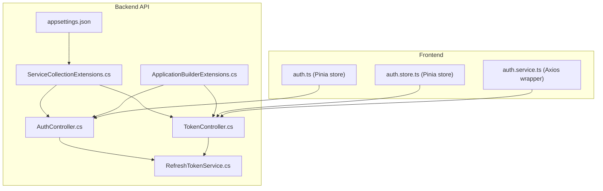
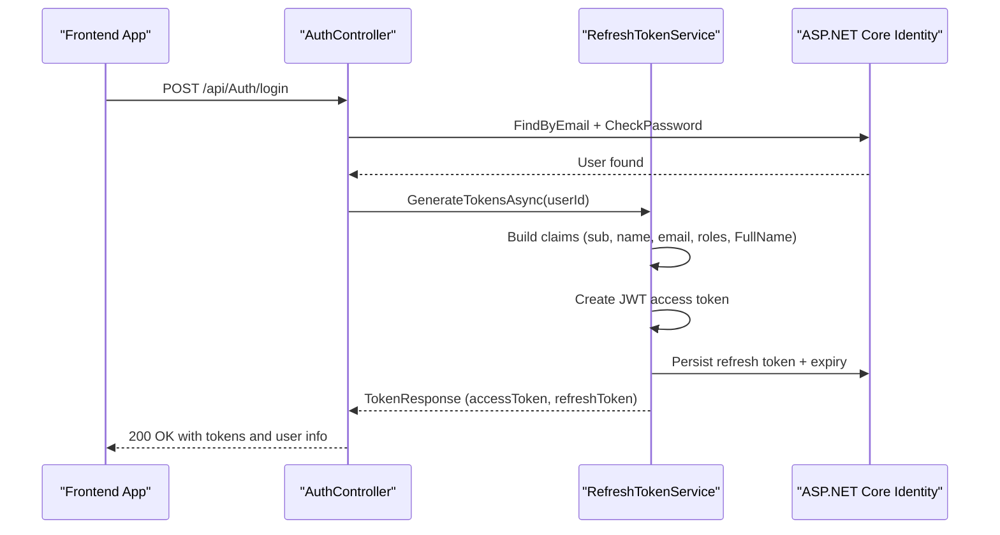
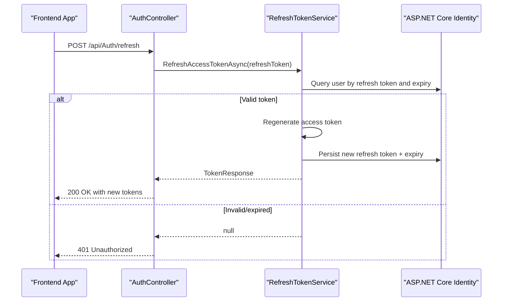
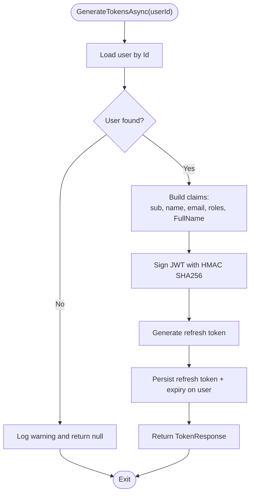
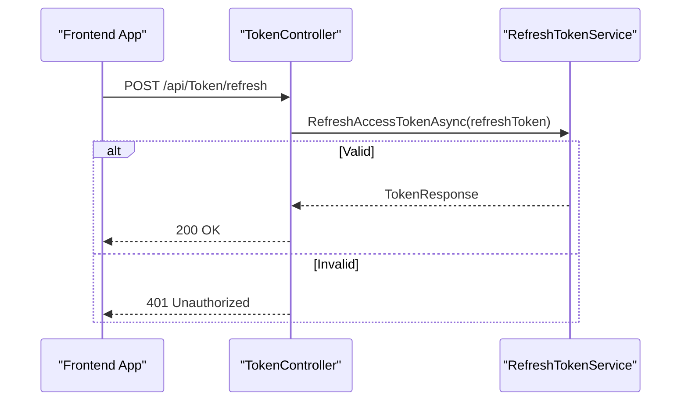
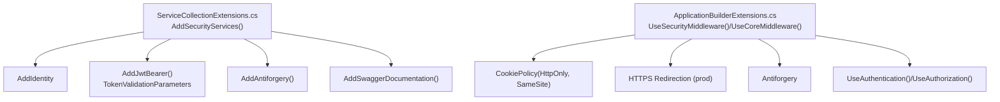
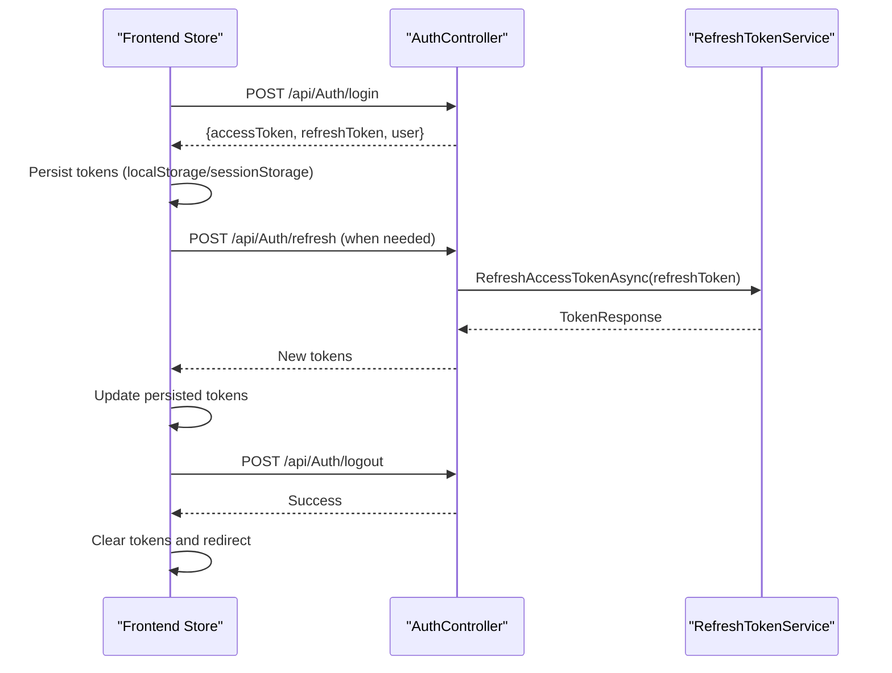
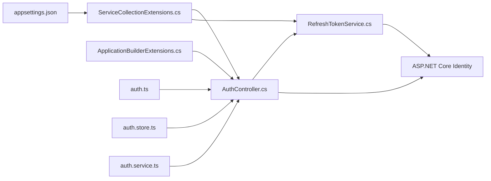

# Authentication System

<cite>
**Referenced Files in This Document**
- [AuthController.cs](file://src/api/DigitalTwinPlatform.API/Controllers/AuthController.cs)
- [RefreshTokenService.cs](file://src/api/DigitalTwinPlatform.API/Services/Auth/RefreshTokenService.cs)
- [TokenController.cs](file://src/api/DigitalTwinPlatform.API/Controllers/TokenController.cs)
- [Program.cs](file://src/api/DigitalTwinPlatform.API/Program.cs)
- [ServiceCollectionExtensions.cs](file://src/api/DigitalTwinPlatform.API/Extensions/ServiceCollectionExtensions.cs)
- [ApplicationBuilderExtensions.cs](file://src/api/DigitalTwinPlatform.API/Extensions/ApplicationBuilderExtensions.cs)
- [appsettings.json](file://src/api/DigitalTwinPlatform.API/appsettings.json)
- [appsettings.Development.json](file://src/api/DigitalTwinPlatform.API/appsettings.Development.json)
- [Token-Security.md](file://src/api/DigitalTwinPlatform.API/Documentation/Token-Security.md)
- [auth.ts](file://src/frontend/src/stores/auth.ts)
- [auth.store.ts](file://src/ui/digital-twin-dashboard/src/stores/auth.store.ts)
- [auth.service.ts](file://src/ui/digital-twin-dashboard/src/services/auth.service.ts)
</cite>

## Table of Contents
1. [Introduction](#introduction)
2. [Project Structure](#project-structure)
3. [Core Components](#core-components)
4. [Architecture Overview](#architecture-overview)
5. [Detailed Component Analysis](#detailed-component-analysis)
6. [Dependency Analysis](#dependency-analysis)
7. [Performance Considerations](#performance-considerations)
8. [Troubleshooting Guide](#troubleshooting-guide)
9. [Conclusion](#conclusion)
10. [Appendices](#appendices)

## Introduction
This document explains the authentication system built with JWT token-based authentication, ASP.NET Core Identity, and a dual-token strategy (access and refresh tokens). It covers the user registration workflow, login and logout processes, token generation and validation, claims-based identity, and frontend integration patterns. Security considerations such as token expiration, refresh token rotation, and secure token storage are addressed alongside implementation guidelines for both backend middleware configuration and frontend token management.

## Project Structure
The authentication system spans three primary areas:
- Backend API controllers and services implementing authentication endpoints and token management
- ASP.NET Core Identity integration for user management and password handling
- Frontend stores/services coordinating token lifecycle and session handling

**Diagram sources**
- [AuthController.cs](file://src/api/DigitalTwinPlatform.API/Controllers/AuthController.cs#L1-L854)
- [RefreshTokenService.cs](file://src/api/DigitalTwinPlatform.API/Services/Auth/RefreshTokenService.cs#L1-L150)
- [TokenController.cs](file://src/api/DigitalTwinPlatform.API/Controllers/TokenController.cs#L1-L57)
- [ServiceCollectionExtensions.cs](file://src/api/DigitalTwinPlatform.API/Extensions/ServiceCollectionExtensions.cs#L1-L418)
- [ApplicationBuilderExtensions.cs](file://src/api/DigitalTwinPlatform.API/Extensions/ApplicationBuilderExtensions.cs#L1-L89)
- [appsettings.json](file://src/api/DigitalTwinPlatform.API/appsettings.json#L64-L69)
- [auth.ts](file://src/frontend/src/stores/auth.ts#L1-L508)
- [auth.store.ts](file://src/ui/digital-twin-dashboard/src/stores/auth.store.ts#L1-L136)
- [auth.service.ts](file://src/ui/digital-twin-dashboard/src/services/auth.service.ts#L1-L39)

**Section sources**
- [AuthController.cs](file://src/api/DigitalTwinPlatform.API/Controllers/AuthController.cs#L1-L854)
- [RefreshTokenService.cs](file://src/api/DigitalTwinPlatform.API/Services/Auth/RefreshTokenService.cs#L1-L150)
- [TokenController.cs](file://src/api/DigitalTwinPlatform.API/Controllers/TokenController.cs#L1-L57)
- [ServiceCollectionExtensions.cs](file://src/api/DigitalTwinPlatform.API/Extensions/ServiceCollectionExtensions.cs#L1-L418)
- [ApplicationBuilderExtensions.cs](file://src/api/DigitalTwinPlatform.API/Extensions/ApplicationBuilderExtensions.cs#L1-L89)
- [appsettings.json](file://src/api/DigitalTwinPlatform.API/appsettings.json#L64-L69)
- [auth.ts](file://src/frontend/src/stores/auth.ts#L1-L508)
- [auth.store.ts](file://src/ui/digital-twin-dashboard/src/stores/auth.store.ts#L1-L136)
- [auth.service.ts](file://src/ui/digital-twin-dashboard/src/services/auth.service.ts#L1-L39)

## Core Components
- AuthController: Implements registration, login, token refresh, revoke, logout, and user profile endpoints. Uses ASP.NET Core Identity for user management and delegates token generation to RefreshTokenService.
- RefreshTokenService: Generates JWT access tokens with claims, creates refresh tokens, stores them on the user entity, and supports refresh and revocation.
- TokenController: Provides a dedicated endpoint for refresh and revoke operations (alternative to AuthController).
- ServiceCollectionExtensions: Configures ASP.NET Core Identity, JWT Bearer authentication, antiforgery, CORS, and Swagger documentation.
- ApplicationBuilderExtensions: Applies security middleware, HTTPS redirection, antiforgery, routing, authentication, and authorization.
- Frontend Stores: Manage tokens in local/session storage, coordinate refresh cycles, and handle logout.

**Section sources**
- [AuthController.cs](file://src/api/DigitalTwinPlatform.API/Controllers/AuthController.cs#L46-L422)
- [RefreshTokenService.cs](file://src/api/DigitalTwinPlatform.API/Services/Auth/RefreshTokenService.cs#L15-L131)
- [TokenController.cs](file://src/api/DigitalTwinPlatform.API/Controllers/TokenController.cs#L16-L51)
- [ServiceCollectionExtensions.cs](file://src/api/DigitalTwinPlatform.API/Extensions/ServiceCollectionExtensions.cs#L43-L72)
- [ApplicationBuilderExtensions.cs](file://src/api/DigitalTwinPlatform.API/Extensions/ApplicationBuilderExtensions.cs#L15-L47)

## Architecture Overview
The authentication architecture follows a layered design:
- Presentation Layer: Controllers expose REST endpoints for auth operations.
- Application Layer: Services encapsulate token generation, refresh, and revocation logic.
- Infrastructure Layer: Identity integration persists user data and manages passwords.
- Frontend Layer: Pinia stores manage tokens and drive session lifecycle.

**Diagram sources**
- [AuthController.cs](file://src/api/DigitalTwinPlatform.API/Controllers/AuthController.cs#L120-L156)
- [RefreshTokenService.cs](file://src/api/DigitalTwinPlatform.API/Services/Auth/RefreshTokenService.cs#L15-L85)
- [ServiceCollectionExtensions.cs](file://src/api/DigitalTwinPlatform.API/Extensions/ServiceCollectionExtensions.cs#L46-L55)

## Detailed Component Analysis

### AuthController Endpoints
AuthController exposes the following authentication endpoints:
- POST /api/Auth/register: Creates a new user via ASP.NET Core Identity with optional confirm password and terms acceptance validation.
- POST /api/Auth/login: Authenticates a user and returns access and refresh tokens.
- POST /api/Auth/refresh: Refreshes the access token using a valid refresh token.
- POST /api/Auth/revoke: Revokes a refresh token.
- POST /api/Auth/logout: Revokes all tokens for the authenticated user.
- GET /api/Auth/me: Retrieves the current user’s profile.
- PUT /api/Auth/profile: Updates the current user’s profile.
- POST /api/Auth/change-password: Changes the current user’s password.
- POST /api/Auth/forgot-password: Initiates password reset (logs token in development).
- POST /api/Auth/reset-password: Resets password using a reset token.
- POST /api/Auth/2fa/enable: Enables 2FA and returns a setup URI.
- POST /api/Auth/2fa/verify: Verifies and enables 2FA.
- POST /api/Auth/2fa/disable: Disables 2FA after verification.

**Diagram sources**
- [AuthController.cs](file://src/api/DigitalTwinPlatform.API/Controllers/AuthController.cs#L176-L196)
- [RefreshTokenService.cs](file://src/api/DigitalTwinPlatform.API/Services/Auth/RefreshTokenService.cs#L87-L99)

**Section sources**
- [AuthController.cs](file://src/api/DigitalTwinPlatform.API/Controllers/AuthController.cs#L46-L422)

### RefreshTokenService: Token Generation and Validation
RefreshTokenService builds JWT access tokens with claims derived from the user and their roles. It generates a refresh token, persists it with an expiry on the user record, and supports:
- GenerateTokensAsync: Builds claims, signs JWT, stores refresh token.
- RefreshAccessTokenAsync: Validates refresh token and expiry, regenerates tokens.
- RevokeRefreshTokenAsync: Revokes a single refresh token.
- RevokeAllUserTokensAsync: Revokes all tokens for a user.

**Diagram sources**
- [RefreshTokenService.cs](file://src/api/DigitalTwinPlatform.API/Services/Auth/RefreshTokenService.cs#L15-L85)

**Section sources**
- [RefreshTokenService.cs](file://src/api/DigitalTwinPlatform.API/Services/Auth/RefreshTokenService.cs#L15-L131)

### TokenController: Dedicated Refresh and Revoke
TokenController provides alternative endpoints for refresh and revoke operations:
- POST /api/Token/refresh: Validates refresh token and returns new tokens.
- POST /api/Token/revoke: Revokes a refresh token (placeholder in current implementation).

**Diagram sources**
- [TokenController.cs](file://src/api/DigitalTwinPlatform.API/Controllers/TokenController.cs#L20-L35)
- [RefreshTokenService.cs](file://src/api/DigitalTwinPlatform.API/Services/Auth/RefreshTokenService.cs#L87-L99)

**Section sources**
- [TokenController.cs](file://src/api/DigitalTwinPlatform.API/Controllers/TokenController.cs#L16-L51)

### JWT Configuration and Middleware Pipeline
JWT configuration is centralized in ServiceCollectionExtensions:
- Identity setup with customizable password requirements.
- JWT Bearer authentication with issuer, audience, and signing key validation.
- Antiforgery protection and CORS configuration.
- Swagger documentation with Bearer token support.

Middleware pipeline in ApplicationBuilderExtensions:
- Cookie policy with HttpOnly and SameSite=Strict.
- HTTPS redirection in production.
- Antiforgery middleware.
- Routing, CORS, authentication, and authorization.

**Diagram sources**
- [ServiceCollectionExtensions.cs](file://src/api/DigitalTwinPlatform.API/Extensions/ServiceCollectionExtensions.cs#L43-L72)
- [ServiceCollectionExtensions.cs](file://src/api/DigitalTwinPlatform.API/Extensions/ServiceCollectionExtensions.cs#L372-L396)
- [ApplicationBuilderExtensions.cs](file://src/api/DigitalTwinPlatform.API/Extensions/ApplicationBuilderExtensions.cs#L15-L47)

**Section sources**
- [ServiceCollectionExtensions.cs](file://src/api/DigitalTwinPlatform.API/Extensions/ServiceCollectionExtensions.cs#L43-L72)
- [ServiceCollectionExtensions.cs](file://src/api/DigitalTwinPlatform.API/Extensions/ServiceCollectionExtensions.cs#L372-L396)
- [ApplicationBuilderExtensions.cs](file://src/api/DigitalTwinPlatform.API/Extensions/ApplicationBuilderExtensions.cs#L15-L47)

### Frontend Integration Patterns
Frontend stores coordinate token lifecycle and session management:
- auth.ts (Pinia store): Manages tokens in localStorage/sessionStorage, performs login/register, refreshes sessions, and logs out.
- auth.store.ts (UI store): Alternative store using sessionStorage for tokens and user data.
- auth.service.ts (Axios wrapper): Wraps API calls for login/logout and token refresh.

**Diagram sources**
- [auth.ts](file://src/frontend/src/stores/auth.ts#L105-L153)
- [auth.ts](file://src/frontend/src/stores/auth.ts#L239-L271)
- [auth.ts](file://src/frontend/src/stores/auth.ts#L326-L361)
- [AuthController.cs](file://src/api/DigitalTwinPlatform.API/Controllers/AuthController.cs#L120-L156)
- [RefreshTokenService.cs](file://src/api/DigitalTwinPlatform.API/Services/Auth/RefreshTokenService.cs#L87-L99)

**Section sources**
- [auth.ts](file://src/frontend/src/stores/auth.ts#L105-L153)
- [auth.ts](file://src/frontend/src/stores/auth.ts#L239-L271)
- [auth.ts](file://src/frontend/src/stores/auth.ts#L326-L361)
- [auth.store.ts](file://src/ui/digital-twin-dashboard/src/stores/auth.store.ts#L18-L53)
- [auth.service.ts](file://src/ui/digital-twin-dashboard/src/services/auth.service.ts#L17-L33)

## Dependency Analysis
The authentication system exhibits clear separation of concerns:
- Controllers depend on RefreshTokenService and ASP.NET Core Identity for user operations.
- RefreshTokenService depends on Identity for user lookup and persistence.
- JWT configuration is injected via appsettings and validated during startup.
- Frontend stores depend on API endpoints for token lifecycle operations.

**Diagram sources**
- [AuthController.cs](file://src/api/DigitalTwinPlatform.API/Controllers/AuthController.cs#L24-L27)
- [RefreshTokenService.cs](file://src/api/DigitalTwinPlatform.API/Services/Auth/RefreshTokenService.cs#L10-L13)
- [ServiceCollectionExtensions.cs](file://src/api/DigitalTwinPlatform.API/Extensions/ServiceCollectionExtensions.cs#L46-L55)
- [ApplicationBuilderExtensions.cs](file://src/api/DigitalTwinPlatform.API/Extensions/ApplicationBuilderExtensions.cs#L42-L44)
- [appsettings.json](file://src/api/DigitalTwinPlatform.API/appsettings.json#L64-L69)
- [auth.ts](file://src/frontend/src/stores/auth.ts#L105-L153)

**Section sources**
- [AuthController.cs](file://src/api/DigitalTwinPlatform.API/Controllers/AuthController.cs#L24-L27)
- [RefreshTokenService.cs](file://src/api/DigitalTwinPlatform.API/Services/Auth/RefreshTokenService.cs#L10-L13)
- [ServiceCollectionExtensions.cs](file://src/api/DigitalTwinPlatform.API/Extensions/ServiceCollectionExtensions.cs#L46-L55)
- [ApplicationBuilderExtensions.cs](file://src/api/DigitalTwinPlatform.API/Extensions/ApplicationBuilderExtensions.cs#L42-L44)
- [appsettings.json](file://src/api/DigitalTwinPlatform.API/appsettings.json#L64-L69)
- [auth.ts](file://src/frontend/src/stores/auth.ts#L105-L153)

## Performance Considerations
- Token expiration: Access tokens are short-lived; refresh tokens have longer validity. Adjust Jwt:ExpiryInMinutes to balance security and UX.
- Token storage: Prefer sessionStorage for tokens in frontend stores to reduce persistent exposure risk.
- Background refresh: Implement proactive refresh before token expiry to avoid latency spikes.
- Logging: Token generation and validation events are logged; tune logging levels in production to avoid overhead.

## Troubleshooting Guide
Common issues and resolutions:
- Invalid credentials on login: Ensure email and password match Identity records.
- Invalid or expired refresh token: Trigger full re-authentication; verify token expiry and persistence.
- JWT configuration errors: Validate Jwt:Key length and presence; ensure issuer/audience match.
- HTTPS enforcement: In production, enforce HTTPS; in development, configure Security.RequireHttps appropriately.
- CORS issues: Verify AllowedOrigins and AllowCredentials settings.

**Section sources**
- [AuthController.cs](file://src/api/DigitalTwinPlatform.API/Controllers/AuthController.cs#L122-L130)
- [AuthController.cs](file://src/api/DigitalTwinPlatform.API/Controllers/AuthController.cs#L178-L187)
- [ServiceCollectionExtensions.cs](file://src/api/DigitalTwinPlatform.API/Extensions/ServiceCollectionExtensions.cs#L355-L367)
- [ApplicationBuilderExtensions.cs](file://src/api/DigitalTwinPlatform.API/Extensions/ApplicationBuilderExtensions.cs#L24-L28)
- [appsettings.Development.json](file://src/api/DigitalTwinPlatform.API/appsettings.Development.json#L51-L57)

## Conclusion
The authentication system leverages JWT bearer tokens with a robust refresh mechanism, integrated ASP.NET Core Identity for user management, and frontend stores coordinating secure token handling. The design emphasizes security through HTTPS enforcement, strict cookie policies, token expiration, and controlled refresh/revoke operations. Following the provided guidelines ensures secure and maintainable authentication across the platform.

## Appendices

### JWT Token Structure and Claims-Based Identity
- Access token claims include subject (user ID), name, email, roles, and FullName.
- Issuer, audience, and signing key are configured via appsettings.
- TokenResponse includes accessToken, refreshToken, ExpiresIn, and optional user info.

**Section sources**
- [RefreshTokenService.cs](file://src/api/DigitalTwinPlatform.API/Services/Auth/RefreshTokenService.cs#L25-L36)
- [ServiceCollectionExtensions.cs](file://src/api/DigitalTwinPlatform.API/Extensions/ServiceCollectionExtensions.cs#L385-L394)
- [Token-Security.md](file://src/api/DigitalTwinPlatform.API/Documentation/Token-Security.md#L13-L16)

### Practical Examples: Authentication Flows
- Registration: POST /api/Auth/register with email, password, and optional confirm password and terms acceptance.
- Login: POST /api/Auth/login with email and password; receive accessToken and refreshToken.
- Token Refresh: POST /api/Auth/refresh with refreshToken; receive new tokens.
- Logout: POST /api/Auth/logout; revoke all tokens for the user.

**Section sources**
- [AuthController.cs](file://src/api/DigitalTwinPlatform.API/Controllers/AuthController.cs#L51-L98)
- [AuthController.cs](file://src/api/DigitalTwinPlatform.API/Controllers/AuthController.cs#L120-L156)
- [AuthController.cs](file://src/api/DigitalTwinPlatform.API/Controllers/AuthController.cs#L176-L196)
- [AuthController.cs](file://src/api/DigitalTwinPlatform.API/Controllers/AuthController.cs#L413-L422)

### Security Considerations
- Transport security: HTTPS enforcement in production, secure cookie flags, SameSite=Strict.
- Token security: Short-lived access tokens, longer-lived refresh tokens, automatic invalidation on logout.
- Storage security: Prefer sessionStorage for tokens; store refresh tokens on the user record with expiry.
- Frontend best practices: Store refresh tokens securely, auto-refresh before expiration, handle 401 responses by attempting refresh, clear tokens on logout.

**Section sources**
- [Token-Security.md](file://src/api/DigitalTwinPlatform.API/Documentation/Token-Security.md#L8-L49)
- [auth.ts](file://src/frontend/src/stores/auth.ts#L126-L133)
- [auth.ts](file://src/frontend/src/stores/auth.ts#L326-L361)

### Implementation Guidelines
- Backend:
  - Configure JWT in appsettings with a strong key and appropriate issuer/audience.
  - Use AddSecurityServices and AddJwtBearer for authentication setup.
  - Apply UseSecurityMiddleware and UseCoreMiddleware in Program.cs.
- Frontend:
  - Persist tokens in localStorage or sessionStorage depending on session needs.
  - Implement proactive refresh before token expiry.
  - Handle 401 responses by attempting token refresh; otherwise, redirect to login.
  - Clear all tokens and state on logout.

**Section sources**
- [appsettings.json](file://src/api/DigitalTwinPlatform.API/appsettings.json#L64-L69)
- [ServiceCollectionExtensions.cs](file://src/api/DigitalTwinPlatform.API/Extensions/ServiceCollectionExtensions.cs#L372-L396)
- [ApplicationBuilderExtensions.cs](file://src/api/DigitalTwinPlatform.API/Extensions/ApplicationBuilderExtensions.cs#L15-L47)
- [auth.ts](file://src/frontend/src/stores/auth.ts#L126-L133)
- [auth.ts](file://src/frontend/src/stores/auth.ts#L239-L271)
- [auth.ts](file://src/frontend/src/stores/auth.ts#L326-L361)