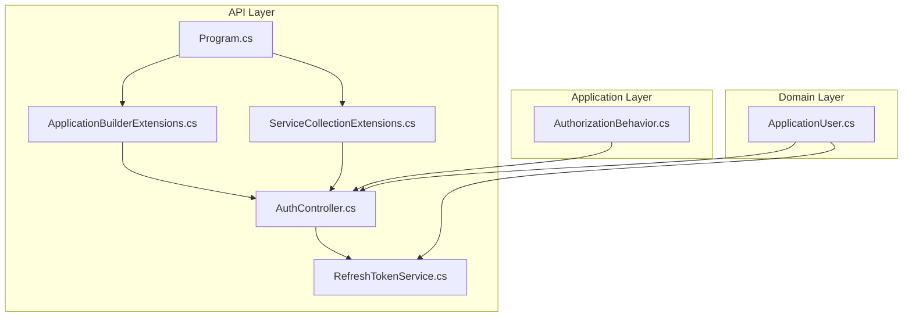
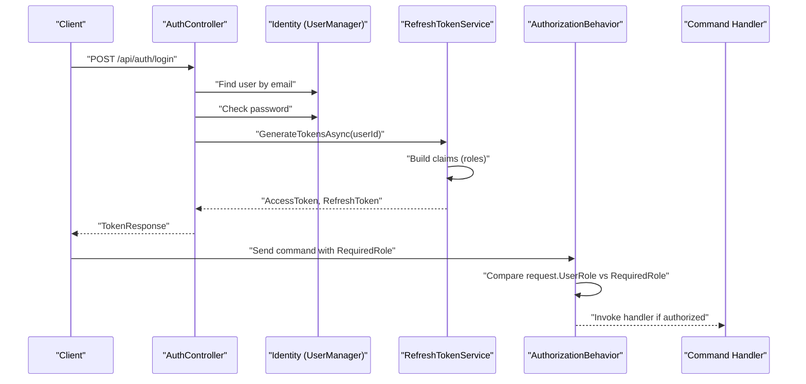
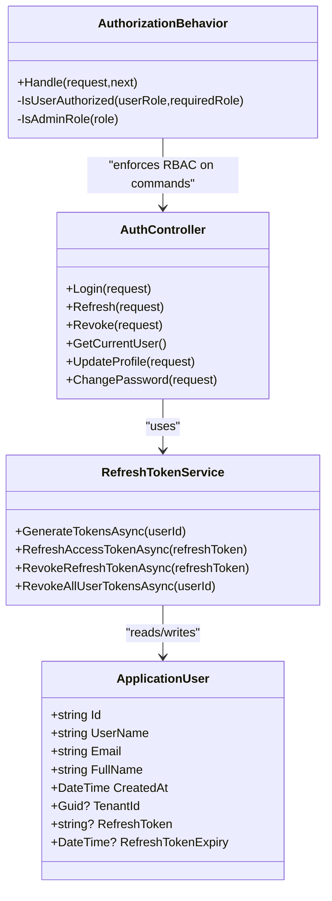
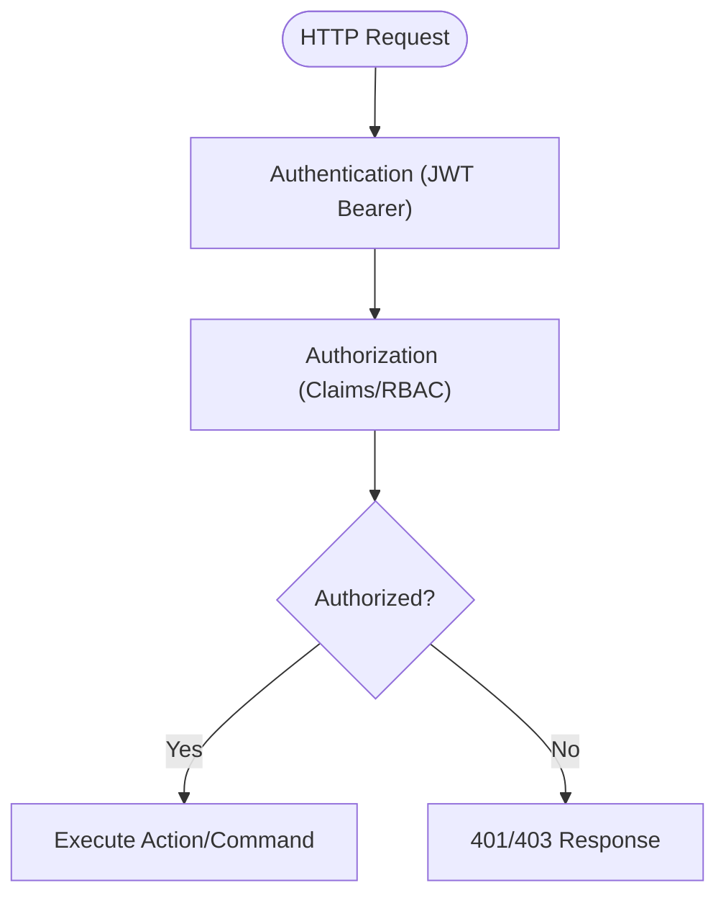
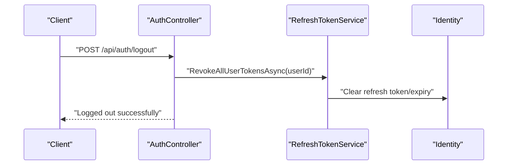
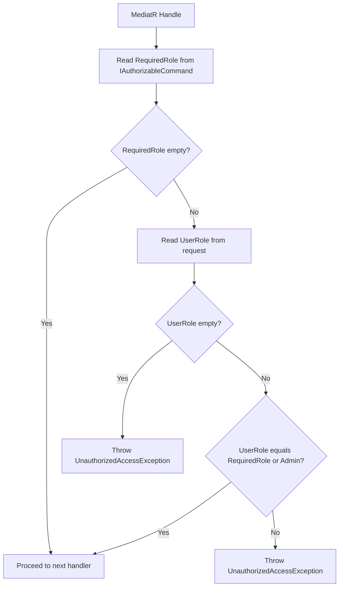
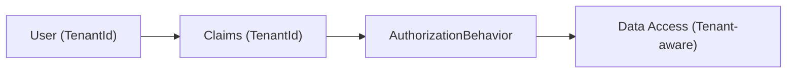
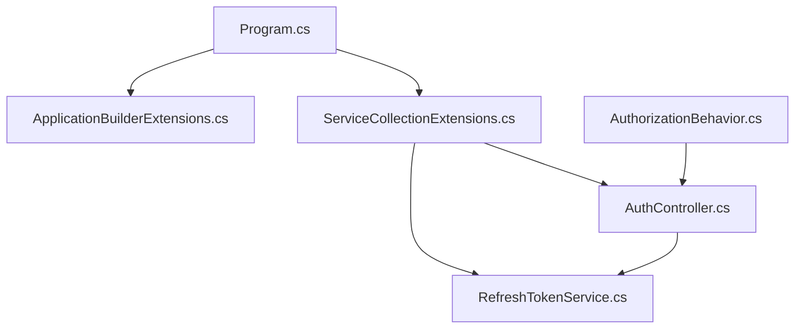

# Authorization and Access Control

<cite>
**Referenced Files in This Document**
- [Program.cs](file://src/api/DigitalTwinPlatform.API/Program.cs)
- [ApplicationBuilderExtensions.cs](file://src/api/DigitalTwinPlatform.API/Extensions/ApplicationBuilderExtensions.cs)
- [ServiceCollectionExtensions.cs](file://src/api/DigitalTwinPlatform.API/Extensions/ServiceCollectionExtensions.cs)
- [AuthController.cs](file://src/api/DigitalTwinPlatform.API/Controllers/AuthController.cs)
- [RefreshTokenService.cs](file://src/api/DigitalTwinPlatform.API/Services/Auth/RefreshTokenService.cs)
- [AuthorizationBehavior.cs](file://src/api/DigitalTwinPlatform.Application/Behaviors/AuthorizationBehavior.cs)
- [ApplicationUser.cs](file://src/api/DigitalTwinPlatform.Domain/Entities/Auth/ApplicationUser.cs)
- [Token-Security.md](file://src/api/DigitalTwinPlatform.API/Documentation/Token-Security.md)
</cite>

## Table of Contents
1. [Introduction](#introduction)
2. [Project Structure](#project-structure)
3. [Core Components](#core-components)
4. [Architecture Overview](#architecture-overview)
5. [Detailed Component Analysis](#detailed-component-analysis)
6. [Dependency Analysis](#dependency-analysis)
7. [Performance Considerations](#performance-considerations)
8. [Troubleshooting Guide](#troubleshooting-guide)
9. [Conclusion](#conclusion)

## Introduction
This document explains the authorization and access control system of the Digital Twin Platform. It covers role-based access control (RBAC), policy-based authorization, and resource protection mechanisms. It documents the AuthorizationBehavior pipeline component and its enforcement of authorization policies across the application, details authorization attributes, policy configuration, and permission-checking logic, and explains integration with ASP.NET Core Identity roles and claims-based authorization. It also addresses best practices, security middleware implementation, common authorization patterns, and multi-tenant security considerations.

## Project Structure
The authorization and access control system spans three layers:
- API layer: authentication, authorization attributes, and middleware pipeline
- Application layer: cross-cutting concerns via pipeline behaviors (e.g., AuthorizationBehavior)
- Domain layer: identity entities and tenant associations

**Diagram sources**
- [Program.cs](file://src/api/DigitalTwinPlatform.API/Program.cs#L59-L74)
- [ApplicationBuilderExtensions.cs](file://src/api/DigitalTwinPlatform.API/Extensions/ApplicationBuilderExtensions.cs#L15-L47)
- [ServiceCollectionExtensions.cs](file://src/api/DigitalTwinPlatform.API/Extensions/ServiceCollectionExtensions.cs#L43-L72)
- [AuthController.cs](file://src/api/DigitalTwinPlatform.API/Controllers/AuthController.cs#L22-L27)
- [RefreshTokenService.cs](file://src/api/DigitalTwinPlatform.API/Services/Auth/RefreshTokenService.cs#L10-L13)
- [AuthorizationBehavior.cs](file://src/api/DigitalTwinPlatform.Application/Behaviors/AuthorizationBehavior.cs#L10-L12)
- [ApplicationUser.cs](file://src/api/DigitalTwinPlatform.Domain/Entities/Auth/ApplicationUser.cs#L5-L12)

**Section sources**
- [Program.cs](file://src/api/DigitalTwinPlatform.API/Program.cs#L12-L80)
- [ApplicationBuilderExtensions.cs](file://src/api/DigitalTwinPlatform.API/Extensions/ApplicationBuilderExtensions.cs#L10-L89)
- [ServiceCollectionExtensions.cs](file://src/api/DigitalTwinPlatform.API/Extensions/ServiceCollectionExtensions.cs#L38-L72)

## Core Components
- Identity and JWT configuration: ASP.NET Core Identity with custom user entity and JWT bearer authentication with symmetric key validation.
- Authentication controller: Registration, login, token refresh, logout, and profile management with claims-based identity.
- Authorization pipeline behavior: Role-based enforcement for authorizable commands.
- Security middleware: HTTPS redirection, cookie policy, antiforgery, and authorization middleware placement.
- Token service: Access and refresh token generation, storage, refresh, and revocation.

**Section sources**
- [ServiceCollectionExtensions.cs](file://src/api/DigitalTwinPlatform.API/Extensions/ServiceCollectionExtensions.cs#L46-L58)
- [AuthController.cs](file://src/api/DigitalTwinPlatform.API/Controllers/AuthController.cs#L14-L27)
- [AuthorizationBehavior.cs](file://src/api/DigitalTwinPlatform.Application/Behaviors/AuthorizationBehavior.cs#L10-L12)
- [ApplicationBuilderExtensions.cs](file://src/api/DigitalTwinPlatform.API/Extensions/ApplicationBuilderExtensions.cs#L15-L47)
- [RefreshTokenService.cs](file://src/api/DigitalTwinPlatform.API/Services/Auth/RefreshTokenService.cs#L15-L85)

## Architecture Overview
The authorization architecture combines claims-based authentication, role-based authorization, and a command-level authorization pipeline behavior.

**Diagram sources**
- [AuthController.cs](file://src/api/DigitalTwinPlatform.API/Controllers/AuthController.cs#L120-L156)
- [RefreshTokenService.cs](file://src/api/DigitalTwinPlatform.API/Services/Auth/RefreshTokenService.cs#L15-L85)
- [AuthorizationBehavior.cs](file://src/api/DigitalTwinPlatform.Application/Behaviors/AuthorizationBehavior.cs#L14-L53)

## Detailed Component Analysis

### Role-Based Access Control (RBAC)
- Identity roles: Users are associated with roles via ASP.NET Core Identity. Claims include role claims for authorization decisions.
- Admin escalation: AuthorizationBehavior allows administrative roles to override role requirements.
- Controller-level enforcement: Many endpoints are protected by [Authorize], ensuring authentication and enabling role checks.

**Diagram sources**
- [ApplicationUser.cs](file://src/api/DigitalTwinPlatform.Domain/Entities/Auth/ApplicationUser.cs#L5-L12)
- [RefreshTokenService.cs](file://src/api/DigitalTwinPlatform.API/Services/Auth/RefreshTokenService.cs#L10-L13)
- [AuthController.cs](file://src/api/DigitalTwinPlatform.API/Controllers/AuthController.cs#L22-L27)
- [AuthorizationBehavior.cs](file://src/api/DigitalTwinPlatform.Application/Behaviors/AuthorizationBehavior.cs#L10-L12)

**Section sources**
- [ServiceCollectionExtensions.cs](file://src/api/DigitalTwinPlatform.API/Extensions/ServiceCollectionExtensions.cs#L46-L58)
- [AuthController.cs](file://src/api/DigitalTwinPlatform.API/Controllers/AuthController.cs#L22-L27)
- [RefreshTokenService.cs](file://src/api/DigitalTwinPlatform.API/Services/Auth/RefreshTokenService.cs#L24-L36)
- [AuthorizationBehavior.cs](file://src/api/DigitalTwinPlatform.Application/Behaviors/AuthorizationBehavior.cs#L55-L67)

### Policy-Based Authorization
- Claims-based authorization: Roles are represented as claims and used by authorization middleware and controllers.
- Attribute-driven policies: [Authorize] applied at controller and action level enforces authentication and can be extended to enforce roles or custom requirements.
- JWT configuration: Symmetric key validation ensures tokens originate from trusted issuers and audiences.

**Diagram sources**
- [ServiceCollectionExtensions.cs](file://src/api/DigitalTwinPlatform.API/Extensions/ServiceCollectionExtensions.cs#L378-L395)
- [ApplicationBuilderExtensions.cs](file://src/api/DigitalTwinPlatform.API/Extensions/ApplicationBuilderExtensions.cs#L43-L44)

**Section sources**
- [ServiceCollectionExtensions.cs](file://src/api/DigitalTwinPlatform.API/Extensions/ServiceCollectionExtensions.cs#L378-L395)
- [ApplicationBuilderExtensions.cs](file://src/api/DigitalTwinPlatform.API/Extensions/ApplicationBuilderExtensions.cs#L43-L44)

### Resource Protection Mechanisms
- Token lifecycle: Access tokens are short-lived; refresh tokens are stored securely and validated for expiry.
- Logout and revocation: Refresh tokens can be revoked per-user or per-token to terminate sessions.
- CSRF protection: Antiforgery middleware is enabled to protect state-changing requests.

**Diagram sources**
- [AuthController.cs](file://src/api/DigitalTwinPlatform.API/Controllers/AuthController.cs#L413-L422)
- [RefreshTokenService.cs](file://src/api/DigitalTwinPlatform.API/Services/Auth/RefreshTokenService.cs#L115-L125)

**Section sources**
- [RefreshTokenService.cs](file://src/api/DigitalTwinPlatform.API/Services/Auth/RefreshTokenService.cs#L63-L85)
- [AuthController.cs](file://src/api/DigitalTwinPlatform.API/Controllers/AuthController.cs#L411-L422)
- [ApplicationBuilderExtensions.cs](file://src/api/DigitalTwinPlatform.API/Extensions/ApplicationBuilderExtensions.cs#L61-L69)

### AuthorizationBehavior Pipeline Component
- Purpose: Enforce role-based authorization for commands implementing IAuthorizableCommand.
- Logic: Compare request.RequiredRole against request.UserRole; allow admin roles to bypass; log and throw on mismatch.
- Placement: Integrated into the MediatR pipeline so all commands implementing the marker interface are checked.

**Diagram sources**
- [AuthorizationBehavior.cs](file://src/api/DigitalTwinPlatform.Application/Behaviors/AuthorizationBehavior.cs#L14-L53)

**Section sources**
- [AuthorizationBehavior.cs](file://src/api/DigitalTwinPlatform.Application/Behaviors/AuthorizationBehavior.cs#L10-L12)
- [AuthorizationBehavior.cs](file://src/api/DigitalTwinPlatform.Application/Behaviors/AuthorizationBehavior.cs#L19-L53)

### Authorization Attributes and Permission Checking
- Controller attributes: [Authorize] protects endpoints; [AllowAnonymous] selectively disables it.
- Claims extraction: Controllers read claims (e.g., NameIdentifier) to identify the current user.
- Role-based checks: AuthorizationBehavior compares roles; admin roles implicitly authorize higher privileges.

**Section sources**
- [AuthController.cs](file://src/api/DigitalTwinPlatform.API/Controllers/AuthController.cs#L22-L27)
- [AuthController.cs](file://src/api/DigitalTwinPlatform.API/Controllers/AuthController.cs#L226-L251)
- [AuthorizationBehavior.cs](file://src/api/DigitalTwinPlatform.Application/Behaviors/AuthorizationBehavior.cs#L55-L67)

### Examples
- Role-based restrictions:
  - An administrative-only endpoint requires [Authorize] and can be further restricted by roles in controllers or policies.
  - AuthorizationBehavior enforces RequiredRole vs UserRole for commands.
- Resource-level authorization:
  - Commands can expose a resource identifier and enforce ownership or role-based access within handlers.
- Custom authorization policies:
  - Extend AuthorizationBehavior or add custom authorization handlers/policies for fine-grained checks.

[No sources needed since this subsection provides conceptual examples]

### Integration with ASP.NET Core Identity and Claims
- Identity setup: AddIdentity<ApplicationUser, IdentityRole> with Entity Framework stores and default token providers.
- Claims population: RefreshTokenService adds role claims during token generation.
- Tenant association: ApplicationUser includes TenantId for multi-tenancy; see Multi-tenant Security Considerations below.

**Section sources**
- [ServiceCollectionExtensions.cs](file://src/api/DigitalTwinPlatform.API/Extensions/ServiceCollectionExtensions.cs#L46-L58)
- [RefreshTokenService.cs](file://src/api/DigitalTwinPlatform.API/Services/Auth/RefreshTokenService.cs#L24-L36)
- [ApplicationUser.cs](file://src/api/DigitalTwinPlatform.Domain/Entities/Auth/ApplicationUser.cs#L9-L11)

### Multi-tenant Security Considerations
- Tenant-aware user: ApplicationUser includes TenantId, enabling tenant-scoped operations.
- Tenant context middleware: The pipeline includes a TenantContextMiddleware to isolate tenant data.
- Recommendation: Combine tenant claim with role-based checks and ensure all queries filter by tenant context.

**Diagram sources**
- [ApplicationUser.cs](file://src/api/DigitalTwinPlatform.Domain/Entities/Auth/ApplicationUser.cs#L9-L11)
- [Program.cs](file://src/api/DigitalTwinPlatform.API/Program.cs#L62-L62)

**Section sources**
- [Program.cs](file://src/api/DigitalTwinPlatform.API/Program.cs#L62-L62)
- [ApplicationUser.cs](file://src/api/DigitalTwinPlatform.Domain/Entities/Auth/ApplicationUser.cs#L9-L11)

## Dependency Analysis
- Program orchestrates middleware and service registration.
- ApplicationBuilderExtensions wires authentication, authorization, and security middleware.
- ServiceCollectionExtensions configures Identity, JWT, and antiforgery.
- AuthController depends on Identity and RefreshTokenService.
- AuthorizationBehavior depends on IAuthorizableCommand marker interface.

**Diagram sources**
- [Program.cs](file://src/api/DigitalTwinPlatform.API/Program.cs#L59-L74)
- [ApplicationBuilderExtensions.cs](file://src/api/DigitalTwinPlatform.API/Extensions/ApplicationBuilderExtensions.cs#L15-L47)
- [ServiceCollectionExtensions.cs](file://src/api/DigitalTwinPlatform.API/Extensions/ServiceCollectionExtensions.cs#L43-L72)
- [AuthController.cs](file://src/api/DigitalTwinPlatform.API/Controllers/AuthController.cs#L22-L27)
- [RefreshTokenService.cs](file://src/api/DigitalTwinPlatform.API/Services/Auth/RefreshTokenService.cs#L10-L13)
- [AuthorizationBehavior.cs](file://src/api/DigitalTwinPlatform.Application/Behaviors/AuthorizationBehavior.cs#L10-L12)

**Section sources**
- [Program.cs](file://src/api/DigitalTwinPlatform.API/Program.cs#L59-L74)
- [ServiceCollectionExtensions.cs](file://src/api/DigitalTwinPlatform.API/Extensions/ServiceCollectionExtensions.cs#L43-L72)

## Performance Considerations
- Minimize role checks: Cache role claims in the token where feasible.
- Avoid excessive logging: AuthorizationBehavior logs at debug/info/warning levels; tune logging verbosity in production.
- Token lifetime: Short access tokens with robust refresh token handling reduce overhead and improve security.

[No sources needed since this section provides general guidance]

## Troubleshooting Guide
- 401 Unauthorized on protected endpoints:
  - Ensure [Authorize] is applied and JWT Bearer authentication is configured.
  - Verify tokens are present and not expired.
- 403 Forbidden after login:
  - Confirm user has the required role; AuthorizationBehavior compares RequiredRole vs UserRole.
  - Check that role claims are included in the token.
- Token refresh failures:
  - Validate refresh token expiry and existence in storage.
  - Ensure JWT key configuration is correct and meets minimum length requirements.
- Logout not terminating session:
  - Confirm refresh token revocation clears stored tokens.

**Section sources**
- [AuthorizationBehavior.cs](file://src/api/DigitalTwinPlatform.Application/Behaviors/AuthorizationBehavior.cs#L30-L50)
- [ServiceCollectionExtensions.cs](file://src/api/DigitalTwinPlatform.API/Extensions/ServiceCollectionExtensions.cs#L355-L367)
- [RefreshTokenService.cs](file://src/api/DigitalTwinPlatform.API/Services/Auth/RefreshTokenService.cs#L87-L99)

## Conclusion
The Digital Twin Platform implements a layered authorization strategy combining JWT-based authentication, ASP.NET Core Identity roles, and a command-level AuthorizationBehavior for role-based enforcement. The system integrates security middleware, antiforgery protection, and a robust token lifecycle. Multi-tenancy is supported via tenant-aware user entities and middleware. Extending the system with custom authorization policies and tenant-scoped resource checks will further strengthen security and compliance.