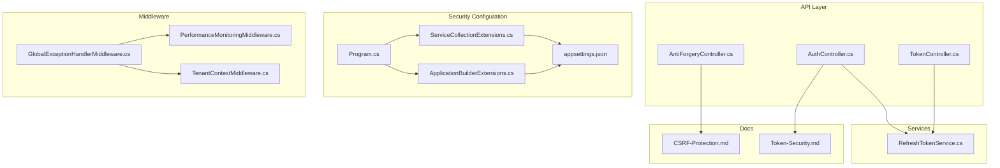
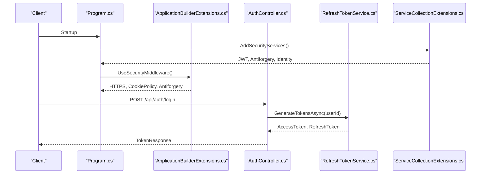
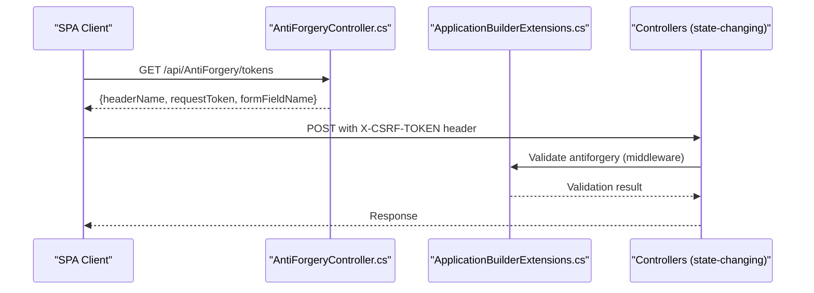
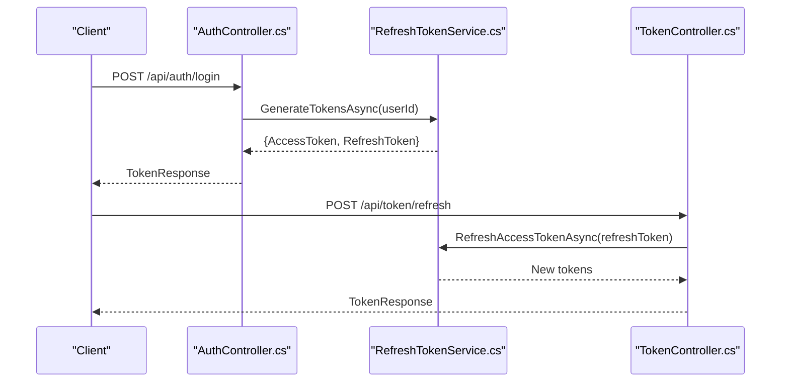
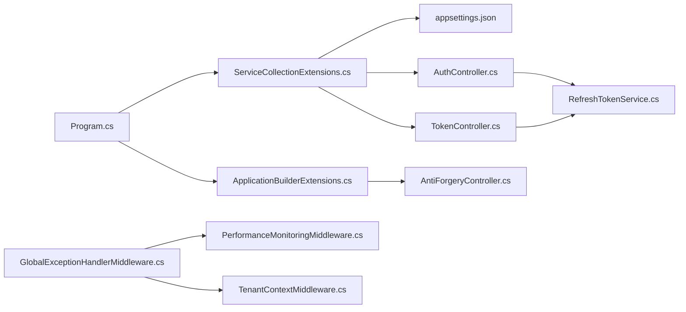

# Security Best Practices and Compliance

<cite>
**Referenced Files in This Document**
- [CSRF-Protection.md](file://src/api/DigitalTwinPlatform.API/Documentation/CSRF-Protection.md)
- [Token-Security.md](file://src/api/DigitalTwinPlatform.API/Documentation/Token-Security.md)
- [AntiForgeryController.cs](file://src/api/DigitalTwinPlatform.API/Controllers/AntiForgeryController.cs)
- [AuthController.cs](file://src/api/DigitalTwinPlatform.API/Controllers/AuthController.cs)
- [TokenController.cs](file://src/api/DigitalTwinPlatform.API/Controllers/TokenController.cs)
- [RefreshTokenService.cs](file://src/api/DigitalTwinPlatform.API/Services/Auth/RefreshTokenService.cs)
- [Program.cs](file://src/api/DigitalTwinPlatform.API/Program.cs)
- [appsettings.json](file://src/api/DigitalTwinPlatform.API/appsettings.json)
- [ApplicationBuilderExtensions.cs](file://src/api/DigitalTwinPlatform.API/Extensions/ApplicationBuilderExtensions.cs)
- [ServiceCollectionExtensions.cs](file://src/api/DigitalTwinPlatform.API/Extensions/ServiceCollectionExtensions.cs)
- [GlobalExceptionHandlerMiddleware.cs](file://src/api/DigitalTwinPlatform.API/Middleware/GlobalExceptionHandlerMiddleware.cs)
- [TenantContextMiddleware.cs](file://src/api/DigitalTwinPlatform.API/Middleware/TenantContextMiddleware.cs)
- [PerformanceMonitoringMiddleware.cs](file://src/api/DigitalTwinPlatform.API/Middleware/PerformanceMonitoringMiddleware.cs)
- [digitaltwin-overview.json](file://monitoring/grafana/dashboards/digitaltwin-overview.json)
</cite>

## Table of Contents
1. [Introduction](#introduction)
2. [Project Structure](#project-structure)
3. [Core Components](#core-components)
4. [Architecture Overview](#architecture-overview)
5. [Detailed Component Analysis](#detailed-component-analysis)
6. [Dependency Analysis](#dependency-analysis)
7. [Performance Considerations](#performance-considerations)
8. [Troubleshooting Guide](#troubleshooting-guide)
9. [Conclusion](#conclusion)
10. [Appendices](#appendices)

## Introduction
This document consolidates security best practices and compliance considerations for the Digital Twin Platform. It focuses on password security, token lifecycle management, CSRF protection, input validation, output encoding, injection prevention, secure API design, rate limiting, and monitoring. It also outlines compliance and auditing guidance tailored for industrial environments.

## Project Structure
Security-relevant components are distributed across:
- API Controllers for authentication, token refresh/revoke, and anti-forgery
- Authentication and token services
- Middleware for security enforcement and global exception handling
- Configuration for JWT, CORS, and cookie policies
- Monitoring dashboards for security-relevant metrics

**Diagram sources**
- [AuthController.cs](file://src/api/DigitalTwinPlatform.API/Controllers/AuthController.cs#L1-L854)
- [TokenController.cs](file://src/api/DigitalTwinPlatform.API/Controllers/TokenController.cs#L1-L57)
- [AntiForgeryController.cs](file://src/api/DigitalTwinPlatform.API/Controllers/AntiForgeryController.cs#L1-L60)
- [RefreshTokenService.cs](file://src/api/DigitalTwinPlatform.API/Services/Auth/RefreshTokenService.cs#L1-L150)
- [Program.cs](file://src/api/DigitalTwinPlatform.API/Program.cs#L1-L87)
- [ServiceCollectionExtensions.cs](file://src/api/DigitalTwinPlatform.API/Extensions/ServiceCollectionExtensions.cs#L1-L423)
- [ApplicationBuilderExtensions.cs](file://src/api/DigitalTwinPlatform.API/Extensions/ApplicationBuilderExtensions.cs#L1-L89)
- [appsettings.json](file://src/api/DigitalTwinPlatform.API/appsettings.json#L1-L93)
- [GlobalExceptionHandlerMiddleware.cs](file://src/api/DigitalTwinPlatform.API/Middleware/GlobalExceptionHandlerMiddleware.cs#L1-L257)
- [TenantContextMiddleware.cs](file://src/api/DigitalTwinPlatform.API/Middleware/TenantContextMiddleware.cs#L1-L18)
- [PerformanceMonitoringMiddleware.cs](file://src/api/DigitalTwinPlatform.API/Middleware/PerformanceMonitoringMiddleware.cs#L1-L148)
- [CSRF-Protection.md](file://src/api/DigitalTwinPlatform.API/Documentation/CSRF-Protection.md#L1-L53)
- [Token-Security.md](file://src/api/DigitalTwinPlatform.API/Documentation/Token-Security.md#L1-L72)

**Section sources**
- [Program.cs](file://src/api/DigitalTwinPlatform.API/Program.cs#L1-L87)
- [ServiceCollectionExtensions.cs](file://src/api/DigitalTwinPlatform.API/Extensions/ServiceCollectionExtensions.cs#L44-L73)
- [ApplicationBuilderExtensions.cs](file://src/api/DigitalTwinPlatform.API/Extensions/ApplicationBuilderExtensions.cs#L15-L34)

## Core Components
- Authentication and Authorization: JWT Bearer authentication with symmetric signing and Identity-based user management.
- Token Lifecycle: Access tokens with short-lived TTL and refresh tokens persisted with expiry.
- CSRF Protection: Antiforgery with header-based validation and Strict SameSite cookies.
- Input Validation and Output Encoding: FluentValidation auto-validation and JSON serialization options.
- Secure Transmission: HTTPS redirection in production and secure cookie flags.
- Exception Handling: Centralized error handling with structured responses and logging.
- Monitoring and Observability: Metrics and Grafana dashboards for uptime, latency, error rates, and alerts.

**Section sources**
- [ServiceCollectionExtensions.cs](file://src/api/DigitalTwinPlatform.API/Extensions/ServiceCollectionExtensions.cs#L44-L73)
- [ServiceCollectionExtensions.cs](file://src/api/DigitalTwinPlatform.API/Extensions/ServiceCollectionExtensions.cs#L377-L401)
- [RefreshTokenService.cs](file://src/api/DigitalTwinPlatform.API/Services/Auth/RefreshTokenService.cs#L15-L85)
- [AntiForgeryController.cs](file://src/api/DigitalTwinPlatform.API/Controllers/AntiForgeryController.cs#L14-L47)
- [ApplicationBuilderExtensions.cs](file://src/api/DigitalTwinPlatform.API/Extensions/ApplicationBuilderExtensions.cs#L18-L31)
- [GlobalExceptionHandlerMiddleware.cs](file://src/api/DigitalTwinPlatform.API/Middleware/GlobalExceptionHandlerMiddleware.cs#L50-L227)
- [digitaltwin-overview.json](file://monitoring/grafana/dashboards/digitaltwin-overview.json#L1-L279)

## Architecture Overview
The security architecture integrates configuration, middleware, controllers, and services to enforce authentication, authorization, CSRF protection, and secure token handling.

**Diagram sources**
- [Program.cs](file://src/api/DigitalTwinPlatform.API/Program.cs#L34-L71)
- [ServiceCollectionExtensions.cs](file://src/api/DigitalTwinPlatform.API/Extensions/ServiceCollectionExtensions.cs#L44-L73)
- [ApplicationBuilderExtensions.cs](file://src/api/DigitalTwinPlatform.API/Extensions/ApplicationBuilderExtensions.cs#L15-L34)
- [AuthController.cs](file://src/api/DigitalTwinPlatform.API/Controllers/AuthController.cs#L120-L156)
- [RefreshTokenService.cs](file://src/api/DigitalTwinPlatform.API/Services/Auth/RefreshTokenService.cs#L15-L85)

## Detailed Component Analysis

### Password Security Requirements and Storage
- Password policy: Minimal length configured via Identity options; adjust as needed for compliance.
- Storage: Passwords are handled by ASP.NET Core Identity. Ensure hashing aligns with organizational standards.
- Recommendations:
  - Enforce stronger password requirements (length, mixed case, digits, special characters).
  - Implement password history and reuse policies.
  - Use adaptive hashing with configurable cost factors if supported by the identity provider.
  - Rotate secrets and keys periodically; monitor for compromised credentials.

**Section sources**
- [ServiceCollectionExtensions.cs](file://src/api/DigitalTwinPlatform.API/Extensions/ServiceCollectionExtensions.cs#L47-L56)
- [AuthController.cs](file://src/api/DigitalTwinPlatform.API/Controllers/AuthController.cs#L51-L98)

### Hash Algorithms and Secure Storage
- JWT signing uses symmetric keys; ensure the key length meets security thresholds.
- Refresh tokens are stored with expiry; consider encrypting sensitive fields at rest.
- Recommendations:
  - Use strong, randomly generated keys and rotate them regularly.
  - Store refresh tokens in encrypted form with hardware security module (HSM) backing if feasible.
  - Apply database encryption for sensitive columns.

**Section sources**
- [ServiceCollectionExtensions.cs](file://src/api/DigitalTwinPlatform.API/Extensions/ServiceCollectionExtensions.cs#L360-L372)
- [ServiceCollectionExtensions.cs](file://src/api/DigitalTwinPlatform.API/Extensions/ServiceCollectionExtensions.cs#L383-L400)
- [RefreshTokenService.cs](file://src/api/DigitalTwinPlatform.API/Services/Auth/RefreshTokenService.cs#L38-L57)
- [RefreshTokenService.cs](file://src/api/DigitalTwinPlatform.API/Services/Auth/RefreshTokenService.cs#L63-L67)

### CSRF Protection Implementation
- Backend configuration:
  - Antiforgery enabled with custom header and cookie names.
  - Strict SameSite cookies and HttpOnly policy.
  - Middleware order: antiforgery placed after routing and before auth.
- Controller protection:
  - State-changing endpoints decorated with validation attributes.
- Token endpoint:
  - Dedicated endpoint returns token pair for SPA usage.
- Frontend integration:
  - Retrieve tokens and include header token on requests.
- Recommendations:
  - Keep tokens per-session and regenerate on login/logout.
  - Validate tokens on all state-modifying requests.
  - Use CSRF documentation as a reference for SPA integration.

**Diagram sources**
- [AntiForgeryController.cs](file://src/api/DigitalTwinPlatform.API/Controllers/AntiForgeryController.cs#L14-L47)
- [ApplicationBuilderExtensions.cs](file://src/api/DigitalTwinPlatform.API/Extensions/ApplicationBuilderExtensions.cs#L30-L31)
- [CSRF-Protection.md](file://src/api/DigitalTwinPlatform.API/Documentation/CSRF-Protection.md#L10-L27)

**Section sources**
- [AntiForgeryController.cs](file://src/api/DigitalTwinPlatform.API/Controllers/AntiForgeryController.cs#L14-L47)
- [ApplicationBuilderExtensions.cs](file://src/api/DigitalTwinPlatform.API/Extensions/ApplicationBuilderExtensions.cs#L18-L31)
- [CSRF-Protection.md](file://src/api/DigitalTwinPlatform.API/Documentation/CSRF-Protection.md#L10-L53)

### Token Security Practices (JWT, Encryption, Transmission)
- Transport security:
  - HTTPS redirection in non-development environments.
  - Secure cookie flags (HttpOnly, SameSite=Strict).
- Token lifecycle:
  - Access tokens short-lived; refresh tokens longer-lived and persisted.
  - Refresh endpoints for renewal and revocation.
- Recommendations:
  - Use HTTPS-only cookies for refresh tokens.
  - Encrypt tokens at rest and in transit.
  - Implement token binding and sliding expiration carefully.

**Diagram sources**
- [AuthController.cs](file://src/api/DigitalTwinPlatform.API/Controllers/AuthController.cs#L120-L156)
- [RefreshTokenService.cs](file://src/api/DigitalTwinPlatform.API/Services/Auth/RefreshTokenService.cs#L15-L85)
- [TokenController.cs](file://src/api/DigitalTwinPlatform.API/Controllers/TokenController.cs#L20-L35)

**Section sources**
- [Token-Security.md](file://src/api/DigitalTwinPlatform.API/Documentation/Token-Security.md#L8-L72)
- [ApplicationBuilderExtensions.cs](file://src/api/DigitalTwinPlatform.API/Extensions/ApplicationBuilderExtensions.cs#L24-L28)
- [AuthController.cs](file://src/api/DigitalTwinPlatform.API/Controllers/AuthController.cs#L171-L196)
- [TokenController.cs](file://src/api/DigitalTwinPlatform.API/Controllers/TokenController.cs#L16-L35)
- [RefreshTokenService.cs](file://src/api/DigitalTwinPlatform.API/Services/Auth/RefreshTokenService.cs#L87-L99)

### Input Validation, Output Encoding, and Injection Prevention
- Input validation:
  - FluentValidation auto-validation and client adapters registered.
  - Strongly typed DTOs and request models in controllers.
- Output encoding:
  - JSON camelCase serialization and null-ignoring options.
- Injection prevention:
  - JWT-based authentication reduces SQL injection vectors.
  - Use parameterized queries and ORMs consistently.
  - Avoid dynamic SQL and sanitize logs.

**Section sources**
- [Program.cs](file://src/api/DigitalTwinPlatform.API/Program.cs#L15-L24)
- [ServiceCollectionExtensions.cs](file://src/api/DigitalTwinPlatform.API/Extensions/ServiceCollectionExtensions.cs#L22-L24)
- [AuthController.cs](file://src/api/DigitalTwinPlatform.API/Controllers/AuthController.cs#L568-L602)

### Secure API Design, Rate Limiting, and Abuse Prevention
- API design:
  - Versioned endpoints and bearer token requirement for protected routes.
  - Structured error responses and consistent status codes.
- Rate limiting:
  - Not explicitly configured in the examined code; implement at gateway or middleware level.
- Abuse prevention:
  - Centralized exception handling with structured responses.
  - Tenant isolation via middleware.
  - Monitor slow requests and errors.

**Section sources**
- [ServiceCollectionExtensions.cs](file://src/api/DigitalTwinPlatform.API/Extensions/ServiceCollectionExtensions.cs#L154-L228)
- [GlobalExceptionHandlerMiddleware.cs](file://src/api/DigitalTwinPlatform.API/Middleware/GlobalExceptionHandlerMiddleware.cs#L50-L227)
- [TenantContextMiddleware.cs](file://src/api/DigitalTwinPlatform.API/Middleware/TenantContextMiddleware.cs#L9-L13)
- [PerformanceMonitoringMiddleware.cs](file://src/api/DigitalTwinPlatform.API/Middleware/PerformanceMonitoringMiddleware.cs#L25-L60)

### Compliance Requirements and Security Auditing
- Industrial applications:
  - Enforce HTTPS, strict cookie policies, and antiforgery.
  - Maintain audit logs via centralized exception handler.
- Data protection regulations:
  - Minimize data exposure; avoid logging sensitive fields.
  - Encrypt at rest and in transit; manage keys securely.
- Auditing:
  - Use structured logging and dashboards for visibility.
  - Track authentication failures, token refreshes, and slow requests.

**Section sources**
- [Token-Security.md](file://src/api/DigitalTwinPlatform.API/Documentation/Token-Security.md#L34-L72)
- [GlobalExceptionHandlerMiddleware.cs](file://src/api/DigitalTwinPlatform.API/Middleware/GlobalExceptionHandlerMiddleware.cs#L229-L249)
- [digitaltwin-overview.json](file://monitoring/grafana/dashboards/digitaltwin-overview.json#L1-L279)

### Security Monitoring, Threat Detection, and Incident Response
- Monitoring:
  - Grafana dashboard tracks uptime, latency, error rate, and recent alerts.
- Threat detection:
  - Use slow request thresholds and error rate spikes as indicators.
- Incident response:
  - Centralized error handling with request IDs and metadata.
  - Review logs for repeated failures and suspicious patterns.

**Section sources**
- [digitaltwin-overview.json](file://monitoring/grafana/dashboards/digitaltwin-overview.json#L19-L102)
- [PerformanceMonitoringMiddleware.cs](file://src/api/DigitalTwinPlatform.API/Middleware/PerformanceMonitoringMiddleware.cs#L46-L58)
- [GlobalExceptionHandlerMiddleware.cs](file://src/api/DigitalTwinPlatform.API/Middleware/GlobalExceptionHandlerMiddleware.cs#L229-L249)

### Security Testing, Vulnerability Assessment, and Penetration Testing
- Testing practices:
  - Validate CSRF token retrieval and usage.
  - Test token refresh and revocation flows.
  - Verify HTTPS enforcement and cookie flags.
- Vulnerability assessment:
  - Review JWT key strength and rotation procedures.
  - Evaluate antiforgery configuration for SPA scenarios.
- Penetration testing:
  - Target authentication flows, token endpoints, and state-changing endpoints.
  - Assess CORS and cookie security settings.

**Section sources**
- [CSRF-Protection.md](file://src/api/DigitalTwinPlatform.API/Documentation/CSRF-Protection.md#L29-L53)
- [Token-Security.md](file://src/api/DigitalTwinPlatform.API/Documentation/Token-Security.md#L18-L32)
- [ServiceCollectionExtensions.cs](file://src/api/DigitalTwinPlatform.API/Extensions/ServiceCollectionExtensions.cs#L360-L372)

## Dependency Analysis

**Diagram sources**
- [Program.cs](file://src/api/DigitalTwinPlatform.API/Program.cs#L34-L71)
- [ServiceCollectionExtensions.cs](file://src/api/DigitalTwinPlatform.API/Extensions/ServiceCollectionExtensions.cs#L44-L73)
- [ApplicationBuilderExtensions.cs](file://src/api/DigitalTwinPlatform.API/Extensions/ApplicationBuilderExtensions.cs#L15-L34)
- [AuthController.cs](file://src/api/DigitalTwinPlatform.API/Controllers/AuthController.cs#L120-L156)
- [TokenController.cs](file://src/api/DigitalTwinPlatform.API/Controllers/TokenController.cs#L20-L35)
- [RefreshTokenService.cs](file://src/api/DigitalTwinPlatform.API/Services/Auth/RefreshTokenService.cs#L15-L85)
- [AntiForgeryController.cs](file://src/api/DigitalTwinPlatform.API/Controllers/AntiForgeryController.cs#L14-L47)
- [GlobalExceptionHandlerMiddleware.cs](file://src/api/DigitalTwinPlatform.API/Middleware/GlobalExceptionHandlerMiddleware.cs#L50-L227)
- [PerformanceMonitoringMiddleware.cs](file://src/api/DigitalTwinPlatform.API/Middleware/PerformanceMonitoringMiddleware.cs#L25-L60)
- [TenantContextMiddleware.cs](file://src/api/DigitalTwinPlatform.API/Middleware/TenantContextMiddleware.cs#L9-L13)

**Section sources**
- [Program.cs](file://src/api/DigitalTwinPlatform.API/Program.cs#L34-L71)
- [ServiceCollectionExtensions.cs](file://src/api/DigitalTwinPlatform.API/Extensions/ServiceCollectionExtensions.cs#L44-L73)
- [ApplicationBuilderExtensions.cs](file://src/api/DigitalTwinPlatform.API/Extensions/ApplicationBuilderExtensions.cs#L15-L34)

## Performance Considerations
- Use performance monitoring middleware to detect slow requests and exclude health endpoints.
- Tune JWT expiry and refresh token lifetimes to balance security and UX.
- Ensure CORS and cookie policies do not introduce latency regressions.

**Section sources**
- [PerformanceMonitoringMiddleware.cs](file://src/api/DigitalTwinPlatform.API/Middleware/PerformanceMonitoringMiddleware.cs#L25-L60)
- [ServiceCollectionExtensions.cs](file://src/api/DigitalTwinPlatform.API/Extensions/ServiceCollectionExtensions.cs#L78-L101)

## Troubleshooting Guide
- Authentication failures:
  - Verify JWT issuer/audience configuration and key length.
  - Check token expiry and refresh flows.
- CSRF validation errors:
  - Confirm token retrieval endpoint and header usage.
  - Ensure middleware order and cookie SameSite settings.
- Exceptions:
  - Inspect structured error responses and request IDs.
  - Review logs for unauthorized access and validation errors.

**Section sources**
- [ServiceCollectionExtensions.cs](file://src/api/DigitalTwinPlatform.API/Extensions/ServiceCollectionExtensions.cs#L360-L401)
- [AntiForgeryController.cs](file://src/api/DigitalTwinPlatform.API/Controllers/AntiForgeryController.cs#L33-L47)
- [GlobalExceptionHandlerMiddleware.cs](file://src/api/DigitalTwinPlatform.API/Middleware/GlobalExceptionHandlerMiddleware.cs#L50-L227)

## Conclusion
The Digital Twin Platform implements robust foundational security controls: JWT-based authentication, antiforgery protection, HTTPS enforcement, and centralized exception handling. To meet industrial and compliance requirements, strengthen password policies, rotate and protect cryptographic keys, implement rate limiting, and expand monitoring/alerting. Regular security testing and audits will ensure continued resilience.

## Appendices
- Configuration references:
  - JWT settings and CORS origins.
- Documentation references:
  - CSRF protection and token security guides.

**Section sources**
- [appsettings.json](file://src/api/DigitalTwinPlatform.API/appsettings.json#L64-L69)
- [ServiceCollectionExtensions.cs](file://src/api/DigitalTwinPlatform.API/Extensions/ServiceCollectionExtensions.cs#L78-L99)
- [CSRF-Protection.md](file://src/api/DigitalTwinPlatform.API/Documentation/CSRF-Protection.md#L1-L53)
- [Token-Security.md](file://src/api/DigitalTwinPlatform.API/Documentation/Token-Security.md#L1-L72)