# Security and Authentication

<cite>
**Referenced Files in This Document**
- [AuthController.cs](file://src/api/DigitalTwinPlatform.API/Controllers/AuthController.cs)
- [TokenController.cs](file://src/api/DigitalTwinPlatform.API/Controllers/TokenController.cs)
- [RefreshTokenService.cs](file://src/api/DigitalTwinPlatform.API/Services/Auth/RefreshTokenService.cs)
- [Program.cs](file://src/api/DigitalTwinPlatform.API/Program.cs)
- [ServiceCollectionExtensions.cs](file://src/api/DigitalTwinPlatform.API/Extensions/ServiceCollectionExtensions.cs)
- [ApplicationBuilderExtensions.cs](file://src/api/DigitalTwinPlatform.API/Extensions/ApplicationBuilderExtensions.cs)
- [ConfigurationExtensions.cs](file://src/api/DigitalTwinPlatform.API/Extensions/ConfigurationExtensions.cs)
- [TenantContextMiddleware.cs](file://src/api/DigitalTwinPlatform.API/Middleware/TenantContextMiddleware.cs)
- [LoggingConfiguration.cs](file://src/api/DigitalTwinPlatform.API/Infrastructure/LoggingConfiguration.cs)
- [AuditBehavior.cs](file://src/api/DigitalTwinPlatform.Application/Behaviors/AuditBehavior.cs)
- [AuthorizationBehavior.cs](file://src/api/DigitalTwinPlatform.Application/Behaviors/AuthorizationBehavior.cs)
- [ApplicationUser.cs](file://src/api/DigitalTwinPlatform.Domain/Entities/Auth/ApplicationUser.cs)
- [Tenant.cs](file://src/api/DigitalTwinPlatform.Domain/Entities/Tenant.cs)
- [appsettings.json](file://src/api/DigitalTwinPlatform.API/appsettings.json)
</cite>

## Table of Contents
1. [Introduction](#introduction)
2. [Project Structure](#project-structure)
3. [Core Components](#core-components)
4. [Architecture Overview](#architecture-overview)
5. [Detailed Component Analysis](#detailed-component-analysis)
6. [Dependency Analysis](#dependency-analysis)
7. [Performance Considerations](#performance-considerations)
8. [Troubleshooting Guide](#troubleshooting-guide)
9. [Conclusion](#conclusion)
10. [Appendices](#appendices)

## Introduction
This document explains the security and authentication system of the Digital Twin Platform. It covers JWT-based authentication, user registration, role-based access control (RBAC), refresh token management, session handling, tenant isolation, authorization policies, resource protection, and audit logging. It also provides practical authentication flows, permission checks, middleware configuration, and security best practices tailored for industrial applications.

## Project Structure
Security and authentication spans three layers:
- API layer: Controllers expose authentication endpoints and integrate JWT bearer authentication.
- Application layer: Pipeline behaviors enforce authorization and audit logging.
- Domain layer: Entities define user and tenant models used for RBAC and tenant isolation.

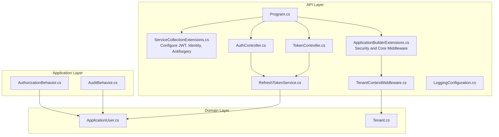

**Diagram sources**
- [Program.cs](file://src/api/DigitalTwinPlatform.API/Program.cs#L1-L87)
- [ServiceCollectionExtensions.cs](file://src/api/DigitalTwinPlatform.API/Extensions/ServiceCollectionExtensions.cs#L43-L72)
- [ApplicationBuilderExtensions.cs](file://src/api/DigitalTwinPlatform.API/Extensions/ApplicationBuilderExtensions.cs#L15-L47)
- [AuthController.cs](file://src/api/DigitalTwinPlatform.API/Controllers/AuthController.cs#L23-L27)
- [TokenController.cs](file://src/api/DigitalTwinPlatform.API/Controllers/TokenController.cs#L9-L57)
- [RefreshTokenService.cs](file://src/api/DigitalTwinPlatform.API/Services/Auth/RefreshTokenService.cs#L10-L132)
- [TenantContextMiddleware.cs](file://src/api/DigitalTwinPlatform.API/Middleware/TenantContextMiddleware.cs#L5-L17)
- [LoggingConfiguration.cs](file://src/api/DigitalTwinPlatform.API/Infrastructure/LoggingConfiguration.cs#L8-L57)
- [AuthorizationBehavior.cs](file://src/api/DigitalTwinPlatform.Application/Behaviors/AuthorizationBehavior.cs#L10-L78)
- [AuditBehavior.cs](file://src/api/DigitalTwinPlatform.Application/Behaviors/AuditBehavior.cs#L10-L63)
- [ApplicationUser.cs](file://src/api/DigitalTwinPlatform.Domain/Entities/Auth/ApplicationUser.cs#L5-L12)
- [Tenant.cs](file://src/api/DigitalTwinPlatform.Domain/Entities/Tenant.cs#L5-L121)

**Section sources**
- [Program.cs](file://src/api/DigitalTwinPlatform.API/Program.cs#L1-L87)
- [ServiceCollectionExtensions.cs](file://src/api/DigitalTwinPlatform.API/Extensions/ServiceCollectionExtensions.cs#L43-L72)
- [ApplicationBuilderExtensions.cs](file://src/api/DigitalTwinPlatform.API/Extensions/ApplicationBuilderExtensions.cs#L15-L47)

## Core Components
- JWT Bearer Authentication: Configured via symmetric keys and validated centrally.
- Identity and Password Policy: ASP.NET Core Identity with configurable password requirements.
- Antiforgery Protection: CSRF prevention for state-changing requests.
- Refresh Token Service: Generates, validates, and revokes refresh tokens.
- Tenant Context Middleware: Propagates tenant context from request headers.
- Authorization Pipeline Behavior: Enforces role-based authorization for commands.
- Audit Pipeline Behavior: Logs command execution with user identity.
- Structured Logging: Centralized request lifecycle logging.

**Section sources**
- [ServiceCollectionExtensions.cs](file://src/api/DigitalTwinPlatform.API/Extensions/ServiceCollectionExtensions.cs#L46-L55)
- [ServiceCollectionExtensions.cs](file://src/api/DigitalTwinPlatform.API/Extensions/ServiceCollectionExtensions.cs#L372-L396)
- [ConfigurationExtensions.cs](file://src/api/DigitalTwinPlatform.API/Extensions/ConfigurationExtensions.cs#L52-L75)
- [RefreshTokenService.cs](file://src/api/DigitalTwinPlatform.API/Services/Auth/RefreshTokenService.cs#L15-L132)
- [TenantContextMiddleware.cs](file://src/api/DigitalTwinPlatform.API/Middleware/TenantContextMiddleware.cs#L5-L17)
- [AuthorizationBehavior.cs](file://src/api/DigitalTwinPlatform.Application/Behaviors/AuthorizationBehavior.cs#L10-L78)
- [AuditBehavior.cs](file://src/api/DigitalTwinPlatform.Application/Behaviors/AuditBehavior.cs#L10-L63)
- [LoggingConfiguration.cs](file://src/api/DigitalTwinPlatform.API/Infrastructure/LoggingConfiguration.cs#L27-L57)

## Architecture Overview
The authentication and authorization architecture integrates controllers, services, middleware, and pipeline behaviors:

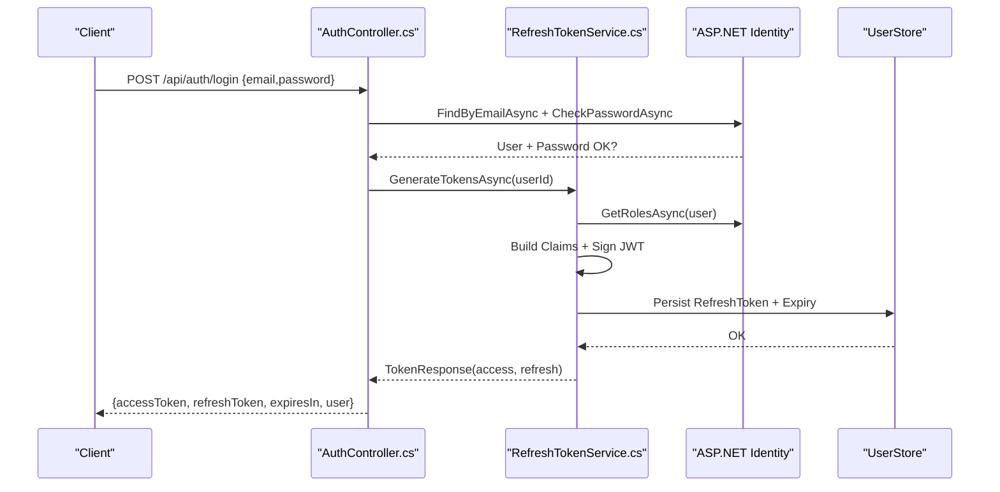

**Diagram sources**
- [AuthController.cs](file://src/api/DigitalTwinPlatform.API/Controllers/AuthController.cs#L120-L156)
- [RefreshTokenService.cs](file://src/api/DigitalTwinPlatform.API/Services/Auth/RefreshTokenService.cs#L15-L85)
- [ApplicationUser.cs](file://src/api/DigitalTwinPlatform.Domain/Entities/Auth/ApplicationUser.cs#L5-L12)

**Section sources**
- [AuthController.cs](file://src/api/DigitalTwinPlatform.API/Controllers/AuthController.cs#L120-L156)
- [RefreshTokenService.cs](file://src/api/DigitalTwinPlatform.API/Services/Auth/RefreshTokenService.cs#L15-L85)

## Detailed Component Analysis

### JWT Token-Based Authentication
- Configuration: Symmetric key signing, issuer, audience, and expiry minutes are loaded from configuration.
- Validation: TokenValidationParameters enforces issuer, audience, lifetime, and signing key.
- Usage: Controllers return access tokens and refresh tokens; clients use bearer tokens for protected endpoints.

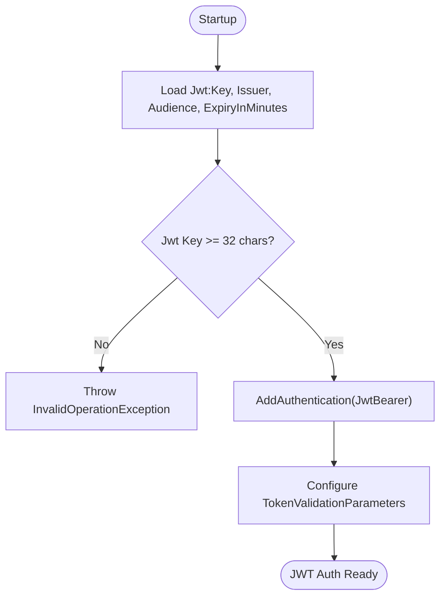

**Diagram sources**
- [ServiceCollectionExtensions.cs](file://src/api/DigitalTwinPlatform.API/Extensions/ServiceCollectionExtensions.cs#L355-L396)
- [ConfigurationExtensions.cs](file://src/api/DigitalTwinPlatform.API/Extensions/ConfigurationExtensions.cs#L52-L75)
- [appsettings.json](file://src/api/DigitalTwinPlatform.API/appsettings.json#L64-L69)

**Section sources**
- [ServiceCollectionExtensions.cs](file://src/api/DigitalTwinPlatform.API/Extensions/ServiceCollectionExtensions.cs#L372-L396)
- [ConfigurationExtensions.cs](file://src/api/DigitalTwinPlatform.API/Extensions/ConfigurationExtensions.cs#L52-L75)
- [appsettings.json](file://src/api/DigitalTwinPlatform.API/appsettings.json#L64-L69)

### User Registration and Identity
- Registration endpoint validates password confirmation and terms acceptance, then creates a user via UserManager.
- Identity password policy is configurable; current configuration requires minimum length and disables several complexity requirements.

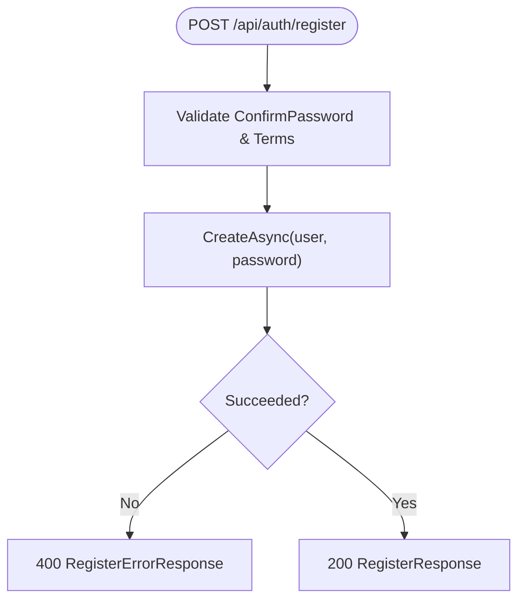

**Diagram sources**
- [AuthController.cs](file://src/api/DigitalTwinPlatform.API/Controllers/AuthController.cs#L51-L98)
- [ServiceCollectionExtensions.cs](file://src/api/DigitalTwinPlatform.API/Extensions/ServiceCollectionExtensions.cs#L46-L55)

**Section sources**
- [AuthController.cs](file://src/api/DigitalTwinPlatform.API/Controllers/AuthController.cs#L51-L98)
- [ServiceCollectionExtensions.cs](file://src/api/DigitalTwinPlatform.API/Extensions/ServiceCollectionExtensions.cs#L46-L55)

### Role-Based Access Control (RBAC)
- Claims-based roles are included in JWT claims during token generation.
- AuthorizationBehavior enforces role checks for commands implementing IAuthorizableCommand.
- Authorization logic allows admin-equivalent roles to override lower roles.

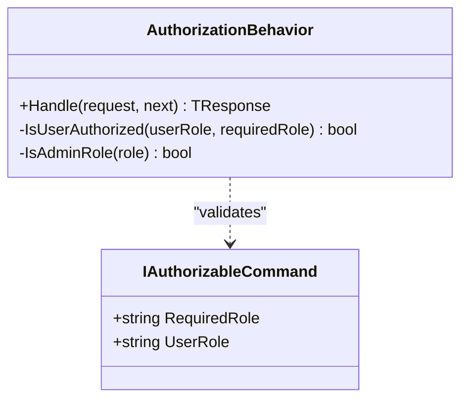

**Diagram sources**
- [AuthorizationBehavior.cs](file://src/api/DigitalTwinPlatform.Application/Behaviors/AuthorizationBehavior.cs#L10-L78)

**Section sources**
- [RefreshTokenService.cs](file://src/api/DigitalTwinPlatform.API/Services/Auth/RefreshTokenService.cs#L24-L36)
- [AuthorizationBehavior.cs](file://src/api/DigitalTwinPlatform.Application/Behaviors/AuthorizationBehavior.cs#L14-L67)

### Refresh Token Service and Session Management
- GenerateTokensAsync builds access token with claims and roles, persists refresh token and expiry on the user.
- RefreshAccessTokenAsync validates refresh token and expiry, regenerating new tokens.
- RevokeRefreshTokenAsync and RevokeAllUserTokensAsync clear stored refresh tokens.

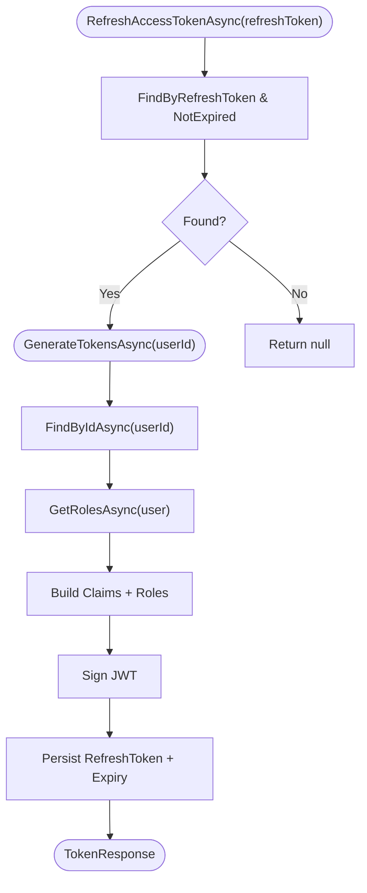

**Diagram sources**
- [RefreshTokenService.cs](file://src/api/DigitalTwinPlatform.API/Services/Auth/RefreshTokenService.cs#L15-L99)
- [ApplicationUser.cs](file://src/api/DigitalTwinPlatform.Domain/Entities/Auth/ApplicationUser.cs#L5-L12)

**Section sources**
- [RefreshTokenService.cs](file://src/api/DigitalTwinPlatform.API/Services/Auth/RefreshTokenService.cs#L15-L132)
- [ApplicationUser.cs](file://src/api/DigitalTwinPlatform.Domain/Entities/Auth/ApplicationUser.cs#L5-L12)

### Tenant Isolation Mechanisms
- TenantContextMiddleware reads X-Tenant-Id from the request header and sets the tenant context via ITenantService.
- Domain Tenant entity encapsulates tenant metadata and relationships; application logic can use ITenantService to enforce schema or data isolation.

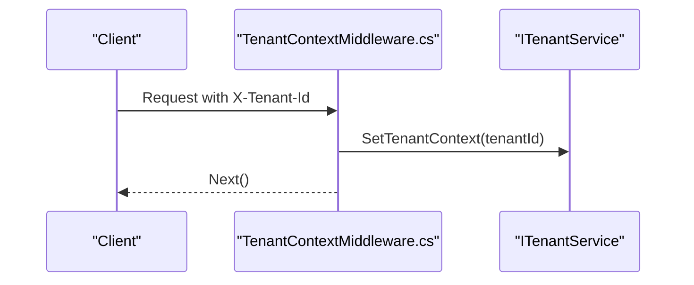

**Diagram sources**
- [TenantContextMiddleware.cs](file://src/api/DigitalTwinPlatform.API/Middleware/TenantContextMiddleware.cs#L5-L17)
- [Tenant.cs](file://src/api/DigitalTwinPlatform.Domain/Entities/Tenant.cs#L5-L121)

**Section sources**
- [TenantContextMiddleware.cs](file://src/api/DigitalTwinPlatform.API/Middleware/TenantContextMiddleware.cs#L5-L17)
- [Tenant.cs](file://src/api/DigitalTwinPlatform.Domain/Entities/Tenant.cs#L5-L121)

### Authorization Policies and Resource Protection
- Controllers use [Authorize] attributes where applicable; JWT bearer authentication is globally enforced.
- Antiforgery protection secures state-changing requests via cookie and header policies.
- CORS is configured for allowed origins with credentials.

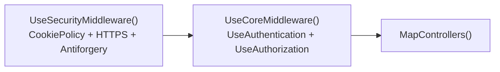

**Diagram sources**
- [ApplicationBuilderExtensions.cs](file://src/api/DigitalTwinPlatform.API/Extensions/ApplicationBuilderExtensions.cs#L15-L47)

**Section sources**
- [ApplicationBuilderExtensions.cs](file://src/api/DigitalTwinPlatform.API/Extensions/ApplicationBuilderExtensions.cs#L15-L47)
- [ServiceCollectionExtensions.cs](file://src/api/DigitalTwinPlatform.API/Extensions/ServiceCollectionExtensions.cs#L61-L69)
- [ServiceCollectionExtensions.cs](file://src/api/DigitalTwinPlatform.API/Extensions/ServiceCollectionExtensions.cs#L77-L100)

### Audit Logging
- AuditBehavior logs command execution start, completion, and failures with request payloads and user identity.
- Combined with JWT claims, this provides traceability for RBAC enforcement and sensitive operations.

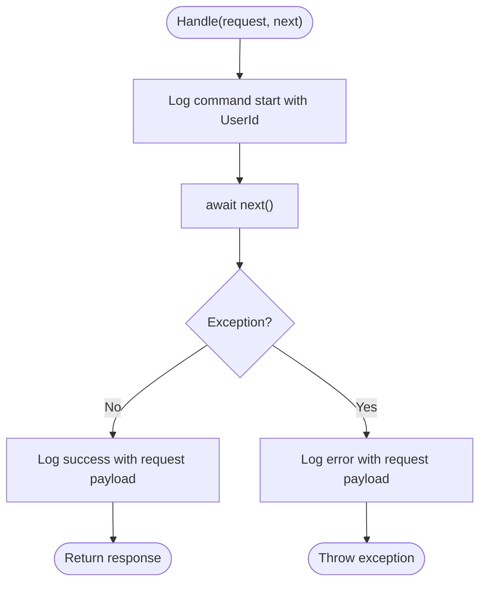

**Diagram sources**
- [AuditBehavior.cs](file://src/api/DigitalTwinPlatform.Application/Behaviors/AuditBehavior.cs#L14-L53)

**Section sources**
- [AuditBehavior.cs](file://src/api/DigitalTwinPlatform.Application/Behaviors/AuditBehavior.cs#L10-L63)

### Practical Authentication Flows
- Login flow: Client posts credentials; server validates and returns access and refresh tokens.
- Token refresh flow: Client posts refresh token; server validates and returns new tokens.
- Logout flow: Client revokes refresh token; server clears stored refresh token.
- Profile and password management: Protected endpoints using JWT bearer tokens.

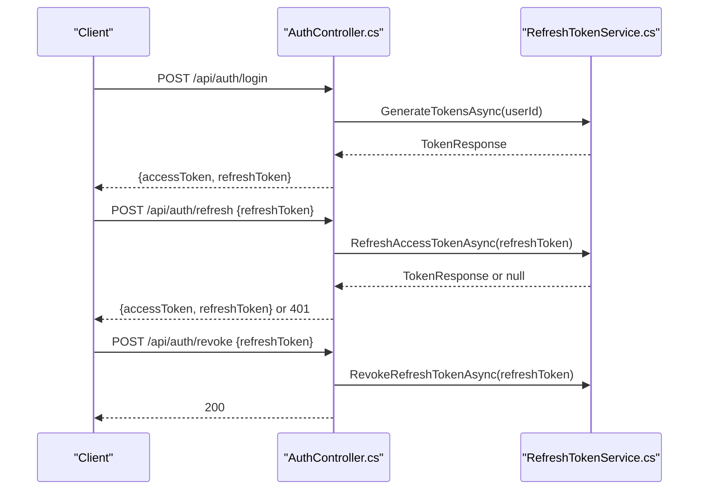

**Diagram sources**
- [AuthController.cs](file://src/api/DigitalTwinPlatform.API/Controllers/AuthController.cs#L120-L196)
- [RefreshTokenService.cs](file://src/api/DigitalTwinPlatform.API/Services/Auth/RefreshTokenService.cs#L87-L113)

**Section sources**
- [AuthController.cs](file://src/api/DigitalTwinPlatform.API/Controllers/AuthController.cs#L120-L196)
- [RefreshTokenService.cs](file://src/api/DigitalTwinPlatform.API/Services/Auth/RefreshTokenService.cs#L87-L113)

### Permission Checks and Security Middleware
- AuthorizationBehavior ensures commands requiring elevated roles are executed only by authorized users.
- Security middleware enforces cookie policies, HTTPS in production, and antiforgery tokens.

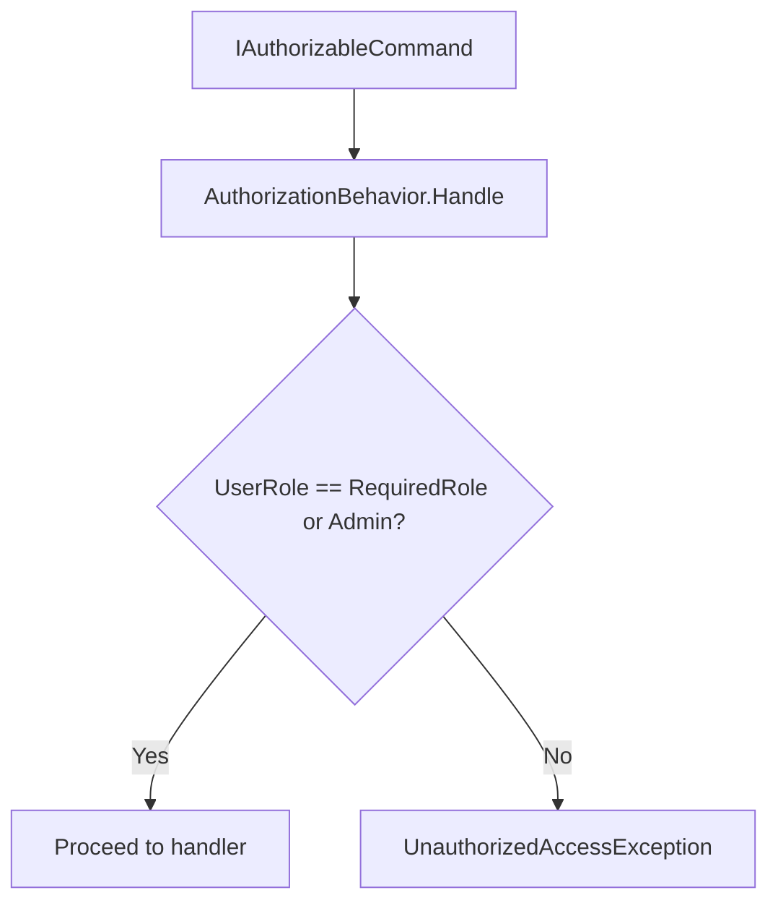

**Diagram sources**
- [AuthorizationBehavior.cs](file://src/api/DigitalTwinPlatform.Application/Behaviors/AuthorizationBehavior.cs#L14-L53)

**Section sources**
- [AuthorizationBehavior.cs](file://src/api/DigitalTwinPlatform.Application/Behaviors/AuthorizationBehavior.cs#L14-L53)
- [ApplicationBuilderExtensions.cs](file://src/api/DigitalTwinPlatform.API/Extensions/ApplicationBuilderExtensions.cs#L15-L34)

## Dependency Analysis
- Controllers depend on RefreshTokenService for token operations.
- RefreshTokenService depends on ASP.NET Identity for user lookup and role retrieval.
- Middleware depends on ITenantService for tenant context propagation.
- Pipeline behaviors depend on command interfaces to enforce authorization and auditing.

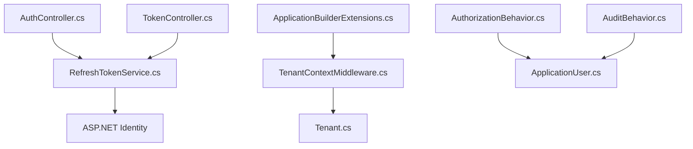

**Diagram sources**
- [AuthController.cs](file://src/api/DigitalTwinPlatform.API/Controllers/AuthController.cs#L23-L27)
- [TokenController.cs](file://src/api/DigitalTwinPlatform.API/Controllers/TokenController.cs#L9-L57)
- [RefreshTokenService.cs](file://src/api/DigitalTwinPlatform.API/Services/Auth/RefreshTokenService.cs#L10-L13)
- [TenantContextMiddleware.cs](file://src/api/DigitalTwinPlatform.API/Middleware/TenantContextMiddleware.cs#L5-L17)
- [AuthorizationBehavior.cs](file://src/api/DigitalTwinPlatform.Application/Behaviors/AuthorizationBehavior.cs#L10-L12)
- [AuditBehavior.cs](file://src/api/DigitalTwinPlatform.Application/Behaviors/AuditBehavior.cs#L10-L12)
- [ApplicationUser.cs](file://src/api/DigitalTwinPlatform.Domain/Entities/Auth/ApplicationUser.cs#L5-L12)
- [Tenant.cs](file://src/api/DigitalTwinPlatform.Domain/Entities/Tenant.cs#L5-L121)

**Section sources**
- [AuthController.cs](file://src/api/DigitalTwinPlatform.API/Controllers/AuthController.cs#L23-L27)
- [TokenController.cs](file://src/api/DigitalTwinPlatform.API/Controllers/TokenController.cs#L9-L57)
- [RefreshTokenService.cs](file://src/api/DigitalTwinPlatform.API/Services/Auth/RefreshTokenService.cs#L10-L13)
- [TenantContextMiddleware.cs](file://src/api/DigitalTwinPlatform.API/Middleware/TenantContextMiddleware.cs#L5-L17)
- [AuthorizationBehavior.cs](file://src/api/DigitalTwinPlatform.Application/Behaviors/AuthorizationBehavior.cs#L10-L12)
- [AuditBehavior.cs](file://src/api/DigitalTwinPlatform.Application/Behaviors/AuditBehavior.cs#L10-L12)
- [ApplicationUser.cs](file://src/api/DigitalTwinPlatform.Domain/Entities/Auth/ApplicationUser.cs#L5-L12)
- [Tenant.cs](file://src/api/DigitalTwinPlatform.Domain/Entities/Tenant.cs#L5-L121)

## Performance Considerations
- Token validation occurs per request; keep signing keys short-lived and rotate periodically.
- Avoid excessive claims in access tokens to minimize payload size.
- Use asynchronous operations for refresh token persistence and validation.
- Monitor token generation and revocation throughput; consider caching roles for frequent access.

## Troubleshooting Guide
- Invalid JWT: Ensure issuer, audience, and signing key match configuration and environment.
- Missing configuration: Validate Jwt:Key length and presence of Jwt:Issuer/Jwt:Audience.
- Token generation failures: Check user existence and refresh token persistence logic.
- Authorization failures: Verify user roles and RequiredRole values in commands.
- Tenant isolation: Confirm X-Tenant-Id header is present and ITenantService is initialized.

**Section sources**
- [ConfigurationExtensions.cs](file://src/api/DigitalTwinPlatform.API/Extensions/ConfigurationExtensions.cs#L52-L75)
- [RefreshTokenService.cs](file://src/api/DigitalTwinPlatform.API/Services/Auth/RefreshTokenService.cs#L15-L22)
- [AuthorizationBehavior.cs](file://src/api/DigitalTwinPlatform.Application/Behaviors/AuthorizationBehavior.cs#L30-L44)
- [TenantContextMiddleware.cs](file://src/api/DigitalTwinPlatform.API/Middleware/TenantContextMiddleware.cs#L9-L13)

## Conclusion
The Digital Twin Platform implements a robust JWT-based authentication system with Identity integration, antiforgery protection, and tenant-aware middleware. RBAC is enforced via pipeline behaviors, and audit logging captures command execution for compliance. Refresh tokens provide resilient session management, while structured logging supports operational visibility. These components collectively address security and compliance needs for industrial-grade applications.

## Appendices

### API Security Patterns and Cross-Cutting Concerns
- JWT Bearer authentication is applied globally; Swagger documentation includes Bearer auth.
- Antiforgery tokens protect state-changing requests; cookie policy enforces HttpOnly and SameSite.
- CORS configuration supports credential exchange with allowed origins.

**Section sources**
- [ServiceCollectionExtensions.cs](file://src/api/DigitalTwinPlatform.API/Extensions/ServiceCollectionExtensions.cs#L153-L227)
- [ApplicationBuilderExtensions.cs](file://src/api/DigitalTwinPlatform.API/Extensions/ApplicationBuilderExtensions.cs#L15-L34)
- [ApplicationBuilderExtensions.cs](file://src/api/DigitalTwinPlatform.API/Extensions/ApplicationBuilderExtensions.cs#L77-L100)

### Password Security, Token Rotation, and Session Timeout Handling
- Password policy is configurable; current defaults require a minimum length and disable several complexity requirements.
- Access tokens expire per Jwt:ExpiryInMinutes; refresh tokens are persisted with expiry and can be revoked.
- Logout clears refresh tokens for the authenticated user.

**Section sources**
- [ServiceCollectionExtensions.cs](file://src/api/DigitalTwinPlatform.API/Extensions/ServiceCollectionExtensions.cs#L46-L55)
- [appsettings.json](file://src/api/DigitalTwinPlatform.API/appsettings.json#L64-L69)
- [RefreshTokenService.cs](file://src/api/DigitalTwinPlatform.API/Services/Auth/RefreshTokenService.cs#L115-L125)