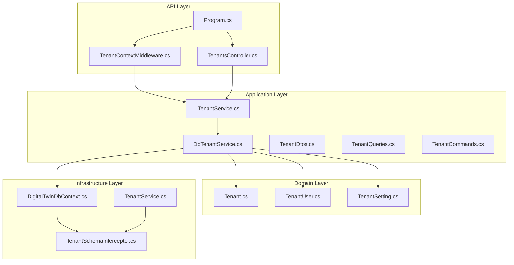
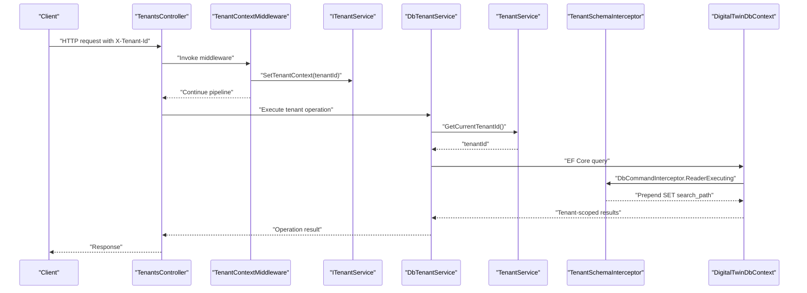
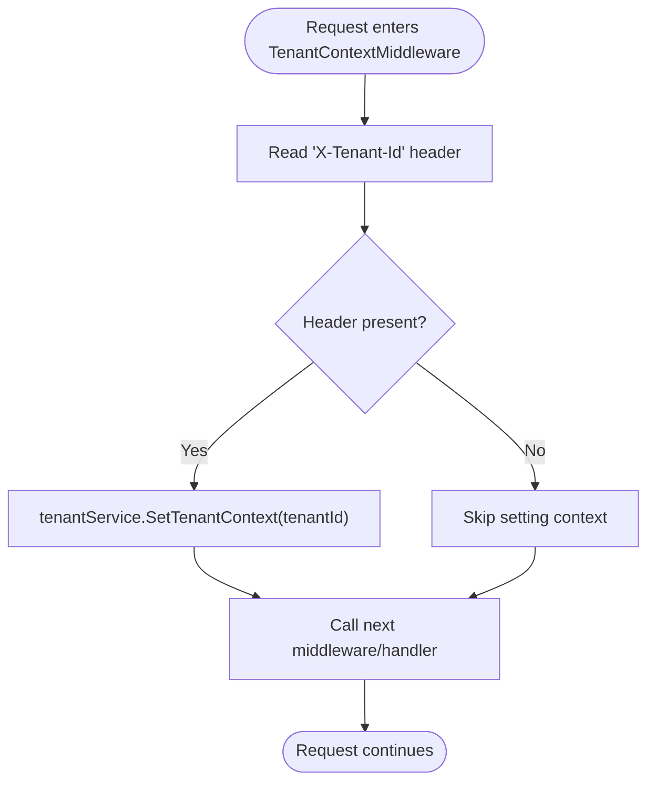
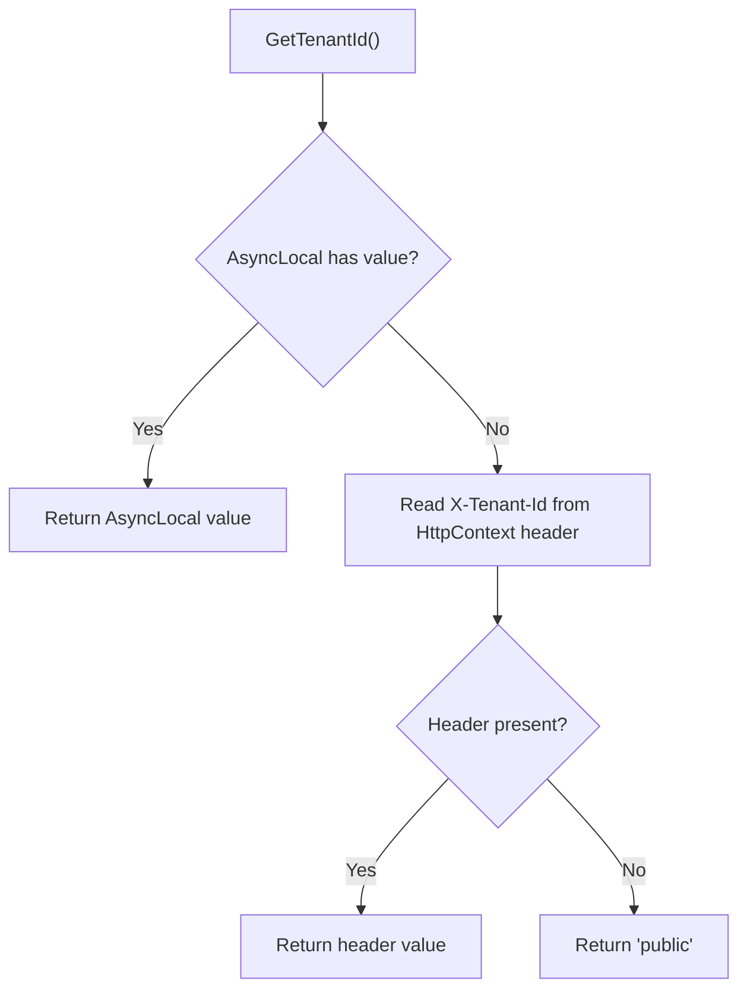
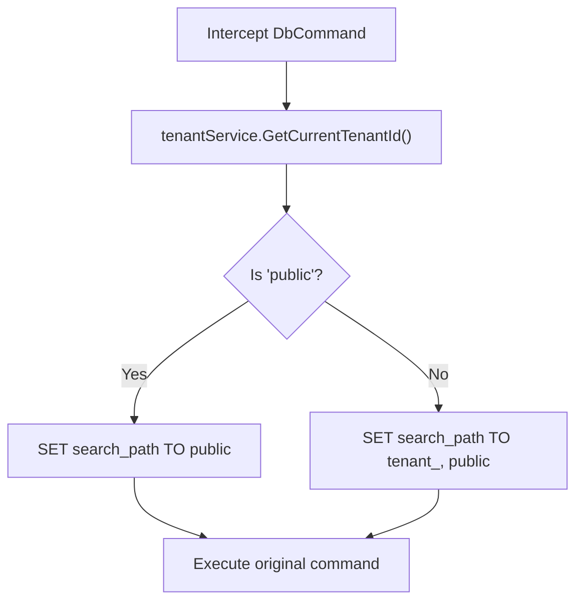
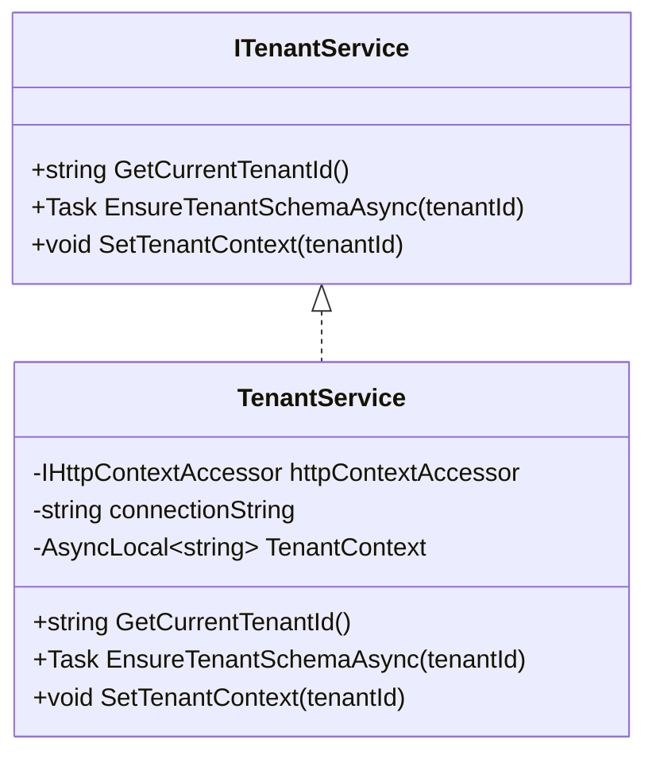
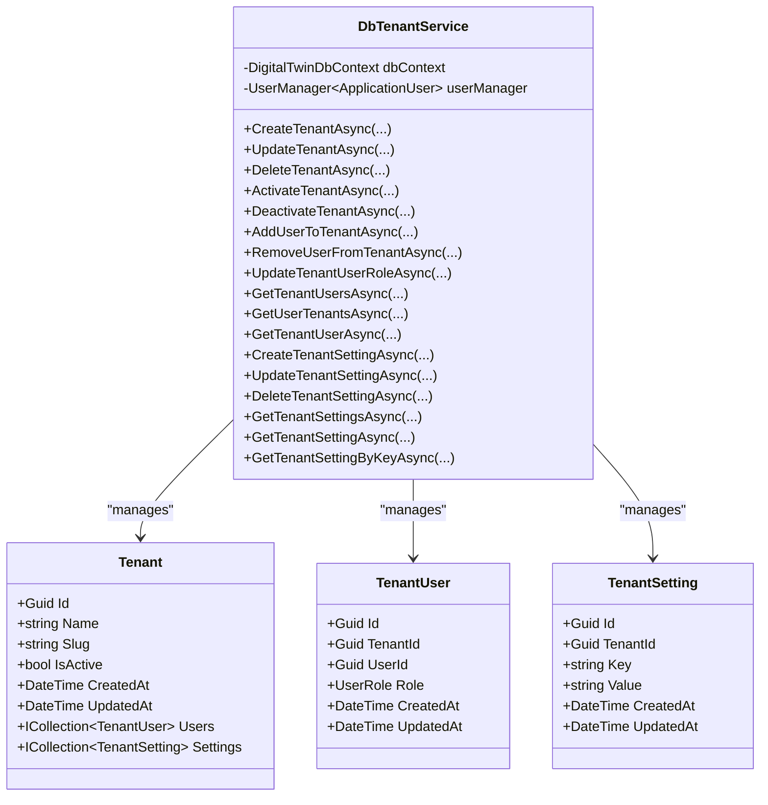
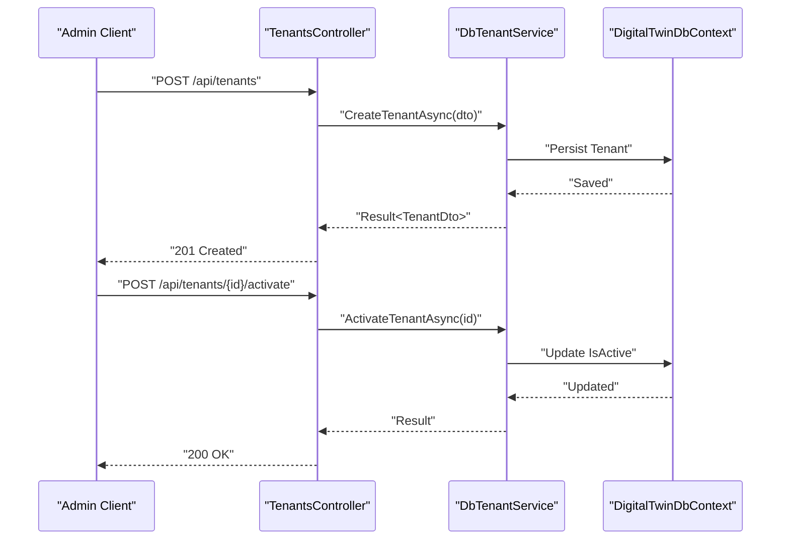
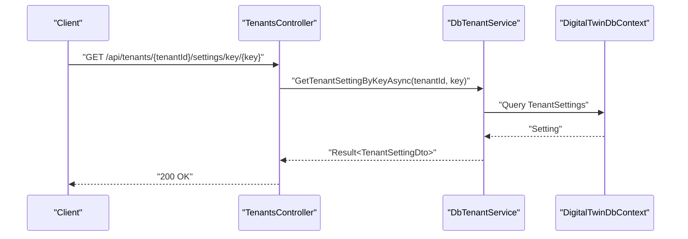
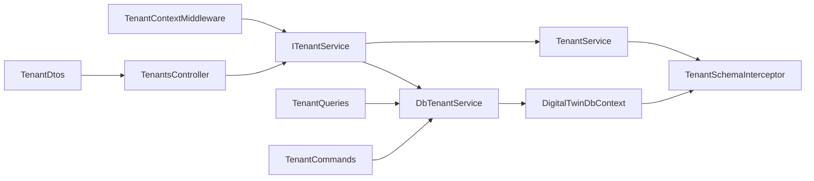

# Tenant Isolation and Multi-tenancy

<cite>
**Referenced Files in This Document**
- [TenantContextMiddleware.cs](file://src/api/DigitalTwinPlatform.API/Middleware/TenantContextMiddleware.cs)
- [Program.cs](file://src/api/DigitalTwinPlatform.API/Program.cs)
- [TenantsController.cs](file://src/api/DigitalTwinPlatform.API/Controllers/TenantsController.cs)
- [ITenantService.cs](file://src/api/DigitalTwinPlatform.Application/Abstractions/Tenancy/ITenantService.cs)
- [DbTenantService.cs](file://src/api/DigitalTwinPlatform.Application/Tenants/Services/DbTenantService.cs)
- [TenantService.cs](file://src/api/DigitalTwinPlatform.Infrastructure/Tenancy/TenantService.cs)
- [TenantSchemaInterceptor.cs](file://src/api/DigitalTwinPlatform.Infrastructure/Tenancy/TenantSchemaInterceptor.cs)
- [DigitalTwinDbContext.cs](file://src/api/DigitalTwinPlatform.Infrastructure/Persistence/DigitalTwinDbContext.cs)
- [Tenant.cs](file://src/api/DigitalTwinPlatform.Domain/Entities/Tenant.cs)
- [TenantSetting.cs](file://src/api/DigitalTwinPlatform.Domain/Entities/TenantSetting.cs)
- [TenantUser.cs](file://src/api/DigitalTwinPlatform.Domain/Entities/TenantUser.cs)
- [TenantDtos.cs](file://src/api/DigitalTwinPlatform.Application/Tenants/Dtos/TenantDtos.cs)
- [TenantQueries.cs](file://src/api/DigitalTwinPlatform.Application/Tenants/Queries/TenantQueries.cs)
- [TenantCommands.cs](file://src/api/DigitalTwinPlatform.Application/Tenants/Commands/TenantCommands.cs)
</cite>

## Table of Contents
1. [Introduction](#introduction)
2. [Project Structure](#project-structure)
3. [Core Components](#core-components)
4. [Architecture Overview](#architecture-overview)
5. [Detailed Component Analysis](#detailed-component-analysis)
6. [Dependency Analysis](#dependency-analysis)
7. [Performance Considerations](#performance-considerations)
8. [Troubleshooting Guide](#troubleshooting-guide)
9. [Conclusion](#conclusion)
10. [Appendices](#appendices)

## Introduction
This document explains the tenant isolation and multi-tenancy implementation in the platform. It covers how tenants are identified and propagated through the request pipeline, how database queries are isolated per tenant via schema-based separation, and how tenant-aware services and repositories enforce data segregation. It also documents tenant registration, activation/deactivation, user membership, and tenant-specific settings. Cross-tenant security considerations and integration with authorization policies are addressed alongside practical examples of tenant-aware operations.

## Project Structure
The multi-tenancy implementation spans three layers:
- API layer: middleware for tenant context propagation and controller endpoints for tenant management.
- Application layer: tenant service abstractions and domain-driven services for tenant operations.
- Infrastructure layer: tenant-aware persistence and schema interception for database-level isolation.

**Diagram sources**
- [Program.cs](file://src/api/DigitalTwinPlatform.API/Program.cs#L59-L72)
- [TenantContextMiddleware.cs](file://src/api/DigitalTwinPlatform.API/Middleware/TenantContextMiddleware.cs#L5-L16)
- [TenantsController.cs](file://src/api/DigitalTwinPlatform.API/Controllers/TenantsController.cs#L14-L23)
- [ITenantService.cs](file://src/api/DigitalTwinPlatform.Application/Abstractions/Tenancy/ITenantService.cs#L3-L8)
- [DbTenantService.cs](file://src/api/DigitalTwinPlatform.Application/Tenants/Services/DbTenantService.cs#L15-L24)
- [TenantService.cs](file://src/api/DigitalTwinPlatform.Infrastructure/Tenancy/TenantService.cs#L8-L44)
- [TenantSchemaInterceptor.cs](file://src/api/DigitalTwinPlatform.Infrastructure/Tenancy/TenantSchemaInterceptor.cs#L8-L35)
- [DigitalTwinDbContext.cs](file://src/api/DigitalTwinPlatform.Infrastructure/Persistence/DigitalTwinDbContext.cs#L15-L45)
- [Tenant.cs](file://src/api/DigitalTwinPlatform.Domain/Entities/Tenant.cs#L5-L59)
- [TenantUser.cs](file://src/api/DigitalTwinPlatform.Domain/Entities/TenantUser.cs#L5-L39)
- [TenantSetting.cs](file://src/api/DigitalTwinPlatform.Domain/Entities/TenantSetting.cs#L5-L53)

**Section sources**
- [Program.cs](file://src/api/DigitalTwinPlatform.API/Program.cs#L59-L72)
- [TenantContextMiddleware.cs](file://src/api/DigitalTwinPlatform.API/Middleware/TenantContextMiddleware.cs#L5-L16)
- [TenantsController.cs](file://src/api/DigitalTwinPlatform.API/Controllers/TenantsController.cs#L14-L23)
- [ITenantService.cs](file://src/api/DigitalTwinPlatform.Application/Abstractions/Tenancy/ITenantService.cs#L3-L8)
- [DbTenantService.cs](file://src/api/DigitalTwinPlatform.Application/Tenants/Services/DbTenantService.cs#L15-L24)
- [TenantService.cs](file://src/api/DigitalTwinPlatform.Infrastructure/Tenancy/TenantService.cs#L8-L44)
- [TenantSchemaInterceptor.cs](file://src/api/DigitalTwinPlatform.Infrastructure/Tenancy/TenantSchemaInterceptor.cs#L8-L35)
- [DigitalTwinDbContext.cs](file://src/api/DigitalTwinPlatform.Infrastructure/Persistence/DigitalTwinDbContext.cs#L15-L45)
- [Tenant.cs](file://src/api/DigitalTwinPlatform.Domain/Entities/Tenant.cs#L5-L59)
- [TenantUser.cs](file://src/api/DigitalTwinPlatform.Domain/Entities/TenantUser.cs#L5-L39)
- [TenantSetting.cs](file://src/api/DigitalTwinPlatform.Domain/Entities/TenantSetting.cs#L5-L53)

## Core Components
- TenantContextMiddleware: Extracts the tenant identifier from the request header and sets it in the tenant service context for the duration of the request.
- ITenantService: Defines the contract for tenant context retrieval, schema provisioning, and context manipulation.
- TenantService (Infrastructure): Implements tenant context storage using thread-local state, reads tenant ID from HTTP headers, and ensures tenant schema existence.
- TenantSchemaInterceptor: Intercepts EF Core database commands and prepends a SET search_path statement to route queries to tenant-specific schemas.
- DbTenantService (Application): Provides tenant lifecycle operations backed by the database, including creation, updates, activation/deactivation, user membership, and tenant settings.
- Domain Entities: Tenant, TenantUser, TenantSetting encapsulate tenant metadata, memberships, and settings with validation and change tracking.
- Controllers: TenantsController exposes endpoints for tenant CRUD, activation/deactivation, user management, and settings management.

**Section sources**
- [TenantContextMiddleware.cs](file://src/api/DigitalTwinPlatform.API/Middleware/TenantContextMiddleware.cs#L5-L16)
- [ITenantService.cs](file://src/api/DigitalTwinPlatform.Application/Abstractions/Tenancy/ITenantService.cs#L3-L8)
- [TenantService.cs](file://src/api/DigitalTwinPlatform.Infrastructure/Tenancy/TenantService.cs#L8-L44)
- [TenantSchemaInterceptor.cs](file://src/api/DigitalTwinPlatform.Infrastructure/Tenancy/TenantSchemaInterceptor.cs#L8-L35)
- [DbTenantService.cs](file://src/api/DigitalTwinPlatform.Application/Tenants/Services/DbTenantService.cs#L15-L24)
- [Tenant.cs](file://src/api/DigitalTwinPlatform.Domain/Entities/Tenant.cs#L5-L59)
- [TenantUser.cs](file://src/api/DigitalTwinPlatform.Domain/Entities/TenantUser.cs#L5-L39)
- [TenantSetting.cs](file://src/api/DigitalTwinPlatform.Domain/Entities/TenantSetting.cs#L5-L53)
- [TenantsController.cs](file://src/api/DigitalTwinPlatform.API/Controllers/TenantsController.cs#L14-L23)

## Architecture Overview
The system enforces tenant isolation at two levels:
- Request-level tenant context propagation via middleware.
- Database-level isolation via Postgres schema routing controlled by an EF Core interceptor.

**Diagram sources**
- [Program.cs](file://src/api/DigitalTwinPlatform.API/Program.cs#L62-L62)
- [TenantContextMiddleware.cs](file://src/api/DigitalTwinPlatform.API/Middleware/TenantContextMiddleware.cs#L7-L15)
- [ITenantService.cs](file://src/api/DigitalTwinPlatform.Application/Abstractions/Tenancy/ITenantService.cs#L3-L8)
- [DbTenantService.cs](file://src/api/DigitalTwinPlatform.Application/Tenants/Services/DbTenantService.cs#L15-L24)
- [TenantService.cs](file://src/api/DigitalTwinPlatform.Infrastructure/Tenancy/TenantService.cs#L15-L24)
- [TenantSchemaInterceptor.cs](file://src/api/DigitalTwinPlatform.Infrastructure/Tenancy/TenantSchemaInterceptor.cs#L10-L35)
- [DigitalTwinDbContext.cs](file://src/api/DigitalTwinPlatform.Infrastructure/Persistence/DigitalTwinDbContext.cs#L15-L45)

## Detailed Component Analysis

### Tenant Context Middleware
- Purpose: Reads the tenant identifier from the X-Tenant-Id request header and sets it in the tenant service context for the current request.
- Behavior: If the header is present, the middleware invokes SetTenantContext on the tenant service; otherwise, the service falls back to a default tenant identifier.

**Diagram sources**
- [TenantContextMiddleware.cs](file://src/api/DigitalTwinPlatform.API/Middleware/TenantContextMiddleware.cs#L7-L15)

**Section sources**
- [TenantContextMiddleware.cs](file://src/api/DigitalTwinPlatform.API/Middleware/TenantContextMiddleware.cs#L5-L16)
- [Program.cs](file://src/api/DigitalTwinPlatform.API/Program.cs#L62-L62)

### Tenant Identification and Context Propagation
- Header-based identification: X-Tenant-Id is the canonical tenant identifier used across the pipeline.
- Fallback behavior: If the header is absent, the tenant service defaults to a public tenant identifier.
- Thread-local context: The tenant identifier is stored in an AsyncLocal variable to propagate within the same logical execution chain.

**Diagram sources**
- [TenantService.cs](file://src/api/DigitalTwinPlatform.Infrastructure/Tenancy/TenantService.cs#L15-L24)

**Section sources**
- [TenantService.cs](file://src/api/DigitalTwinPlatform.Infrastructure/Tenancy/TenantService.cs#L15-L24)

### Schema-Based Tenant Isolation
- Tenant schema naming: Each tenant uses a dedicated schema named tenant_<tenantId>.
- Search path routing: The interceptor prepends a SET search_path statement to queries, prioritizing the tenant schema followed by the public schema for fallback.
- Public tenant: When tenantId equals the public identifier, the search_path is set to public only.

**Diagram sources**
- [TenantSchemaInterceptor.cs](file://src/api/DigitalTwinPlatform.Infrastructure/Tenancy/TenantSchemaInterceptor.cs#L22-L35)

**Section sources**
- [TenantSchemaInterceptor.cs](file://src/api/DigitalTwinPlatform.Infrastructure/Tenancy/TenantSchemaInterceptor.cs#L8-L35)
- [TenantService.cs](file://src/api/DigitalTwinPlatform.Infrastructure/Tenancy/TenantService.cs#L26-L39)

### TenantService Implementation
- Responsibilities:
  - Retrieve current tenant identifier from AsyncLocal or HTTP header.
  - Ensure tenant schema exists in the database.
  - Set tenant context for the current request.
- Database provisioning: Creates tenant_<id> schema if it does not exist using a direct connection with the configured default connection string.

**Diagram sources**
- [ITenantService.cs](file://src/api/DigitalTwinPlatform.Application/Abstractions/Tenancy/ITenantService.cs#L3-L8)
- [TenantService.cs](file://src/api/DigitalTwinPlatform.Infrastructure/Tenancy/TenantService.cs#L8-L44)

**Section sources**
- [ITenantService.cs](file://src/api/DigitalTwinPlatform.Application/Abstractions/Tenancy/ITenantService.cs#L3-L8)
- [TenantService.cs](file://src/api/DigitalTwinPlatform.Infrastructure/Tenancy/TenantService.cs#L8-L44)

### Tenant-Aware Repositories and Services
- DbTenantService: Implements tenant operations against the database using EF Core. It:
  - Validates inputs and enforces uniqueness constraints.
  - Manages tenant lifecycle (create, update, delete, activate, deactivate).
  - Manages tenant users (add/remove/update roles) and tenant settings (create/update/delete/get by key).
  - Uses UserManager for user identity integration.
- Domain entities:
  - Tenant: Immutable metadata with validation and activation state.
  - TenantUser: Links users to tenants with role enumeration.
  - TenantSetting: Key-value tenant configuration with validation.

**Diagram sources**
- [DbTenantService.cs](file://src/api/DigitalTwinPlatform.Application/Tenants/Services/DbTenantService.cs#L15-L24)
- [Tenant.cs](file://src/api/DigitalTwinPlatform.Domain/Entities/Tenant.cs#L5-L59)
- [TenantUser.cs](file://src/api/DigitalTwinPlatform.Domain/Entities/TenantUser.cs#L5-L39)
- [TenantSetting.cs](file://src/api/DigitalTwinPlatform.Domain/Entities/TenantSetting.cs#L5-L53)

**Section sources**
- [DbTenantService.cs](file://src/api/DigitalTwinPlatform.Application/Tenants/Services/DbTenantService.cs#L15-L24)
- [Tenant.cs](file://src/api/DigitalTwinPlatform.Domain/Entities/Tenant.cs#L5-L59)
- [TenantUser.cs](file://src/api/DigitalTwinPlatform.Domain/Entities/TenantUser.cs#L5-L39)
- [TenantSetting.cs](file://src/api/DigitalTwinPlatform.Domain/Entities/TenantSetting.cs#L5-L53)

### Tenant Registration, Activation, and Switching
- Registration: Create a tenant with validated name and slug; the service checks for slug uniqueness and persists the entity.
- Activation/Deactivation: Toggle tenant state; downstream logic can gate access or data visibility accordingly.
- Switching: The middleware reads X-Tenant-Id from each request and updates the tenant context, ensuring subsequent operations target the correct schema.

**Diagram sources**
- [TenantsController.cs](file://src/api/DigitalTwinPlatform.API/Controllers/TenantsController.cs#L77-L88)
- [TenantsController.cs](file://src/api/DigitalTwinPlatform.API/Controllers/TenantsController.cs#L116-L127)
- [DbTenantService.cs](file://src/api/DigitalTwinPlatform.Application/Tenants/Services/DbTenantService.cs#L27-L52)
- [DbTenantService.cs](file://src/api/DigitalTwinPlatform.Application/Tenants/Services/DbTenantService.cs#L148-L160)

**Section sources**
- [TenantsController.cs](file://src/api/DigitalTwinPlatform.API/Controllers/TenantsController.cs#L77-L88)
- [DbTenantService.cs](file://src/api/DigitalTwinPlatform.Application/Tenants/Services/DbTenantService.cs#L27-L52)
- [DbTenantService.cs](file://src/api/DigitalTwinPlatform.Application/Tenants/Services/DbTenantService.cs#L148-L160)

### Tenant-Specific Configuration Management
- Tenant settings are stored as key-value pairs scoped to a tenant.
- Operations include create, update (including key updates with uniqueness checks), delete, and lookup by key.
- These settings can drive tenant-specific customizations and feature flags.

**Diagram sources**
- [TenantsController.cs](file://src/api/DigitalTwinPlatform.API/Controllers/TenantsController.cs#L248-L259)
- [DbTenantService.cs](file://src/api/DigitalTwinPlatform.Application/Tenants/Services/DbTenantService.cs#L379-L388)

**Section sources**
- [TenantsController.cs](file://src/api/DigitalTwinPlatform.API/Controllers/TenantsController.cs#L196-L246)
- [DbTenantService.cs](file://src/api/DigitalTwinPlatform.Application/Tenants/Services/DbTenantService.cs#L286-L388)
- [TenantSetting.cs](file://src/api/DigitalTwinPlatform.Domain/Entities/TenantSetting.cs#L5-L53)

### Cross-Tenant Security Considerations
- Header enforcement: Tenant identification relies on X-Tenant-Id; clients must supply the correct header to operate on the intended tenant.
- Authorization alignment: Combine tenant context with authorization policies so that users can only access tenants they belong to. Use the tenant context to scope policy evaluation.
- Least privilege: Ensure that tenant-specific settings and user roles are enforced at the API boundary and repository level.
- Auditability: The DbContext tracks audit logs for changes; leverage these to monitor tenant-scoped modifications.

**Section sources**
- [TenantContextMiddleware.cs](file://src/api/DigitalTwinPlatform.API/Middleware/TenantContextMiddleware.cs#L9-L12)
- [DigitalTwinDbContext.cs](file://src/api/DigitalTwinPlatform.Infrastructure/Persistence/DigitalTwinDbContext.cs#L47-L91)

## Dependency Analysis
The following diagram shows how components depend on each other to achieve tenant isolation:

**Diagram sources**
- [TenantContextMiddleware.cs](file://src/api/DigitalTwinPlatform.API/Middleware/TenantContextMiddleware.cs#L7-L15)
- [ITenantService.cs](file://src/api/DigitalTwinPlatform.Application/Abstractions/Tenancy/ITenantService.cs#L3-L8)
- [TenantService.cs](file://src/api/DigitalTwinPlatform.Infrastructure/Tenancy/TenantService.cs#L8-L44)
- [DbTenantService.cs](file://src/api/DigitalTwinPlatform.Application/Tenants/Services/DbTenantService.cs#L15-L24)
- [DigitalTwinDbContext.cs](file://src/api/DigitalTwinPlatform.Infrastructure/Persistence/DigitalTwinDbContext.cs#L15-L45)
- [TenantSchemaInterceptor.cs](file://src/api/DigitalTwinPlatform.Infrastructure/Tenancy/TenantSchemaInterceptor.cs#L8-L35)
- [TenantsController.cs](file://src/api/DigitalTwinPlatform.API/Controllers/TenantsController.cs#L14-L23)
- [TenantDtos.cs](file://src/api/DigitalTwinPlatform.Application/Tenants/Dtos/TenantDtos.cs#L3-L53)
- [TenantQueries.cs](file://src/api/DigitalTwinPlatform.Application/Tenants/Queries/TenantQueries.cs#L8-L28)
- [TenantCommands.cs](file://src/api/DigitalTwinPlatform.Application/Tenants/Commands/TenantCommands.cs#L8-L30)

**Section sources**
- [Program.cs](file://src/api/DigitalTwinPlatform.API/Program.cs#L62-L62)
- [TenantContextMiddleware.cs](file://src/api/DigitalTwinPlatform.API/Middleware/TenantContextMiddleware.cs#L5-L16)
- [TenantService.cs](file://src/api/DigitalTwinPlatform.Infrastructure/Tenancy/TenantService.cs#L8-L44)
- [TenantSchemaInterceptor.cs](file://src/api/DigitalTwinPlatform.Infrastructure/Tenancy/TenantSchemaInterceptor.cs#L8-L35)
- [DbTenantService.cs](file://src/api/DigitalTwinPlatform.Application/Tenants/Services/DbTenantService.cs#L15-L24)
- [DigitalTwinDbContext.cs](file://src/api/DigitalTwinPlatform.Infrastructure/Persistence/DigitalTwinDbContext.cs#L15-L45)
- [TenantsController.cs](file://src/api/DigitalTwinPlatform.API/Controllers/TenantsController.cs#L14-L23)
- [TenantDtos.cs](file://src/api/DigitalTwinPlatform.Application/Tenants/Dtos/TenantDtos.cs#L3-L53)
- [TenantQueries.cs](file://src/api/DigitalTwinPlatform.Application/Tenants/Queries/TenantQueries.cs#L8-L28)
- [TenantCommands.cs](file://src/api/DigitalTwinPlatform.Application/Tenants/Commands/TenantCommands.cs#L8-L30)

## Performance Considerations
- Schema creation: Ensure tenant schemas are provisioned lazily on demand to avoid unnecessary overhead during cold starts.
- Search path overhead: Prepending SET search_path is lightweight but occurs on every command; keep queries efficient and avoid excessive command batching.
- Connection pooling: TenantService uses a separate connection for schema provisioning; ensure connection limits accommodate peak concurrency.
- Indexing and queries: Leverage tenant-scoped indexes and filters to minimize scans across large datasets.

[No sources needed since this section provides general guidance]

## Troubleshooting Guide
- Missing X-Tenant-Id header: Requests fall back to the public tenant. Verify client headers and ensure proper tenant switching.
- Schema not found errors: Confirm EnsureTenantSchemaAsync ran for the tenant or that the interceptor is registered in the EF Core pipeline.
- Permission denied: Align authorization policies with tenant context and user roles managed by TenantUser.
- Duplicate keys or slugs: Validation prevents duplicates; inspect DTOs and error responses for constraint violations.

**Section sources**
- [TenantService.cs](file://src/api/DigitalTwinPlatform.Infrastructure/Tenancy/TenantService.cs#L26-L39)
- [TenantSchemaInterceptor.cs](file://src/api/DigitalTwinPlatform.Infrastructure/Tenancy/TenantSchemaInterceptor.cs#L22-L35)
- [DbTenantService.cs](file://src/api/DigitalTwinPlatform.Application/Tenants/Services/DbTenantService.cs#L29-L34)
- [DbTenantService.cs](file://src/api/DigitalTwinPlatform.Application/Tenants/Services/DbTenantService.cs#L69-L73)

## Conclusion
The platform implements robust tenant isolation through header-driven context propagation and Postgres schema routing. The TenantContextMiddleware, TenantService, and TenantSchemaInterceptor work together to ensure that all database operations are scoped to the appropriate tenant. The DbTenantService provides comprehensive tenant lifecycle management, while domain entities encapsulate tenant metadata, memberships, and settings. Together, these components deliver secure, scalable multi-tenancy aligned with authorization policies and operational best practices.

[No sources needed since this section summarizes without analyzing specific files]

## Appendices

### Tenant-Aware Query Examples
- Tenant-scoped listing: Filter by tenant identifier in repository queries to return only tenant-owned records.
- Cross-tenant prevention: Enforce tenant context in all repository methods to prevent accidental cross-tenant access.
- Schema-level isolation: Queries automatically route to tenant_<id> schema via the interceptor’s search_path manipulation.

[No sources needed since this section provides general guidance]