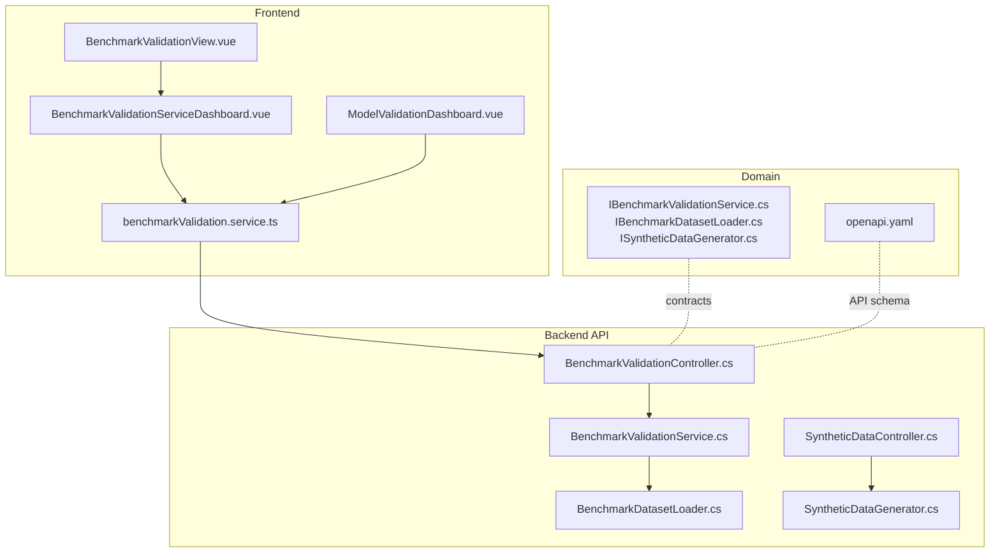
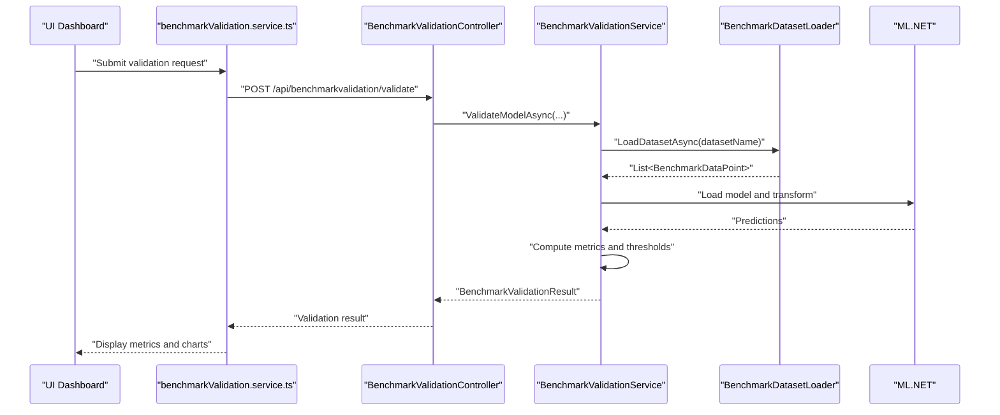
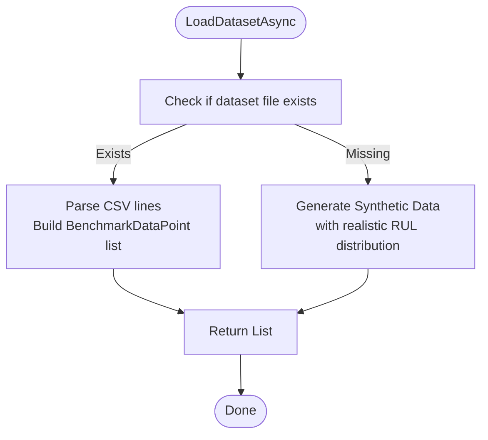
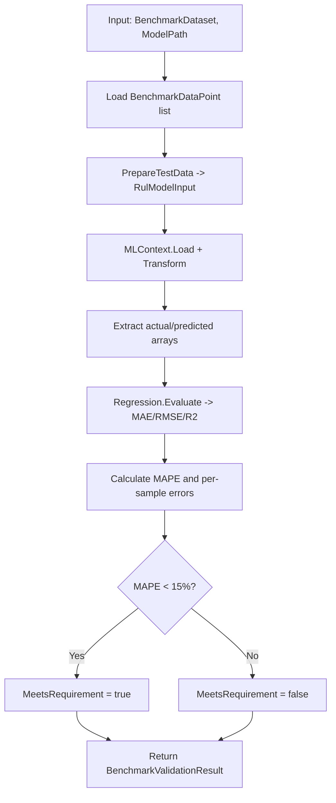
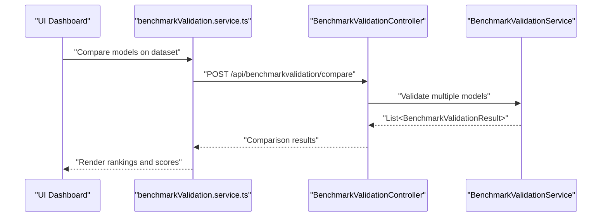
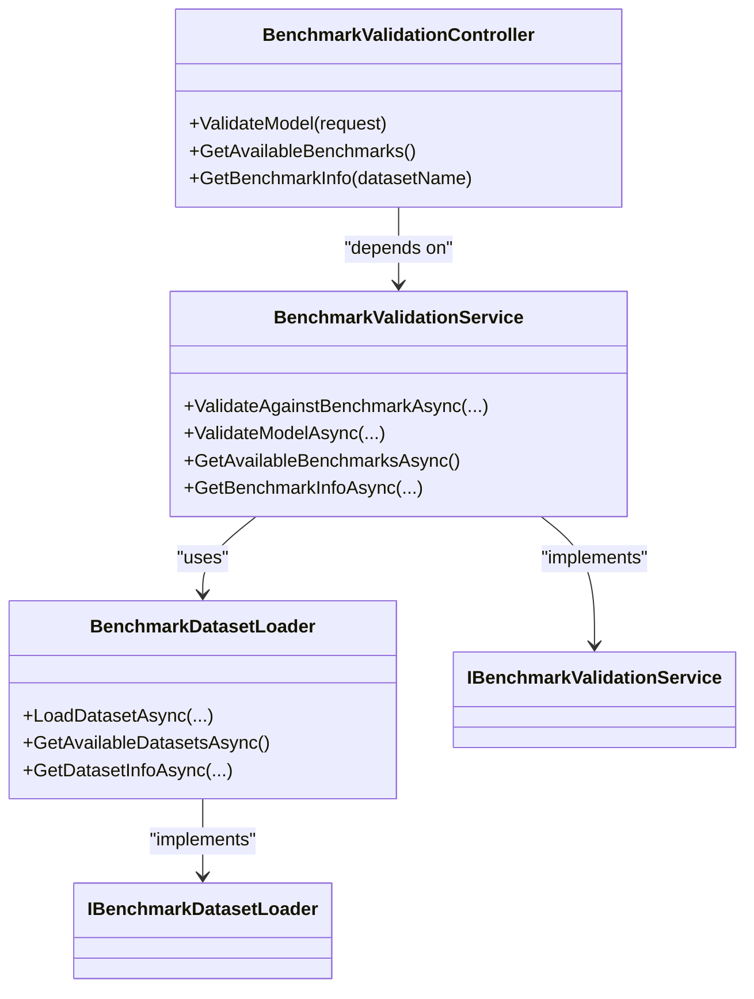

# Benchmark Comparison and Metrics

<cite>
**Referenced Files in This Document**
- [BenchmarkValidationController.cs](file://src/api/DigitalTwinPlatform.API/Controllers/BenchmarkValidationController.cs)
- [BenchmarkValidationService.cs](file://src/api/DigitalTwinPlatform.API/Services/Analytics/BenchmarkValidationService.cs)
- [IBenchmarkValidationService.cs](file://src/api/DigitalTwinPlatform.API/Services/Analytics/IBenchmarkValidationService.cs)
- [BenchmarkDatasetLoader.cs](file://src/api/DigitalTwinPlatform.API/Services/Analytics/BenchmarkDatasetLoader.cs)
- [IBenchmarkDatasetLoader.cs](file://src/api/DigitalTwinPlatform.API/Services/Analytics/IBenchmarkDatasetLoader.cs)
- [benchmarkValidation.service.ts](file://src/ui/digital-twin-dashboard/src/services/benchmarkValidation.service.ts)
- [BenchmarkValidationView.vue](file://src/ui/digital-twin-dashboard/src/views/BenchmarkValidationView.vue)
- [ModelValidationDashboard.vue](file://src/ui/digital-twin-dashboard/src/components/ml/ModelValidationDashboard.vue)
- [BenchmarkValidationServiceDashboard.vue](file://src/ui/digital-twin-dashboard/src/components/ml/BenchmarkValidationServiceDashboard.vue)
- [SyntheticDataGenerator.cs](file://src/api/DigitalTwinPlatform.API/Services/Simulation/SyntheticDataGenerator.cs)
- [SyntheticDataController.cs](file://src/api/DigitalTwinPlatform.API/Controllers/SyntheticDataController.cs)
- [ISyntheticDataGenerator.cs](file://src/api/DigitalTwinPlatform.API/Services/Simulation/ISyntheticDataGenerator.cs)
- [openapi.yaml](file://specs/1-predictive-maintenance/contracts/openapi.yaml)
</cite>

## Table of Contents
1. [Introduction](#introduction)
2. [Project Structure](#project-structure)
3. [Core Components](#core-components)
4. [Architecture Overview](#architecture-overview)
5. [Detailed Component Analysis](#detailed-component-analysis)
6. [Dependency Analysis](#dependency-analysis)
7. [Performance Considerations](#performance-considerations)
8. [Troubleshooting Guide](#troubleshooting-guide)
9. [Conclusion](#conclusion)
10. [Appendices](#appendices)

## Introduction
This document explains the benchmark comparison and metrics system for evaluating predictive models and synthetic data. It covers how benchmark datasets are loaded, how standardized evaluation protocols are applied, and how comparative analyses are performed. It also documents integration with industry-standard benchmarks (notably NASA CMAPSS), threshold-based assessment, and visualization of results. The content is designed to be accessible to beginners while providing sufficient technical depth for experienced developers.

## Project Structure
The benchmark and metrics system spans backend services, controllers, frontend services and dashboards, and supporting domain entities. The key areas are:
- Backend API controllers for benchmark validation and synthetic data validation
- Analytics services for benchmark loading and model validation
- Frontend services and dashboards for interacting with the APIs and visualizing results
- Domain entities for metrics, validation reports, and statistics

**Diagram sources**
- [BenchmarkValidationController.cs](file://src/api/DigitalTwinPlatform.API/Controllers/BenchmarkValidationController.cs#L1-L114)
- [BenchmarkValidationService.cs](file://src/api/DigitalTwinPlatform.API/Services/Analytics/BenchmarkValidationService.cs#L1-L223)
- [BenchmarkDatasetLoader.cs](file://src/api/DigitalTwinPlatform.API/Services/Analytics/BenchmarkDatasetLoader.cs#L1-L212)
- [benchmarkValidation.service.ts](file://src/ui/digital-twin-dashboard/src/services/benchmarkValidation.service.ts#L1-L239)
- [BenchmarkValidationView.vue](file://src/ui/digital-twin-dashboard/src/views/BenchmarkValidationView.vue#L1-L7)
- [BenchmarkValidationServiceDashboard.vue](file://src/ui/digital-twin-dashboard/src/components/ml/BenchmarkValidationServiceDashboard.vue#L1-L468)
- [ModelValidationDashboard.vue](file://src/ui/digital-twin-dashboard/src/components/ml/ModelValidationDashboard.vue#L1-L408)
- [SyntheticDataController.cs](file://src/api/DigitalTwinPlatform.API/Controllers/SyntheticDataController.cs#L1-L143)
- [SyntheticDataGenerator.cs](file://src/api/DigitalTwinPlatform.API/Services/Simulation/SyntheticDataGenerator.cs#L1-L200)
- [IBenchmarkValidationService.cs](file://src/api/DigitalTwinPlatform.API/Services/Analytics/IBenchmarkValidationService.cs#L1-L57)
- [IBenchmarkDatasetLoader.cs](file://src/api/DigitalTwinPlatform.API/Services/Analytics/IBenchmarkDatasetLoader.cs#L1-L23)
- [ISyntheticDataGenerator.cs](file://src/api/DigitalTwinPlatform.API/Services/Simulation/ISyntheticDataGenerator.cs#L35-L64)
- [openapi.yaml](file://specs/1-predictive-maintenance/contracts/openapi.yaml#L780-L835)

**Section sources**
- [BenchmarkValidationController.cs](file://src/api/DigitalTwinPlatform.API/Controllers/BenchmarkValidationController.cs#L1-L114)
- [BenchmarkValidationService.cs](file://src/api/DigitalTwinPlatform.API/Services/Analytics/BenchmarkValidationService.cs#L1-L223)
- [BenchmarkDatasetLoader.cs](file://src/api/DigitalTwinPlatform.API/Services/Analytics/BenchmarkDatasetLoader.cs#L1-L212)
- [benchmarkValidation.service.ts](file://src/ui/digital-twin-dashboard/src/services/benchmarkValidation.service.ts#L1-L239)
- [BenchmarkValidationView.vue](file://src/ui/digital-twin-dashboard/src/views/BenchmarkValidationView.vue#L1-L7)
- [BenchmarkValidationServiceDashboard.vue](file://src/ui/digital-twin-dashboard/src/components/ml/BenchmarkValidationServiceDashboard.vue#L1-L468)
- [ModelValidationDashboard.vue](file://src/ui/digital-twin-dashboard/src/components/ml/ModelValidationDashboard.vue#L1-L408)
- [SyntheticDataController.cs](file://src/api/DigitalTwinPlatform.API/Controllers/SyntheticDataController.cs#L1-L143)
- [SyntheticDataGenerator.cs](file://src/api/DigitalTwinPlatform.API/Services/Simulation/SyntheticDataGenerator.cs#L1-L200)
- [IBenchmarkValidationService.cs](file://src/api/DigitalTwinPlatform.API/Services/Analytics/IBenchmarkValidationService.cs#L1-L57)
- [IBenchmarkDatasetLoader.cs](file://src/api/DigitalTwinPlatform.API/Services/Analytics/IBenchmarkDatasetLoader.cs#L1-L23)
- [ISyntheticDataGenerator.cs](file://src/api/DigitalTwinPlatform.API/Services/Simulation/ISyntheticDataGenerator.cs#L35-L64)
- [openapi.yaml](file://specs/1-predictive-maintenance/contracts/openapi.yaml#L780-L835)

## Core Components
- BenchmarkValidationController: Exposes endpoints to validate models against benchmarks, list available benchmarks, and fetch dataset metadata.
- BenchmarkValidationService: Orchestrates loading of benchmark data, loads ML.NET models, runs inference, computes metrics, and applies thresholds.
- BenchmarkDatasetLoader: Loads CSV datasets from disk or generates synthetic benchmarks when files are missing.
- Frontend benchmarkValidation.service: Wraps HTTP calls to the backend for dataset discovery, validation submission, and report retrieval.
- SyntheticDataGenerator and SyntheticDataController: Provide synthetic data generation and validation against benchmarks, including statistical comparisons and threshold-based assessments.

Key evaluation outputs include MAPE, RMSE, R2, absolute and percentage errors per sample, and a pass/fail determination based on MAPE thresholds.

**Section sources**
- [BenchmarkValidationController.cs](file://src/api/DigitalTwinPlatform.API/Controllers/BenchmarkValidationController.cs#L21-L104)
- [BenchmarkValidationService.cs](file://src/api/DigitalTwinPlatform.API/Services/Analytics/BenchmarkValidationService.cs#L26-L173)
- [BenchmarkDatasetLoader.cs](file://src/api/DigitalTwinPlatform.API/Services/Analytics/BenchmarkDatasetLoader.cs#L17-L148)
- [benchmarkValidation.service.ts](file://src/ui/digital-twin-dashboard/src/services/benchmarkValidation.service.ts#L66-L174)
- [SyntheticDataGenerator.cs](file://src/api/DigitalTwinPlatform.API/Services/Simulation/SyntheticDataGenerator.cs#L119-L165)
- [SyntheticDataController.cs](file://src/api/DigitalTwinPlatform.API/Controllers/SyntheticDataController.cs#L29-L86)

## Architecture Overview
The system follows a layered architecture:
- Presentation layer: Vue components and services in the UI
- API layer: ASP.NET Core controllers exposing benchmark and synthetic data endpoints
- Service layer: Business logic for validation, dataset loading, and ML model evaluation
- Data layer: CSV files for benchmarks and synthetic data generation

**Diagram sources**
- [BenchmarkValidationController.cs](file://src/api/DigitalTwinPlatform.API/Controllers/BenchmarkValidationController.cs#L24-L65)
- [BenchmarkValidationService.cs](file://src/api/DigitalTwinPlatform.API/Services/Analytics/BenchmarkValidationService.cs#L55-L173)
- [BenchmarkDatasetLoader.cs](file://src/api/DigitalTwinPlatform.API/Services/Analytics/BenchmarkDatasetLoader.cs#L17-L89)
- [benchmarkValidation.service.ts](file://src/ui/digital-twin-dashboard/src/services/benchmarkValidation.service.ts#L96-L104)

## Detailed Component Analysis

### Benchmark Dataset Loading Mechanisms
- File-based loading: Reads CSV files from a predefined data directory, parsing features and target values.
- Availability detection: Lists known datasets and checks for file existence.
- Fallback to synthetic data: Generates synthetic benchmarks with realistic distributions when files are missing.
- Dataset metadata: Provides descriptions, approximate sample counts, and statistics for known benchmarks.

**Diagram sources**
- [BenchmarkDatasetLoader.cs](file://src/api/DigitalTwinPlatform.API/Services/Analytics/BenchmarkDatasetLoader.cs#L17-L89)
- [BenchmarkDatasetLoader.cs](file://src/api/DigitalTwinPlatform.API/Services/Analytics/BenchmarkDatasetLoader.cs#L155-L210)

**Section sources**
- [BenchmarkDatasetLoader.cs](file://src/api/DigitalTwinPlatform.API/Services/Analytics/BenchmarkDatasetLoader.cs#L17-L148)

### Standard Evaluation Protocols
- Supported benchmarks: NASA CMAPSS, FEMTO Bearing, and a synthetic dataset.
- Model evaluation pipeline:
  - Load benchmark dataset
  - Load ML.NET model from disk
  - Prepare test data from benchmark data
  - Transform via ML model to obtain predictions
  - Evaluate regression metrics (MAE, RMSE, R2)
  - Compute MAPE and per-sample errors
  - Apply pass/fail threshold (MAPE < 15%)

**Diagram sources**
- [BenchmarkValidationService.cs](file://src/api/DigitalTwinPlatform.API/Services/Analytics/BenchmarkValidationService.cs#L55-L173)

**Section sources**
- [BenchmarkValidationService.cs](file://src/api/DigitalTwinPlatform.API/Services/Analytics/BenchmarkValidationService.cs#L55-L173)
- [IBenchmarkValidationService.cs](file://src/api/DigitalTwinPlatform.API/Services/Analytics/IBenchmarkValidationService.cs#L23-L56)

### Comparative Analysis Workflows
- Single-model validation: Submit either a model version ID or a model path; the service resolves and evaluates.
- Multi-model comparison: The frontend service exposes a comparison endpoint; the backend contract defines the request/response shapes for ranking and scoring models on a given dataset.
- Historical tracking: The frontend dashboard supports exporting validation results and visualizing historical scores.

**Diagram sources**
- [benchmarkValidation.service.ts](file://src/ui/digital-twin-dashboard/src/services/benchmarkValidation.service.ts#L130-L141)
- [BenchmarkValidationController.cs](file://src/api/DigitalTwinPlatform.API/Controllers/BenchmarkValidationController.cs#L24-L65)

**Section sources**
- [benchmarkValidation.service.ts](file://src/ui/digital-twin-dashboard/src/services/benchmarkValidation.service.ts#L130-L141)
- [BenchmarkValidationController.cs](file://src/api/DigitalTwinPlatform.API/Controllers/BenchmarkValidationController.cs#L24-L65)

### Integration with NASA CMAPSS and Industry Benchmarks
- Known datasets include NASA CMAPSS and FEMTO Bearing, with approximate statistics and descriptions.
- The loader returns curated metadata for these datasets, enabling informed selection.
- When files are unavailable, the system generates synthetic benchmarks aligned with expected distributions.

**Section sources**
- [BenchmarkDatasetLoader.cs](file://src/api/DigitalTwinPlatform.API/Services/Analytics/BenchmarkDatasetLoader.cs#L102-L148)

### Metric Calculation and Threshold-Based Assessment
- Metrics computed:
  - MAE, RMSE, R2 via ML.NET regression evaluation
  - MAPE manually computed across non-zero actual values
  - Per-sample absolute and percentage errors
- Threshold-based pass/fail:
  - MeetsRequirement = true if MAPE < 15%
- Additional statistics include min/max/median absolute errors and total samples.

**Section sources**
- [BenchmarkValidationService.cs](file://src/api/DigitalTwinPlatform.API/Services/Analytics/BenchmarkValidationService.cs#L103-L151)
- [IBenchmarkValidationService.cs](file://src/api/DigitalTwinPlatform.API/Services/Analytics/IBenchmarkValidationService.cs#L23-L56)

### Relationship Between Benchmark Scores and Synthetic Data Quality Indicators
- Synthetic data validation compares generated statistics (means, standard deviations) against benchmark statistics with a 15% tolerance threshold.
- The synthetic generator also calculates correlation matrices and other statistics to inform quality.
- These synthetic validations complement benchmark-based evaluations by ensuring internal consistency and distributional fidelity.

**Section sources**
- [SyntheticDataGenerator.cs](file://src/api/DigitalTwinPlatform.API/Services/Simulation/SyntheticDataGenerator.cs#L183-L195)
- [SyntheticDataGenerator.cs](file://src/api/DigitalTwinPlatform.API/Services/Simulation/SyntheticDataGenerator.cs#L377-L414)
- [SyntheticDataController.cs](file://src/api/DigitalTwinPlatform.API/Controllers/SyntheticDataController.cs#L65-L86)
- [ISyntheticDataGenerator.cs](file://src/api/DigitalTwinPlatform.API/Services/Simulation/ISyntheticDataGenerator.cs#L35-L64)

### Benchmark Selection Criteria, Preprocessing, and Visualization
- Selection criteria:
  - Availability of dataset files
  - Dataset metadata (description, sample count, statistics)
- Preprocessing:
  - CSV parsing with flexible header handling
  - Feature normalization assumptions (converted to model input format)
  - Synthetic generation with controlled RUL distributions and feature correlations
- Visualization:
  - Frontend dashboards render validation results, historical trends, and exportable reports.

**Section sources**
- [BenchmarkDatasetLoader.cs](file://src/api/DigitalTwinPlatform.API/Services/Analytics/BenchmarkDatasetLoader.cs#L17-L89)
- [BenchmarkValidationService.cs](file://src/api/DigitalTwinPlatform.API/Services/Analytics/BenchmarkValidationService.cs#L175-L201)
- [ModelValidationDashboard.vue](file://src/ui/digital-twin-dashboard/src/components/ml/ModelValidationDashboard.vue#L354-L376)
- [BenchmarkValidationServiceDashboard.vue](file://src/ui/digital-twin-dashboard/src/components/ml/BenchmarkValidationServiceDashboard.vue#L1-L468)

## Dependency Analysis
The following diagram shows key dependencies among components:

**Diagram sources**
- [BenchmarkValidationController.cs](file://src/api/DigitalTwinPlatform.API/Controllers/BenchmarkValidationController.cs#L1-L114)
- [BenchmarkValidationService.cs](file://src/api/DigitalTwinPlatform.API/Services/Analytics/BenchmarkValidationService.cs#L1-L25)
- [BenchmarkDatasetLoader.cs](file://src/api/DigitalTwinPlatform.API/Services/Analytics/BenchmarkDatasetLoader.cs#L1-L15)
- [IBenchmarkValidationService.cs](file://src/api/DigitalTwinPlatform.API/Services/Analytics/IBenchmarkValidationService.cs#L1-L21)
- [IBenchmarkDatasetLoader.cs](file://src/api/DigitalTwinPlatform.API/Services/Analytics/IBenchmarkDatasetLoader.cs#L1-L14)

**Section sources**
- [BenchmarkValidationController.cs](file://src/api/DigitalTwinPlatform.API/Controllers/BenchmarkValidationController.cs#L1-L114)
- [BenchmarkValidationService.cs](file://src/api/DigitalTwinPlatform.API/Services/Analytics/BenchmarkValidationService.cs#L1-L25)
- [BenchmarkDatasetLoader.cs](file://src/api/DigitalTwinPlatform.API/Services/Analytics/BenchmarkDatasetLoader.cs#L1-L15)
- [IBenchmarkValidationService.cs](file://src/api/DigitalTwinPlatform.API/Services/Analytics/IBenchmarkValidationService.cs#L1-L21)
- [IBenchmarkDatasetLoader.cs](file://src/api/DigitalTwinPlatform.API/Services/Analytics/IBenchmarkDatasetLoader.cs#L1-L14)

## Performance Considerations
- CSV parsing overhead: For large datasets, consider streaming parsers or pre-processing CSV files into columnar formats.
- ML.NET model loading: Cache models in memory when repeatedly validating to avoid repeated IO and deserialization costs.
- Parallelization: When comparing multiple models, batch requests and leverage asynchronous processing to reduce latency.
- Visualization rendering: Defer heavy chart computations until data is available; use virtualization for long histories.

## Troubleshooting Guide
Common issues and resolutions:
- Model file not found: Ensure the model path exists and is accessible by the API process.
- Empty or invalid benchmark dataset: Verify CSV formatting and column counts; synthetic fallback is triggered automatically when files are missing.
- Validation failures due to MAPE threshold: Review model quality or adjust expectations; inspect per-sample errors for outliers.
- Frontend API errors: Confirm endpoint URLs and CORS settings; check network tab for 5xx responses.

**Section sources**
- [BenchmarkValidationService.cs](file://src/api/DigitalTwinPlatform.API/Services/Analytics/BenchmarkValidationService.cs#L82-L87)
- [BenchmarkValidationController.cs](file://src/api/DigitalTwinPlatform.API/Controllers/BenchmarkValidationController.cs#L53-L64)
- [benchmarkValidation.service.ts](file://src/ui/digital-twin-dashboard/src/services/benchmarkValidation.service.ts#L96-L104)

## Conclusion
The benchmark comparison and metrics system integrates robust dataset loading, standardized evaluation protocols, and threshold-based assessments. It supports real-world benchmarks like NASA CMAPSS and FEMTO, with synthetic data generation and validation as a fallback and complementary mechanism. The frontend dashboards enable interactive exploration, comparison, and export of results, making the system practical for both beginners and experienced developers.

## Appendices

### API Definitions and Contracts
- Benchmark validation endpoints:
  - GET /api/benchmarkvalidation/benchmarks
  - GET /api/benchmarkvalidation/benchmarks/{datasetName}
  - POST /api/benchmarkvalidation/validate
- Synthetic data validation endpoints:
  - POST /api/synthetic-data/generate
  - POST /api/synthetic-data/validate
  - GET /api/synthetic-data/statistics/{machineType}
  - GET /api/synthetic-data/statistics

**Section sources**
- [BenchmarkValidationController.cs](file://src/api/DigitalTwinPlatform.API/Controllers/BenchmarkValidationController.cs#L67-L104)
- [SyntheticDataController.cs](file://src/api/DigitalTwinPlatform.API/Controllers/SyntheticDataController.cs#L29-L115)
- [openapi.yaml](file://specs/1-predictive-maintenance/contracts/openapi.yaml#L780-L835)