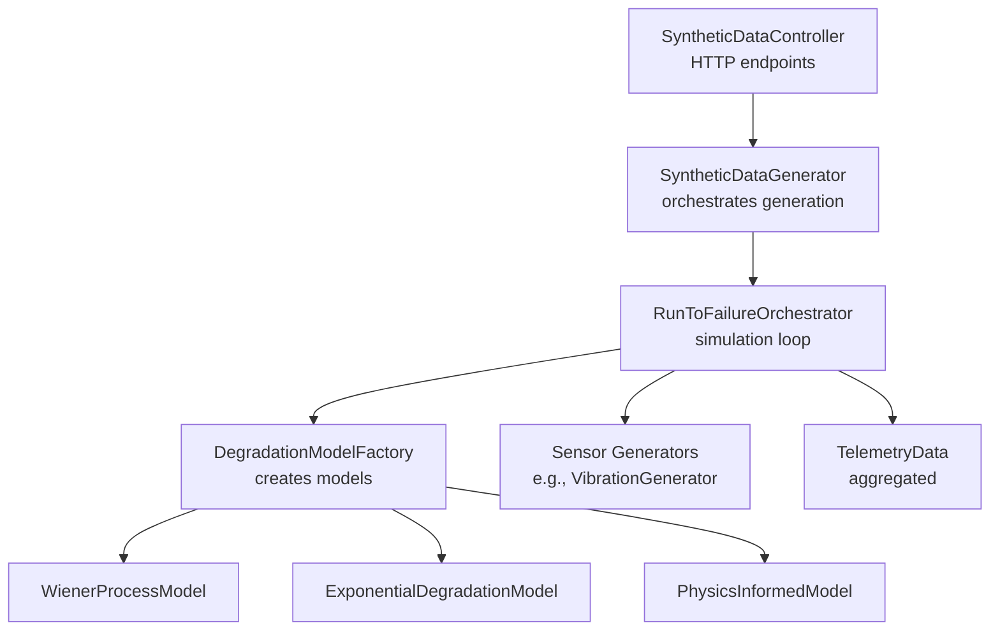
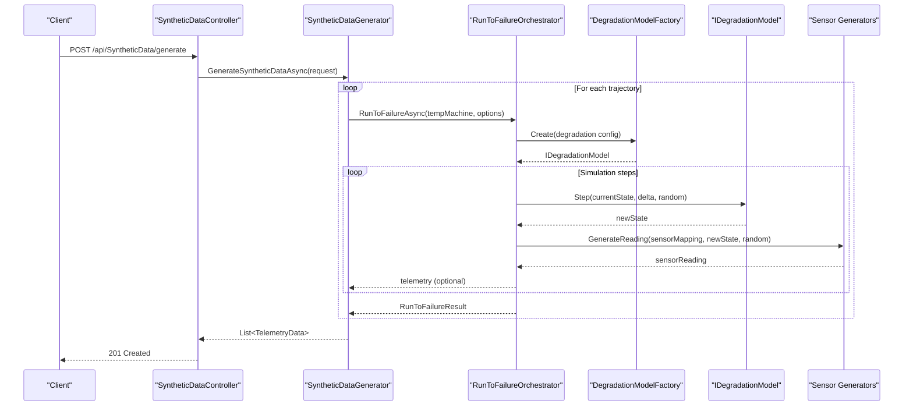
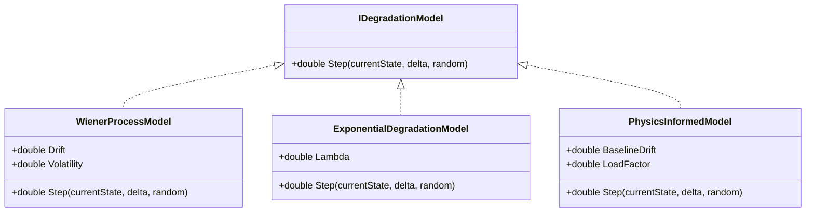
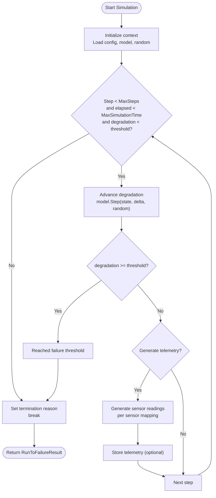
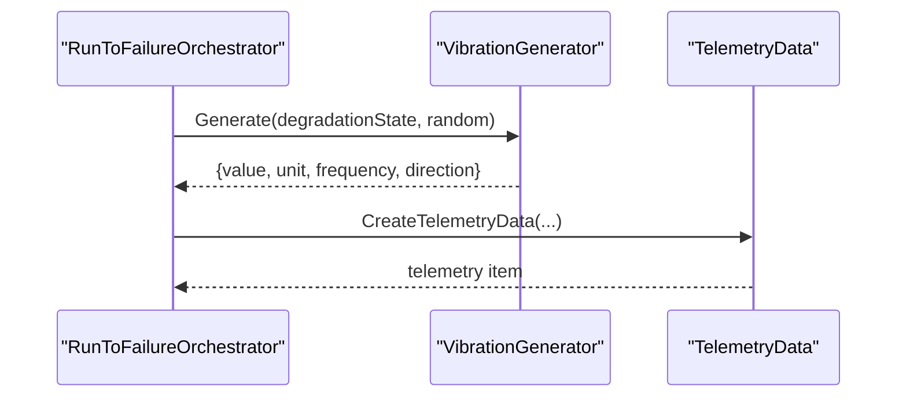
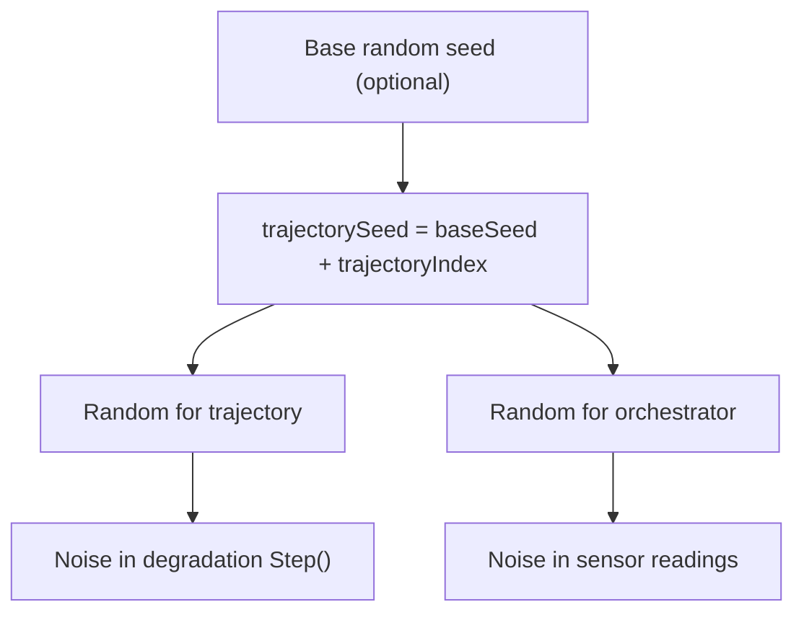
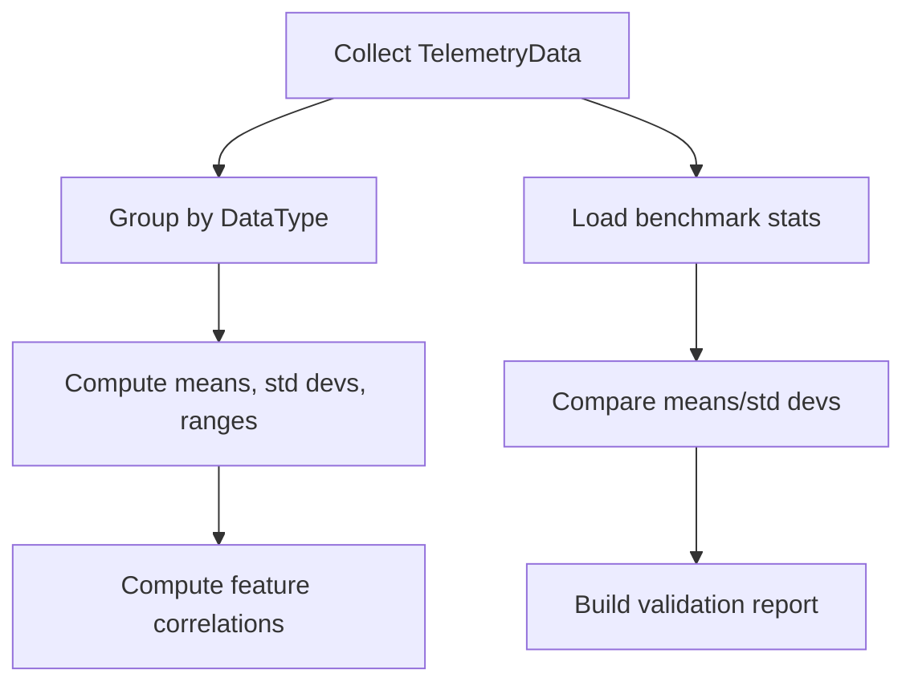
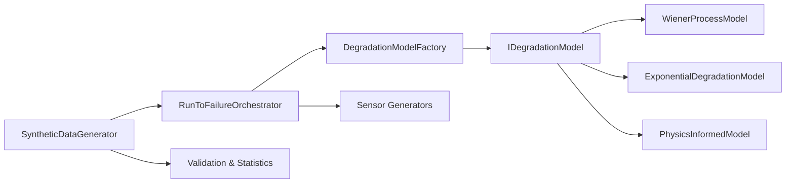

# Data Generation Algorithms

<cite>
**Referenced Files in This Document**
- [SyntheticDataController.cs](file://src/api/DigitalTwinPlatform.API/Controllers/SyntheticDataController.cs)
- [SyntheticDataGenerator.cs](file://src/api/DigitalTwinPlatform.API/Services/Simulation/SyntheticDataGenerator.cs)
- [RunToFailureOrchestrator.cs](file://src/api/DigitalTwinPlatform.API/Services/Simulation/RunToFailureOrchestrator.cs)
- [DegradationModelFactory.cs](file://src/api/DigitalTwinPlatform.API/Services/Simulation/DegradationModels/DegradationModelFactory.cs)
- [WienerProcessModel.cs](file://src/api/DigitalTwinPlatform.API/Services/Simulation/DegradationModels/WienerProcessModel.cs)
- [ExponentialDegradationModel.cs](file://src/api/DigitalTwinPlatform.API/Services/Simulation/DegradationModels/ExponentialDegradationModel.cs)
- [PhysicsInformedModel.cs](file://src/api/DigitalTwinPlatform.API/Services/Simulation/DegradationModels/PhysicsInformedModel.cs)
- [IDegradationModel.cs](file://src/api/DigitalTwinPlatform.API/Services/Simulation/DegradationModels/IDegradationModel.cs)
- [VibrationGenerator.cs](file://src/api/DigitalTwinPlatform.API/Services/Simulation/Generators/VibrationGenerator.cs)
- [SyntheticDataGeneratorTests.cs](file://src/api/DigitalTwinPlatform.Tests/Services/SyntheticDataGeneratorTests.cs)
</cite>

## Table of Contents
1. [Introduction](#introduction)
2. [Project Structure](#project-structure)
3. [Core Components](#core-components)
4. [Architecture Overview](#architecture-overview)
5. [Detailed Component Analysis](#detailed-component-analysis)
6. [Dependency Analysis](#dependency-analysis)
7. [Performance Considerations](#performance-considerations)
8. [Troubleshooting Guide](#troubleshooting-guide)
9. [Conclusion](#conclusion)

## Introduction
This document explains the synthetic data generation algorithms used to produce high-fidelity, physics-informed sensor trajectories for industrial machinery. It covers:
- Physics-informed degradation models for motors, pumps, compressors, gearboxes, and bearings
- Wiener process for motor degradation
- Exponential degradation for pumps and compressors
- Physics-based wear progression for gearboxes and bearings
- Trajectory generation, time stepping, and sensor data synthesis
- Algorithm parameters, random seed management, and reproducibility vs. variability
- Performance characteristics and practical guidance

The goal is to make the concepts accessible to beginners while providing sufficient technical depth for experienced developers.

## Project Structure
The synthetic data pipeline spans the API controller, a generator service, a run-to-failure orchestrator, a degradation model factory, and telemetry generators. The controller exposes endpoints to generate and validate synthetic data. The generator orchestrates repeated run-to-failure simulations with per-trajectory seeds. The orchestrator advances degradation models and synthesizes sensor readings at each time step.

**Diagram sources**
- [SyntheticDataController.cs](file://src/api/DigitalTwinPlatform.API/Controllers/SyntheticDataController.cs#L1-L143)
- [SyntheticDataGenerator.cs](file://src/api/DigitalTwinPlatform.API/Services/Simulation/SyntheticDataGenerator.cs#L1-L415)
- [RunToFailureOrchestrator.cs](file://src/api/DigitalTwinPlatform.API/Services/Simulation/RunToFailureOrchestrator.cs#L1-L502)
- [DegradationModelFactory.cs](file://src/api/DigitalTwinPlatform.API/Services/Simulation/DegradationModels/DegradationModelFactory.cs#L1-L84)
- [WienerProcessModel.cs](file://src/api/DigitalTwinPlatform.API/Services/Simulation/DegradationModels/WienerProcessModel.cs#L1-L23)
- [ExponentialDegradationModel.cs](file://src/api/DigitalTwinPlatform.API/Services/Simulation/DegradationModels/ExponentialDegradationModel.cs#L1-L16)
- [PhysicsInformedModel.cs](file://src/api/DigitalTwinPlatform.API/Services/Simulation/DegradationModels/PhysicsInformedModel.cs#L1-L16)
- [VibrationGenerator.cs](file://src/api/DigitalTwinPlatform.API/Services/Simulation/Generators/VibrationGenerator.cs#L1-L20)

**Section sources**
- [SyntheticDataController.cs](file://src/api/DigitalTwinPlatform.API/Controllers/SyntheticDataController.cs#L1-L143)
- [SyntheticDataGenerator.cs](file://src/api/DigitalTwinPlatform.API/Services/Simulation/SyntheticDataGenerator.cs#L1-L415)
- [RunToFailureOrchestrator.cs](file://src/api/DigitalTwinPlatform.API/Services/Simulation/RunToFailureOrchestrator.cs#L1-L502)
- [DegradationModelFactory.cs](file://src/api/DigitalTwinPlatform.API/Services/Simulation/DegradationModels/DegradationModelFactory.cs#L1-L84)
- [VibrationGenerator.cs](file://src/api/DigitalTwinPlatform.API/Services/Simulation/Generators/VibrationGenerator.cs#L1-L20)

## Core Components
- SyntheticDataController: Exposes endpoints to generate and validate synthetic data and to fetch generation statistics.
- SyntheticDataGenerator: Manages trajectory creation, per-trajectory seeding, and optional statistical validation against benchmarks.
- RunToFailureOrchestrator: Executes the run-to-failure simulation loop, advancing degradation models and generating telemetry at each step.
- DegradationModelFactory: Instantiates physics-informed degradation models (Wiener, exponential, Markov, physics-informed) with configurable parameters.
- Telemetry Generators: Produce realistic sensor readings (e.g., vibration) conditioned on current degradation state and random noise.

Key capabilities:
- Deterministic seeding per trajectory for reproducibility
- Statistical variability via per-step randomization
- Configurable time stepping and termination criteria
- Aggregated statistics and basic validation

**Section sources**
- [SyntheticDataController.cs](file://src/api/DigitalTwinPlatform.API/Controllers/SyntheticDataController.cs#L1-L143)
- [SyntheticDataGenerator.cs](file://src/api/DigitalTwinPlatform.API/Services/Simulation/SyntheticDataGenerator.cs#L1-L415)
- [RunToFailureOrchestrator.cs](file://src/api/DigitalTwinPlatform.API/Services/Simulation/RunToFailureOrchestrator.cs#L1-L502)
- [DegradationModelFactory.cs](file://src/api/DigitalTwinPlatform.API/Services/Simulation/DegradationModels/DegradationModelFactory.cs#L1-L84)

## Architecture Overview
The system composes a controller, generator, orchestrator, and model factory to produce synthetic telemetry. The orchestrator iterates until failure or termination, advancing a degradation model and generating sensor data at each step.

**Diagram sources**
- [SyntheticDataController.cs](file://src/api/DigitalTwinPlatform.API/Controllers/SyntheticDataController.cs#L35-L57)
- [SyntheticDataGenerator.cs](file://src/api/DigitalTwinPlatform.API/Services/Simulation/SyntheticDataGenerator.cs#L33-L117)
- [RunToFailureOrchestrator.cs](file://src/api/DigitalTwinPlatform.API/Services/Simulation/RunToFailureOrchestrator.cs#L43-L147)
- [DegradationModelFactory.cs](file://src/api/DigitalTwinPlatform.API/Services/Simulation/DegradationModels/DegradationModelFactory.cs#L12-L27)
- [IDegradationModel.cs](file://src/api/DigitalTwinPlatform.API/Services/Simulation/DegradationModels/IDegradationModel.cs#L1-L7)

## Detailed Component Analysis

### Physics-Informed Degradation Models
The degradation models define how a machine’s condition evolves over time. They are selected by the DegradationModelFactory based on configuration and advanced by the RunToFailureOrchestrator at each time step.

- Wiener process model (motor): Adds drift and diffusive noise to the current state, enabling gradual, continuous degradation with stochastic variability.
- Exponential degradation model (pumps/compressors): Models monotonic growth with a decay rate parameter and small noise for realism.
- Physics-informed model (gearboxes/bearings): Incorporates baseline drift and load factor scaling to reflect mechanical stress and operational conditions.

**Diagram sources**
- [IDegradationModel.cs](file://src/api/DigitalTwinPlatform.API/Services/Simulation/DegradationModels/IDegradationModel.cs#L1-L7)
- [WienerProcessModel.cs](file://src/api/DigitalTwinPlatform.API/Services/Simulation/DegradationModels/WienerProcessModel.cs#L1-L23)
- [ExponentialDegradationModel.cs](file://src/api/DigitalTwinPlatform.API/Services/Simulation/DegradationModels/ExponentialDegradationModel.cs#L1-L16)
- [PhysicsInformedModel.cs](file://src/api/DigitalTwinPlatform.API/Services/Simulation/DegradationModels/PhysicsInformedModel.cs#L1-L16)

**Section sources**
- [DegradationModelFactory.cs](file://src/api/DigitalTwinPlatform.API/Services/Simulation/DegradationModels/DegradationModelFactory.cs#L12-L82)
- [WienerProcessModel.cs](file://src/api/DigitalTwinPlatform.API/Services/Simulation/DegradationModels/WienerProcessModel.cs#L1-L23)
- [ExponentialDegradationModel.cs](file://src/api/DigitalTwinPlatform.API/Services/Simulation/DegradationModels/ExponentialDegradationModel.cs#L1-L16)
- [PhysicsInformedModel.cs](file://src/api/DigitalTwinPlatform.API/Services/Simulation/DegradationModels/PhysicsInformedModel.cs#L1-L16)

### Trajectory Generation and Time Stepping
The orchestrator runs a fixed-step simulation loop, advancing the degradation state and optionally generating telemetry at each step. Termination occurs when failure thresholds are reached or configured limits are exceeded.

**Diagram sources**
- [RunToFailureOrchestrator.cs](file://src/api/DigitalTwinPlatform.API/Services/Simulation/RunToFailureOrchestrator.cs#L98-L147)

**Section sources**
- [RunToFailureOrchestrator.cs](file://src/api/DigitalTwinPlatform.API/Services/Simulation/RunToFailureOrchestrator.cs#L98-L147)

### Sensor Data Synthesis
Telemetry is synthesized per sensor mapping using dedicated generators. For example, vibration RMS increases with degradation and includes bounded noise. Other sensors (pressure, temperature) follow similar patterns in the broader system.

**Diagram sources**
- [RunToFailureOrchestrator.cs](file://src/api/DigitalTwinPlatform.API/Services/Simulation/RunToFailureOrchestrator.cs#L212-L241)
- [VibrationGenerator.cs](file://src/api/DigitalTwinPlatform.API/Services/Simulation/Generators/VibrationGenerator.cs#L1-L20)

**Section sources**
- [RunToFailureOrchestrator.cs](file://src/api/DigitalTwinPlatform.API/Services/Simulation/RunToFailureOrchestrator.cs#L212-L241)
- [VibrationGenerator.cs](file://src/api/DigitalTwinPlatform.API/Services/Simulation/Generators/VibrationGenerator.cs#L1-L20)

### Reproducibility and Variability
- Deterministic seeding: Each trajectory receives a unique seed derived from the base seed plus trajectory index, ensuring reproducible runs.
- Statistical variability: Per-step randomization introduces noise into both degradation transitions and sensor readings.
- Random number generation: Both the generator and orchestrator instantiate Random with either a provided seed or a fresh source.

**Diagram sources**
- [SyntheticDataGenerator.cs](file://src/api/DigitalTwinPlatform.API/Services/Simulation/SyntheticDataGenerator.cs#L45-L49)
- [RunToFailureOrchestrator.cs](file://src/api/DigitalTwinPlatform.API/Services/Simulation/RunToFailureOrchestrator.cs#L77-L79)
- [WienerProcessModel.cs](file://src/api/DigitalTwinPlatform.API/Services/Simulation/DegradationModels/WienerProcessModel.cs#L15-L21)
- [VibrationGenerator.cs](file://src/api/DigitalTwinPlatform.API/Services/Simulation/Generators/VibrationGenerator.cs#L10-L10)

**Section sources**
- [SyntheticDataGenerator.cs](file://src/api/DigitalTwinPlatform.API/Services/Simulation/SyntheticDataGenerator.cs#L45-L49)
- [RunToFailureOrchestrator.cs](file://src/api/DigitalTwinPlatform.API/Services/Simulation/RunToFailureOrchestrator.cs#L77-L79)
- [WienerProcessModel.cs](file://src/api/DigitalTwinPlatform.API/Services/Simulation/DegradationModels/WienerProcessModel.cs#L15-L21)
- [VibrationGenerator.cs](file://src/api/DigitalTwinPlatform.API/Services/Simulation/Generators/VibrationGenerator.cs#L10-L10)

### Algorithm Parameters and Configuration
- Wiener process: drift and volatility parameters control the deterministic trend and stochastic diffusion.
- Exponential model: lambda controls the growth rate of degradation.
- Physics-informed model: baseline drift and load factor scale the deterministic progression with operational stress.
- Factory parameters: parameters are loaded from configuration dictionaries and applied to model instances.

Practical guidance:
- Motors: use Wiener process with moderate drift and volatility to simulate thermal and mechanical wear.
- Pumps/Compressors: use exponential growth with small lambda to emulate seal and impeller degradation.
- Gearboxes/Bearings: use physics-informed model with load factor proportional to torque/overload conditions.

**Section sources**
- [DegradationModelFactory.cs](file://src/api/DigitalTwinPlatform.API/Services/Simulation/DegradationModels/DegradationModelFactory.cs#L31-L38)
- [DegradationModelFactory.cs](file://src/api/DigitalTwinPlatform.API/Services/Simulation/DegradationModels/DegradationModelFactory.cs#L43-L48)
- [DegradationModelFactory.cs](file://src/api/DigitalTwinPlatform.API/Services/Simulation/DegradationModels/DegradationModelFactory.cs#L74-L81)
- [WienerProcessModel.cs](file://src/api/DigitalTwinPlatform.API/Services/Simulation/DegradationModels/WienerProcessModel.cs#L5-L6)
- [ExponentialDegradationModel.cs](file://src/api/DigitalTwinPlatform.API/Services/Simulation/DegradationModels/ExponentialDegradationModel.cs#L5-L5)
- [PhysicsInformedModel.cs](file://src/api/DigitalTwinPlatform.API/Services/Simulation/DegradationModels/PhysicsInformedModel.cs#L5-L6)

### Relationship Between Mechanical Stress, Operational Conditions, and Degradation Patterns
- Mechanical stress: higher loads increase wear rates. The physics-informed model encodes this via the load factor term.
- Operational conditions: temperature, pressure, and speed influence material fatigue and lubrication. These are reflected in sensor generators’ dependence on degradation state and noise scaling.
- Degradation patterns:
  - Motors: Wiener process captures continuous, diffusive wear with drift representing aging.
  - Pumps/Compressors: exponential growth reflects cumulative damage like erosion or seal degradation.
  - Gearboxes/Bearings: physics-informed progression aligns deterministic wear with load conditions.

**Section sources**
- [PhysicsInformedModel.cs](file://src/api/DigitalTwinPlatform.API/Services/Simulation/DegradationModels/PhysicsInformedModel.cs#L10-L13)
- [VibrationGenerator.cs](file://src/api/DigitalTwinPlatform.API/Services/Simulation/Generators/VibrationGenerator.cs#L9-L17)

### Validation and Statistics
The generator computes descriptive statistics (means, standard deviations, ranges) and simplified correlation measures across features. Validation compares synthetic distributions to benchmark statistics with a tolerance threshold.

**Diagram sources**
- [SyntheticDataGenerator.cs](file://src/api/DigitalTwinPlatform.API/Services/Simulation/SyntheticDataGenerator.cs#L314-L405)

**Section sources**
- [SyntheticDataGenerator.cs](file://src/api/DigitalTwinPlatform.API/Services/Simulation/SyntheticDataGenerator.cs#L183-L299)
- [SyntheticDataGenerator.cs](file://src/api/DigitalTwinPlatform.API/Services/Simulation/SyntheticDataGenerator.cs#L314-L405)

## Dependency Analysis
The orchestration layer depends on configuration-driven model selection and per-step telemetry generation. The generator coordinates multiple trajectories and optional validation.

**Diagram sources**
- [SyntheticDataGenerator.cs](file://src/api/DigitalTwinPlatform.API/Services/Simulation/SyntheticDataGenerator.cs#L1-L415)
- [RunToFailureOrchestrator.cs](file://src/api/DigitalTwinPlatform.API/Services/Simulation/RunToFailureOrchestrator.cs#L1-L502)
- [DegradationModelFactory.cs](file://src/api/DigitalTwinPlatform.API/Services/Simulation/DegradationModels/DegradationModelFactory.cs#L1-L84)
- [IDegradationModel.cs](file://src/api/DigitalTwinPlatform.API/Services/Simulation/DegradationModels/IDegradationModel.cs#L1-L7)

**Section sources**
- [SyntheticDataGenerator.cs](file://src/api/DigitalTwinPlatform.API/Services/Simulation/SyntheticDataGenerator.cs#L1-L415)
- [RunToFailureOrchestrator.cs](file://src/api/DigitalTwinPlatform.API/Services/Simulation/RunToFailureOrchestrator.cs#L1-L502)
- [DegradationModelFactory.cs](file://src/api/DigitalTwinPlatform.API/Services/Simulation/DegradationModels/DegradationModelFactory.cs#L1-L84)

## Performance Considerations
- Time stepping: The simulation advances in fixed intervals; adjust step interval and maximum steps/time to balance fidelity and throughput.
- Random overhead: Each step instantiates Random; consider reusing a seeded Random instance per trajectory to reduce overhead.
- Storage: Generating telemetry for every step produces large datasets; disable storage for batch generation and enable only when needed.
- Validation cost: Computing statistics and correlations adds CPU time; pre-compute or cache benchmark statistics in production.

[No sources needed since this section provides general guidance]

## Troubleshooting Guide
Common issues and resolutions:
- Missing machine configuration: Ensure machine type configurations are loaded before simulation starts.
- Invalid degradation model type: Verify model type strings match supported values in the factory.
- Seed collisions: Use distinct seeds per trajectory to avoid identical outputs.
- Excessive runtime: Reduce step interval or maximum steps/time; disable telemetry storage for faster runs.
- Validation failures: Adjust tolerance thresholds or refine benchmark statistics.

**Section sources**
- [RunToFailureOrchestrator.cs](file://src/api/DigitalTwinPlatform.API/Services/Simulation/RunToFailureOrchestrator.cs#L66-L92)
- [DegradationModelFactory.cs](file://src/api/DigitalTwinPlatform.API/Services/Simulation/DegradationModels/DegradationModelFactory.cs#L14-L26)
- [SyntheticDataGenerator.cs](file://src/api/DigitalTwinPlatform.API/Services/Simulation/SyntheticDataGenerator.cs#L45-L49)
- [SyntheticDataGenerator.cs](file://src/api/DigitalTwinPlatform.API/Services/Simulation/SyntheticDataGenerator.cs#L152-L165)

## Conclusion
The synthetic data generation pipeline combines configurable physics-informed degradation models with realistic sensor synthesis to produce faithful trajectories. By controlling seeds per trajectory, the system ensures reproducibility, while per-step randomness captures statistical variability. Operators can tune parameters to reflect mechanical stress and operational conditions, and validation enables quality assessment against benchmarks.