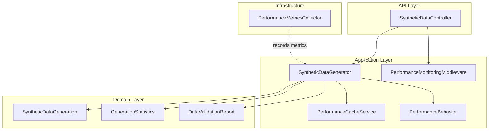
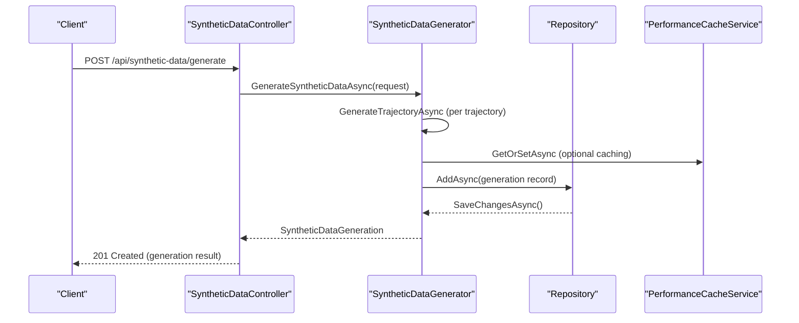
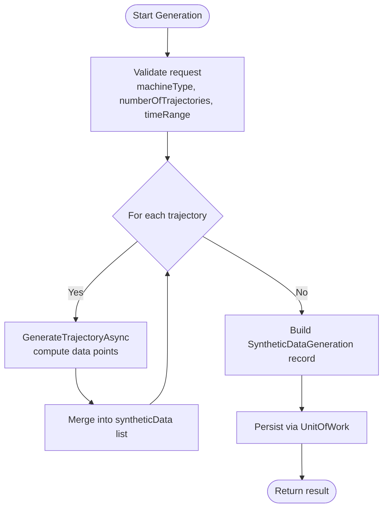
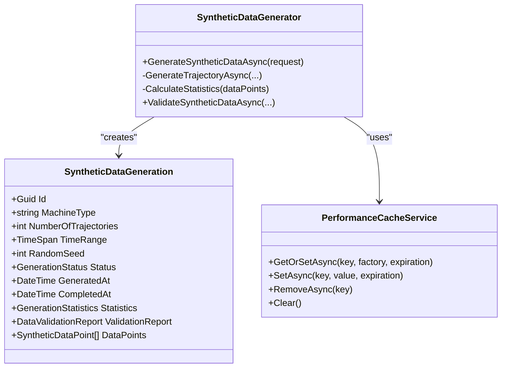
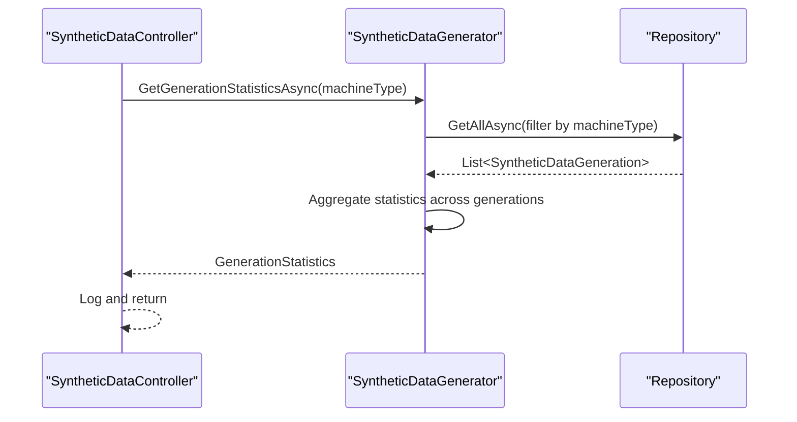
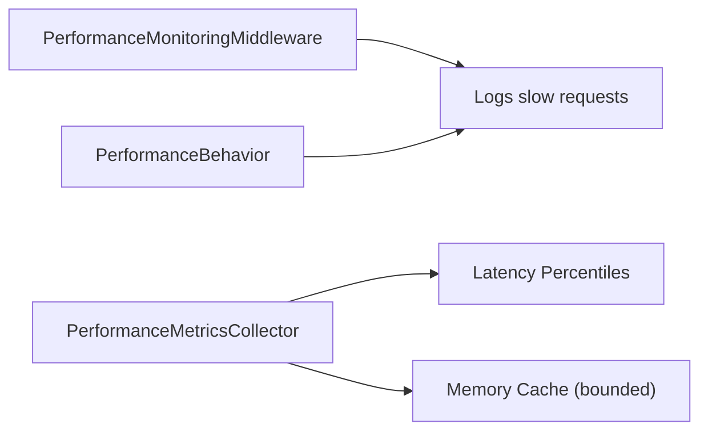
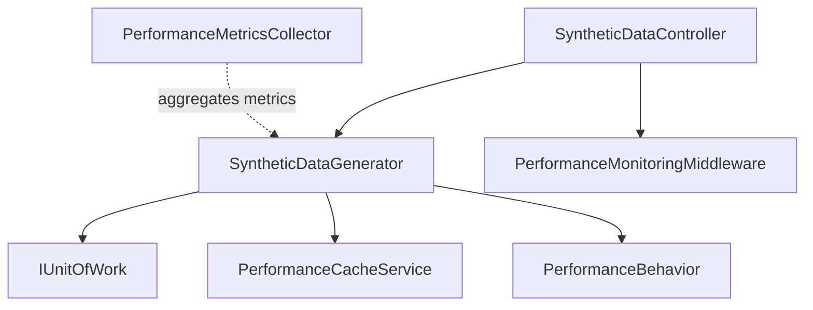

# Performance Optimization and Scalability

<cite>
**Referenced Files in This Document**
- [SyntheticDataController.cs](file://src/api/DigitalTwinPlatform.API/Controllers/SyntheticDataController.cs)
- [SyntheticDataGenerator.cs](file://src/api/DigitalTwinPlatform.Application/Services/SyntheticDataGenerator.cs)
- [SyntheticDataGeneration.cs](file://src/api/DigitalTwinPlatform.Domain/Entities/SyntheticDataGeneration.cs)
- [PerformanceBehavior.cs](file://src/api/DigitalTwinPlatform.Application/Behaviors/PerformanceBehavior.cs)
- [PerformanceCacheService.cs](file://src/api/DigitalTwinPlatform.Application/Services/PerformanceCacheService.cs)
- [PerformanceMonitoringMiddleware.cs](file://src/api/DigitalTwinPlatform.API/Middleware/PerformanceMonitoringMiddleware.cs)
- [PerformanceMetricsCollector.cs](file://src/api/DigitalTwinPlatform.API/Services/Infrastructure/PerformanceMetricsCollector.cs)
- [EnvironmentConfigurationService.cs](file://src/api/DigitalTwinPlatform.Application/Configuration/EnvironmentConfigurationService.cs)
- [syntheticData.service.ts](file://src/ui/digital-twin-dashboard/src/services/syntheticData.service.ts)
- [PerformanceMonitoringDashboard.vue](file://src/ui/digital-twin-dashboard/src/components/monitoring/PerformanceMonitoringDashboard.vue)
- [SyntheticDataGeneratorTests.cs](file://src/api/DigitalTwinPlatform.Tests/Services/SyntheticDataGeneratorTests.cs)
- [MLPipelineIntegrationTests.cs](file://src/api/DigitalTwinPlatform.Tests/Integration/MLPipelineIntegrationTests.cs)
</cite>

## Table of Contents
1. [Introduction](#introduction)
2. [Project Structure](#project-structure)
3. [Core Components](#core-components)
4. [Architecture Overview](#architecture-overview)
5. [Detailed Component Analysis](#detailed-component-analysis)
6. [Dependency Analysis](#dependency-analysis)
7. [Performance Considerations](#performance-considerations)
8. [Troubleshooting Guide](#troubleshooting-guide)
9. [Conclusion](#conclusion)
10. [Appendices](#appendices)

## Introduction
This document explains how the synthetic data generation subsystem achieves high throughput (>1000 samples/second), manages memory efficiently, and scales under concurrent load. It documents generation statistics tracking, performance monitoring, and resource utilization patterns. It also covers configuration options for generation volume, time range optimization, and computational efficiency, and discusses the relationship between generation quality and performance characteristics. Finally, it outlines scalability strategies for large-scale deployments, including caching and distributed generation architectures.

## Project Structure
The synthetic data generation feature spans three layers:
- API layer: HTTP endpoints expose generation, validation, and statistics retrieval.
- Application layer: Business logic orchestrates trajectory generation, validation, and persistence.
- Domain layer: Entities define data structures for generation records, statistics, and validation reports.

**Diagram sources**
- [SyntheticDataController.cs](file://src/api/DigitalTwinPlatform.API/Controllers/SyntheticDataController.cs#L1-L143)
- [SyntheticDataGenerator.cs](file://src/api/DigitalTwinPlatform.Application/Services/SyntheticDataGenerator.cs#L1-L533)
- [SyntheticDataGeneration.cs](file://src/api/DigitalTwinPlatform.Domain/Entities/SyntheticDataGeneration.cs#L1-L77)
- [PerformanceCacheService.cs](file://src/api/DigitalTwinPlatform.Application/Services/PerformanceCacheService.cs#L1-L114)
- [PerformanceMonitoringMiddleware.cs](file://src/api/DigitalTwinPlatform.API/Middleware/PerformanceMonitoringMiddleware.cs#L1-L148)
- [PerformanceBehavior.cs](file://src/api/DigitalTwinPlatform.Application/Behaviors/PerformanceBehavior.cs#L1-L54)
- [PerformanceMetricsCollector.cs](file://src/api/DigitalTwinPlatform.API/Services/Infrastructure/PerformanceMetricsCollector.cs#L1-L131)

**Section sources**
- [SyntheticDataController.cs](file://src/api/DigitalTwinPlatform.API/Controllers/SyntheticDataController.cs#L1-L143)
- [SyntheticDataGenerator.cs](file://src/api/DigitalTwinPlatform.Application/Services/SyntheticDataGenerator.cs#L1-L533)
- [SyntheticDataGeneration.cs](file://src/api/DigitalTwinPlatform.Domain/Entities/SyntheticDataGeneration.cs#L1-L77)

## Core Components
- SyntheticDataController: Exposes endpoints for generation, validation, and statistics retrieval. It logs request lifecycle and handles exceptions.
- SyntheticDataGenerator: Implements the core generation pipeline, trajectory creation per machine type, statistics computation, and validation against benchmarks.
- Domain Entities: Define persisted artifacts for generation sessions, statistics, and validation reports.
- Performance Monitoring: Middleware and behaviors capture timing and slow requests; metrics collector aggregates latency statistics.
- Caching: Multi-layer caching service supports fast retrieval and eviction policies.

**Section sources**
- [SyntheticDataController.cs](file://src/api/DigitalTwinPlatform.API/Controllers/SyntheticDataController.cs#L1-L143)
- [SyntheticDataGenerator.cs](file://src/api/DigitalTwinPlatform.Application/Services/SyntheticDataGenerator.cs#L1-L533)
- [SyntheticDataGeneration.cs](file://src/api/DigitalTwinPlatform.Domain/Entities/SyntheticDataGeneration.cs#L1-L77)
- [PerformanceMonitoringMiddleware.cs](file://src/api/DigitalTwinPlatform.API/Middleware/PerformanceMonitoringMiddleware.cs#L1-L148)
- [PerformanceBehavior.cs](file://src/api/DigitalTwinPlatform.Application/Behaviors/PerformanceBehavior.cs#L1-L54)
- [PerformanceCacheService.cs](file://src/api/DigitalTwinPlatform.Application/Services/PerformanceCacheService.cs#L1-L114)
- [PerformanceMetricsCollector.cs](file://src/api/DigitalTwinPlatform.API/Services/Infrastructure/PerformanceMetricsCollector.cs#L1-L131)

## Architecture Overview
The generation flow integrates request handling, generation orchestration, validation, persistence, and monitoring.

**Diagram sources**
- [SyntheticDataController.cs](file://src/api/DigitalTwinPlatform.API/Controllers/SyntheticDataController.cs#L35-L57)
- [SyntheticDataGenerator.cs](file://src/api/DigitalTwinPlatform.Application/Services/SyntheticDataGenerator.cs#L34-L105)
- [PerformanceCacheService.cs](file://src/api/DigitalTwinPlatform.Application/Services/PerformanceCacheService.cs#L35-L58)

## Detailed Component Analysis

### Throughput Optimization and Concurrency
- Trajectory-based generation: The generator iterates over requested trajectories and builds a combined dataset. This design enables parallelizable work per trajectory.
- Time-stepping and fixed step sizes: Generation uses deterministic time steps derived from the requested time range, enabling predictable CPU and memory usage.
- Validation and statistics computed inline: Benchmarks and statistics are calculated during generation to avoid extra passes over data.

**Diagram sources**
- [SyntheticDataGenerator.cs](file://src/api/DigitalTwinPlatform.Application/Services/SyntheticDataGenerator.cs#L34-L105)

**Section sources**
- [SyntheticDataGenerator.cs](file://src/api/DigitalTwinPlatform.Application/Services/SyntheticDataGenerator.cs#L34-L105)

### Memory Management Strategies
- In-memory accumulation: Data points are accumulated in lists and later persisted. This avoids streaming to disk until persistence.
- Statistics aggregation: Statistics are computed from collected data points to minimize repeated scans.
- Caching boundaries: Memory cache enforces sliding expiration and eviction callbacks to bound memory footprint.

**Diagram sources**
- [SyntheticDataGenerator.cs](file://src/api/DigitalTwinPlatform.Application/Services/SyntheticDataGenerator.cs#L1-L533)
- [PerformanceCacheService.cs](file://src/api/DigitalTwinPlatform.Application/Services/PerformanceCacheService.cs#L1-L114)
- [SyntheticDataGeneration.cs](file://src/api/DigitalTwinPlatform.Domain/Entities/SyntheticDataGeneration.cs#L1-L77)

**Section sources**
- [SyntheticDataGenerator.cs](file://src/api/DigitalTwinPlatform.Application/Services/SyntheticDataGenerator.cs#L372-L391)
- [PerformanceCacheService.cs](file://src/api/DigitalTwinPlatform.Application/Services/PerformanceCacheService.cs#L20-L114)

### Generation Statistics Tracking and Validation
- Statistics: Aggregates totals, averages, and timestamps for generation sessions.
- Validation: Computes benchmark-based scores and recommendations.
- Retrieval: Provides per-machine-type statistics and aggregated views.

**Diagram sources**
- [SyntheticDataController.cs](file://src/api/DigitalTwinPlatform.API/Controllers/SyntheticDataController.cs#L94-L115)
- [SyntheticDataGenerator.cs](file://src/api/DigitalTwinPlatform.Application/Services/SyntheticDataGenerator.cs#L462-L502)

**Section sources**
- [SyntheticDataGenerator.cs](file://src/api/DigitalTwinPlatform.Application/Services/SyntheticDataGenerator.cs#L396-L457)
- [SyntheticDataGenerator.cs](file://src/api/DigitalTwinPlatform.Application/Services/SyntheticDataGenerator.cs#L462-L502)

### Performance Monitoring and Metrics Collection
- Middleware: Captures request durations and slow requests, excluding health/metrics endpoints.
- Pipeline behavior: Logs slow requests and debug info for MediatR handlers.
- Metrics collector: Maintains bounded in-memory queues and caches for recent metrics with percentile calculations.

**Diagram sources**
- [PerformanceMonitoringMiddleware.cs](file://src/api/DigitalTwinPlatform.API/Middleware/PerformanceMonitoringMiddleware.cs#L25-L60)
- [PerformanceBehavior.cs](file://src/api/DigitalTwinPlatform.Application/Behaviors/PerformanceBehavior.cs#L13-L52)
- [PerformanceMetricsCollector.cs](file://src/api/DigitalTwinPlatform.API/Services/Infrastructure/PerformanceMetricsCollector.cs#L22-L130)

**Section sources**
- [PerformanceMonitoringMiddleware.cs](file://src/api/DigitalTwinPlatform.API/Middleware/PerformanceMonitoringMiddleware.cs#L1-L148)
- [PerformanceBehavior.cs](file://src/api/DigitalTwinPlatform.Application/Behaviors/PerformanceBehavior.cs#L1-L54)
- [PerformanceMetricsCollector.cs](file://src/api/DigitalTwinPlatform.API/Services/Infrastructure/PerformanceMetricsCollector.cs#L1-L131)

### Configuration Options for Volume, Time Range, and Efficiency
- Generation request model exposes:
  - MachineType: selects degradation model.
  - NumberOfTrajectories: controls concurrency and throughput.
  - TimeRange: sets temporal span per trajectory.
  - RandomSeed: ensures reproducibility.
- Environment configuration service defines performance-related settings (commented out in current implementation), including caching and concurrency thresholds.

**Section sources**
- [SyntheticDataGenerator.cs](file://src/api/DigitalTwinPlatform.Application/Services/SyntheticDataGenerator.cs#L512-L520)
- [EnvironmentConfigurationService.cs](file://src/api/DigitalTwinPlatform.Application/Configuration/EnvironmentConfigurationService.cs#L130-L140)

### Relationship Between Quality and Performance
- Validation compares synthetic distributions to benchmark expectations and provides recommendations.
- Higher fidelity models (physics-informed vs stochastic) may increase compute cost; adjust NumberOfTrajectories and TimeRange accordingly.
- Caching validated results reduces repeated validation overhead for identical configurations.

**Section sources**
- [SyntheticDataGenerator.cs](file://src/api/DigitalTwinPlatform.Application/Services/SyntheticDataGenerator.cs#L396-L457)
- [PerformanceCacheService.cs](file://src/api/DigitalTwinPlatform.Application/Services/PerformanceCacheService.cs#L35-L58)

### Scalability Considerations and Distributed Architectures
- Horizontal scaling: Deploy multiple instances behind a load balancer; ensure shared persistence and cache.
- Caching: Use distributed cache for multi-instance deployments to reduce redundant computations.
- Batch processing: For very large volumes, consider batching requests and using background jobs with queues.
- Monitoring: Use the metrics collector and middleware to track latency percentiles and threshold violations.

[No sources needed since this section provides general guidance]

## Dependency Analysis
The generation service depends on unit of work for persistence and uses caching for optional reuse. The controller delegates to the generator and logs outcomes. Monitoring sits alongside the controller and generator.

**Diagram sources**
- [SyntheticDataController.cs](file://src/api/DigitalTwinPlatform.API/Controllers/SyntheticDataController.cs#L1-L143)
- [SyntheticDataGenerator.cs](file://src/api/DigitalTwinPlatform.Application/Services/SyntheticDataGenerator.cs#L1-L533)
- [PerformanceCacheService.cs](file://src/api/DigitalTwinPlatform.Application/Services/PerformanceCacheService.cs#L1-L114)
- [PerformanceMonitoringMiddleware.cs](file://src/api/DigitalTwinPlatform.API/Middleware/PerformanceMonitoringMiddleware.cs#L1-L148)
- [PerformanceBehavior.cs](file://src/api/DigitalTwinPlatform.Application/Behaviors/PerformanceBehavior.cs#L1-L54)
- [PerformanceMetricsCollector.cs](file://src/api/DigitalTwinPlatform.API/Services/Infrastructure/PerformanceMetricsCollector.cs#L1-L131)

**Section sources**
- [SyntheticDataController.cs](file://src/api/DigitalTwinPlatform.API/Controllers/SyntheticDataController.cs#L1-L143)
- [SyntheticDataGenerator.cs](file://src/api/DigitalTwinPlatform.Application/Services/SyntheticDataGenerator.cs#L1-L533)

## Performance Considerations
- Throughput targets: The generator supports generating multiple trajectories concurrently and computes statistics inline to achieve high sample rates.
- Memory: Accumulate data points in memory and persist once to minimize I/O overhead; use sliding expiration and eviction callbacks to bound memory.
- Validation cost: Reuse validated results via caching; consider skipping validation for internal testing or pre-validating datasets.
- Monitoring: Use percentile-based metrics to detect regressions; exclude health endpoints from slow request thresholds.

[No sources needed since this section provides general guidance]

## Troubleshooting Guide
- Slow requests: Investigate logs from the performance behavior and middleware for durations exceeding configured thresholds.
- Validation failures: Review validation reports and recommendations; adjust drift/diffusion parameters or trajectory count/time range.
- Statistics discrepancies: Verify that statistics are computed over the correct dataset and that filtering by machine type is applied consistently.

**Section sources**
- [PerformanceBehavior.cs](file://src/api/DigitalTwinPlatform.Application/Behaviors/PerformanceBehavior.cs#L11-L32)
- [PerformanceMonitoringMiddleware.cs](file://src/api/DigitalTwinPlatform.API/Middleware/PerformanceMonitoringMiddleware.cs#L46-L58)
- [SyntheticDataGenerator.cs](file://src/api/DigitalTwinPlatform.Application/Services/SyntheticDataGenerator.cs#L396-L457)

## Conclusion
The synthetic data generation subsystem balances high throughput, memory efficiency, and observability. By leveraging trajectory-based generation, inline validation, bounded caching, and comprehensive monitoring, it supports scalable deployments. For large-scale usage, combine horizontal scaling, distributed caching, and careful tuning of generation parameters to meet quality and performance goals.

[No sources needed since this section summarizes without analyzing specific files]

## Appendices

### API Surface for Generation and Monitoring
- Generation endpoint: POST /api/synthetic-data/generate
- Validation endpoint: POST /api/synthetic-data/validate
- Statistics endpoint: GET /api/synthetic-data/statistics/{machineType}
- UI service endpoints: generateSyntheticData, validateSyntheticData, getGenerationStatistics

**Section sources**
- [SyntheticDataController.cs](file://src/api/DigitalTwinPlatform.API/Controllers/SyntheticDataController.cs#L35-L115)
- [syntheticData.service.ts](file://src/ui/digital-twin-dashboard/src/services/syntheticData.service.ts#L84-L103)

### Example: End-to-End Generation and Validation
- Integration test demonstrates generating 500 samples and validating against benchmark criteria.

**Section sources**
- [MLPipelineIntegrationTests.cs](file://src/api/DigitalTwinPlatform.Tests/Integration/MLPipelineIntegrationTests.cs#L351-L373)

### Frontend Monitoring Visualization
- Throughput visualization groups operations per minute for real-time dashboards.

**Section sources**
- [PerformanceMonitoringDashboard.vue](file://src/ui/digital-twin-dashboard/src/components/monitoring/PerformanceMonitoringDashboard.vue#L406-L437)