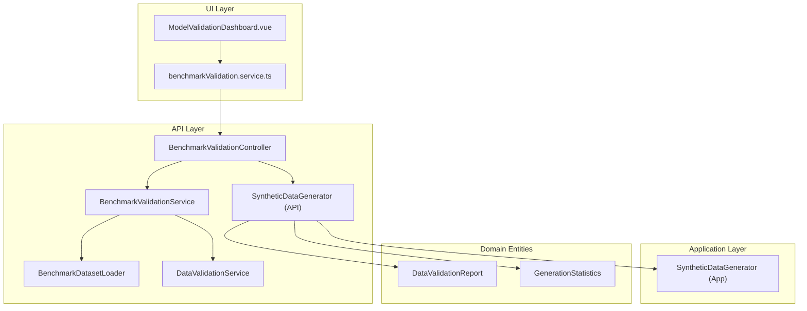
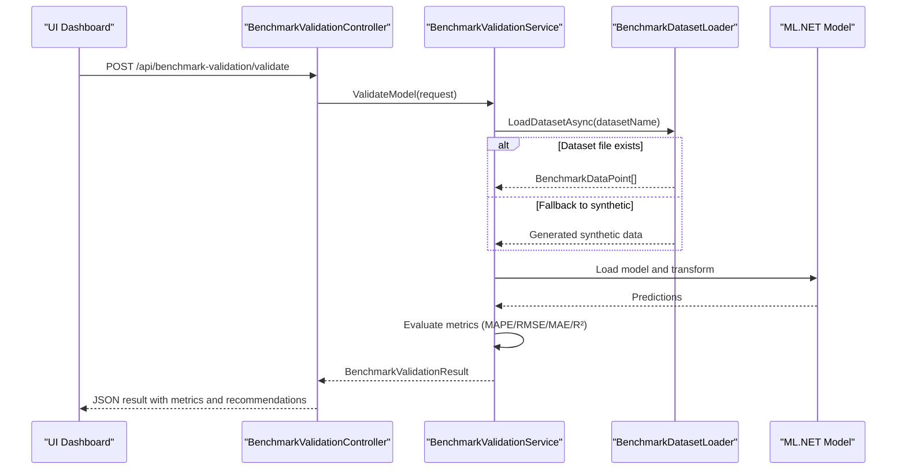
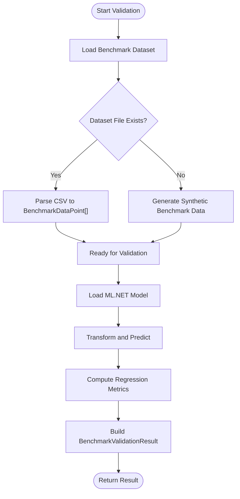
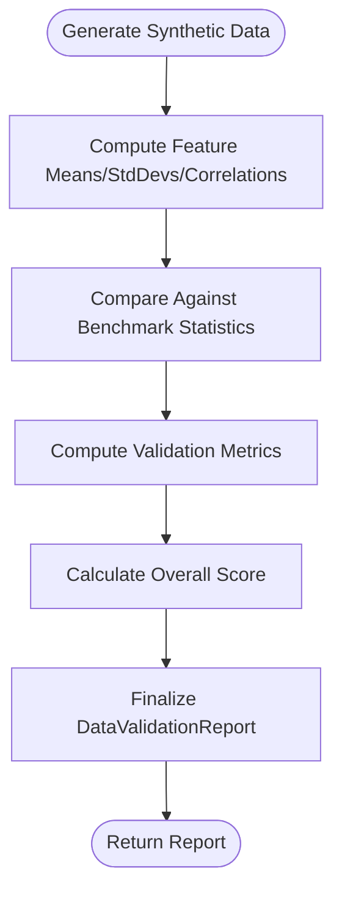
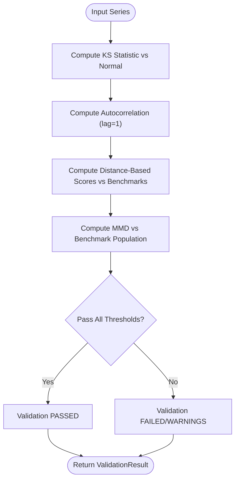
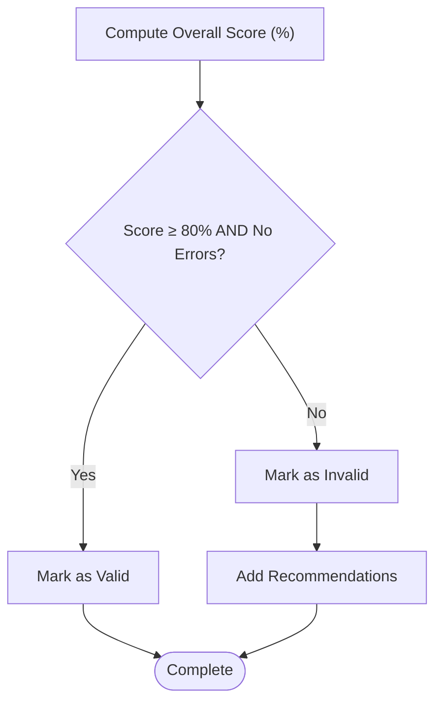
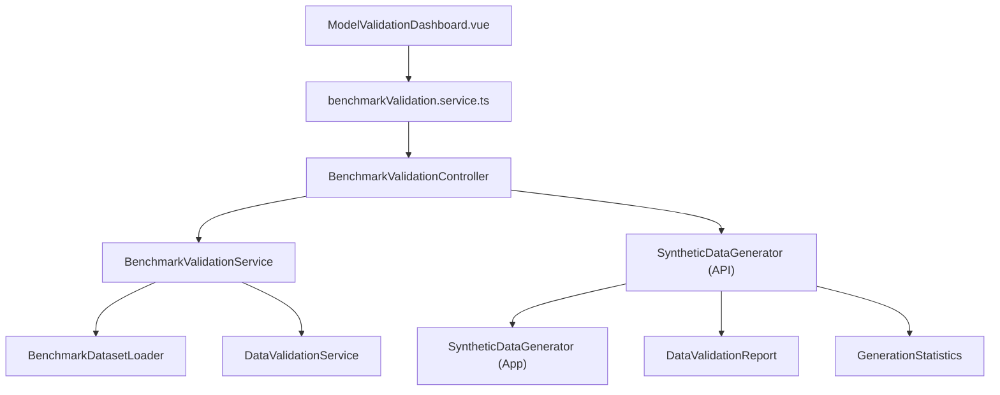

# Statistical Validation and Quality Assurance

<cite>
**Referenced Files in This Document**
- [BenchmarkValidationController.cs](file://src/api/DigitalTwinPlatform.API/Controllers/BenchmarkValidationController.cs)
- [BenchmarkValidationService.cs](file://src/api/DigitalTwinPlatform.API/services/Analytics/BenchmarkValidationService.cs)
- [IBenchmarkValidationService.cs](file://src/api/DigitalTwinPlatform.API/services/Analytics/IBenchmarkValidationService.cs)
- [BenchmarkDatasetLoader.cs](file://src/api/DigitalTwinPlatform.API/services/Analytics/BenchmarkDatasetLoader.cs)
- [IBenchmarkDatasetLoader.cs](file://src/api/DigitalTwinPlatform.API/services/Analytics/IBenchmarkDatasetLoader.cs)
- [DataValidationService.cs](file://src/api/DigitalTwinPlatform.API/services/Simulation/DataValidationService.cs)
- [SyntheticDataGenerator.cs](file://src/api/DigitalTwinPlatform.API/services/Simulation/SyntheticDataGenerator.cs)
- [ISyntheticDataGenerator.cs](file://src/api/DigitalTwinPlatform.API/services/Simulation/ISyntheticDataGenerator.cs)
- [SyntheticDataGenerator.cs](file://src/api/DigitalTwinPlatform.Application/services/SyntheticDataGenerator.cs)
- [SyntheticDataGeneration.cs](file://src/api/DigitalTwinPlatform.Domain/entities/SyntheticDataGeneration.cs)
- [MLPipelineIntegrationTests.cs](file://src/api/DigitalTwinPlatform.Tests/integration/MLPipelineIntegrationTests.cs)
- [benchmarkValidation.service.ts](file://src/ui/digital-twin-dashboard/src/services/benchmarkValidation.service.ts)
- [ModelValidationDashboard.vue](file://src/ui/digital-twin-dashboard/src/components/ml/ModelValidationDashboard.vue)
- [DataDriftService.cs](file://src/api/DigitalTwinPlatform.API/services/Analytics/DataDriftService.cs)
</cite>

## Table of Contents
1. [Introduction](#introduction)
2. [Project Structure](#project-structure)
3. [Core Components](#core-components)
4. [Architecture Overview](#architecture-overview)
5. [Detailed Component Analysis](#detailed-component-analysis)
6. [Dependency Analysis](#dependency-analysis)
7. [Performance Considerations](#performance-considerations)
8. [Troubleshooting Guide](#troubleshooting-guide)
9. [Conclusion](#conclusion)
10. [Appendices](#appendices)

## Introduction
This document explains the statistical validation and quality assurance system for synthetic data generation and model benchmarking. It covers:
- Distance-based scoring for feature-level fidelity
- Kolmogorov-Smirnov (KS) statistics for distributional similarity
- Maximum Mean Discrepancy (MMD) for kernel-based distribution comparison
- Benchmark dataset comparison workflow against NASA CMAPSS and other industry datasets
- Automated quality assessment, thresholds, and recommendations
- Interpretation of validation reports and iterative refinement processes
- The relationship between synthetic data fidelity and real-world performance

The system integrates backend services with a frontend dashboard to provide actionable insights and recommendations for improving synthetic data quality.

## Project Structure
The validation system spans three layers:
- API Controllers: Expose endpoints for benchmark validation and synthetic data validation
- Services: Implement ML model validation, dataset loading, and synthetic data validation logic
- UI: Visualizes validation results, recommendations, and historical trends

**Diagram sources**
- [BenchmarkValidationController.cs](file://src/api/DigitalTwinPlatform.API/Controllers/BenchmarkValidationController.cs#L1-L114)
- [BenchmarkValidationService.cs](file://src/api/DigitalTwinPlatform.API/services/Analytics/BenchmarkValidationService.cs#L1-L223)
- [BenchmarkDatasetLoader.cs](file://src/api/DigitalTwinPlatform.API/services/Analytics/BenchmarkDatasetLoader.cs#L1-L212)
- [DataValidationService.cs](file://src/api/DigitalTwinPlatform.API/services/Simulation/DataValidationService.cs#L1-L159)
- [SyntheticDataGenerator.cs](file://src/api/DigitalTwinPlatform.API/services/Simulation/SyntheticDataGenerator.cs#L1-L415)
- [SyntheticDataGenerator.cs](file://src/api/DigitalTwinPlatform.Application/services/SyntheticDataGenerator.cs#L396-L457)
- [SyntheticDataGeneration.cs](file://src/api/DigitalTwinPlatform.Domain/entities/SyntheticDataGeneration.cs#L41-L76)

**Section sources**
- [BenchmarkValidationController.cs](file://src/api/DigitalTwinPlatform.API/Controllers/BenchmarkValidationController.cs#L1-L114)
- [BenchmarkValidationService.cs](file://src/api/DigitalTwinPlatform.API/services/Analytics/BenchmarkValidationService.cs#L1-L223)
- [BenchmarkDatasetLoader.cs](file://src/api/DigitalTwinPlatform.API/services/Analytics/BenchmarkDatasetLoader.cs#L1-L212)
- [DataValidationService.cs](file://src/api/DigitalTwinPlatform.API/services/Simulation/DataValidationService.cs#L1-L159)
- [SyntheticDataGenerator.cs](file://src/api/DigitalTwinPlatform.API/services/Simulation/SyntheticDataGenerator.cs#L1-L415)
- [SyntheticDataGenerator.cs](file://src/api/DigitalTwinPlatform.Application/services/SyntheticDataGenerator.cs#L396-L457)
- [SyntheticDataGeneration.cs](file://src/api/DigitalTwinPlatform.Domain/entities/SyntheticDataGeneration.cs#L41-L76)

## Core Components
- BenchmarkValidationController: Exposes endpoints to validate ML models against benchmark datasets and to discover available benchmarks.
- BenchmarkValidationService: Loads benchmark datasets, loads ML.NET models, runs predictions, computes regression metrics (MAPE, RMSE, MAE, R²), and generates detailed validation results.
- BenchmarkDatasetLoader: Loads CSV datasets or synthesizes benchmark data when files are unavailable, with metadata and statistics.
- DataValidationService: Performs batch validation of numeric series using KS statistics and autocorrelation, and benchmark-based validation using KL divergence and MMD.
- SyntheticDataGenerator (API): Computes feature-level statistics from synthetic telemetry, compares against benchmark statistics, and produces a structured validation report with scores and recommendations.
- SyntheticDataGenerator (Application): Provides a simpler validation pipeline for synthetic data points with distance-based scoring and benchmark comparisons.
- Domain Entities: Define validation reports, generation statistics, and validation metrics used across services.

Key validation metrics:
- Distance-based scoring: Compares synthetic feature means/stddevs to benchmark values using percentage differences
- Kolmogorov-Smirnov statistic: Empirical vs theoretical distribution comparison
- Maximum Mean Discrepancy: Kernel-based measure of distribution similarity

**Section sources**
- [BenchmarkValidationController.cs](file://src/api/DigitalTwinPlatform.API/Controllers/BenchmarkValidationController.cs#L24-L104)
- [BenchmarkValidationService.cs](file://src/api/DigitalTwinPlatform.API/services/Analytics/BenchmarkValidationService.cs#L26-L161)
- [BenchmarkDatasetLoader.cs](file://src/api/DigitalTwinPlatform.API/services/Analytics/BenchmarkDatasetLoader.cs#L17-L148)
- [DataValidationService.cs](file://src/api/DigitalTwinPlatform.API/services/Simulation/DataValidationService.cs#L25-L116)
- [SyntheticDataGenerator.cs](file://src/api/DigitalTwinPlatform.API/services/Simulation/SyntheticDataGenerator.cs#L119-L165)
- [SyntheticDataGenerator.cs](file://src/api/DigitalTwinPlatform.Application/services/SyntheticDataGenerator.cs#L396-L457)
- [SyntheticDataGeneration.cs](file://src/api/DigitalTwinPlatform.Domain/entities/SyntheticDataGeneration.cs#L41-L76)

## Architecture Overview
The validation workflow connects UI, API, and application services to deliver automated quality assessments.

**Diagram sources**
- [BenchmarkValidationController.cs](file://src/api/DigitalTwinPlatform.API/Controllers/BenchmarkValidationController.cs#L24-L65)
- [BenchmarkValidationService.cs](file://src/api/DigitalTwinPlatform.API/services/Analytics/BenchmarkValidationService.cs#L55-L161)
- [BenchmarkDatasetLoader.cs](file://src/api/DigitalTwinPlatform.API/services/Analytics/BenchmarkDatasetLoader.cs#L17-L100)

## Detailed Component Analysis

### Benchmark Dataset Comparison Workflow
This workflow validates ML models against standardized datasets (e.g., NASA CMAPSS, FEMTO Bearing) and generates a comprehensive report.

**Diagram sources**
- [BenchmarkDatasetLoader.cs](file://src/api/DigitalTwinPlatform.API/services/Analytics/BenchmarkDatasetLoader.cs#L17-L100)
- [BenchmarkValidationService.cs](file://src/api/DigitalTwinPlatform.API/services/Analytics/BenchmarkValidationService.cs#L55-L161)

**Section sources**
- [BenchmarkValidationController.cs](file://src/api/DigitalTwinPlatform.API/Controllers/BenchmarkValidationController.cs#L24-L104)
- [BenchmarkValidationService.cs](file://src/api/DigitalTwinPlatform.API/services/Analytics/BenchmarkValidationService.cs#L26-L161)
- [BenchmarkDatasetLoader.cs](file://src/api/DigitalTwinPlatform.API/services/Analytics/BenchmarkDatasetLoader.cs#L17-L148)

### Synthetic Data Validation Pipeline
The API service computes feature-level statistics and compares them to benchmark values, generating a structured report.

**Diagram sources**
- [SyntheticDataGenerator.cs](file://src/api/DigitalTwinPlatform.API/services/Simulation/SyntheticDataGenerator.cs#L119-L165)
- [SyntheticDataGenerator.cs](file://src/api/DigitalTwinPlatform.API/services/Simulation/SyntheticDataGenerator.cs#L183-L303)

**Section sources**
- [SyntheticDataGenerator.cs](file://src/api/DigitalTwinPlatform.API/services/Simulation/SyntheticDataGenerator.cs#L119-L303)
- [ISyntheticDataGenerator.cs](file://src/api/DigitalTwinPlatform.API/services/Simulation/ISyntheticDataGenerator.cs#L37-L64)
- [SyntheticDataGeneration.cs](file://src/api/DigitalTwinPlatform.Domain/entities/SyntheticDataGeneration.cs#L41-L76)

### Statistical Tests and Scoring Mechanisms
- Distance-based scoring: Compares synthetic feature means and standard deviations to benchmark values using percentage differences. Metrics are tracked per feature with pass/fail thresholds.
- Kolmogorov-Smirnov statistic: Empirical CDF vs theoretical normal distribution to detect distributional deviations.
- Maximum Mean Discrepancy: Kernel-based measure comparing sample distributions via an RBF kernel.

**Diagram sources**
- [DataValidationService.cs](file://src/api/DigitalTwinPlatform.API/services/Simulation/DataValidationService.cs#L25-L116)
- [SyntheticDataGenerator.cs](file://src/api/DigitalTwinPlatform.API/services/Simulation/SyntheticDataGenerator.cs#L183-L303)

**Section sources**
- [DataValidationService.cs](file://src/api/DigitalTwinPlatform.API/services/Simulation/DataValidationService.cs#L25-L116)
- [SyntheticDataGenerator.cs](file://src/api/DigitalTwinPlatform.API/services/Simulation/SyntheticDataGenerator.cs#L183-L303)

### Quality Scoring and Recommendation Generation
- Thresholds: 15% tolerance for feature means/stddevs; KS < 0.2 and autocorrelation < 0.95 for batch validation; KL < 1.0 and MMD < 0.5 for benchmark validation.
- Recommendations: Automatically generated based on failing metrics (e.g., temperature/vibration deviations, drift/diffusion parameter adjustments).
- Iterative refinement: Adjust simulation parameters and re-run validation until scores meet targets.

**Diagram sources**
- [SyntheticDataGenerator.cs](file://src/api/DigitalTwinPlatform.API/services/Simulation/SyntheticDataGenerator.cs#L285-L303)
- [SyntheticDataGenerator.cs](file://src/api/DigitalTwinPlatform.Application/services/SyntheticDataGenerator.cs#L434-L450)

**Section sources**
- [SyntheticDataGenerator.cs](file://src/api/DigitalTwinPlatform.API/services/Simulation/SyntheticDataGenerator.cs#L285-L303)
- [SyntheticDataGenerator.cs](file://src/api/DigitalTwinPlatform.Application/services/SyntheticDataGenerator.cs#L434-L450)

### Relationship Between Synthetic Fidelity and Real-World Performance
- Synthetic data fidelity directly impacts downstream model performance. The benchmark validation workflow compares synthetic distributions to real-world datasets (e.g., NASA CMAPSS) to ensure alignment.
- The application-level synthetic validator demonstrates how synthetic metrics (means, stddevs) compare to benchmark baselines, guiding parameter tuning for higher fidelity.

**Section sources**
- [BenchmarkDatasetLoader.cs](file://src/api/DigitalTwinPlatform.API/services/Analytics/BenchmarkDatasetLoader.cs#L112-L147)
- [SyntheticDataGenerator.cs](file://src/api/DigitalTwinPlatform.Application/services/SyntheticDataGenerator.cs#L417-L450)

### Validation Report Interpretation and Iterative Refinement
- Interpretation: Overall score indicates proportion of validated metrics passing thresholds; recommendations highlight corrective actions.
- Improvement: Adjust drift/diffusion parameters, increase sample sizes, or refine feature correlations to improve scores.
- Iterative process: Re-run validation after adjustments and monitor trends in the dashboard.

**Section sources**
- [SyntheticDataGeneration.cs](file://src/api/DigitalTwinPlatform.Domain/entities/SyntheticDataGeneration.cs#L41-L76)
- [ModelValidationDashboard.vue](file://src/ui/digital-twin-dashboard/src/components/ml/ModelValidationDashboard.vue#L575-L610)

## Dependency Analysis
The system exhibits clear separation of concerns:
- Controllers depend on services for orchestration
- Services depend on repositories and loaders for data
- Application services encapsulate domain-specific logic
- UI depends on service clients for fetching and displaying results

**Diagram sources**
- [BenchmarkValidationController.cs](file://src/api/DigitalTwinPlatform.API/Controllers/BenchmarkValidationController.cs#L1-L114)
- [BenchmarkValidationService.cs](file://src/api/DigitalTwinPlatform.API/services/Analytics/BenchmarkValidationService.cs#L1-L25)
- [BenchmarkDatasetLoader.cs](file://src/api/DigitalTwinPlatform.API/services/Analytics/BenchmarkDatasetLoader.cs#L1-L212)
- [DataValidationService.cs](file://src/api/DigitalTwinPlatform.API/services/Simulation/DataValidationService.cs#L1-L25)
- [SyntheticDataGenerator.cs](file://src/api/DigitalTwinPlatform.API/services/Simulation/SyntheticDataGenerator.cs#L1-L32)
- [SyntheticDataGenerator.cs](file://src/api/DigitalTwinPlatform.Application/services/SyntheticDataGenerator.cs#L396-L457)
- [benchmarkValidation.service.ts](file://src/ui/digital-twin-dashboard/src/services/benchmarkValidation.service.ts#L213-L239)

**Section sources**
- [BenchmarkValidationController.cs](file://src/api/DigitalTwinPlatform.API/Controllers/BenchmarkValidationController.cs#L1-L114)
- [BenchmarkValidationService.cs](file://src/api/DigitalTwinPlatform.API/services/Analytics/BenchmarkValidationService.cs#L1-L25)
- [BenchmarkDatasetLoader.cs](file://src/api/DigitalTwinPlatform.API/services/Analytics/BenchmarkDatasetLoader.cs#L1-L212)
- [DataValidationService.cs](file://src/api/DigitalTwinPlatform.API/services/Simulation/DataValidationService.cs#L1-L25)
- [SyntheticDataGenerator.cs](file://src/api/DigitalTwinPlatform.API/services/Simulation/SyntheticDataGenerator.cs#L1-L32)
- [SyntheticDataGenerator.cs](file://src/api/DigitalTwinPlatform.Application/services/SyntheticDataGenerator.cs#L396-L457)
- [benchmarkValidation.service.ts](file://src/ui/digital-twin-dashboard/src/services/benchmarkValidation.service.ts#L213-L239)

## Performance Considerations
- Sampling for MMD: The benchmark-based MMD uses a sampled benchmark population to reduce computational cost during large-scale simulations.
- Early termination: Batch validation short-circuits when insufficient data is available, returning a safe default.
- Synthetic fallback: When benchmark datasets are missing, synthetic data is generated to maintain validation continuity.

Practical tips:
- Increase sample sizes for more robust KS and MMD estimates
- Use stratified sampling for heterogeneous features
- Cache benchmark statistics when datasets are reused frequently

**Section sources**
- [DataValidationService.cs](file://src/api/DigitalTwinPlatform.API/services/Simulation/DataValidationService.cs#L118-L151)
- [DataValidationService.cs](file://src/api/DigitalTwinPlatform.API/services/Simulation/DataValidationService.cs#L25-L53)
- [BenchmarkDatasetLoader.cs](file://src/api/DigitalTwinPlatform.API/services/Analytics/BenchmarkDatasetLoader.cs#L31-L33)

## Troubleshooting Guide
Common issues and resolutions:
- Model version ID invalid: Ensure a valid GUID is provided when validating by model version.
- Model file not found: Verify the model path exists and is accessible.
- Benchmark dataset load failures: Confirm dataset files exist or rely on synthetic fallback.
- Insufficient data for validation: Ensure adequate sample sizes for KS/MMD and feature statistics.
- High KL or MMD values: Investigate drift/diffusion parameters and feature correlations; consider increasing sample sizes.

Recommendations:
- Review validation report warnings and recommendations
- Iterate parameter tuning and re-validate
- Monitor drift detection metrics alongside validation scores

**Section sources**
- [BenchmarkValidationController.cs](file://src/api/DigitalTwinPlatform.API/Controllers/BenchmarkValidationController.cs#L33-L51)
- [BenchmarkValidationService.cs](file://src/api/DigitalTwinPlatform.API/services/Analytics/BenchmarkValidationService.cs#L31-L46)
- [BenchmarkValidationService.cs](file://src/api/DigitalTwinPlatform.API/services/Analytics/BenchmarkValidationService.cs#L82-L87)
- [DataValidationService.cs](file://src/api/DigitalTwinPlatform.API/services/Simulation/DataValidationService.cs#L27-L31)
- [DataDriftService.cs](file://src/api/DigitalTwinPlatform.API/services/Analytics/DataDriftService.cs#L402-L426)

## Conclusion
The statistical validation and quality assurance system provides a comprehensive framework for ensuring synthetic data fidelity and model performance. By combining distance-based scoring, KS statistics, and MMD with benchmark dataset comparisons, the system enables automated quality assessment, actionable recommendations, and iterative refinement. The integration with the UI dashboard facilitates transparent interpretation of validation outcomes and supports continuous improvement of synthetic data generation pipelines.

## Appendices

### Example API Workflows
- Benchmark validation endpoint invocation with validation criteria and dataset selection is demonstrated in integration tests.

**Section sources**
- [MLPipelineIntegrationTests.cs](file://src/api/DigitalTwinPlatform.Tests/integration/MLPipelineIntegrationTests.cs#L362-L373)

### Frontend Integration
- The UI service handles retry/cancel operations for validations and displays results with charts and recommendations.

**Section sources**
- [benchmarkValidation.service.ts](file://src/ui/digital-twin-dashboard/src/services/benchmarkValidation.service.ts#L213-L239)
- [ModelValidationDashboard.vue](file://src/ui/digital-twin-dashboard/src/components/ml/ModelValidationDashboard.vue#L214-L257)