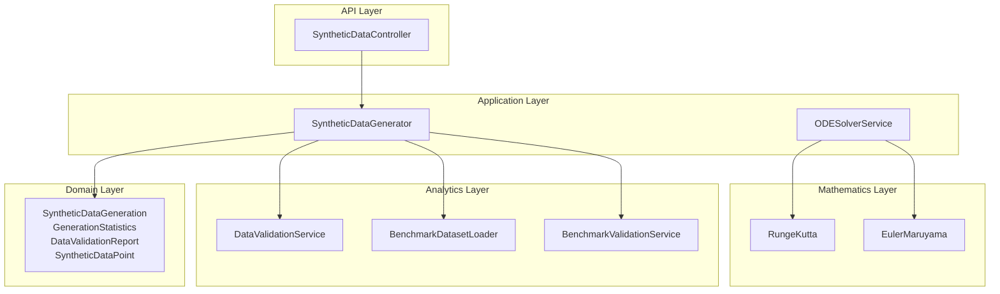
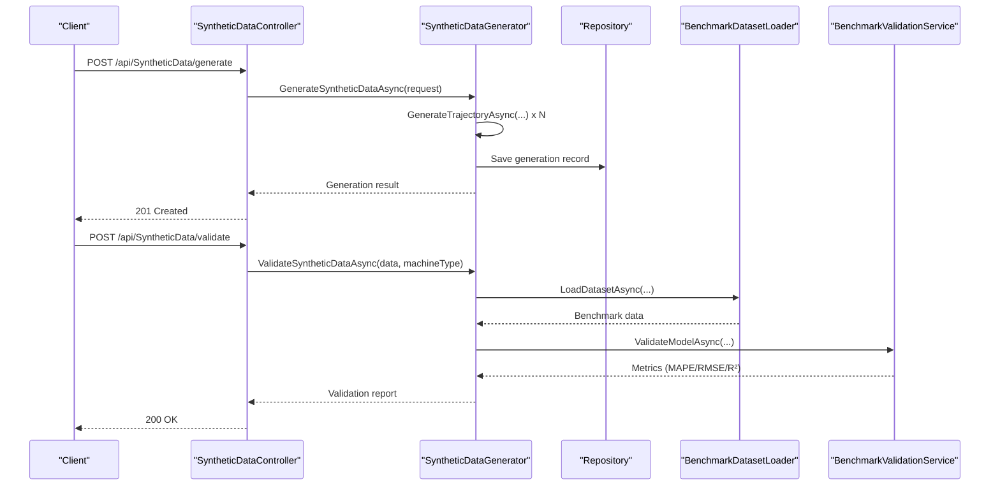
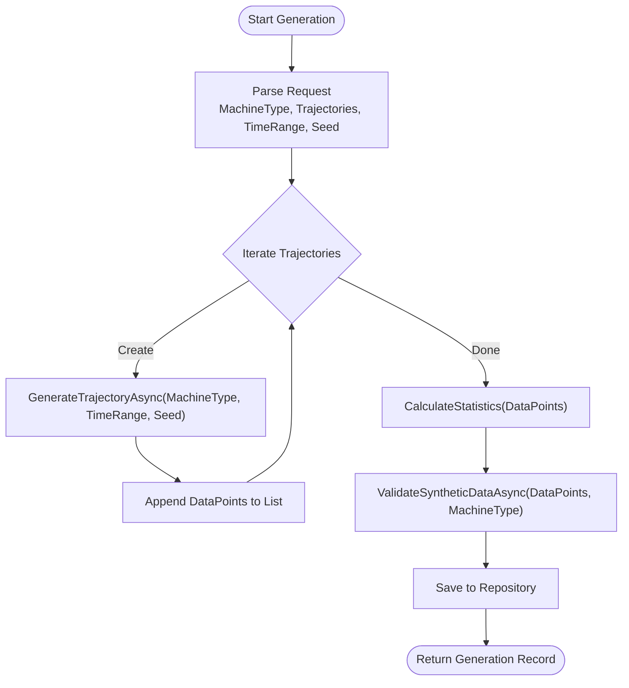
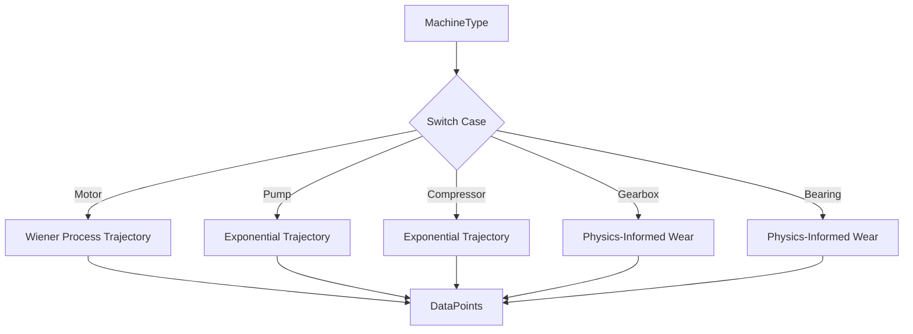
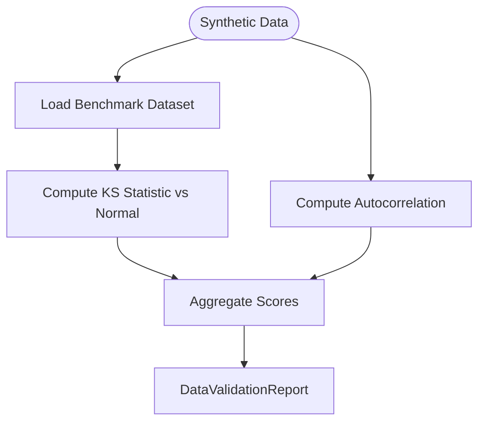
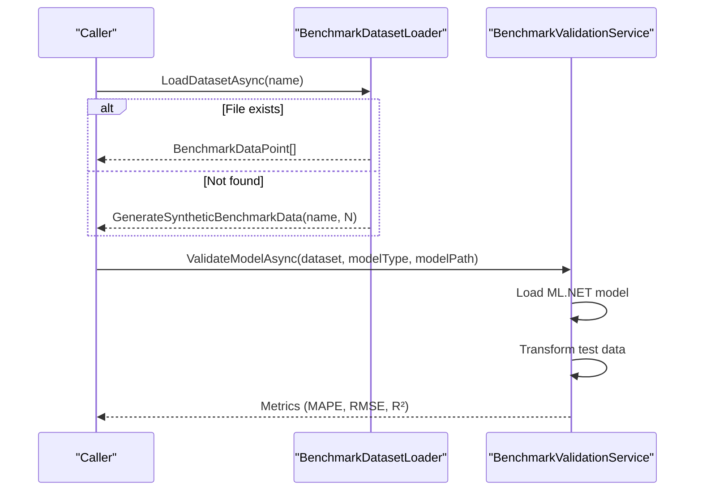
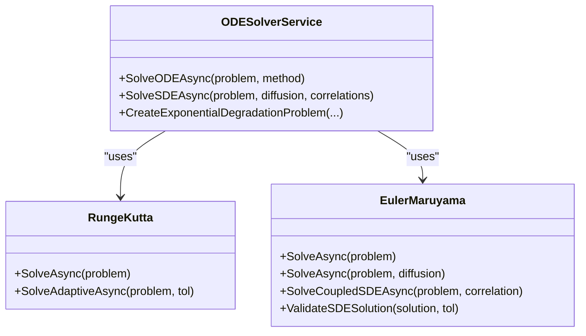
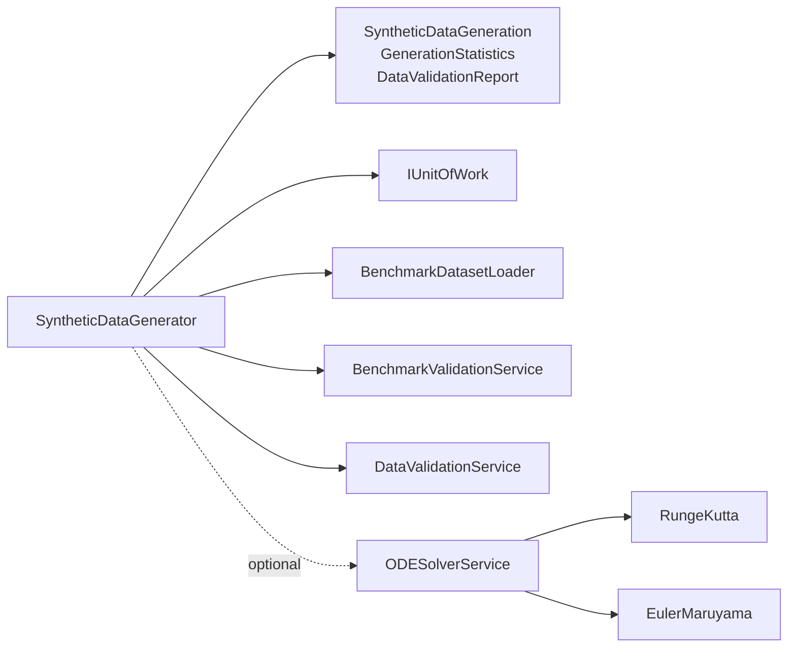

# Synthetic Data Generation

<cite>
**Referenced Files in This Document**
- [SyntheticDataController.cs](file://src/api/DigitalTwinPlatform.API/Controllers/SyntheticDataController.cs)
- [SyntheticDataGenerator.cs](file://src/api/DigitalTwinPlatform.Application/Services/SyntheticDataGenerator.cs)
- [ISyntheticDataGenerator.cs](file://src/api/DigitalTwinPlatform.API/Services/Simulation/ISyntheticDataGenerator.cs)
- [SyntheticDataGeneration.cs](file://src/api/DigitalTwinPlatform.Domain/Entities/SyntheticDataGeneration.cs)
- [SyntheticDataGeneratorTests.cs](file://src/api/DigitalTwinPlatform.Tests/Services/SyntheticDataGeneratorTests.cs)
- [EulerMaruyama.cs](file://src/api/DigitalTwinPlatform.Application/Mathematics/EulerMaruyama.cs)
- [RungeKutta.cs](file://src/api/DigitalTwinPlatform.Application/Mathematics/RungeKutta.cs)
- [ODESolverService.cs](file://src/api/DigitalTwinPlatform.Application/Services/ODESolverService.cs)
- [DegradationModelingController.cs](file://src/api/DigitalTwinPlatform.API/Controllers/DegradationModelingController.cs)
- [BenchmarkDatasetLoader.cs](file://src/api/DigitalTwinPlatform.API/Services/Analytics/BenchmarkDatasetLoader.cs)
- [BenchmarkValidationService.cs](file://src/api/DigitalTwinPlatform.API/Services/Analytics/BenchmarkValidationService.cs)
- [DataValidationService.cs](file://src/api/DigitalTwinPlatform.API/Services/Simulation/DataValidationService.cs)
- [research.md](file://specs/1-predictive-maintenance/research.md)
- [master_proposal_en.md](file://src/resources/master_proposal_en.md)
</cite>

## Table of Contents
1. [Introduction](#introduction)
2. [Project Structure](#project-structure)
3. [Core Components](#core-components)
4. [Architecture Overview](#architecture-overview)
5. [Detailed Component Analysis](#detailed-component-analysis)
6. [Dependency Analysis](#dependency-analysis)
7. [Performance Considerations](#performance-considerations)
8. [Troubleshooting Guide](#troubleshooting-guide)
9. [Conclusion](#conclusion)
10. [Appendices](#appendices)

## Introduction
This document explains the synthetic data generation system for the digital twin platform. It covers the physics-informed generation process, statistical validation, and benchmark dataset comparison workflows. It documents generation algorithms, configuration parameters, quality assurance, and how the system relates to mathematical modeling, machine learning training, and real-world validation. Guidance is included for data privacy, reproducibility, and scalability.

## Project Structure
The synthetic data generation spans three layers:
- API layer: HTTP endpoints expose generation, validation, and statistics retrieval.
- Application layer: Business logic orchestrates generation, validation, and persistence.
- Domain layer: Entities define data structures for generation sessions, statistics, and validation reports.
- Mathematics layer: Numerical ODE/SDE solvers enable physics-informed modeling.
- Analytics layer: Benchmark datasets and ML-based validation services support comparative evaluation.

**Diagram sources**
- [SyntheticDataController.cs](file://src/api/DigitalTwinPlatform.API/Controllers/SyntheticDataController.cs#L1-L143)
- [SyntheticDataGenerator.cs](file://src/api/DigitalTwinPlatform.Application/Services/SyntheticDataGenerator.cs#L1-L533)
- [SyntheticDataGeneration.cs](file://src/api/DigitalTwinPlatform.Domain/Entities/SyntheticDataGeneration.cs#L1-L77)
- [RungeKutta.cs](file://src/api/DigitalTwinPlatform.Application/Mathematics/RungeKutta.cs#L1-L250)
- [EulerMaruyama.cs](file://src/api/DigitalTwinPlatform.Application/Mathematics/EulerMaruyama.cs#L1-L388)
- [ODESolverService.cs](file://src/api/DigitalTwinPlatform.Application/Services/ODESolverService.cs#L1-L138)
- [BenchmarkDatasetLoader.cs](file://src/api/DigitalTwinPlatform.API/Services/Analytics/BenchmarkDatasetLoader.cs#L1-L212)
- [BenchmarkValidationService.cs](file://src/api/DigitalTwinPlatform.API/Services/Analytics/BenchmarkValidationService.cs#L1-L223)
- [DataValidationService.cs](file://src/api/DigitalTwinPlatform.API/Services/Simulation/DataValidationService.cs#L1-L144)

**Section sources**
- [SyntheticDataController.cs](file://src/api/DigitalTwinPlatform.API/Controllers/SyntheticDataController.cs#L1-L143)
- [SyntheticDataGenerator.cs](file://src/api/DigitalTwinPlatform.Application/Services/SyntheticDataGenerator.cs#L1-L533)
- [SyntheticDataGeneration.cs](file://src/api/DigitalTwinPlatform.Domain/Entities/SyntheticDataGeneration.cs#L1-L77)
- [RungeKutta.cs](file://src/api/DigitalTwinPlatform.Application/Mathematics/RungeKutta.cs#L1-L250)
- [EulerMaruyama.cs](file://src/api/DigitalTwinPlatform.Application/Mathematics/EulerMaruyama.cs#L1-L388)
- [ODESolverService.cs](file://src/api/DigitalTwinPlatform.Application/Services/ODESolverService.cs#L1-L138)
- [BenchmarkDatasetLoader.cs](file://src/api/DigitalTwinPlatform.API/Services/Analytics/BenchmarkDatasetLoader.cs#L1-L212)
- [BenchmarkValidationService.cs](file://src/api/DigitalTwinPlatform.API/Services/Analytics/BenchmarkValidationService.cs#L1-L223)
- [DataValidationService.cs](file://src/api/DigitalTwinPlatform.API/Services/Simulation/DataValidationService.cs#L1-L144)

## Core Components
- SyntheticDataController: Exposes endpoints to generate synthetic telemetry data, validate against benchmarks, and fetch statistics.
- SyntheticDataGenerator: Implements the generation pipeline, trajectory creation per machine type, statistics computation, and validation against benchmark datasets.
- Entities: Define generation records, statistics, validation reports, and data point structures.
- Numerical solvers: Runge-Kutta (deterministic) and Euler-Maruyama (stochastic) enable physics-informed models.
- Analytics services: BenchmarkDatasetLoader loads or synthesizes benchmark datasets; BenchmarkValidationService evaluates ML models against benchmarks; DataValidationService performs batch-level statistical checks.

Key configuration and parameters:
- Generation request: machine type, number of trajectories, time range, random seed.
- Trajectory generation supports multiple machine types with distinct degradation models.
- Validation integrates benchmark datasets and ML-based metrics.

**Section sources**
- [SyntheticDataController.cs](file://src/api/DigitalTwinPlatform.API/Controllers/SyntheticDataController.cs#L29-L143)
- [SyntheticDataGenerator.cs](file://src/api/DigitalTwinPlatform.Application/Services/SyntheticDataGenerator.cs#L34-L502)
- [SyntheticDataGeneration.cs](file://src/api/DigitalTwinPlatform.Domain/Entities/SyntheticDataGeneration.cs#L10-L77)
- [RungeKutta.cs](file://src/api/DigitalTwinPlatform.Application/Mathematics/RungeKutta.cs#L12-L106)
- [EulerMaruyama.cs](file://src/api/DigitalTwinPlatform.Application/Mathematics/EulerMaruyama.cs#L12-L87)
- [BenchmarkDatasetLoader.cs](file://src/api/DigitalTwinPlatform.API/Services/Analytics/BenchmarkDatasetLoader.cs#L17-L148)
- [BenchmarkValidationService.cs](file://src/api/DigitalTwinPlatform.API/Services/Analytics/BenchmarkValidationService.cs#L26-L161)
- [DataValidationService.cs](file://src/api/DigitalTwinPlatform.API/Services/Simulation/DataValidationService.cs#L25-L116)

## Architecture Overview
The system follows a layered architecture:
- API layer handles HTTP requests and delegates to application services.
- Application layer encapsulates business logic, including generation, validation, persistence, and statistics.
- Domain layer defines immutable entities and enumerations.
- Mathematics layer provides numerical methods for deterministic and stochastic degradation modeling.
- Analytics layer supplies benchmark datasets and ML-based validation.

**Diagram sources**
- [SyntheticDataController.cs](file://src/api/DigitalTwinPlatform.API/Controllers/SyntheticDataController.cs#L36-L86)
- [SyntheticDataGenerator.cs](file://src/api/DigitalTwinPlatform.Application/Services/SyntheticDataGenerator.cs#L34-L105)
- [BenchmarkDatasetLoader.cs](file://src/api/DigitalTwinPlatform.API/Services/Analytics/BenchmarkDatasetLoader.cs#L17-L89)
- [BenchmarkValidationService.cs](file://src/api/DigitalTwinPlatform.API/Services/Analytics/BenchmarkValidationService.cs#L55-L161)

## Detailed Component Analysis

### Synthetic Data Generation Pipeline
The generation pipeline creates multiple degradation trajectories per machine type, aggregates data points, computes statistics, runs validation, persists the record, and returns the result.

**Diagram sources**
- [SyntheticDataGenerator.cs](file://src/api/DigitalTwinPlatform.Application/Services/SyntheticDataGenerator.cs#L34-L105)
- [SyntheticDataGeneration.cs](file://src/api/DigitalTwinPlatform.Domain/Entities/SyntheticDataGeneration.cs#L10-L23)

**Section sources**
- [SyntheticDataGenerator.cs](file://src/api/DigitalTwinPlatform.Application/Services/SyntheticDataGenerator.cs#L34-L105)
- [SyntheticDataGeneration.cs](file://src/api/DigitalTwinPlatform.Domain/Entities/SyntheticDataGeneration.cs#L10-L23)

### Trajectory Generation by Machine Type
Each machine type applies a distinct degradation model:
- Motor: Wiener process with drift and diffusion.
- Pump/Compressor: Exponential degradation with growth parameters.
- Gearbox/Bearing: Physics-informed wear based on load, speed, and temperature.

**Diagram sources**
- [SyntheticDataGenerator.cs](file://src/api/DigitalTwinPlatform.Application/Services/SyntheticDataGenerator.cs#L110-L367)

**Section sources**
- [SyntheticDataGenerator.cs](file://src/api/DigitalTwinPlatform.Application/Services/SyntheticDataGenerator.cs#L110-L367)

### Statistical Validation Methods
Two complementary validation approaches are implemented:
- Distance-based scoring against benchmark averages (temperature, vibration, pressure).
- Batch-level statistical checks (Kolmogorov-Smirnov, autocorrelation) and benchmark comparison (KL divergence, MMD).

**Diagram sources**
- [SyntheticDataGenerator.cs](file://src/api/DigitalTwinPlatform.Application/Services/SyntheticDataGenerator.cs#L396-L457)
- [DataValidationService.cs](file://src/api/DigitalTwinPlatform.API/Services/Simulation/DataValidationService.cs#L25-L116)

**Section sources**
- [SyntheticDataGenerator.cs](file://src/api/DigitalTwinPlatform.Application/Services/SyntheticDataGenerator.cs#L396-L457)
- [DataValidationService.cs](file://src/api/DigitalTwinPlatform.API/Services/Simulation/DataValidationService.cs#L25-L116)

### Benchmark Dataset Comparison Workflow
The system supports loading real or synthetic benchmark datasets and evaluating ML models trained on synthetic data against them using regression metrics.

**Diagram sources**
- [BenchmarkDatasetLoader.cs](file://src/api/DigitalTwinPlatform.API/Services/Analytics/BenchmarkDatasetLoader.cs#L17-L148)
- [BenchmarkValidationService.cs](file://src/api/DigitalTwinPlatform.API/Services/Analytics/BenchmarkValidationService.cs#L55-L161)

**Section sources**
- [BenchmarkDatasetLoader.cs](file://src/api/DigitalTwinPlatform.API/Services/Analytics/BenchmarkDatasetLoader.cs#L17-L148)
- [BenchmarkValidationService.cs](file://src/api/DigitalTwinPlatform.API/Services/Analytics/BenchmarkValidationService.cs#L55-L161)

### Numerical Methods for Physics-Informed Modeling
Deterministic and stochastic degradation models rely on numerical ODE/SDE solvers:
- Runge-Kutta 4th order for deterministic ODEs.
- Euler-Maruyama for stochastic differential equations with optional correlated Brownian motion.

**Diagram sources**
- [ODESolverService.cs](file://src/api/DigitalTwinPlatform.Application/Services/ODESolverService.cs#L15-L138)
- [RungeKutta.cs](file://src/api/DigitalTwinPlatform.Application/Mathematics/RungeKutta.cs#L12-L106)
- [EulerMaruyama.cs](file://src/api/DigitalTwinPlatform.Application/Mathematics/EulerMaruyama.cs#L12-L87)

**Section sources**
- [ODESolverService.cs](file://src/api/DigitalTwinPlatform.Application/Services/ODESolverService.cs#L15-L138)
- [RungeKutta.cs](file://src/api/DigitalTwinPlatform.Application/Mathematics/RungeKutta.cs#L12-L106)
- [EulerMaruyama.cs](file://src/api/DigitalTwinPlatform.Application/Mathematics/EulerMaruyama.cs#L12-L87)

### API Endpoints and Usage
Endpoints exposed by the controller:
- POST /api/SyntheticData/generate: Creates synthetic data for a machine type with validation and statistics.
- POST /api/SyntheticData/validate: Validates synthetic data against benchmark datasets.
- GET /api/SyntheticData/statistics/{machineType}: Retrieves generation statistics for a machine type.
- GET /api/SyntheticData/statistics: Retrieves aggregated statistics (placeholder in current implementation).

Example request/response references:
- Generation request DTO and validation request DTO are defined in the application service.
- Responses include generation records with statistics and validation reports.

**Section sources**
- [SyntheticDataController.cs](file://src/api/DigitalTwinPlatform.API/Controllers/SyntheticDataController.cs#L36-L143)
- [SyntheticDataGenerator.cs](file://src/api/DigitalTwinPlatform.Application/Services/SyntheticDataGenerator.cs#L512-L521)

## Dependency Analysis
The generation service depends on:
- Domain entities for persistence and reporting.
- Repository pattern via unit of work for storage.
- Analytics services for benchmark loading and ML validation.
- Numerical mathematics services for physics-informed modeling.

**Diagram sources**
- [SyntheticDataGenerator.cs](file://src/api/DigitalTwinPlatform.Application/Services/SyntheticDataGenerator.cs#L18-L29)
- [SyntheticDataGeneration.cs](file://src/api/DigitalTwinPlatform.Domain/Entities/SyntheticDataGeneration.cs#L10-L77)
- [ODESolverService.cs](file://src/api/DigitalTwinPlatform.Application/Services/ODESolverService.cs#L15-L29)
- [RungeKutta.cs](file://src/api/DigitalTwinPlatform.Application/Mathematics/RungeKutta.cs#L12-L19)
- [EulerMaruyama.cs](file://src/api/DigitalTwinPlatform.Application/Mathematics/EulerMaruyama.cs#L12-L21)

**Section sources**
- [SyntheticDataGenerator.cs](file://src/api/DigitalTwinPlatform.Application/Services/SyntheticDataGenerator.cs#L18-L29)
- [SyntheticDataGeneration.cs](file://src/api/DigitalTwinPlatform.Domain/Entities/SyntheticDataGeneration.cs#L10-L77)
- [ODESolverService.cs](file://src/api/DigitalTwinPlatform.Application/Services/ODESolverService.cs#L15-L29)

## Performance Considerations
- Throughput: The application claims generation rates exceeding 1000 samples per second, enabling rapid prototyping and large-scale synthetic datasets.
- Numerical stability: SDE solver includes validation for stability and extreme values; consider tuning tolerances and step sizes for adaptive methods.
- Parallelization: Trajectory generation loops can be parallelized safely by using independent seeds per trajectory.
- Persistence: Batch writes and transaction boundaries should be tuned to balance durability and latency.
- Benchmark loading: Prefer preloading or caching benchmark datasets to avoid repeated IO during validation.

[No sources needed since this section provides general guidance]

## Troubleshooting Guide
Common issues and resolutions:
- Empty or invalid data for validation: Validation returns a report with recommendations when input is missing or invalid.
- Unsupported machine type: Trajectory generation throws an argument exception for unsupported types; ensure the machine type is one of the supported values.
- Benchmark dataset not found: The loader generates synthetic benchmark data if the file is missing; confirm dataset availability or adjust expectations.
- ML model path errors: Validation service checks for model existence and returns an error message if the file is missing.
- Numerical instability: SDE validation detects NaN/infinity and extreme values; review solver parameters and tolerances.

**Section sources**
- [SyntheticDataGenerator.cs](file://src/api/DigitalTwinPlatform.Application/Services/SyntheticDataGenerator.cs#L405-L456)
- [SyntheticDataGenerator.cs](file://src/api/DigitalTwinPlatform.Application/Services/SyntheticDataGenerator.cs#L146-L148)
- [BenchmarkDatasetLoader.cs](file://src/api/DigitalTwinPlatform.API/Services/Analytics/BenchmarkDatasetLoader.cs#L25-L33)
- [BenchmarkValidationService.cs](file://src/api/DigitalTwinPlatform.API/Services/Analytics/BenchmarkValidationService.cs#L83-L87)
- [EulerMaruyama.cs](file://src/api/DigitalTwinPlatform.Application/Mathematics/EulerMaruyama.cs#L330-L375)

## Conclusion
The synthetic data generation system integrates physics-informed modeling, robust statistical validation, and benchmark dataset comparison. It supports rapid generation of high-fidelity synthetic telemetry data, automated quality assessment, and ML model evaluation against real or synthetic baselines. The modular design enables extension to additional machine types, numerical methods, and validation metrics.

[No sources needed since this section summarizes without analyzing specific files]

## Appendices

### Configuration Options and Parameters
- Generation request:
  - MachineType: Target machine category (e.g., motor, pump, compressor, gearbox, bearing).
  - NumberOfTrajectories: Number of independent degradation trajectories to generate.
  - TimeRange: Duration span for each trajectory.
  - RandomSeed: Base seed for reproducible generation; individual trajectories use seeded RNG.
- Validation request:
  - SyntheticData: List of synthetic data points to validate.
  - MachineType: Used to select appropriate benchmark and scoring logic.
- Benchmark datasets:
  - Names: NASA_CMAPSS, FEMTO_Bearing, Synthetic.
  - Behavior: Load from CSV or synthesize if unavailable.

**Section sources**
- [SyntheticDataGenerator.cs](file://src/api/DigitalTwinPlatform.Application/Services/SyntheticDataGenerator.cs#L512-L521)
- [BenchmarkDatasetLoader.cs](file://src/api/DigitalTwinPlatform.API/Services/Analytics/BenchmarkDatasetLoader.cs#L91-L148)

### Mathematical Modeling and ML Integration
- Mathematical models:
  - Wiener process for stochastic degradation.
  - Exponential degradation for accelerating wear.
  - Physics-informed surrogates capturing load, speed, and temperature effects.
- Numerical methods:
  - Deterministic: 4th-order Runge-Kutta.
  - Stochastic: Euler-Maruyama with optional correlated noise.
- ML integration:
  - Benchmark datasets loaded and transformed for ML.NET evaluation.
  - Metrics include MAPE, RMSE, and R² for model performance assessment.

**Section sources**
- [research.md](file://specs/1-predictive-maintenance/research.md#L7-L35)
- [master_proposal_en.md](file://src/resources/master_proposal_en.md#L110-L194)
- [RungeKutta.cs](file://src/api/DigitalTwinPlatform.Application/Mathematics/RungeKutta.cs#L12-L106)
- [EulerMaruyama.cs](file://src/api/DigitalTwinPlatform.Application/Mathematics/EulerMaruyama.cs#L12-L87)
- [BenchmarkValidationService.cs](file://src/api/DigitalTwinPlatform.API/Services/Analytics/BenchmarkValidationService.cs#L89-L108)

### Quality Assurance Processes
- Generation statistics: Aggregated counts, averages, and timestamps.
- Validation report: Overall score, test counts, benchmark dataset, recommendations.
- Batch validation: KS test, autocorrelation, KL divergence, and MMD against benchmarks.
- Test coverage: Unit tests validate generation, statistics, and validation outcomes.

**Section sources**
- [SyntheticDataGenerator.cs](file://src/api/DigitalTwinPlatform.Application/Services/SyntheticDataGenerator.cs#L372-L391)
- [SyntheticDataGenerator.cs](file://src/api/DigitalTwinPlatform.Application/Services/SyntheticDataGenerator.cs#L434-L450)
- [DataValidationService.cs](file://src/api/DigitalTwinPlatform.API/Services/Simulation/DataValidationService.cs#L25-L116)
- [SyntheticDataGeneratorTests.cs](file://src/api/DigitalTwinPlatform.Tests/Services/SyntheticDataGeneratorTests.cs#L34-L157)

### Data Privacy, Reproducibility, and Scalability
- Privacy: Synthetic data replaces sensitive real data; ensure no personal identifiable information is present.
- Reproducibility: Fixed seeds for benchmark generation and deterministic solvers; consider logging seeds in generation records.
- Scalability: Parallel trajectory generation, batch persistence, and caching of benchmark datasets improve throughput.

[No sources needed since this section provides general guidance]