# Backend Service Architecture

<cite>
**Referenced Files in This Document**
- [Program.cs](file://src/api/DigitalTwinPlatform.API/Program.cs)
- [ServiceCollectionExtensions.cs](file://src/api/DigitalTwinPlatform.API/Extensions/ServiceCollectionExtensions.cs)
- [ApplicationBuilderExtensions.cs](file://src/api/DigitalTwinPlatform.API/Extensions/ApplicationBuilderExtensions.cs)
- [DatabaseExtensions.cs](file://src/api/DigitalTwinPlatform.API/Extensions/DatabaseExtensions.cs)
- [GlobalExceptionHandlerMiddleware.cs](file://src/api/DigitalTwinPlatform.API/Middleware/GlobalExceptionHandlerMiddleware.cs)
- [PerformanceMonitoringMiddleware.cs](file://src/api/DigitalTwinPlatform.API/Middleware/PerformanceMonitoringMiddleware.cs)
- [DependencyInjection.cs](file://src/api/DigitalTwinPlatform.Application/DependencyInjection.cs)
- [ValidationBehavior.cs](file://src/api/DigitalTwinPlatform.Application/Behaviors/ValidationBehavior.cs)
- [ExceptionHandlingBehavior.cs](file://src/api/DigitalTwinPlatform.Application/Behaviors/ExceptionHandlingBehavior.cs)
- [LoggingBehavior.cs](file://src/api/DigitalTwinPlatform.Application/Behaviors/LoggingBehavior.cs)
- [DependencyInjection.cs](file://src/api/DigitalTwinPlatform.Infrastructure/DependencyInjection.cs)
- [DigitalTwinDbContext.cs](file://src/api/DigitalTwinPlatform.Infrastructure/Persistence/DigitalTwinDbContext.cs)
- [SimulationEngine.cs](file://src/api/DigitalTwinPlatform.API/Simulations/SimulationEngine.cs)
- [MathematicalModelingServices.cs](file://src/api/DigitalTwinPlatform.API/MathematicalModeling/MathematicalModelingServices.cs)
- [PredictiveAnalyticsService.cs](file://src/api/DigitalTwinPlatform.API/Analytics/PredictiveAnalyticsService.cs)
</cite>

## Table of Contents
1. [Introduction](#introduction)
2. [Project Structure](#project-structure)
3. [Core Components](#core-components)
4. [Architecture Overview](#architecture-overview)
5. [Detailed Component Analysis](#detailed-component-analysis)
6. [Dependency Analysis](#dependency-analysis)
7. [Performance Considerations](#performance-considerations)
8. [Troubleshooting Guide](#troubleshooting-guide)
9. [Conclusion](#conclusion)

## Introduction
This document describes the backend service architecture for the .NET 9 Web API implementation of the Digital Twin Platform. It explains the layered architecture (presentation, application, domain, and infrastructure), the CQRS pattern with MediatR, dependency injection configuration, and service registration. It also documents specialized services including the simulation engine, analytics engine, ML pipeline, mathematical modeling services, synthetic data generator, and alert management. The document covers Entity Framework configuration, repository pattern implementation, data access strategies, middleware pipeline, global exception handling, and cross-cutting concerns such as logging and performance monitoring.

## Project Structure
The backend is organized into four primary layers:
- Presentation: ASP.NET Core Web API with controllers, SignalR hubs, middleware, and Swagger documentation.
- Application: CQRS handlers, validators, behaviors, services, and abstractions for analytics, ML, simulations, and workflows.
- Domain: Entities, value objects, enums, and common domain abstractions.
- Infrastructure: Entity Framework DbContext, repositories, unit of work, migrations, and persistence concerns.

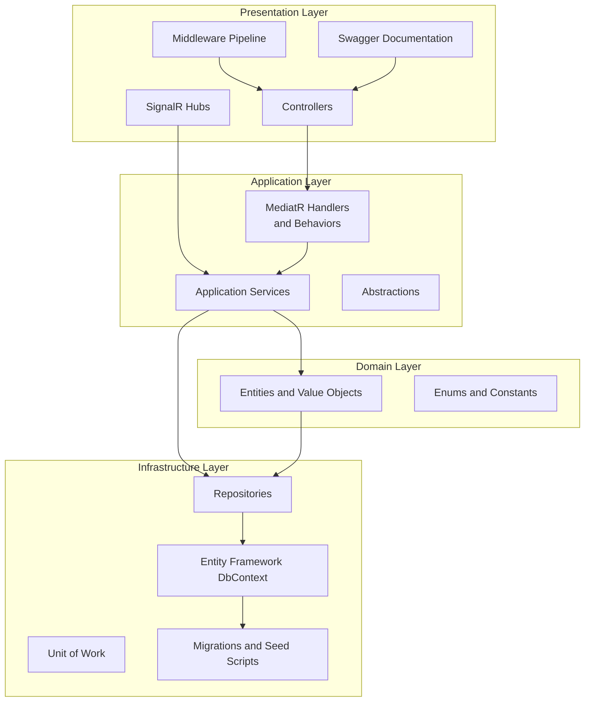

**Diagram sources**
- [Program.cs](file://src/api/DigitalTwinPlatform.API/Program.cs#L12-L80)
- [DependencyInjection.cs](file://src/api/DigitalTwinPlatform.Application/DependencyInjection.cs#L15-L56)
- [DependencyInjection.cs](file://src/api/DigitalTwinPlatform.Infrastructure/DependencyInjection.cs#L16-L45)

**Section sources**
- [Program.cs](file://src/api/DigitalTwinPlatform.API/Program.cs#L12-L80)
- [DependencyInjection.cs](file://src/api/DigitalTwinPlatform.Application/DependencyInjection.cs#L15-L56)
- [DependencyInjection.cs](file://src/api/DigitalTwinPlatform.Infrastructure/DependencyInjection.cs#L16-L45)

## Core Components
- CQRS with MediatR: The application layer registers MediatR and composes pipeline behaviors for validation, logging, exception handling, performance, retries, authorization, auditing, and caching.
- Dependency Injection: Centralized service registration in the API project extends DI with security, CORS, SignalR, Swagger, and application/infrastructure services.
- Middleware Pipeline: Global exception handling, tenant context, structured logging, metrics, development diagnostics, security, and core routing/authentication/authorization.
- Data Access: Entity Framework with PostgreSQL, repository pattern, and unit of work for transactional boundaries and tenant isolation.
- Specialized Services: Simulation engine, predictive analytics, ML inference and XAI, mathematical modeling (ODE solver and optimization), synthetic data generation, and alert management.

**Section sources**
- [DependencyInjection.cs](file://src/api/DigitalTwinPlatform.Application/DependencyInjection.cs#L20-L36)
- [ServiceCollectionExtensions.cs](file://src/api/DigitalTwinPlatform.API/Extensions/ServiceCollectionExtensions.cs#L232-L321)
- [ApplicationBuilderExtensions.cs](file://src/api/DigitalTwinPlatform.API/Extensions/ApplicationBuilderExtensions.cs#L15-L72)
- [DependencyInjection.cs](file://src/api/DigitalTwinPlatform.Infrastructure/DependencyInjection.cs#L22-L43)

## Architecture Overview
The system follows a clean architecture with explicit separation of concerns:
- Presentation depends on application abstractions.
- Application orchestrates domain logic and coordinates repositories/services.
- Domain encapsulates business rules and entities.
- Infrastructure provides persistence and external integrations.

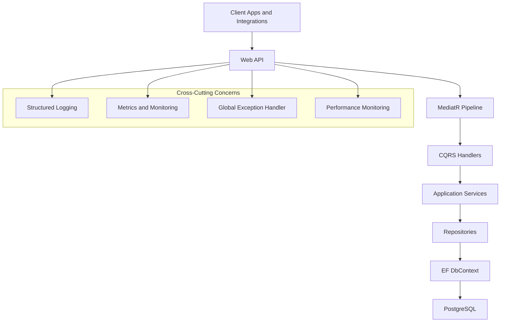

**Diagram sources**
- [Program.cs](file://src/api/DigitalTwinPlatform.API/Program.cs#L52-L80)
- [DependencyInjection.cs](file://src/api/DigitalTwinPlatform.Application/DependencyInjection.cs#L20-L36)
- [DependencyInjection.cs](file://src/api/DigitalTwinPlatform.Infrastructure/DependencyInjection.cs#L22-L43)

## Detailed Component Analysis

### CQRS and MediatR Pipeline
- Registration: MediatR is registered with behaviors in the application layer, including validation, logging, exception handling, performance, retry, authorization, audit, and caching.
- Validation: FluentValidation integrates via a dedicated pipeline behavior that aggregates failures and throws a domain validation exception.
- Exception Handling: A pipeline behavior logs and rethrows exceptions with differentiated severity.
- Logging: A behavior logs request start/end and errors.

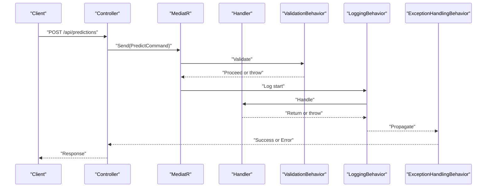

**Diagram sources**
- [DependencyInjection.cs](file://src/api/DigitalTwinPlatform.Application/DependencyInjection.cs#L20-L36)
- [ValidationBehavior.cs](file://src/api/DigitalTwinPlatform.Application/Behaviors/ValidationBehavior.cs#L11-L40)
- [ExceptionHandlingBehavior.cs](file://src/api/DigitalTwinPlatform.Application/Behaviors/ExceptionHandlingBehavior.cs#L11-L40)
- [LoggingBehavior.cs](file://src/api/DigitalTwinPlatform.Application/Behaviors/LoggingBehavior.cs#L10-L29)

**Section sources**
- [DependencyInjection.cs](file://src/api/DigitalTwinPlatform.Application/DependencyInjection.cs#L20-L36)
- [ValidationBehavior.cs](file://src/api/DigitalTwinPlatform.Application/Behaviors/ValidationBehavior.cs#L7-L41)
- [ExceptionHandlingBehavior.cs](file://src/api/DigitalTwinPlatform.Application/Behaviors/ExceptionHandlingBehavior.cs#L7-L41)
- [LoggingBehavior.cs](file://src/api/DigitalTwinPlatform.Application/Behaviors/LoggingBehavior.cs#L6-L30)

### Dependency Injection and Service Registration
- API entry point configures controllers, JSON serialization, validators, AutoMapper, logging, health checks, metrics, security, CORS, SignalR, API versioning, and Swagger.
- Application and infrastructure layers are registered via extension methods.
- Application services include analytics, ML, simulation, XAI, alerting, maintenance, mathematical modeling, and advanced analytics.
- Infrastructure registers DbContext, Unit of Work, and repositories.

```mermaid
flowchart TD
Start(["Startup"]) --> ConfigureServices["Configure Services"]
ConfigureServices --> AddControllers["AddControllers"]
ConfigureServices --> AddValidators["Add FluentValidation"]
ConfigureServices --> AddLogging["Add Structured Logging"]
ConfigureServices --> AddHealth["Add Health Checks"]
ConfigureServices --> AddMetrics["Add Metrics"]
ConfigureServices --> AddSecurity["Add Security Services"]
ConfigureServices --> AddCors["Add CORS"]
ConfigureServices --> AddSignalR["Add SignalR"]
ConfigureServices --> AddVersioning["Add API Versioning"]
ConfigureServices --> AddSwagger["Add Swagger"]
ConfigureServices --> AddApplication["AddApplication()"]
ConfigureServices --> AddInfrastructure["AddInfrastructure()"]
ConfigureServices --> AddAppServices["AddApplicationServices()"]
ConfigureServices --> AddInfraServices["AddInfrastructureServices()"]
ConfigureServices --> BuildApp["Build Application"]
BuildApp --> ConfigurePipeline["Configure Pipeline"]
ConfigurePipeline --> UseExceptionHandler["Use Global Exception Handler"]
ConfigurePipeline --> UseDevMiddleware["Use Developer Exception Page"]
ConfigurePipeline --> UseTenantContext["Use Tenant Context"]
ConfigurePipeline --> UseStructuredLogging["Use Structured Logging"]
ConfigurePipeline --> UseMetrics["Use Metrics"]
ConfigurePipeline --> UseSwagger["Use Swagger UI"]
ConfigurePipeline --> UsePerformance["Use Performance Monitoring"]
ConfigurePipeline --> UseSecurity["Use Security Middleware"]
ConfigurePipeline --> UseCore["Use Routing/AuthN/AuthZ"]
ConfigurePipeline --> MapEndpoints["Map Controllers and Hubs"]
MapEndpoints --> Run(["Run"])
```

**Diagram sources**
- [Program.cs](file://src/api/DigitalTwinPlatform.API/Program.cs#L14-L80)
- [ServiceCollectionExtensions.cs](file://src/api/DigitalTwinPlatform.API/Extensions/ServiceCollectionExtensions.cs#L43-L417)
- [ApplicationBuilderExtensions.cs](file://src/api/DigitalTwinPlatform.API/Extensions/ApplicationBuilderExtensions.cs#L15-L89)

**Section sources**
- [Program.cs](file://src/api/DigitalTwinPlatform.API/Program.cs#L14-L80)
- [ServiceCollectionExtensions.cs](file://src/api/DigitalTwinPlatform.API/Extensions/ServiceCollectionExtensions.cs#L232-L321)
- [ApplicationBuilderExtensions.cs](file://src/api/DigitalTwinPlatform.API/Extensions/ApplicationBuilderExtensions.cs#L15-L89)

### Middleware Pipeline and Cross-Cutting Concerns
- Global Exception Handler: Centralizes error responses by exception type, logs with correlation identifiers, and returns structured JSON.
- Performance Monitoring: Measures request durations, buckets slow requests, and logs metrics; supports excluded paths.
- Security Middleware: Cookie policy, HTTPS redirection (non-development), and antiforgery protection.
- Development Middleware: Developer exception page in development.
- Structured Logging and Metrics: Integrated via extension methods.

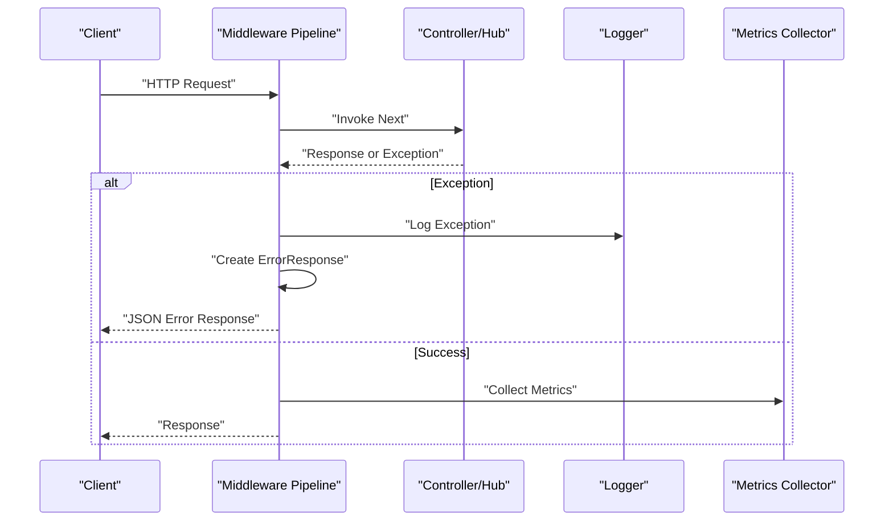

**Diagram sources**
- [GlobalExceptionHandlerMiddleware.cs](file://src/api/DigitalTwinPlatform.API/Middleware/GlobalExceptionHandlerMiddleware.cs#L13-L45)
- [PerformanceMonitoringMiddleware.cs](file://src/api/DigitalTwinPlatform.API/Middleware/PerformanceMonitoringMiddleware.cs#L25-L60)
- [ApplicationBuilderExtensions.cs](file://src/api/DigitalTwinPlatform.API/Extensions/ApplicationBuilderExtensions.cs#L15-L47)

**Section sources**
- [GlobalExceptionHandlerMiddleware.cs](file://src/api/DigitalTwinPlatform.API/Middleware/GlobalExceptionHandlerMiddleware.cs#L25-L227)
- [PerformanceMonitoringMiddleware.cs](file://src/api/DigitalTwinPlatform.API/Middleware/PerformanceMonitoringMiddleware.cs#L25-L110)
- [ApplicationBuilderExtensions.cs](file://src/api/DigitalTwinPlatform.API/Extensions/ApplicationBuilderExtensions.cs#L15-L47)

### Entity Framework Configuration and Repository Pattern
- DbContext: Extends IdentityDbContext for users/roles, defines entity sets, audits changes via interceptors, and configures value converters and indexes.
- Repositories: Generic repository base plus typed repositories for machines, telemetry, predictions, alerts, maintenance, and production lines.
- Unit of Work: Provides transactional boundaries around repository operations.
- Migrations and Seed: Retry-enabled migrations and seeded identity data and SQL script.

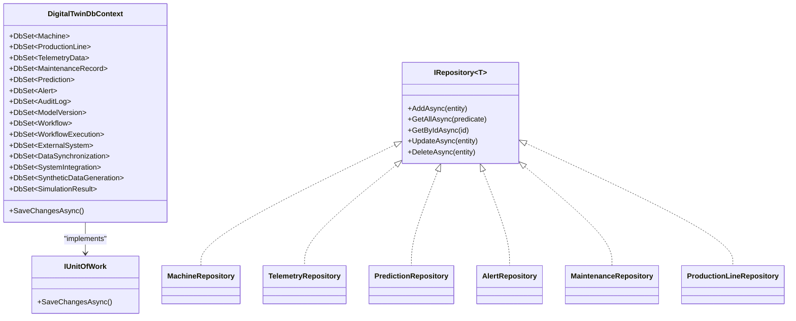

**Diagram sources**
- [DigitalTwinDbContext.cs](file://src/api/DigitalTwinPlatform.Infrastructure/Persistence/DigitalTwinDbContext.cs#L15-L86)
- [DependencyInjection.cs](file://src/api/DigitalTwinPlatform.Infrastructure/DependencyInjection.cs#L33-L43)

**Section sources**
- [DigitalTwinDbContext.cs](file://src/api/DigitalTwinPlatform.Infrastructure/Persistence/DigitalTwinDbContext.cs#L88-L394)
- [DependencyInjection.cs](file://src/api/DigitalTwinPlatform.Infrastructure/DependencyInjection.cs#L22-L43)
- [DatabaseExtensions.cs](file://src/api/DigitalTwinPlatform.API/Extensions/DatabaseExtensions.cs#L16-L74)

### Specialized Services

#### Simulation Engine
- Responsibilities: Initialize, run, pause/resume, and finalize simulations; compute progress and statistical validation; integrate with data validation service.
- Integration: Registered as a singleton and orchestrated by hosted services and schedulers.

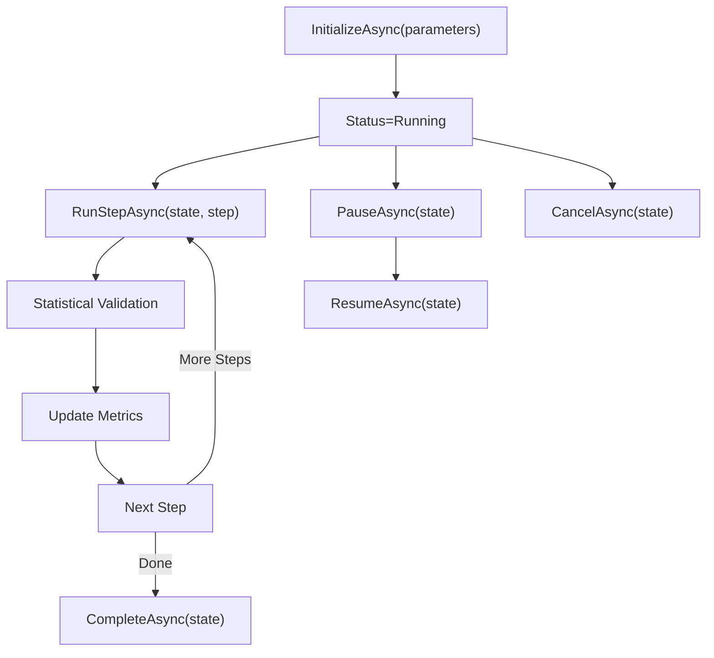

**Diagram sources**
- [SimulationEngine.cs](file://src/api/DigitalTwinPlatform.API/Simulations/SimulationEngine.cs#L11-L124)

**Section sources**
- [ServiceCollectionExtensions.cs](file://src/api/DigitalTwinPlatform.API/Extensions/ServiceCollectionExtensions.cs#L247-L253)
- [SimulationEngine.cs](file://src/api/DigitalTwinPlatform.API/Simulations/SimulationEngine.cs#L6-L126)

#### Predictive Analytics Engine
- Responsibilities: Extract features from telemetry, run ML inference for RUL and health classification, calculate XAI contributions, persist predictions, update digital twin, and trigger alerts.
- Integration: Uses repositories, unit of work, ML predictors, XAI service, and alert service.

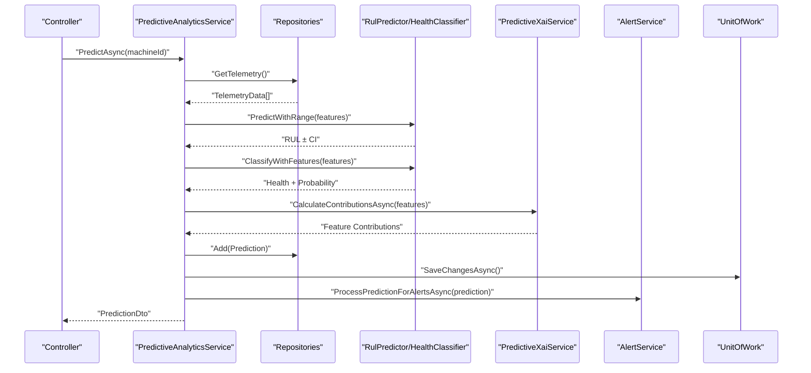

**Diagram sources**
- [PredictiveAnalyticsService.cs](file://src/api/DigitalTwinPlatform.API/Analytics/PredictiveAnalyticsService.cs#L49-L134)

**Section sources**
- [PredictiveAnalyticsService.cs](file://src/api/DigitalTwinPlatform.API/Analytics/PredictiveAnalyticsService.cs#L15-L134)
- [ServiceCollectionExtensions.cs](file://src/api/DigitalTwinPlatform.API/Extensions/ServiceCollectionExtensions.cs#L254-L278)

#### Mathematical Modeling Services
- Differential Equation Solver: Implements Runge-Kutta ODE solving and system dynamics analysis with stability and energy balance.
- Optimization Service: Gradient-based optimization, genetic algorithm, and multi-objective optimization (NSGA-II) with crowding distance selection.

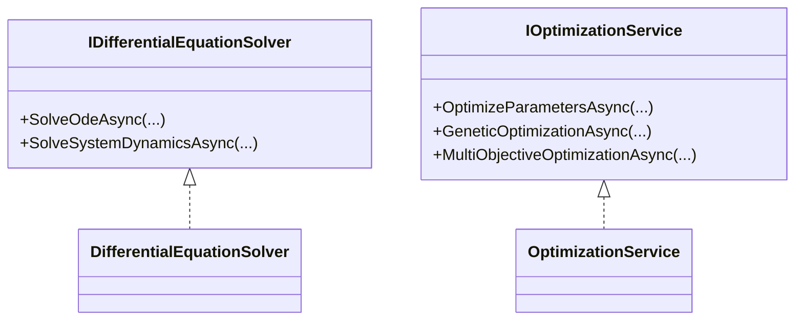

**Diagram sources**
- [MathematicalModelingServices.cs](file://src/api/DigitalTwinPlatform.API/MathematicalModeling/MathematicalModelingServices.cs#L5-L55)
- [MathematicalModelingServices.cs](file://src/api/DigitalTwinPlatform.API/MathematicalModeling/MathematicalModelingServices.cs#L57-L238)
- [MathematicalModelingServices.cs](file://src/api/DigitalTwinPlatform.API/MathematicalModeling/MathematicalModelingServices.cs#L240-L726)

**Section sources**
- [ServiceCollectionExtensions.cs](file://src/api/DigitalTwinPlatform.API/Extensions/ServiceCollectionExtensions.cs#L292-L298)
- [MathematicalModelingServices.cs](file://src/api/DigitalTwinPlatform.API/MathematicalModeling/MathematicalModelingServices.cs#L57-L238)
- [MathematicalModelingServices.cs](file://src/api/DigitalTwinPlatform.API/MathematicalModeling/MathematicalModelingServices.cs#L240-L726)

#### ML Pipeline and XAI
- ML Services: RUL predictor, health classifier, model trainer, benchmark dataset loader/validation, model lifecycle service, and experiment logger.
- XAI: SHAP service client integration for predictive explanations.

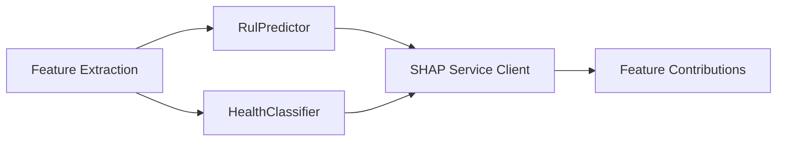

**Diagram sources**
- [ServiceCollectionExtensions.cs](file://src/api/DigitalTwinPlatform.API/Extensions/ServiceCollectionExtensions.cs#L254-L278)
- [PredictiveAnalyticsService.cs](file://src/api/DigitalTwinPlatform.API/Analytics/PredictiveAnalyticsService.cs#L86-L100)

**Section sources**
- [ServiceCollectionExtensions.cs](file://src/api/DigitalTwinPlatform.API/Extensions/ServiceCollectionExtensions.cs#L254-L278)
- [PredictiveAnalyticsService.cs](file://src/api/DigitalTwinPlatform.API/Analytics/PredictiveAnalyticsService.cs#L86-L100)

#### Alert Management
- Alert Service: Processes predictions to generate and manage alerts based on thresholds and rules.
- Notification Service: Sends notifications via HTTP client.

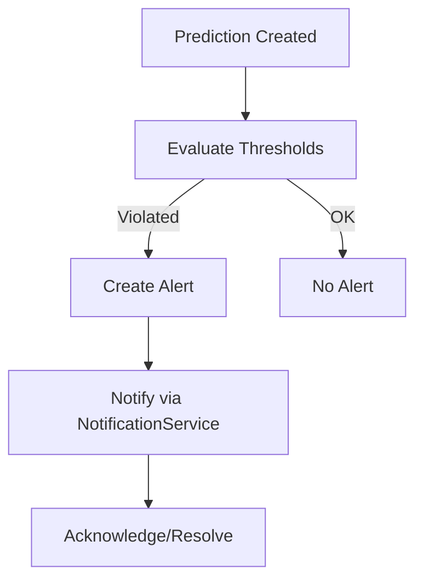

**Diagram sources**
- [ServiceCollectionExtensions.cs](file://src/api/DigitalTwinPlatform.API/Extensions/ServiceCollectionExtensions.cs#L265-L267)
- [PredictiveAnalyticsService.cs](file://src/api/DigitalTwinPlatform.API/Analytics/PredictiveAnalyticsService.cs#L120-L122)

**Section sources**
- [ServiceCollectionExtensions.cs](file://src/api/DigitalTwinPlatform.API/Extensions/ServiceCollectionExtensions.cs#L265-L267)
- [PredictiveAnalyticsService.cs](file://src/api/DigitalTwinPlatform.API/Analytics/PredictiveAnalyticsService.cs#L120-L122)

## Dependency Analysis
The following diagram shows key dependencies among major components:

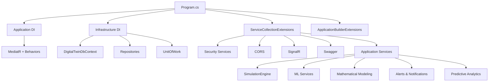

**Diagram sources**
- [Program.cs](file://src/api/DigitalTwinPlatform.API/Program.cs#L42-L47)
- [DependencyInjection.cs](file://src/api/DigitalTwinPlatform.Application/DependencyInjection.cs#L15-L56)
- [DependencyInjection.cs](file://src/api/DigitalTwinPlatform.Infrastructure/DependencyInjection.cs#L16-L45)
- [ServiceCollectionExtensions.cs](file://src/api/DigitalTwinPlatform.API/Extensions/ServiceCollectionExtensions.cs#L43-L321)

**Section sources**
- [Program.cs](file://src/api/DigitalTwinPlatform.API/Program.cs#L42-L47)
- [DependencyInjection.cs](file://src/api/DigitalTwinPlatform.Application/DependencyInjection.cs#L15-L56)
- [DependencyInjection.cs](file://src/api/DigitalTwinPlatform.Infrastructure/DependencyInjection.cs#L16-L45)
- [ServiceCollectionExtensions.cs](file://src/api/DigitalTwinPlatform.API/Extensions/ServiceCollectionExtensions.cs#L43-L321)

## Performance Considerations
- Middleware Performance Monitoring: Tracks slow requests and logs metrics; configurable thresholds and excluded paths.
- Entity Framework Indexes: Strategic indexes on frequently queried fields improve query performance.
- Caching Behavior: Memory caching behavior reduces repeated computation in the MediatR pipeline.
- Background Services: Simulation and telemetry hosted services operate asynchronously to avoid blocking the request pipeline.
- Retry Logic: Database migrations apply retry logic for transient connectivity issues.

**Section sources**
- [PerformanceMonitoringMiddleware.cs](file://src/api/DigitalTwinPlatform.API/Middleware/PerformanceMonitoringMiddleware.cs#L68-L110)
- [DigitalTwinDbContext.cs](file://src/api/DigitalTwinPlatform.Infrastructure/Persistence/DigitalTwinDbContext.cs#L155-L161)
- [DependencyInjection.cs](file://src/api/DigitalTwinPlatform.Application/DependencyInjection.cs#L24-L35)
- [DatabaseExtensions.cs](file://src/api/DigitalTwinPlatform.API/Extensions/DatabaseExtensions.cs#L52-L74)

## Troubleshooting Guide
- Global Exception Handling: The middleware maps domain/business/validation errors to structured responses with correlation IDs and logs at appropriate levels.
- Slow Requests: Performance monitoring logs slow requests and buckets durations; adjust thresholds and excluded paths as needed.
- Database Initialization: Migration retries and seed scripts help recover from transient failures during startup.
- Logging: Structured logging captures request metrics and exceptions; enable development mode for stack traces.

**Section sources**
- [GlobalExceptionHandlerMiddleware.cs](file://src/api/DigitalTwinPlatform.API/Middleware/GlobalExceptionHandlerMiddleware.cs#L25-L227)
- [PerformanceMonitoringMiddleware.cs](file://src/api/DigitalTwinPlatform.API/Middleware/PerformanceMonitoringMiddleware.cs#L68-L110)
- [DatabaseExtensions.cs](file://src/api/DigitalTwinPlatform.API/Extensions/DatabaseExtensions.cs#L16-L74)

## Conclusion
The backend employs a clean, layered architecture with strong separation of concerns. CQRS and MediatR streamline request handling and cross-cutting concerns. The DI configuration centralizes service registration across presentation, application, and infrastructure layers. Entity Framework and the repository pattern provide robust data access with transactional boundaries. Specialized services deliver simulation, analytics, ML/XAI, mathematical modeling, and alerting capabilities. Middleware ensures consistent error handling, performance monitoring, and security. Together, these components form a scalable and maintainable foundation for the Digital Twin Platform.