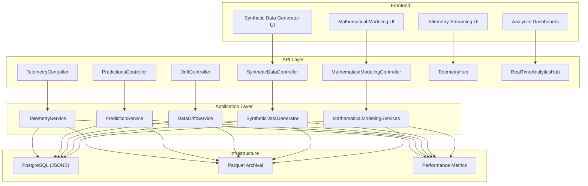
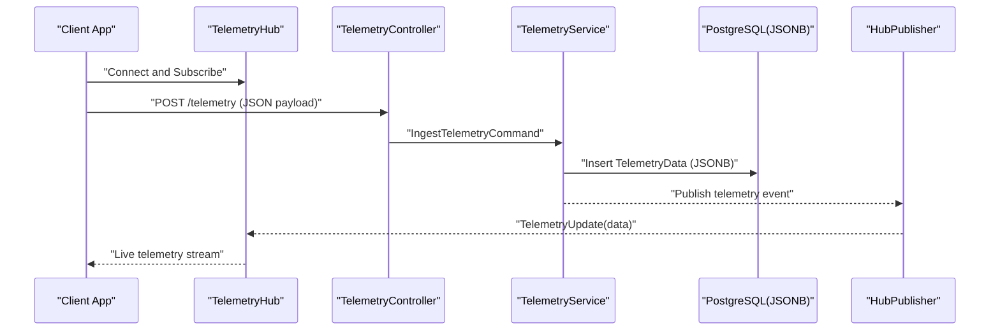
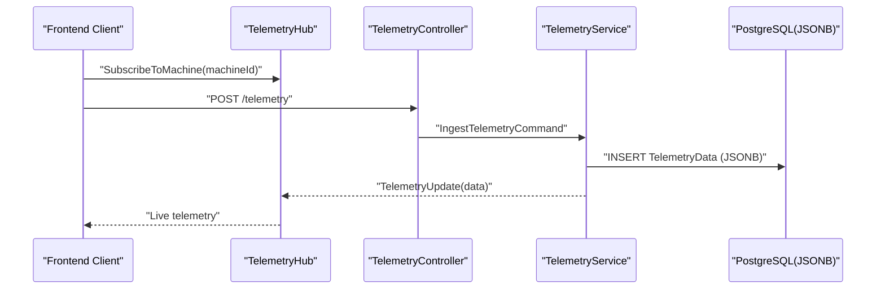
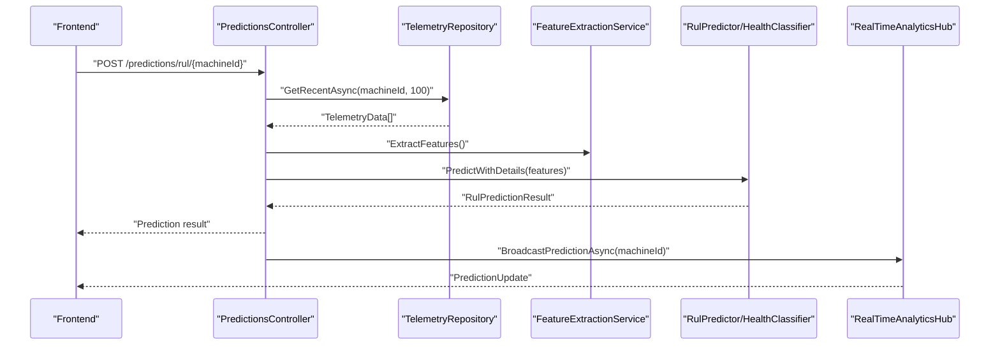
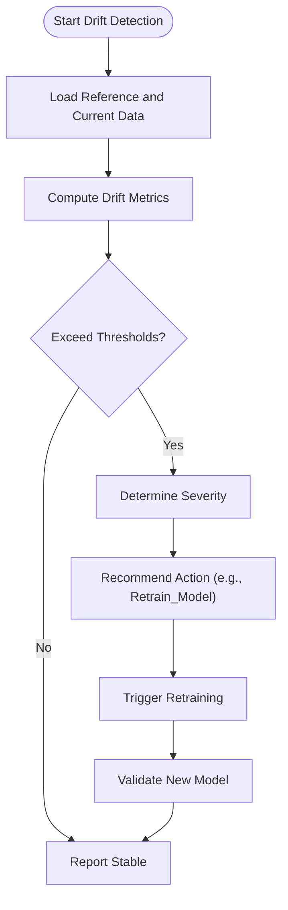
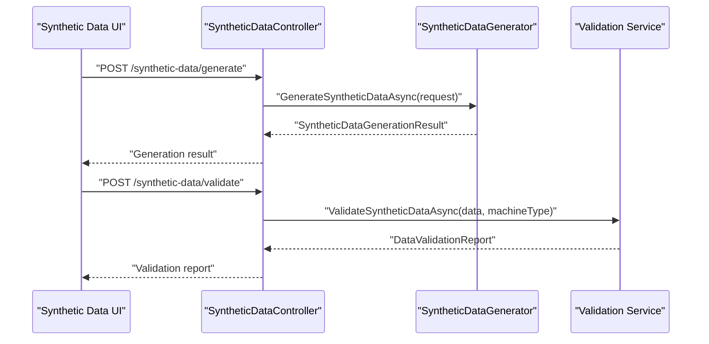
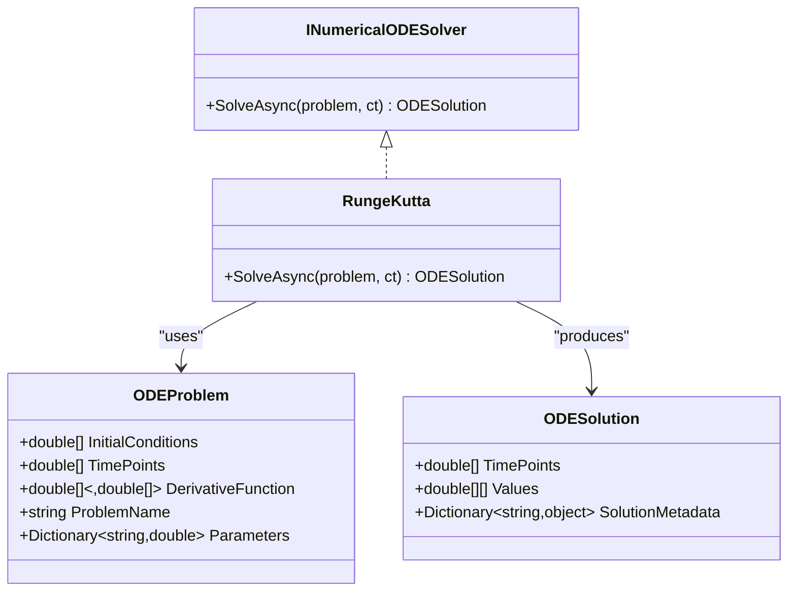
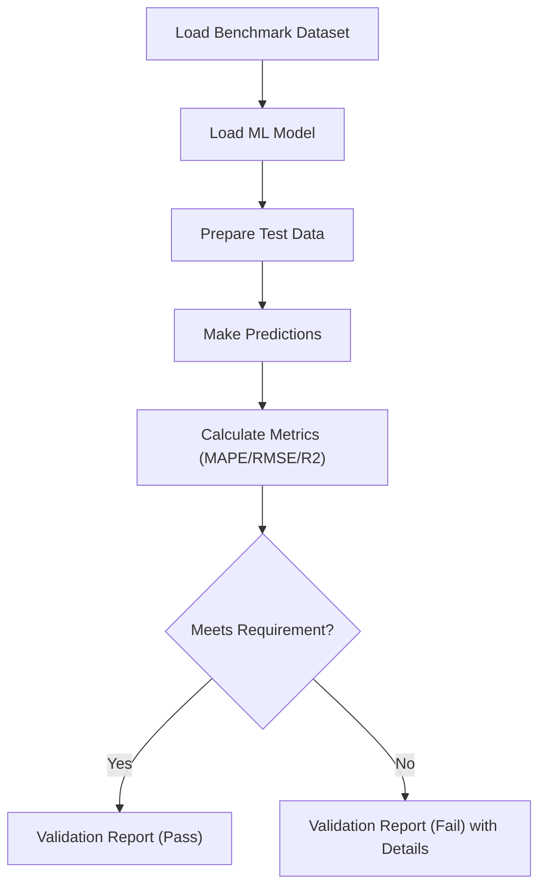
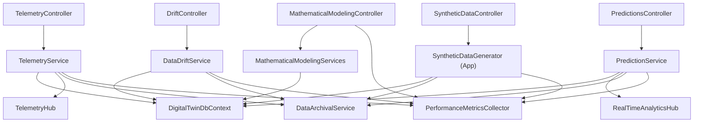

# Data Flow and Processing Patterns

<cite>
**Referenced Files in This Document**
- [TelemetryHub.cs](file://src/api/DigitalTwinPlatform.API/Hubs/TelemetryHub.cs)
- [RealTimeAnalyticsHub.cs](file://src/api/DigitalTwinPlatform.API/Hubs/RealTimeAnalyticsHub.cs)
- [TelemetryController.cs](file://src/api/DigitalTwinPlatform.API/Controllers/TelemetryController.cs)
- [PredictionsController.cs](file://src/api/DigitalTwinPlatform.API/Controllers/PredictionsController.cs)
- [DriftController.cs](file://src/api/DigitalTwinPlatform.API/Controllers/DriftController.cs)
- [SyntheticDataController.cs](file://src/api/DigitalTwinPlatform.API/Controllers/SyntheticDataController.cs)
- [MathematicalModelingController.cs](file://src/api/DigitalTwinPlatform.API/Controllers/MathematicalModelingController.cs)
- [DataArchivalController.cs](file://src/api/DigitalTwinPlatform.API/Controllers/DataArchivalController.cs)
- [DataArchivalService.cs](file://src/api/DigitalTwinPlatform.API/Services/Infrastructure/DataArchivalService.cs)
- [PerformanceMetricsCollector.cs](file://src/api/DigitalTwinPlatform.API/Services/Infrastructure/PerformanceMetricsCollector.cs)
- [DataDriftService.cs](file://src/api/DigitalTwinPlatform.API/Services/Analytics/DataDriftService.cs)
- [SyntheticDataGenerator.cs](file://src/api/DigitalTwinPlatform.API/Services/Simulation/SyntheticDataGenerator.cs)
- [SyntheticDataGenerator.cs](file://src/api/DigitalTwinPlatform.Application/Services/SyntheticDataGenerator.cs)
- [DigitalTwinDbContext.cs](file://src/api/DigitalTwinPlatform.Infrastructure/Persistence/DigitalTwinDbContext.cs)
- [20260212181606_InitialCreate.cs](file://src/api/DigitalTwinPlatform.Infrastructure/Migrations/20260212181606_InitialCreate.cs)
- [20260212181855_FixModel.cs](file://src/api/DigitalTwinPlatform.Infrastructure/Migrations/20260212181855_FixModel.cs)
- [signalr.ts](file://src/frontend/src/services/signalr.ts)
- [syntheticData.service.ts](file://src/ui/digital-twin-dashboard/src/services/syntheticData.service.ts)
- [mathematicalModeling.service.ts](file://src/ui/digital-twin-dashboard/src/services/mathematicalModeling.service.ts)
- [RungeKutta.cs](file://src/api/DigitalTwinPlatform.Application/Mathematics/RungeKutta.cs)
- [INumericalODESolver.cs](file://src/api/DigitalTwinPlatform.Application/Mathematics/INumericalODESolver.cs)
- [Types.cs](file://src/api/DigitalTwinPlatform.Application/Mathematics/Types.cs)
- [BenchmarkValidationService.cs](file://src/api/DigitalTwinPlatform.API/Services/Analytics/BenchmarkValidationService.cs)
- [IBenchmarkValidationService.cs](file://src/api/DigitalTwinPlatform.API/Services/Analytics/IBenchmarkValidationService.cs)
- [MLPipelineIntegrationTests.cs](file://src/api/DigitalTwinPlatform.Tests/Integration/MLPipelineIntegrationTests.cs)
</cite>

## Table of Contents
1. [Introduction](#introduction)
2. [Project Structure](#project-structure)
3. [Core Components](#core-components)
4. [Architecture Overview](#architecture-overview)
5. [Detailed Component Analysis](#detailed-component-analysis)
6. [Dependency Analysis](#dependency-analysis)
7. [Performance Considerations](#performance-considerations)
8. [Troubleshooting Guide](#troubleshooting-guide)
9. [Conclusion](#conclusion)

## Introduction
This document explains the end-to-end data flow and processing patterns across the Digital Twin Platform, focusing on five key pathways:
- Real-time telemetry ingestion and streaming
- Machine learning prediction pipeline
- Automated retraining through drift detection
- Synthetic data generation and validation
- Mathematical modeling workflows

It documents data transformation stages, PostgreSQL JSONB storage strategies, real-time processing with SignalR, integration between telemetry streaming, prediction services, and visualization components, plus data quality validation, statistical testing, and performance optimization techniques.

## Project Structure
The platform is organized into three primary layers:
- Backend API (controllers, hubs, services, repositories)
- Application services (analytics, ML, simulation, mathematical modeling)
- Infrastructure (database, migrations, persistence)

**Diagram sources**
- [TelemetryController.cs](file://src/api/DigitalTwinPlatform.API/Controllers/TelemetryController.cs#L1-L202)
- [PredictionsController.cs](file://src/api/DigitalTwinPlatform.API/Controllers/PredictionsController.cs#L1-L435)
- [DriftController.cs](file://src/api/DigitalTwinPlatform.API/Controllers/DriftController.cs#L1-L251)
- [SyntheticDataController.cs](file://src/api/DigitalTwinPlatform.API/Controllers/SyntheticDataController.cs#L1-L143)
- [MathematicalModelingController.cs](file://src/api/DigitalTwinPlatform.API/Controllers/MathematicalModelingController.cs#L1-L514)
- [TelemetryHub.cs](file://src/api/DigitalTwinPlatform.API/Hubs/TelemetryHub.cs#L1-L210)
- [RealTimeAnalyticsHub.cs](file://src/api/DigitalTwinPlatform.API/Hubs/RealTimeAnalyticsHub.cs#L1-L310)
- [DigitalTwinDbContext.cs](file://src/api/DigitalTwinPlatform.Infrastructure/Persistence/DigitalTwinDbContext.cs#L146-L178)
- [DataArchivalService.cs](file://src/api/DigitalTwinPlatform.API/Services/Infrastructure/DataArchivalService.cs#L135-L159)

**Section sources**
- [TelemetryController.cs](file://src/api/DigitalTwinPlatform.API/Controllers/TelemetryController.cs#L1-L202)
- [PredictionsController.cs](file://src/api/DigitalTwinPlatform.API/Controllers/PredictionsController.cs#L1-L435)
- [DriftController.cs](file://src/api/DigitalTwinPlatform.API/Controllers/DriftController.cs#L1-L251)
- [SyntheticDataController.cs](file://src/api/DigitalTwinPlatform.API/Controllers/SyntheticDataController.cs#L1-L143)
- [MathematicalModelingController.cs](file://src/api/DigitalTwinPlatform.API/Controllers/MathematicalModelingController.cs#L1-L514)
- [TelemetryHub.cs](file://src/api/DigitalTwinPlatform.API/Hubs/TelemetryHub.cs#L1-L210)
- [RealTimeAnalyticsHub.cs](file://src/api/DigitalTwinPlatform.API/Hubs/RealTimeAnalyticsHub.cs#L1-L310)
- [DigitalTwinDbContext.cs](file://src/api/DigitalTwinPlatform.Infrastructure/Persistence/DigitalTwinDbContext.cs#L146-L178)

## Core Components
- Real-time streaming: SignalR hubs for telemetry and analytics deliver live updates to clients.
- Telemetry ingestion: REST endpoints accept sensor data and persist it with JSONB storage.
- Predictive analytics: Feature extraction, model inference, and prediction broadcasting.
- Drift detection: Statistical tests monitor feature/prediction shifts and trigger retraining.
- Synthetic data: Generation with benchmark validation and downloadable artifacts.
- Mathematical modeling: ODE solving, system dynamics, and optimization services.
- Storage and archival: PostgreSQL JSONB for flexible telemetry, Parquet export for long-term analytics.
- Performance monitoring: In-memory metrics collection and statistics.

**Section sources**
- [TelemetryHub.cs](file://src/api/DigitalTwinPlatform.API/Hubs/TelemetryHub.cs#L1-L210)
- [RealTimeAnalyticsHub.cs](file://src/api/DigitalTwinPlatform.API/Hubs/RealTimeAnalyticsHub.cs#L1-L310)
- [TelemetryController.cs](file://src/api/DigitalTwinPlatform.API/Controllers/TelemetryController.cs#L1-L202)
- [PredictionsController.cs](file://src/api/DigitalTwinPlatform.API/Controllers/PredictionsController.cs#L1-L435)
- [DataDriftService.cs](file://src/api/DigitalTwinPlatform.API/Services/Analytics/DataDriftService.cs#L128-L525)
- [SyntheticDataGenerator.cs](file://src/api/DigitalTwinPlatform.API/Services/Simulation/SyntheticDataGenerator.cs#L123-L414)
- [MathematicalModelingController.cs](file://src/api/DigitalTwinPlatform.API/Controllers/MathematicalModelingController.cs#L1-L514)
- [DigitalTwinDbContext.cs](file://src/api/DigitalTwinPlatform.Infrastructure/Persistence/DigitalTwinDbContext.cs#L146-L178)
- [DataArchivalService.cs](file://src/api/DigitalTwinPlatform.API/Services/Infrastructure/DataArchivalService.cs#L135-L159)
- [PerformanceMetricsCollector.cs](file://src/api/DigitalTwinPlatform.API/Services/Infrastructure/PerformanceMetricsCollector.cs#L1-L131)

## Architecture Overview
The system integrates REST APIs, SignalR hubs, and application services around a PostgreSQL-backed domain model. Telemetry flows from ingestion to storage and real-time streaming, while predictions and alerts are broadcast to subscribed clients. Drift detection continuously monitors model performance and initiates retraining when thresholds are exceeded. Synthetic data generation validates fidelity against benchmarks, and mathematical modeling supports system dynamics and optimization.

**Diagram sources**
- [TelemetryHub.cs](file://src/api/DigitalTwinPlatform.API/Hubs/TelemetryHub.cs#L1-L210)
- [TelemetryController.cs](file://src/api/DigitalTwinPlatform.API/Controllers/TelemetryController.cs#L1-L202)
- [DigitalTwinDbContext.cs](file://src/api/DigitalTwinPlatform.Infrastructure/Persistence/DigitalTwinDbContext.cs#L146-L178)

**Section sources**
- [TelemetryHub.cs](file://src/api/DigitalTwinPlatform.API/Hubs/TelemetryHub.cs#L1-L210)
- [TelemetryController.cs](file://src/api/DigitalTwinPlatform.API/Controllers/TelemetryController.cs#L1-L202)
- [DigitalTwinDbContext.cs](file://src/api/DigitalTwinPlatform.Infrastructure/Persistence/DigitalTwinDbContext.cs#L146-L178)

## Detailed Component Analysis

### Real-time Telemetry Ingestion and Streaming
- Ingestion: REST endpoint accepts telemetry payloads and delegates to application services for processing.
- Storage: TelemetryData stored as JSONB for flexible schema evolution.
- Streaming: SignalR hub manages subscriptions and broadcasts updates to clients.
- Frontend integration: SignalR client connects with automatic reconnection and token-based authentication.

**Diagram sources**
- [TelemetryHub.cs](file://src/api/DigitalTwinPlatform.API/Hubs/TelemetryHub.cs#L1-L210)
- [TelemetryController.cs](file://src/api/DigitalTwinPlatform.API/Controllers/TelemetryController.cs#L1-L202)
- [DigitalTwinDbContext.cs](file://src/api/DigitalTwinPlatform.Infrastructure/Persistence/DigitalTwinDbContext.cs#L146-L178)

**Section sources**
- [TelemetryController.cs](file://src/api/DigitalTwinPlatform.API/Controllers/TelemetryController.cs#L1-L202)
- [TelemetryHub.cs](file://src/api/DigitalTwinPlatform.API/Hubs/TelemetryHub.cs#L1-L210)
- [signalr.ts](file://src/frontend/src/services/signalr.ts#L45-L79)
- [DigitalTwinDbContext.cs](file://src/api/DigitalTwinPlatform.Infrastructure/Persistence/DigitalTwinDbContext.cs#L146-L178)

### Machine Learning Prediction Pipeline
- Endpoint orchestration: PredictionsController coordinates feature extraction, model inference, and result delivery.
- Data requirements: Minimum telemetry samples enforced before prediction.
- Real-time broadcasting: PredictionsController triggers RealTimeAnalyticsHub to push updates to subscribers.
- Historical access: Prediction history and search endpoints support audit and downstream analytics.

**Diagram sources**
- [PredictionsController.cs](file://src/api/DigitalTwinPlatform.API/Controllers/PredictionsController.cs#L1-L435)
- [RealTimeAnalyticsHub.cs](file://src/api/DigitalTwinPlatform.API/Hubs/RealTimeAnalyticsHub.cs#L1-L310)

**Section sources**
- [PredictionsController.cs](file://src/api/DigitalTwinPlatform.API/Controllers/PredictionsController.cs#L1-L435)
- [RealTimeAnalyticsHub.cs](file://src/api/DigitalTwinPlatform.API/Hubs/RealTimeAnalyticsHub.cs#L1-L310)

### Automated Retraining Through Drift Detection
- Drift detection: Statistical tests (e.g., Kolmogorov-Smirnov, Wasserstein, PSI) compare reference vs. current distributions.
- Threshold configuration: Adjustable thresholds per model and detection method.
- Action recommendation: Severity-based recommendations (e.g., Retrain_Model) guide automated retraining.
- Integration tests: End-to-end validation demonstrates drift detection and subsequent model retraining.

**Diagram sources**
- [DataDriftService.cs](file://src/api/DigitalTwinPlatform.API/Services/Analytics/DataDriftService.cs#L128-L525)
- [DriftController.cs](file://src/api/DigitalTwinPlatform.API/Controllers/DriftController.cs#L1-L251)
- [MLPipelineIntegrationTests.cs](file://src/api/DigitalTwinPlatform.Tests/Integration/MLPipelineIntegrationTests.cs#L428-L493)

**Section sources**
- [DataDriftService.cs](file://src/api/DigitalTwinPlatform.API/Services/Analytics/DataDriftService.cs#L128-L525)
- [DriftController.cs](file://src/api/DigitalTwinPlatform.API/Controllers/DriftController.cs#L1-L251)
- [MLPipelineIntegrationTests.cs](file://src/api/DigitalTwinPlatform.Tests/Integration/MLPipelineIntegrationTests.cs#L428-L493)

### Synthetic Data Generation and Validation
- Generation: Produces high-fidelity trajectories with configurable parameters and time ranges.
- Validation: Compares synthetic statistics against benchmark datasets using statistical tests and correlation metrics.
- Frontend integration: UI components generate and validate data, then offer downloads and reporting.
- Quality assurance: Validation reports include overall scores, passed/failed tests, and recommendations.

**Diagram sources**
- [SyntheticDataController.cs](file://src/api/DigitalTwinPlatform.API/Controllers/SyntheticDataController.cs#L1-L143)
- [SyntheticDataGenerator.cs](file://src/api/DigitalTwinPlatform.API/Services/Simulation/SyntheticDataGenerator.cs#L123-L414)
- [SyntheticDataGenerator.cs](file://src/api/DigitalTwinPlatform.Application/Services/SyntheticDataGenerator.cs#L378-L437)
- [syntheticData.service.ts](file://src/ui/digital-twin-dashboard/src/services/syntheticData.service.ts#L58-L115)

**Section sources**
- [SyntheticDataController.cs](file://src/api/DigitalTwinPlatform.API/Controllers/SyntheticDataController.cs#L1-L143)
- [SyntheticDataGenerator.cs](file://src/api/DigitalTwinPlatform.API/Services/Simulation/SyntheticDataGenerator.cs#L123-L414)
- [SyntheticDataGenerator.cs](file://src/api/DigitalTwinPlatform.Application/Services/SyntheticDataGenerator.cs#L378-L437)
- [syntheticData.service.ts](file://src/ui/digital-twin-dashboard/src/services/syntheticData.service.ts#L58-L115)

### Mathematical Modeling Workflows
- ODE solving: Numerical solvers (e.g., Runge-Kutta) integrate systems of differential equations.
- System dynamics: Supports derived quantities, stability analysis, and energy balance calculations.
- Optimization: Gradient-based and genetic algorithm approaches for parameter estimation and multi-objective problems.
- Frontend integration: Dedicated services expose endpoints for ODE solving, system dynamics, and optimization.

**Diagram sources**
- [INumericalODESolver.cs](file://src/api/DigitalTwinPlatform.Application/Mathematics/INumericalODESolver.cs#L1-L15)
- [RungeKutta.cs](file://src/api/DigitalTwinPlatform.Application/Mathematics/RungeKutta.cs#L1-L39)
- [Types.cs](file://src/api/DigitalTwinPlatform.Application/Mathematics/Types.cs#L1-L48)

**Section sources**
- [MathematicalModelingController.cs](file://src/api/DigitalTwinPlatform.API/Controllers/MathematicalModelingController.cs#L1-L514)
- [RungeKutta.cs](file://src/api/DigitalTwinPlatform.Application/Mathematics/RungeKutta.cs#L1-L39)
- [INumericalODESolver.cs](file://src/api/DigitalTwinPlatform.Application/Mathematics/INumericalODESolver.cs#L1-L15)
- [Types.cs](file://src/api/DigitalTwinPlatform.Application/Mathematics/Types.cs#L1-L48)
- [mathematicalModeling.service.ts](file://src/ui/digital-twin-dashboard/src/services/mathematicalModeling.service.ts#L57-L150)

### Data Quality Validation and Benchmark Comparison
- Benchmark validation: Loads benchmark datasets, evaluates ML models with MAPE, RMSE, R2, and detailed metrics.
- Statistical tests: KS-test and autocorrelation checks for synthetic data quality.
- Frontend reporting: Displays validation outcomes and recommendations.

**Diagram sources**
- [BenchmarkValidationService.cs](file://src/api/DigitalTwinPlatform.API/Services/Analytics/BenchmarkValidationService.cs#L1-L223)
- [IBenchmarkValidationService.cs](file://src/api/DigitalTwinPlatform.API/Services/Analytics/IBenchmarkValidationService.cs#L1-L57)

**Section sources**
- [BenchmarkValidationService.cs](file://src/api/DigitalTwinPlatform.API/Services/Analytics/BenchmarkValidationService.cs#L1-L223)
- [IBenchmarkValidationService.cs](file://src/api/DigitalTwinPlatform.API/Services/Analytics/IBenchmarkValidationService.cs#L1-L57)

## Dependency Analysis
The following diagram highlights key dependencies among components involved in data flow and processing.

**Diagram sources**
- [TelemetryController.cs](file://src/api/DigitalTwinPlatform.API/Controllers/TelemetryController.cs#L1-L202)
- [PredictionsController.cs](file://src/api/DigitalTwinPlatform.API/Controllers/PredictionsController.cs#L1-L435)
- [DriftController.cs](file://src/api/DigitalTwinPlatform.API/Controllers/DriftController.cs#L1-L251)
- [SyntheticDataController.cs](file://src/api/DigitalTwinPlatform.API/Controllers/SyntheticDataController.cs#L1-L143)
- [MathematicalModelingController.cs](file://src/api/DigitalTwinPlatform.API/Controllers/MathematicalModelingController.cs#L1-L514)
- [TelemetryHub.cs](file://src/api/DigitalTwinPlatform.API/Hubs/TelemetryHub.cs#L1-L210)
- [RealTimeAnalyticsHub.cs](file://src/api/DigitalTwinPlatform.API/Hubs/RealTimeAnalyticsHub.cs#L1-L310)
- [DigitalTwinDbContext.cs](file://src/api/DigitalTwinPlatform.Infrastructure/Persistence/DigitalTwinDbContext.cs#L146-L178)
- [DataArchivalService.cs](file://src/api/DigitalTwinPlatform.API/Services/Infrastructure/DataArchivalService.cs#L135-L159)
- [PerformanceMetricsCollector.cs](file://src/api/DigitalTwinPlatform.API/Services/Infrastructure/PerformanceMetricsCollector.cs#L1-L131)

**Section sources**
- [TelemetryController.cs](file://src/api/DigitalTwinPlatform.API/Controllers/TelemetryController.cs#L1-L202)
- [PredictionsController.cs](file://src/api/DigitalTwinPlatform.API/Controllers/PredictionsController.cs#L1-L435)
- [DriftController.cs](file://src/api/DigitalTwinPlatform.API/Controllers/DriftController.cs#L1-L251)
- [SyntheticDataController.cs](file://src/api/DigitalTwinPlatform.API/Controllers/SyntheticDataController.cs#L1-L143)
- [MathematicalModelingController.cs](file://src/api/DigitalTwinPlatform.API/Controllers/MathematicalModelingController.cs#L1-L514)
- [TelemetryHub.cs](file://src/api/DigitalTwinPlatform.API/Hubs/TelemetryHub.cs#L1-L210)
- [RealTimeAnalyticsHub.cs](file://src/api/DigitalTwinPlatform.API/Hubs/RealTimeAnalyticsHub.cs#L1-L310)
- [DigitalTwinDbContext.cs](file://src/api/DigitalTwinPlatform.Infrastructure/Persistence/DigitalTwinDbContext.cs#L146-L178)
- [DataArchivalService.cs](file://src/api/DigitalTwinPlatform.API/Services/Infrastructure/DataArchivalService.cs#L135-L159)
- [PerformanceMetricsCollector.cs](file://src/api/DigitalTwinPlatform.API/Services/Infrastructure/PerformanceMetricsCollector.cs#L1-L131)

## Performance Considerations
- Real-time streaming: SignalR hubs maintain subscription groups and broadcast updates efficiently; clients auto-reconnect with exponential backoff.
- In-memory metrics: PerformanceMetricsCollector queues recent metrics and caches per-operation lists with sliding expiration for low-latency retrieval.
- Data archival: Parquet export with Snappy compression reduces storage footprint and accelerates analytics queries.
- Database indexing: Strategic indexes on frequently queried fields improve telemetry retrieval and filtering performance.
- Frontend caching: UI services leverage local state and reactive stores to minimize redundant network calls.

[No sources needed since this section provides general guidance]

## Troubleshooting Guide
- SignalR connectivity: Verify token injection and automatic reconnection settings in the SignalR client. Check hub logs for connection/disconnection events.
- Drift detection failures: Confirm data arrays are non-empty and thresholds are within valid ranges. Review drift history and recommended actions.
- Synthetic data validation: Ensure non-empty synthetic datasets and valid benchmark identifiers. Inspect validation report warnings and recommendations.
- Mathematical modeling errors: Validate ODE expressions and parameter bounds. Confirm solver availability and convergence criteria.
- Performance issues: Use performance metrics collector to identify operations exceeding latency thresholds and investigate bottlenecks.

**Section sources**
- [signalr.ts](file://src/frontend/src/services/signalr.ts#L45-L79)
- [DriftController.cs](file://src/api/DigitalTwinPlatform.API/Controllers/DriftController.cs#L1-L251)
- [SyntheticDataController.cs](file://src/api/DigitalTwinPlatform.API/Controllers/SyntheticDataController.cs#L1-L143)
- [MathematicalModelingController.cs](file://src/api/DigitalTwinPlatform.API/Controllers/MathematicalModelingController.cs#L1-L514)
- [PerformanceMetricsCollector.cs](file://src/api/DigitalTwinPlatform.API/Services/Infrastructure/PerformanceMetricsCollector.cs#L1-L131)

## Conclusion
The Digital Twin Platform implements robust, real-time data flows spanning ingestion, analytics, drift monitoring, synthetic validation, and mathematical modeling. PostgreSQL JSONB enables flexible schema evolution, while SignalR ensures responsive visualization and alerts. Automated drift detection and retraining keep models aligned with operational conditions, and synthetic data generation supports testing and training with validated quality. Performance monitoring and archival strategies sustain scalability and long-term insights.