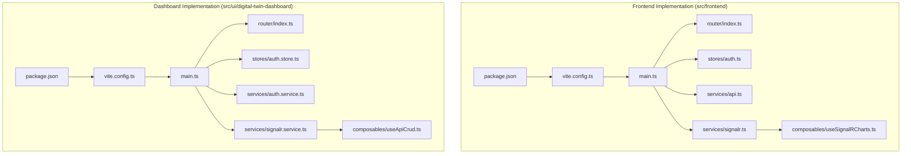
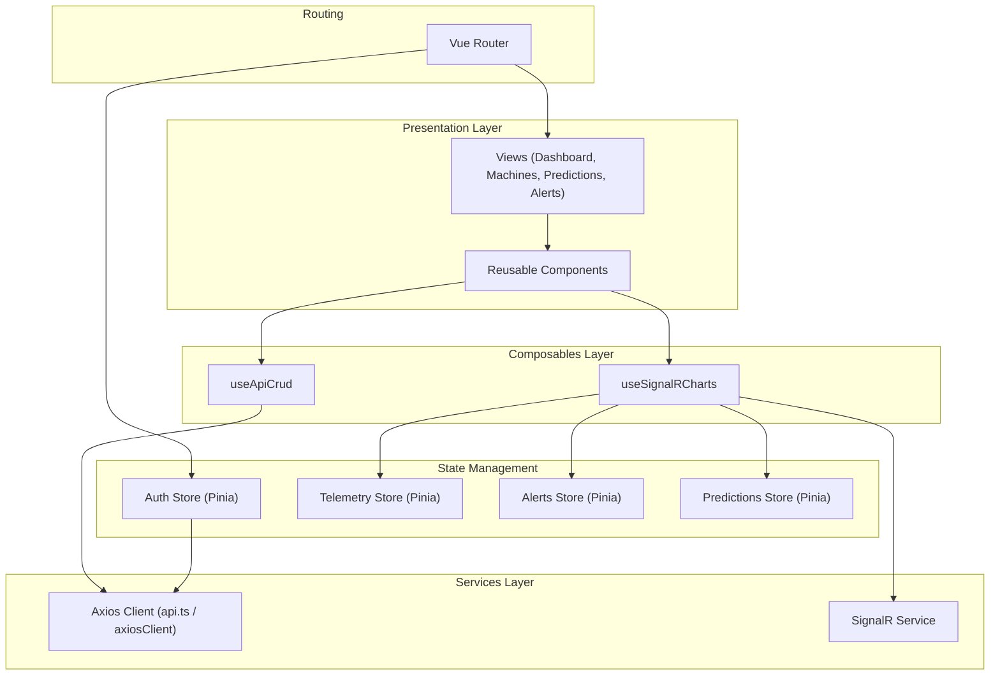
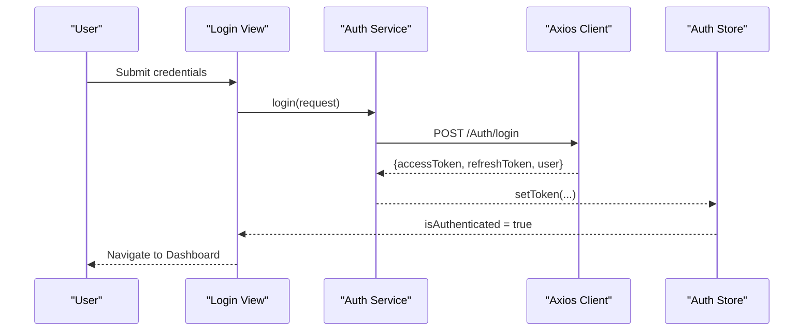
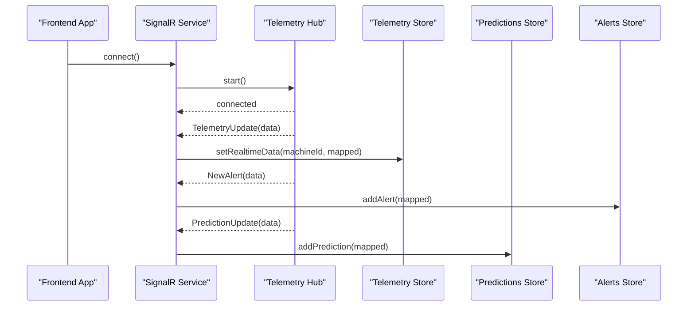
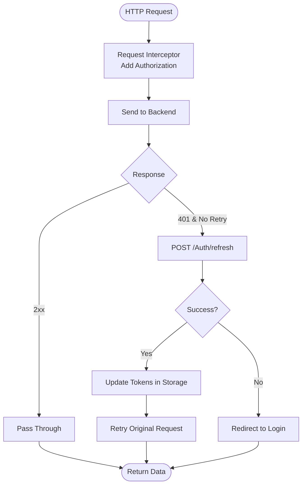
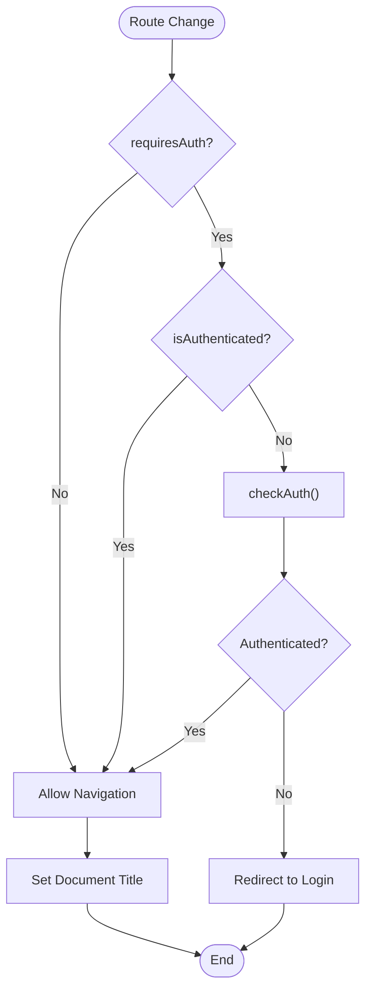
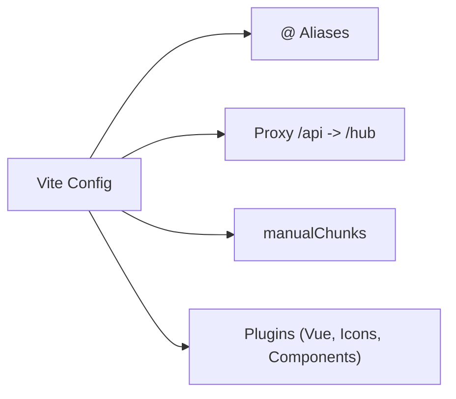
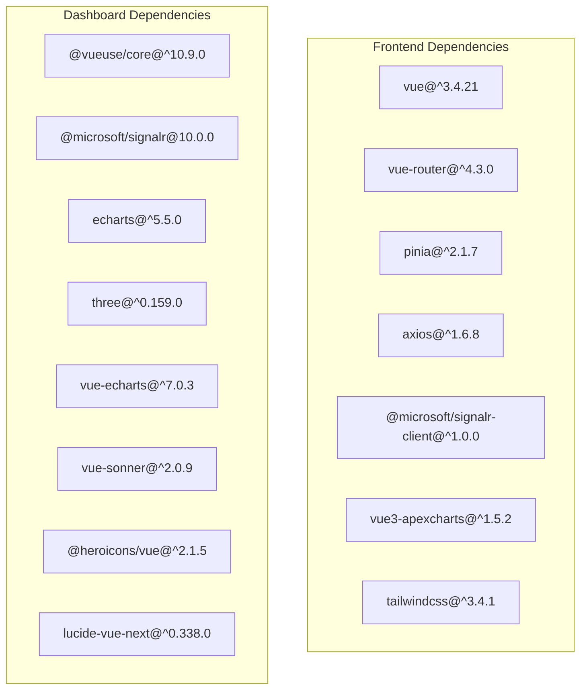

# Frontend Application Architecture

<cite>
**Referenced Files in This Document**
- [package.json](file://src/frontend/package.json)
- [vite.config.ts](file://src/frontend/vite.config.ts)
- [main.ts](file://src/frontend/src/main.ts)
- [router/index.ts](file://src/frontend/src/router/index.ts)
- [stores/auth.ts](file://src/frontend/src/stores/auth.ts)
- [services/api.ts](file://src/frontend/src/services/api.ts)
- [services/signalr.ts](file://src/frontend/src/services/signalr.ts)
- [composables/useSignalRCharts.ts](file://src/frontend/src/composables/useSignalRCharts.ts)
- [package.json](file://src/ui/digital-twin-dashboard/package.json)
- [vite.config.ts](file://src/ui/digital-twin-dashboard/vite.config.ts)
- [main.ts](file://src/ui/digital-twin-dashboard/src/main.ts)
- [router/index.ts](file://src/ui/digital-twin-dashboard/src/router/index.ts)
- [stores/auth.store.ts](file://src/ui/digital-twin-dashboard/src/stores/auth.store.ts)
- [services/auth.service.ts](file://src/ui/digital-twin-dashboard/src/services/auth.service.ts)
- [services/signalr.service.ts](file://src/ui/digital-twin-dashboard/src/services/signalr.service.ts)
- [composables/useApiCrud.ts](file://src/ui/digital-twin-dashboard/src/composables/useApiCrud.ts)
</cite>

## Table of Contents
1. [Introduction](#introduction)
2. [Project Structure](#project-structure)
3. [Core Components](#core-components)
4. [Architecture Overview](#architecture-overview)
5. [Detailed Component Analysis](#detailed-component-analysis)
6. [Dependency Analysis](#dependency-analysis)
7. [Performance Considerations](#performance-considerations)
8. [Troubleshooting Guide](#troubleshooting-guide)
9. [Conclusion](#conclusion)

## Introduction
This document describes the frontend application architecture for the Digital Twin Platform, focusing on two Vue.js implementations. It covers component-based architecture, state management with Pinia, routing configuration, real-time visualization with SignalR, API service layer, reusable component libraries, build system configuration, TypeScript integration, and styling with TailwindCSS. It also addresses performance optimization, accessibility, and cross-browser compatibility strategies.

## Project Structure
The repository contains two distinct frontend implementations:
- Minimal Vue 3 application under src/frontend with a focused set of features and a simple component hierarchy.
- Rich Vue 3 application under src/ui/digital-twin-dashboard with a comprehensive feature set, extensive reusable components, and advanced integrations.

Both applications share common patterns:
- Vue 3 with Composition API
- Pinia for state management
- Vue Router for navigation
- Vite as the build tool
- TypeScript for type safety
- TailwindCSS for styling
- SignalR for real-time updates

**Diagram sources**
- [package.json](file://src/frontend/package.json#L1-L44)
- [vite.config.ts](file://src/frontend/vite.config.ts#L1-L48)
- [main.ts](file://src/frontend/src/main.ts#L1-L35)
- [router/index.ts](file://src/frontend/src/router/index.ts#L1-L112)
- [stores/auth.ts](file://src/frontend/src/stores/auth.ts#L1-L508)
- [services/api.ts](file://src/frontend/src/services/api.ts#L1-L96)
- [services/signalr.ts](file://src/frontend/src/services/signalr.ts#L1-L271)
- [composables/useSignalRCharts.ts](file://src/frontend/src/composables/useSignalRCharts.ts#L1-L352)
- [package.json](file://src/ui/digital-twin-dashboard/package.json#L1-L87)
- [vite.config.ts](file://src/ui/digital-twin-dashboard/vite.config.ts#L1-L62)
- [main.ts](file://src/ui/digital-twin-dashboard/src/main.ts#L1-L17)
- [router/index.ts](file://src/ui/digital-twin-dashboard/src/router/index.ts#L1-L339)
- [stores/auth.store.ts](file://src/ui/digital-twin-dashboard/src/stores/auth.store.ts#L1-L136)
- [services/auth.service.ts](file://src/ui/digital-twin-dashboard/src/services/auth.service.ts#L1-L204)
- [services/signalr.service.ts](file://src/ui/digital-twin-dashboard/src/services/signalr.service.ts#L1-L62)
- [composables/useApiCrud.ts](file://src/ui/digital-twin-dashboard/src/composables/useApiCrud.ts#L1-L154)

**Section sources**
- [package.json](file://src/frontend/package.json#L1-L44)
- [vite.config.ts](file://src/frontend/vite.config.ts#L1-L48)
- [main.ts](file://src/frontend/src/main.ts#L1-L35)
- [router/index.ts](file://src/frontend/src/router/index.ts#L1-L112)
- [stores/auth.ts](file://src/frontend/src/stores/auth.ts#L1-L508)
- [services/api.ts](file://src/frontend/src/services/api.ts#L1-L96)
- [services/signalr.ts](file://src/frontend/src/services/signalr.ts#L1-L271)
- [composables/useSignalRCharts.ts](file://src/frontend/src/composables/useSignalRCharts.ts#L1-L352)
- [package.json](file://src/ui/digital-twin-dashboard/package.json#L1-L87)
- [vite.config.ts](file://src/ui/digital-twin-dashboard/vite.config.ts#L1-L62)
- [main.ts](file://src/ui/digital-twin-dashboard/src/main.ts#L1-L17)
- [router/index.ts](file://src/ui/digital-twin-dashboard/src/router/index.ts#L1-L339)
- [stores/auth.store.ts](file://src/ui/digital-twin-dashboard/src/stores/auth.store.ts#L1-L136)
- [services/auth.service.ts](file://src/ui/digital-twin-dashboard/src/services/auth.service.ts#L1-L204)
- [services/signalr.service.ts](file://src/ui/digital-twin-dashboard/src/services/signalr.service.ts#L1-L62)
- [composables/useApiCrud.ts](file://src/ui/digital-twin-dashboard/src/composables/useApiCrud.ts#L1-L154)

## Core Components
- Component-based architecture: Both applications use Vue 3 Single File Components organized by feature areas (views, components, services, stores, composables).
- State management with Pinia: Stores encapsulate domain-specific state and actions, with persistence and lifecycle management.
- Routing configuration: Both apps define route records with meta fields for authentication and titles, and global navigation guards.
- Real-time visualization: SignalR integration streams telemetry, alerts, and predictions to reactive stores and composables.
- API service layer: Centralized Axios clients with interceptors for authentication and token refresh.
- Reusable component library: Shared components and composables promote consistency and reduce duplication.
- Build system: Vite configuration with aliases, chunk splitting, and plugin ecosystems for Vue, TypeScript, and icons.
- Styling: TailwindCSS for utility-first styling with PostCSS and autoprefixing.

**Section sources**
- [main.ts](file://src/frontend/src/main.ts#L1-L35)
- [router/index.ts](file://src/frontend/src/router/index.ts#L1-L112)
- [stores/auth.ts](file://src/frontend/src/stores/auth.ts#L1-L508)
- [services/api.ts](file://src/frontend/src/services/api.ts#L1-L96)
- [services/signalr.ts](file://src/frontend/src/services/signalr.ts#L1-L271)
- [composables/useSignalRCharts.ts](file://src/frontend/src/composables/useSignalRCharts.ts#L1-L352)
- [main.ts](file://src/ui/digital-twin-dashboard/src/main.ts#L1-L17)
- [router/index.ts](file://src/ui/digital-twin-dashboard/src/router/index.ts#L1-L339)
- [stores/auth.store.ts](file://src/ui/digital-twin-dashboard/src/stores/auth.store.ts#L1-L136)
- [services/auth.service.ts](file://src/ui/digital-twin-dashboard/src/services/auth.service.ts#L1-L204)
- [services/signalr.service.ts](file://src/ui/digital-twin-dashboard/src/services/signalr.service.ts#L1-L62)
- [composables/useApiCrud.ts](file://src/ui/digital-twin-dashboard/src/composables/useApiCrud.ts#L1-L154)

## Architecture Overview
The frontend architecture follows a layered pattern:
- Presentation Layer: Vue components and views
- Composables Layer: Reusable logic for SignalR, API, and UI concerns
- Services Layer: Axios-based API clients and SignalR hubs
- State Management: Pinia stores for domain state
- Routing: Vue Router with navigation guards and meta-driven configuration

**Diagram sources**
- [router/index.ts](file://src/frontend/src/router/index.ts#L1-L112)
- [stores/auth.ts](file://src/frontend/src/stores/auth.ts#L1-L508)
- [services/api.ts](file://src/frontend/src/services/api.ts#L1-L96)
- [services/signalr.ts](file://src/frontend/src/services/signalr.ts#L1-L271)
- [composables/useSignalRCharts.ts](file://src/frontend/src/composables/useSignalRCharts.ts#L1-L352)
- [router/index.ts](file://src/ui/digital-twin-dashboard/src/router/index.ts#L1-L339)
- [stores/auth.store.ts](file://src/ui/digital-twin-dashboard/src/stores/auth.store.ts#L1-L136)
- [services/auth.service.ts](file://src/ui/digital-twin-dashboard/src/services/auth.service.ts#L1-L204)
- [services/signalr.service.ts](file://src/ui/digital-twin-dashboard/src/services/signalr.service.ts#L1-L62)
- [composables/useApiCrud.ts](file://src/ui/digital-twin-dashboard/src/composables/useApiCrud.ts#L1-L154)

## Detailed Component Analysis

### Authentication and Session Management
Both implementations provide robust authentication flows:
- Frontend app: Centralized auth store with token persistence, session monitoring, and automatic refresh.
- Dashboard app: Secure token manager using sessionStorage and role-based access checks.

**Diagram sources**
- [stores/auth.ts](file://src/frontend/src/stores/auth.ts#L105-L153)
- [services/api.ts](file://src/frontend/src/services/api.ts#L74-L93)
- [stores/auth.store.ts](file://src/ui/digital-twin-dashboard/src/stores/auth.store.ts#L74-L97)
- [services/auth.service.ts](file://src/ui/digital-twin-dashboard/src/services/auth.service.ts#L98-L101)

**Section sources**
- [stores/auth.ts](file://src/frontend/src/stores/auth.ts#L1-L508)
- [services/api.ts](file://src/frontend/src/services/api.ts#L1-L96)
- [stores/auth.store.ts](file://src/ui/digital-twin-dashboard/src/stores/auth.store.ts#L1-L136)
- [services/auth.service.ts](file://src/ui/digital-twin-dashboard/src/services/auth.service.ts#L1-L204)

### Real-Time Visualization with SignalR
The SignalR integration provides live telemetry, alerts, and predictions:
- Connection lifecycle with automatic reconnection and error handling
- Event handlers mapping backend payloads to frontend models
- Composable for buffering and batching updates to maintain performance

**Diagram sources**
- [services/signalr.ts](file://src/frontend/src/services/signalr.ts#L55-L110)
- [services/signalr.ts](file://src/frontend/src/services/signalr.ts#L148-L204)
- [composables/useSignalRCharts.ts](file://src/frontend/src/composables/useSignalRCharts.ts#L136-L164)

**Section sources**
- [services/signalr.ts](file://src/frontend/src/services/signalr.ts#L1-L271)
- [composables/useSignalRCharts.ts](file://src/frontend/src/composables/useSignalRCharts.ts#L1-L352)

### API Service Layer
The API layer abstracts HTTP communication:
- Axios client with base URL and timeout configuration
- Request interceptor adding Authorization headers
- Response interceptor handling 401 and token refresh
- Typed service functions for each domain endpoint

**Diagram sources**
- [services/api.ts](file://src/frontend/src/services/api.ts#L15-L71)

**Section sources**
- [services/api.ts](file://src/frontend/src/services/api.ts#L1-L96)

### Routing Configuration
Both applications implement route-based navigation with authentication guards:
- Meta fields define requiresAuth and titles
- beforeEach guard checks authentication state and redirects accordingly
- Dynamic imports prevent circular dependencies

**Diagram sources**
- [router/index.ts](file://src/frontend/src/router/index.ts#L85-L109)
- [router/index.ts](file://src/ui/digital-twin-dashboard/src/router/index.ts#L297-L337)

**Section sources**
- [router/index.ts](file://src/frontend/src/router/index.ts#L1-L112)
- [router/index.ts](file://src/ui/digital-twin-dashboard/src/router/index.ts#L1-L339)

### Build System and Tooling
Build configurations differ slightly between implementations:
- Aliases for cleaner imports (@, @components, @services, @stores, @types, @utils, @views)
- Proxy configuration for API and SignalR WebSocket traffic
- Chunk splitting for vendor, charts, and utilities
- Dashboard app includes icon and component auto-registration plugins

**Diagram sources**
- [vite.config.ts](file://src/frontend/vite.config.ts#L5-L47)
- [vite.config.ts](file://src/ui/digital-twin-dashboard/vite.config.ts#L8-L24)

**Section sources**
- [vite.config.ts](file://src/frontend/vite.config.ts#L1-L48)
- [vite.config.ts](file://src/ui/digital-twin-dashboard/vite.config.ts#L1-L62)

### TypeScript Integration and Styling
- TypeScript is configured across both projects with appropriate tsconfig files and Vue-specific setups.
- TailwindCSS is integrated with PostCSS and autoprefixer for modern CSS processing.
- The dashboard app leverages additional tooling for testing and linting.

**Section sources**
- [package.json](file://src/frontend/package.json#L29-L40)
- [package.json](file://src/ui/digital-twin-dashboard/package.json#L41-L84)

## Dependency Analysis
The applications demonstrate clear separation of concerns with minimal coupling:
- Frontend app: lean dependencies (Vue, Router, Pinia, ApexCharts, SignalR, TailwindCSS)
- Dashboard app: richer ecosystem (Heroicons, Lucide, ECharts, Three.js, Vue Sonner)

**Diagram sources**
- [package.json](file://src/frontend/package.json#L14-L28)
- [package.json](file://src/ui/digital-twin-dashboard/package.json#L24-L40)

**Section sources**
- [package.json](file://src/frontend/package.json#L1-L44)
- [package.json](file://src/ui/digital-twin-dashboard/package.json#L1-L87)

## Performance Considerations
- SignalR buffering: The composable buffers updates and processes in batches to limit DOM updates and maintain smooth chart rendering.
- Chunk splitting: Vite manualChunks separate vendor libraries, charting libraries, and utilities to optimize caching and initial load.
- Lazy loading: Route components are dynamically imported to reduce initial bundle size.
- Reactive stores: Efficient updates through Pinia stores minimize unnecessary re-renders.
- Icon and component auto-registration: Reduces manual imports and improves tree-shaking.

**Section sources**
- [composables/useSignalRCharts.ts](file://src/frontend/src/composables/useSignalRCharts.ts#L12-L17)
- [vite.config.ts](file://src/frontend/vite.config.ts#L34-L46)
- [router/index.ts](file://src/frontend/src/router/index.ts#L10-L72)

## Troubleshooting Guide
Common issues and resolutions:
- Authentication failures: Verify token storage and refresh logic; ensure interceptors are applied.
- SignalR connection errors: Check proxy configuration for WebSocket traffic and CORS settings on the backend.
- Navigation guard loops: Confirm auth store initialization and router guard conditions.
- Build errors: Validate Vite aliases and ensure TypeScript types match runtime behavior.

**Section sources**
- [services/api.ts](file://src/frontend/src/services/api.ts#L35-L71)
- [services/signalr.ts](file://src/frontend/src/services/signalr.ts#L62-L110)
- [router/index.ts](file://src/frontend/src/router/index.ts#L85-L109)

## Conclusion
The frontend architecture combines a pragmatic minimal implementation with a feature-rich dashboard, unified by strong patterns in component composition, state management, routing, and real-time data streaming. The SignalR integration, centralized API layer, and reusable composables provide a solid foundation for scalable enhancements while maintaining performance and developer productivity.