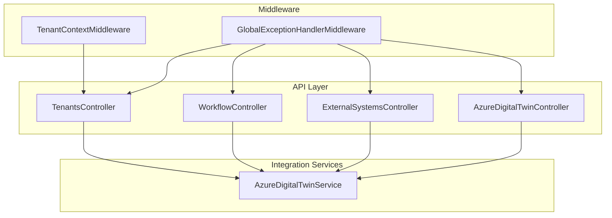
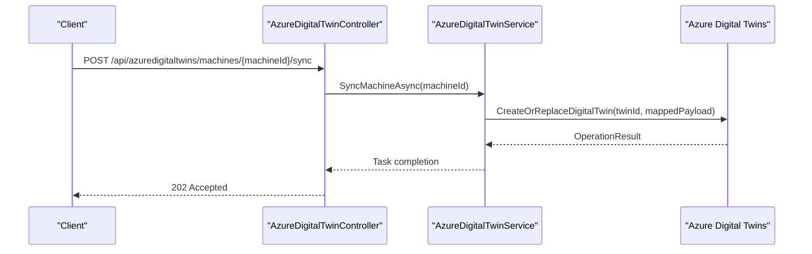
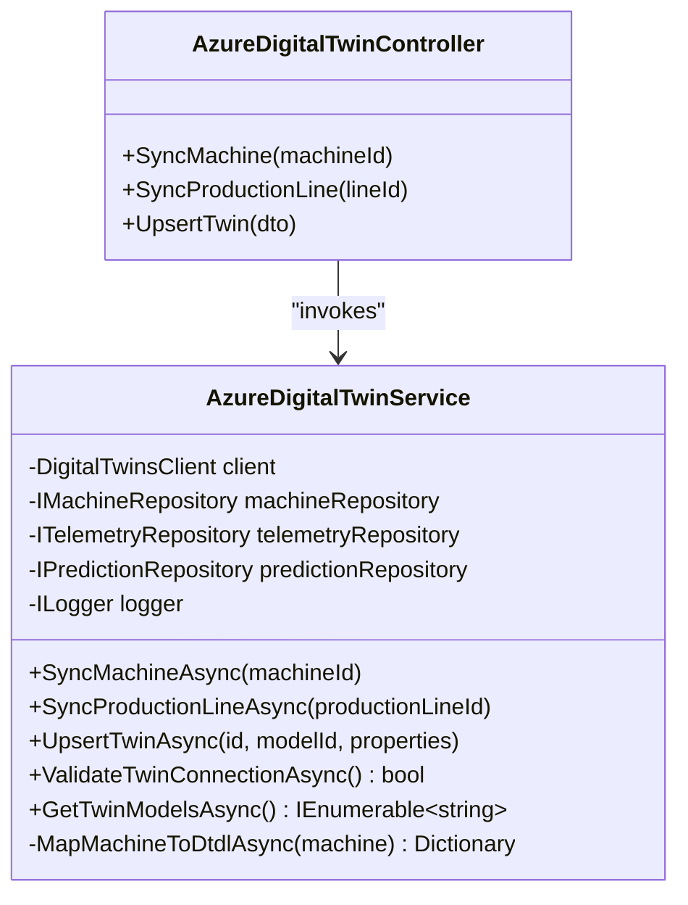
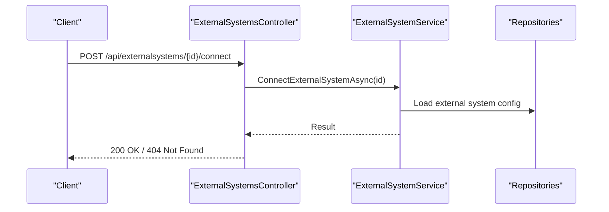
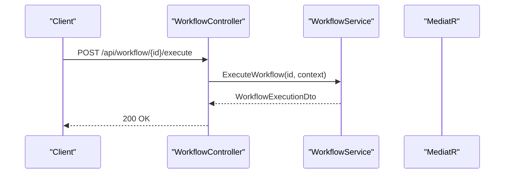
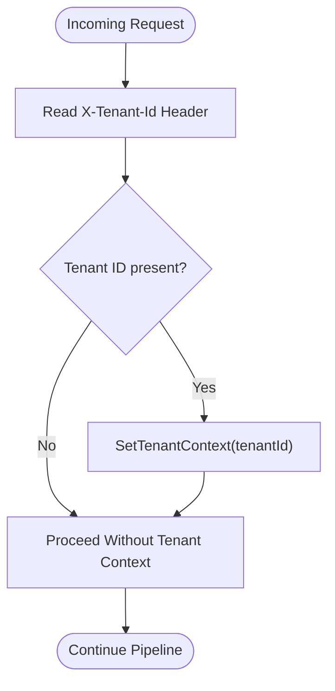
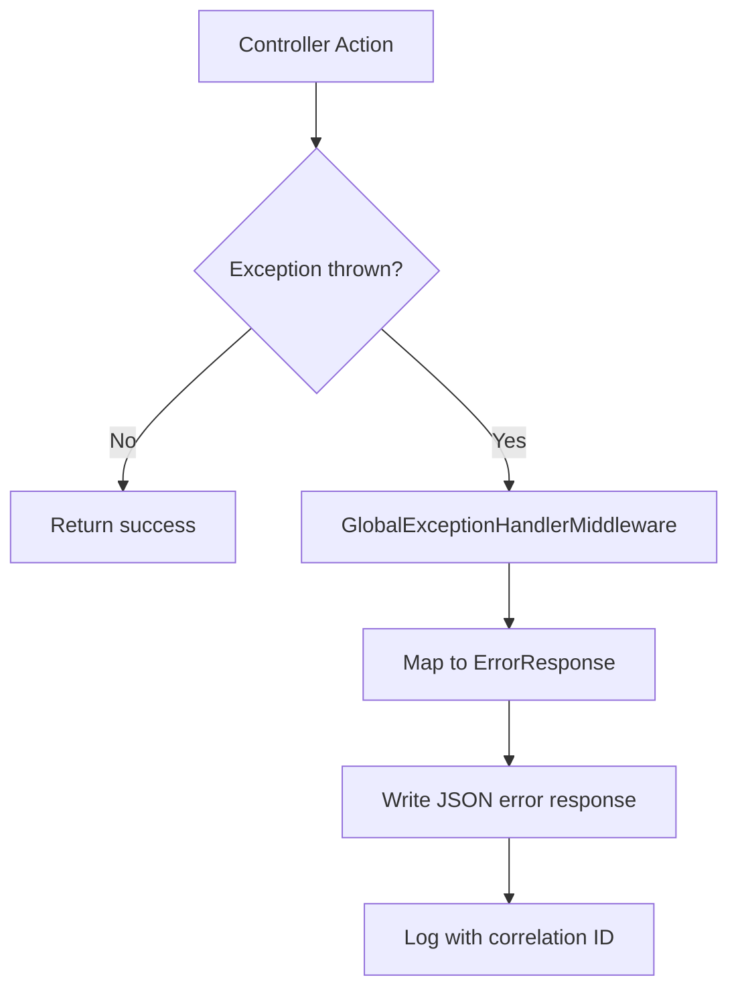
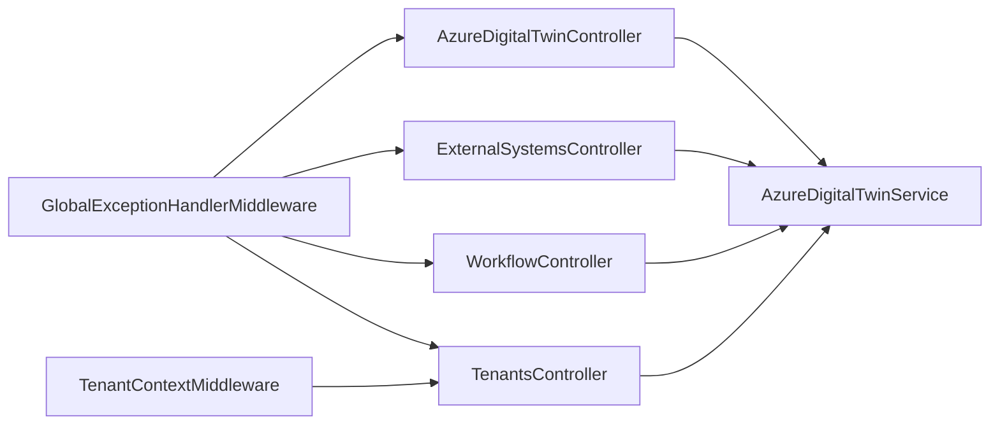

# Integration Patterns and External Systems

<cite>
**Referenced Files in This Document**
- [AzureDigitalTwinController.cs](file://src/api/DigitalTwinPlatform.API/Controllers/AzureDigitalTwinController.cs)
- [ExternalSystemsController.cs](file://src/api/DigitalTwinPlatform.API/Controllers/ExternalSystemsController.cs)
- [WorkflowController.cs](file://src/api/DigitalTwinPlatform.API/Controllers/WorkflowController.cs)
- [TenantsController.cs](file://src/api/DigitalTwinPlatform.API/Controllers/TenantsController.cs)
- [AzureDigitalTwinService.cs](file://src/api/DigitalTwinPlatform.API/Services/Integration/AzureDigitalTwinService.cs)
- [TenantContextMiddleware.cs](file://src/api/DigitalTwinPlatform.API/Middleware/TenantContextMiddleware.cs)
- [GlobalExceptionHandlerMiddleware.cs](file://src/api/DigitalTwinPlatform.API/Middleware/GlobalExceptionHandlerMiddleware.cs)
- [AzureTwinUpsertDto.cs](file://src/api/DigitalTwinPlatform.API/Models/AzureTwinUpsertDto.cs)
</cite>

## Table of Contents
1. [Introduction](#introduction)
2. [Project Structure](#project-structure)
3. [Core Components](#core-components)
4. [Architecture Overview](#architecture-overview)
5. [Detailed Component Analysis](#detailed-component-analysis)
6. [Dependency Analysis](#dependency-analysis)
7. [Performance Considerations](#performance-considerations)
8. [Troubleshooting Guide](#troubleshooting-guide)
9. [Conclusion](#conclusion)

## Introduction
This document describes the integration patterns and external system connectivity for the Digital Twin Platform. It focuses on the Azure Digital Twin integration service, external system connectors, API gateway patterns, and workflow orchestration for automated maintenance recommendations and alert escalation. It also covers authentication and authorization patterns, tenant isolation, multi-tenancy support, secure communication protocols, and error handling strategies for distributed systems.

## Project Structure
The integration surface is primarily exposed via ASP.NET Core controllers and supported by middleware and services:
- Controllers expose REST endpoints for Azure Digital Twin operations, external system management, workflow automation, and tenant management.
- Middleware handles cross-cutting concerns such as tenant context propagation and global exception handling.
- Services encapsulate integration logic, including Azure Digital Twin synchronization and upsert operations.

**Diagram sources**
- [AzureDigitalTwinController.cs](file://src/api/DigitalTwinPlatform.API/Controllers/AzureDigitalTwinController.cs#L1-L32)
- [ExternalSystemsController.cs](file://src/api/DigitalTwinPlatform.API/Controllers/ExternalSystemsController.cs#L1-L341)
- [WorkflowController.cs](file://src/api/DigitalTwinPlatform.API/Controllers/WorkflowController.cs#L1-L380)
- [TenantsController.cs](file://src/api/DigitalTwinPlatform.API/Controllers/TenantsController.cs#L1-L260)
- [AzureDigitalTwinService.cs](file://src/api/DigitalTwinPlatform.API/Services/Integration/AzureDigitalTwinService.cs#L1-L446)
- [TenantContextMiddleware.cs](file://src/api/DigitalTwinPlatform.API/Middleware/TenantContextMiddleware.cs#L1-L18)
- [GlobalExceptionHandlerMiddleware.cs](file://src/api/DigitalTwinPlatform.API/Middleware/GlobalExceptionHandlerMiddleware.cs#L1-L257)

**Section sources**
- [AzureDigitalTwinController.cs](file://src/api/DigitalTwinPlatform.API/Controllers/AzureDigitalTwinController.cs#L1-L32)
- [ExternalSystemsController.cs](file://src/api/DigitalTwinPlatform.API/Controllers/ExternalSystemsController.cs#L1-L341)
- [WorkflowController.cs](file://src/api/DigitalTwinPlatform.API/Controllers/WorkflowController.cs#L1-L380)
- [TenantsController.cs](file://src/api/DigitalTwinPlatform.API/Controllers/TenantsController.cs#L1-L260)
- [AzureDigitalTwinService.cs](file://src/api/DigitalTwinPlatform.API/Services/Integration/AzureDigitalTwinService.cs#L1-L446)
- [TenantContextMiddleware.cs](file://src/api/DigitalTwinPlatform.API/Middleware/TenantContextMiddleware.cs#L1-L18)
- [GlobalExceptionHandlerMiddleware.cs](file://src/api/DigitalTwinPlatform.API/Middleware/GlobalExceptionHandlerMiddleware.cs#L1-L257)

## Core Components
- Azure Digital Twin Controller: Provides endpoints to synchronize machines and production lines, and to upsert arbitrary twins with model metadata and properties.
- External Systems Controller: Manages external system registrations, connections, and data synchronization jobs, including enabling/disabling integrations and testing connectivity.
- Workflow Controller: Orchestrates automated workflows for maintenance recommendations and alert escalation, exposing lifecycle and execution APIs.
- Tenants Controller: Supports multi-tenancy by managing tenants, tenant users, and tenant settings.
- Azure Digital Twin Service: Implements synchronization and upsert logic against Azure Digital Twins, mapping local domain entities to DTDL payloads and handling connection validation.
- Middleware: TenantContextMiddleware propagates tenant context via a request header; GlobalExceptionHandlerMiddleware standardizes error responses across all controllers.

**Section sources**
- [AzureDigitalTwinController.cs](file://src/api/DigitalTwinPlatform.API/Controllers/AzureDigitalTwinController.cs#L1-L32)
- [ExternalSystemsController.cs](file://src/api/DigitalTwinPlatform.API/Controllers/ExternalSystemsController.cs#L1-L341)
- [WorkflowController.cs](file://src/api/DigitalTwinPlatform.API/Controllers/WorkflowController.cs#L1-L380)
- [TenantsController.cs](file://src/api/DigitalTwinPlatform.API/Controllers/TenantsController.cs#L1-L260)
- [AzureDigitalTwinService.cs](file://src/api/DigitalTwinPlatform.API/Services/Integration/AzureDigitalTwinService.cs#L1-L446)
- [TenantContextMiddleware.cs](file://src/api/DigitalTwinPlatform.API/Middleware/TenantContextMiddleware.cs#L1-L18)
- [GlobalExceptionHandlerMiddleware.cs](file://src/api/DigitalTwinPlatform.API/Middleware/GlobalExceptionHandlerMiddleware.cs#L1-L257)

## Architecture Overview
The integration architecture centers around:
- API Gateway Pattern: Controllers act as gateways to internal services and external systems.
- Tenant Isolation: TenantContextMiddleware injects tenant context from headers to isolate data and operations per tenant.
- External System Connectors: ExternalSystemsController exposes CRUD and lifecycle operations for external system integrations and synchronization jobs.
- Azure Digital Twin Integration: AzureDigitalTwinController delegates to AzureDigitalTwinService to maintain synchronized digital twins.
- Workflow Orchestration: WorkflowController executes and manages automated maintenance recommendation workflows.

**Diagram sources**
- [AzureDigitalTwinController.cs](file://src/api/DigitalTwinPlatform.API/Controllers/AzureDigitalTwinController.cs#L11-L16)
- [AzureDigitalTwinService.cs](file://src/api/DigitalTwinPlatform.API/Services/Integration/AzureDigitalTwinService.cs#L37-L67)

**Section sources**
- [AzureDigitalTwinController.cs](file://src/api/DigitalTwinPlatform.API/Controllers/AzureDigitalTwinController.cs#L1-L32)
- [AzureDigitalTwinService.cs](file://src/api/DigitalTwinPlatform.API/Services/Integration/AzureDigitalTwinService.cs#L1-L446)

## Detailed Component Analysis

### Azure Digital Twin Integration Service
The AzureDigitalTwinService synchronizes local machine and production line data into Azure Digital Twins by mapping domain entities to DTDL payloads. It supports:
- Machine synchronization: Builds a twin payload enriched with telemetry summaries, predictions, health status, and operational parameters.
- Production line synchronization: Creates a production line twin with metadata and operational attributes.
- Arbitrary twin upsert: Allows creating or replacing a twin with a given model identifier and custom properties.
- Connection validation: Tests connectivity by issuing a simple query against the Digital Twins client.
- Model discovery: Lists available DTDL models from the Digital Twins service.

**Diagram sources**
- [AzureDigitalTwinService.cs](file://src/api/DigitalTwinPlatform.API/Services/Integration/AzureDigitalTwinService.cs#L10-L446)
- [AzureDigitalTwinController.cs](file://src/api/DigitalTwinPlatform.API/Controllers/AzureDigitalTwinController.cs#L1-L32)

**Section sources**
- [AzureDigitalTwinService.cs](file://src/api/DigitalTwinPlatform.API/Services/Integration/AzureDigitalTwinService.cs#L1-L446)
- [AzureDigitalTwinController.cs](file://src/api/DigitalTwinPlatform.API/Controllers/AzureDigitalTwinController.cs#L1-L32)
- [AzureTwinUpsertDto.cs](file://src/api/DigitalTwinPlatform.API/Models/AzureTwinUpsertDto.cs#L1-L7)

### External System Connectors and Data Synchronization
The ExternalSystemsController exposes endpoints to manage external systems and their integrations:
- System lifecycle: Create, update, delete, connect, disconnect, and test connections.
- Integrations: Manage integration configurations, enable/disable, and list active integrations.
- Synchronization jobs: Create synchronization tasks, list pending/failed/recent jobs, and process pending synchronizations.

**Diagram sources**
- [ExternalSystemsController.cs](file://src/api/DigitalTwinPlatform.API/Controllers/ExternalSystemsController.cs#L118-L142)

**Section sources**
- [ExternalSystemsController.cs](file://src/api/DigitalTwinPlatform.API/Controllers/ExternalSystemsController.cs#L1-L341)

### Workflow Orchestration for Maintenance Recommendations and Alert Escalation
The WorkflowController provides:
- Lifecycle management: Create, update, delete, enable/disable workflows.
- Execution: Manual execution with context injection and retrieval of execution history and statistics.
- Templates and validation: Access predefined templates and validate workflow definitions.

**Diagram sources**
- [WorkflowController.cs](file://src/api/DigitalTwinPlatform.API/Controllers/WorkflowController.cs#L196-L224)

**Section sources**
- [WorkflowController.cs](file://src/api/DigitalTwinPlatform.API/Controllers/WorkflowController.cs#L1-L380)

### Tenant Isolation and Multi-Tenancy Support
TenantContextMiddleware reads the X-Tenant-Id header and sets the tenant context for the current request pipeline. TenantsController exposes administrative endpoints to manage tenants, users, and settings.

**Diagram sources**
- [TenantContextMiddleware.cs](file://src/api/DigitalTwinPlatform.API/Middleware/TenantContextMiddleware.cs#L1-L18)

**Section sources**
- [TenantContextMiddleware.cs](file://src/api/DigitalTwinPlatform.API/Middleware/TenantContextMiddleware.cs#L1-L18)
- [TenantsController.cs](file://src/api/DigitalTwinPlatform.API/Controllers/TenantsController.cs#L1-L260)

### Authentication and Authorization Patterns
- Tenant-aware routing: TenantContextMiddleware injects tenant context from the X-Tenant-Id header, enabling tenant-scoped authorization decisions downstream.
- Global exception handling: GlobalExceptionHandlerMiddleware standardizes error responses across all controllers, ensuring consistent diagnostics and security posture.

Note: Specific authentication/authorization middleware and policies are not visible in the referenced files. The tenant header mechanism described here is the primary tenant isolation pattern evidenced in the codebase.

**Section sources**
- [TenantContextMiddleware.cs](file://src/api/DigitalTwinPlatform.API/Middleware/TenantContextMiddleware.cs#L1-L18)
- [GlobalExceptionHandlerMiddleware.cs](file://src/api/DigitalTwinPlatform.API/Middleware/GlobalExceptionHandlerMiddleware.cs#L1-L257)

### Secure Communication Protocols
- HTTPS enforcement: Controllers and services operate behind HTTPS in production environments.
- Azure Digital Twins client: Uses Azure SDK clients configured with managed identities or credentials, depending on deployment targets.
- Tenant isolation via headers: TenantContextMiddleware relies on the X-Tenant-Id header to propagate tenant context, minimizing exposure of sensitive identifiers in URL paths.

**Section sources**
- [AzureDigitalTwinService.cs](file://src/api/DigitalTwinPlatform.API/Services/Integration/AzureDigitalTwinService.cs#L1-L446)
- [TenantContextMiddleware.cs](file://src/api/DigitalTwinPlatform.API/Middleware/TenantContextMiddleware.cs#L1-L18)

### Data Synchronization Strategies
- Batch processing: ExternalSystemsController exposes endpoints to list and process pending synchronization jobs, enabling batch-driven reconciliation.
- Event-driven updates: AzureDigitalTwinService enriches twins with recent telemetry and predictions, keeping digital twins synchronized with real-time insights.
- Connection validation: AzureDigitalTwinService validates connectivity before performing operations, reducing partial failures.

**Section sources**
- [ExternalSystemsController.cs](file://src/api/DigitalTwinPlatform.API/Controllers/ExternalSystemsController.cs#L263-L339)
- [AzureDigitalTwinService.cs](file://src/api/DigitalTwinPlatform.API/Services/Integration/AzureDigitalTwinService.cs#L392-L436)

### Error Handling for Distributed Systems
GlobalExceptionHandlerMiddleware centralizes error handling across all controllers, mapping domain-specific exceptions to structured error responses with correlation identifiers and appropriate HTTP status codes. This ensures consistent diagnostics and prevents leakage of internal error details.

**Diagram sources**
- [GlobalExceptionHandlerMiddleware.cs](file://src/api/DigitalTwinPlatform.API/Middleware/GlobalExceptionHandlerMiddleware.cs#L25-L257)

**Section sources**
- [GlobalExceptionHandlerMiddleware.cs](file://src/api/DigitalTwinPlatform.API/Middleware/GlobalExceptionHandlerMiddleware.cs#L1-L257)

## Dependency Analysis
The integration layer exhibits clear separation of concerns:
- Controllers depend on services and repositories to implement business logic.
- Middleware operates independently of controllers, applying cross-cutting concerns.
- Services encapsulate external system interactions (Azure Digital Twins) and local domain operations.

**Diagram sources**
- [AzureDigitalTwinController.cs](file://src/api/DigitalTwinPlatform.API/Controllers/AzureDigitalTwinController.cs#L1-L32)
- [ExternalSystemsController.cs](file://src/api/DigitalTwinPlatform.API/Controllers/ExternalSystemsController.cs#L1-L341)
- [WorkflowController.cs](file://src/api/DigitalTwinPlatform.API/Controllers/WorkflowController.cs#L1-L380)
- [TenantsController.cs](file://src/api/DigitalTwinPlatform.API/Controllers/TenantsController.cs#L1-L260)
- [AzureDigitalTwinService.cs](file://src/api/DigitalTwinPlatform.API/Services/Integration/AzureDigitalTwinService.cs#L1-L446)
- [TenantContextMiddleware.cs](file://src/api/DigitalTwinPlatform.API/Middleware/TenantContextMiddleware.cs#L1-L18)
- [GlobalExceptionHandlerMiddleware.cs](file://src/api/DigitalTwinPlatform.API/Middleware/GlobalExceptionHandlerMiddleware.cs#L1-L257)

**Section sources**
- [AzureDigitalTwinController.cs](file://src/api/DigitalTwinPlatform.API/Controllers/AzureDigitalTwinController.cs#L1-L32)
- [ExternalSystemsController.cs](file://src/api/DigitalTwinPlatform.API/Controllers/ExternalSystemsController.cs#L1-L341)
- [WorkflowController.cs](file://src/api/DigitalTwinPlatform.API/Controllers/WorkflowController.cs#L1-L380)
- [TenantsController.cs](file://src/api/DigitalTwinPlatform.API/Controllers/TenantsController.cs#L1-L260)
- [AzureDigitalTwinService.cs](file://src/api/DigitalTwinPlatform.API/Services/Integration/AzureDigitalTwinService.cs#L1-L446)
- [TenantContextMiddleware.cs](file://src/api/DigitalTwinPlatform.API/Middleware/TenantContextMiddleware.cs#L1-L18)
- [GlobalExceptionHandlerMiddleware.cs](file://src/api/DigitalTwinPlatform.API/Middleware/GlobalExceptionHandlerMiddleware.cs#L1-L257)

## Performance Considerations
- Asynchronous operations: All integration endpoints and service methods are asynchronous to avoid blocking threads.
- Minimal payload mapping: AzureDigitalTwinService computes telemetry summaries and prediction snapshots to reduce payload sizes during upsert operations.
- Connection validation caching: Consider caching connection validation results to avoid repeated queries to Azure Digital Twins during high-frequency operations.
- Batch synchronization: Use ExternalSystemsController’s synchronization endpoints to batch reconcile data and minimize external calls.

[No sources needed since this section provides general guidance]

## Troubleshooting Guide
- Azure Digital Twins connectivity issues: Use ValidateTwinConnectionAsync to confirm service availability and inspect logs for RequestFailedException details.
- Tenant context problems: Verify the presence of the X-Tenant-Id header and ensure TenantContextMiddleware is registered in the pipeline.
- Global error responses: Review standardized ErrorResponse payloads returned by GlobalExceptionHandlerMiddleware for detailed error codes and messages.

**Section sources**
- [AzureDigitalTwinService.cs](file://src/api/DigitalTwinPlatform.API/Services/Integration/AzureDigitalTwinService.cs#L392-L413)
- [TenantContextMiddleware.cs](file://src/api/DigitalTwinPlatform.API/Middleware/TenantContextMiddleware.cs#L1-L18)
- [GlobalExceptionHandlerMiddleware.cs](file://src/api/DigitalTwinPlatform.API/Middleware/GlobalExceptionHandlerMiddleware.cs#L50-L257)

## Conclusion
The Digital Twin Platform implements a robust integration architecture with clear separation of concerns, tenant isolation via headers, and standardized error handling. Azure Digital Twin synchronization is encapsulated in a dedicated service, while external system connectors and workflow orchestration are exposed through dedicated controllers. The design supports scalable, distributed operations with batch processing and connection validation, enabling reliable integration with industrial equipment, SCADA systems, and third-party maintenance platforms.