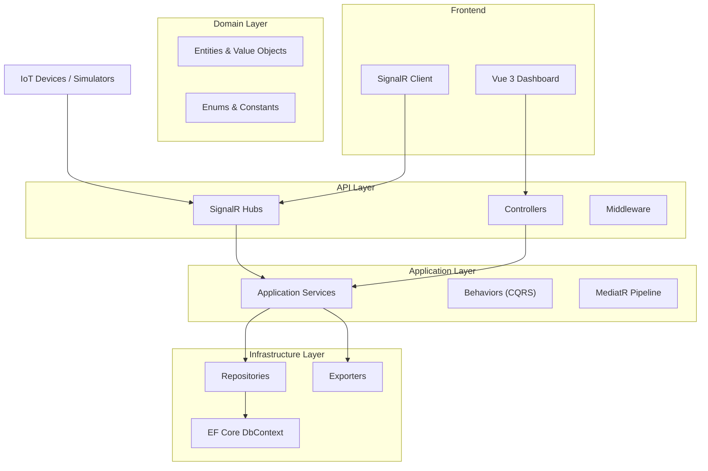
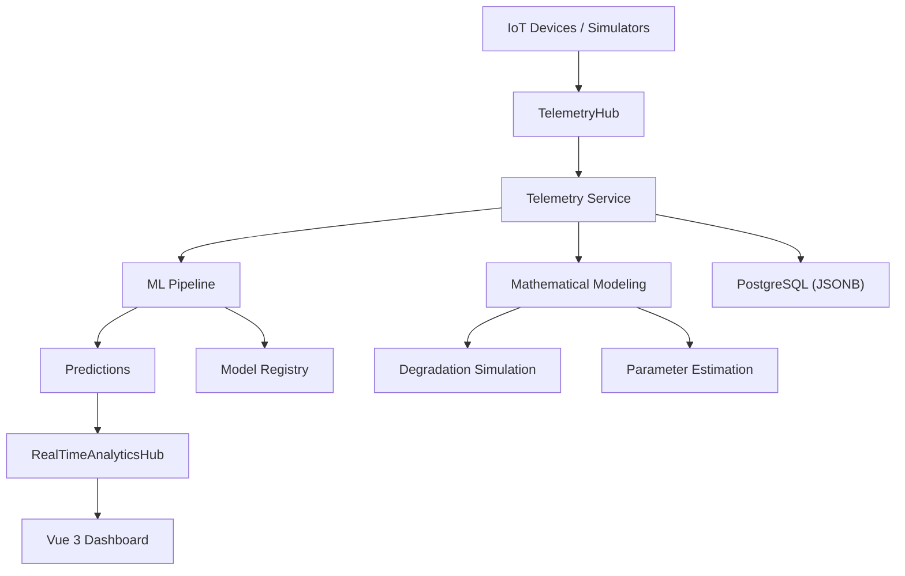
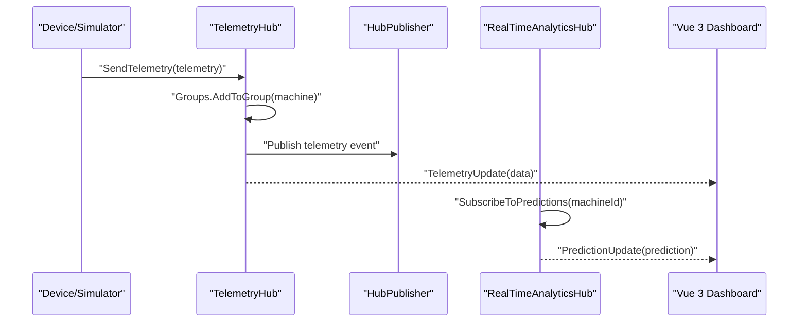
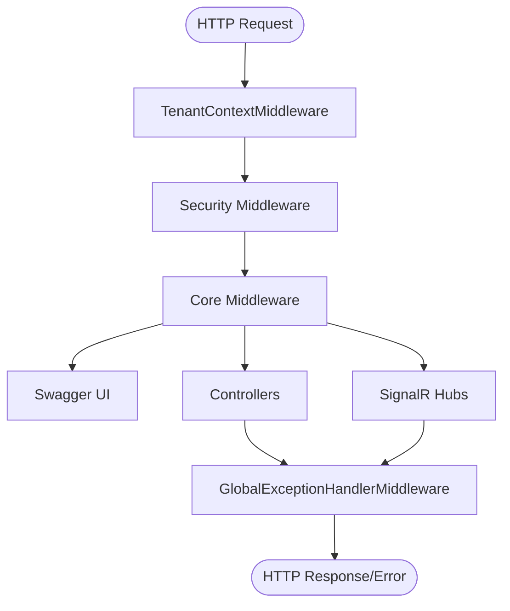
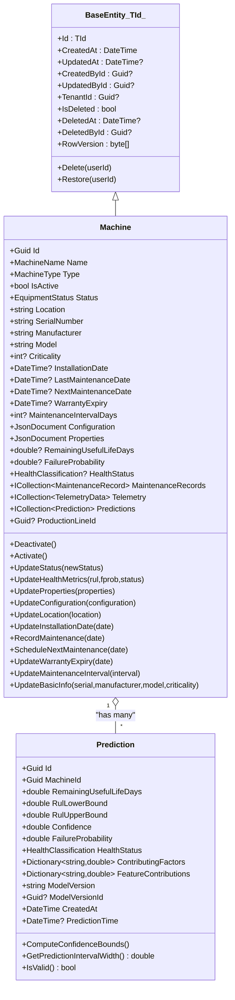
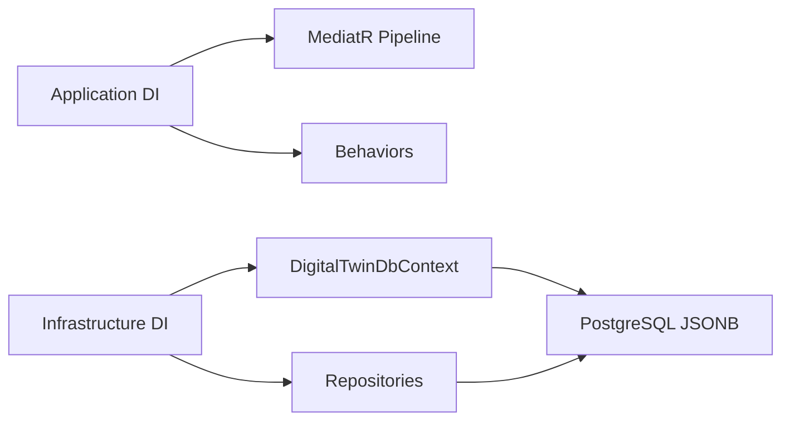
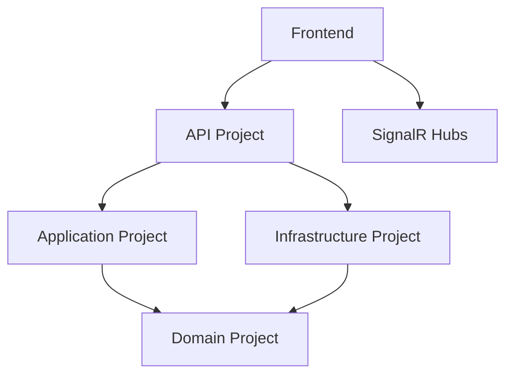
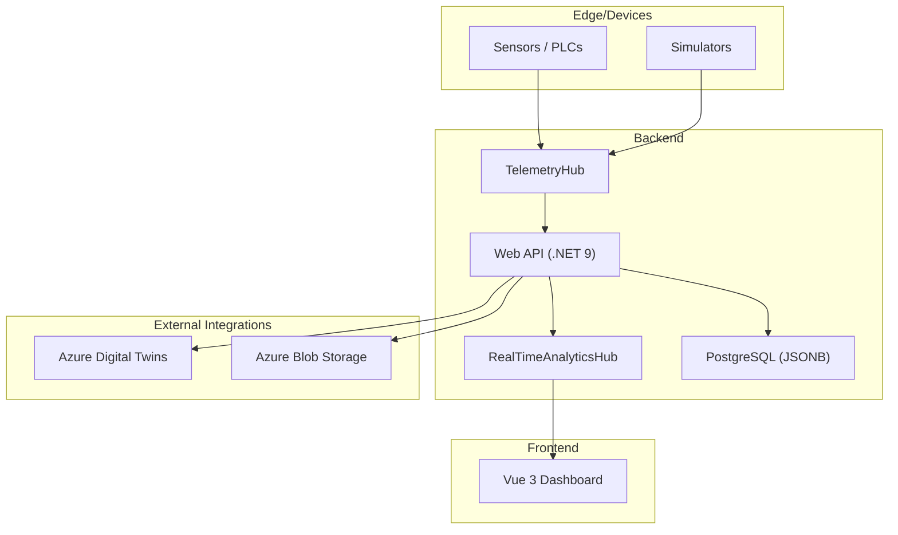

# Overall Architecture Design

<cite>
**Referenced Files in This Document**
- [ARCHITECTURE.md](file://docs/ARCHITECTURE.md)
- [Program.cs](file://src/api/DigitalTwinPlatform.API/Program.cs)
- [DigitalTwinPlatform.API.csproj](file://src/api/DigitalTwinPlatform.API/DigitalTwinPlatform.API.csproj)
- [package.json](file://src/frontend/package.json)
- [main.tf](file://infrastructure/main.tf)
- [docker-compose.yml](file://docker-compose.yml)
- [TelemetryHub.cs](file://src/api/DigitalTwinPlatform.API/Hubs/TelemetryHub.cs)
- [RealTimeAnalyticsHub.cs](file://src/api/DigitalTwinPlatform.API/Hubs/RealTimeAnalyticsHub.cs)
- [ApplicationBuilderExtensions.cs](file://src/api/DigitalTwinPlatform.API/Extensions/ApplicationBuilderExtensions.cs)
- [ServiceCollectionExtensions.cs](file://src/api/DigitalTwinPlatform.API/Extensions/ServiceCollectionExtensions.cs)
- [TenantContextMiddleware.cs](file://src/api/DigitalTwinPlatform.API/Middleware/TenantContextMiddleware.cs)
- [GlobalExceptionHandlerMiddleware.cs](file://src/api/DigitalTwinPlatform.API/Middleware/GlobalExceptionHandlerMiddleware.cs)
- [DependencyInjection.cs](file://src/api/DigitalTwinPlatform.Application/DependencyInjection.cs)
- [BaseEntity.cs](file://src/api/DigitalTwinPlatform.Domain/Common/BaseEntity.cs)
- [Machine.cs](file://src/api/DigitalTwinPlatform.Domain/Entities/Machine.cs)
- [Prediction.cs](file://src/api/DigitalTwinPlatform.Domain/Entities/Prediction.cs)
- [DependencyInjection.cs](file://src/api/DigitalTwinPlatform.Infrastructure/DependencyInjection.cs)
- [DigitalTwinDbContext.cs](file://src/api/DigitalTwinPlatform.Infrastructure/Persistence/DigitalTwinDbContext.cs)
</cite>

## Table of Contents
1. [Introduction](#introduction)
2. [Project Structure](#project-structure)
3. [Core Components](#core-components)
4. [Architecture Overview](#architecture-overview)
5. [Detailed Component Analysis](#detailed-component-analysis)
6. [Dependency Analysis](#dependency-analysis)
7. [Performance Considerations](#performance-considerations)
8. [Troubleshooting Guide](#troubleshooting-guide)
9. [Conclusion](#conclusion)
10. [Appendices](#appendices)

## Introduction
This document presents the overall system architecture design of the Digital Twin Platform, a unified ecosystem for Small and Medium Enterprises (SMEs) focused on equipment health monitoring, predictive maintenance, and interpretable machine learning. The platform integrates real-time telemetry, mathematical degradation modeling, and explainable ML into a cohesive solution. It emphasizes SME-friendly design principles, clear system boundaries, and scalable deployment topologies.

## Project Structure
The repository follows a layered architecture with three primary layers:
- Domain: Core business entities and invariants
- Application: Use cases, orchestration, and cross-cutting concerns
- Infrastructure: Persistence, repositories, and external integrations
- API: HTTP endpoints and SignalR hubs for real-time streaming
- Frontend: Vue 3 dashboard with real-time visualizations

**Diagram sources**
- [Program.cs](file://src/api/DigitalTwinPlatform.API/Program.cs#L1-L87)
- [DependencyInjection.cs](file://src/api/DigitalTwinPlatform.Application/DependencyInjection.cs#L1-L58)
- [DependencyInjection.cs](file://src/api/DigitalTwinPlatform.Infrastructure/DependencyInjection.cs#L1-L47)
- [DigitalTwinDbContext.cs](file://src/api/DigitalTwinPlatform.Infrastructure/Persistence/DigitalTwinDbContext.cs#L1-L395)

**Section sources**
- [Program.cs](file://src/api/DigitalTwinPlatform.API/Program.cs#L1-L87)
- [DependencyInjection.cs](file://src/api/DigitalTwinPlatform.Application/DependencyInjection.cs#L1-L58)
- [DependencyInjection.cs](file://src/api/DigitalTwinPlatform.Infrastructure/DependencyInjection.cs#L1-L47)

## Core Components
- Backend (.NET 9 Web API): Orchestrates telemetry ingestion, analytics, ML inference, mathematical modeling, and alerting. Real-time streaming via SignalR hubs.
- Frontend (Vue 3 + TypeScript): Operator-centric dashboard with real-time charts, XAI insights, and controls for synthetic data generation and mathematical modeling.
- Data Store: PostgreSQL with JSONB for flexible telemetry and structured analytics.
- Real-time Streaming: SignalR hubs for telemetry and analytics with connection pooling and per-client invocation limits.
- Observability: Structured logging, metrics, health checks, and Swagger documentation.

**Section sources**
- [ARCHITECTURE.md](file://docs/ARCHITECTURE.md#L1-L50)
- [DigitalTwinPlatform.API.csproj](file://src/api/DigitalTwinPlatform.API/DigitalTwinPlatform.API.csproj#L1-L54)
- [package.json](file://src/frontend/package.json#L1-L44)

## Architecture Overview
The system adheres to Clean Architecture with bounded contexts and a CQRS-inspired separation of concerns:
- Domain layer encapsulates business rules and entities.
- Application layer coordinates use cases, applies cross-cutting behaviors, and orchestrates services.
- Infrastructure layer handles persistence and external integrations.
- API layer exposes REST endpoints and SignalR hubs.
- Frontend consumes APIs and real-time streams.

**Diagram sources**
- [TelemetryHub.cs](file://src/api/DigitalTwinPlatform.API/Hubs/TelemetryHub.cs#L1-L211)
- [RealTimeAnalyticsHub.cs](file://src/api/DigitalTwinPlatform.API/Hubs/RealTimeAnalyticsHub.cs#L1-L310)
- [DigitalTwinPlatform.API.csproj](file://src/api/DigitalTwinPlatform.API/DigitalTwinPlatform.API.csproj#L1-L54)

## Detailed Component Analysis

### SignalR Hubs: Real-time Telemetry and Analytics
The platform uses two SignalR hubs:
- TelemetryHub: Manages machine-specific groups, subscription lifecycle, and broadcasting telemetry events.
- RealTimeAnalyticsHub: Streams predictions, alerts, and system health metrics to clients.

**Diagram sources**
- [TelemetryHub.cs](file://src/api/DigitalTwinPlatform.API/Hubs/TelemetryHub.cs#L1-L211)
- [RealTimeAnalyticsHub.cs](file://src/api/DigitalTwinPlatform.API/Hubs/RealTimeAnalyticsHub.cs#L1-L310)

**Section sources**
- [TelemetryHub.cs](file://src/api/DigitalTwinPlatform.API/Hubs/TelemetryHub.cs#L1-L211)
- [RealTimeAnalyticsHub.cs](file://src/api/DigitalTwinPlatform.API/Hubs/RealTimeAnalyticsHub.cs#L1-L310)
- [ApplicationBuilderExtensions.cs](file://src/api/DigitalTwinPlatform.API/Extensions/ApplicationBuilderExtensions.cs#L1-L89)
- [ServiceCollectionExtensions.cs](file://src/api/DigitalTwinPlatform.API/Extensions/ServiceCollectionExtensions.cs#L1-L418)

### Middleware and Pipeline
The API pipeline includes:
- Tenant context propagation via a custom middleware.
- Security middleware (cookies, HTTPS enforcement, CSRF protection).
- Core middleware (routing, CORS, auth).
- Structured logging and metrics.
- Global exception handling with typed error responses.

**Diagram sources**
- [TenantContextMiddleware.cs](file://src/api/DigitalTwinPlatform.API/Middleware/TenantContextMiddleware.cs#L1-L18)
- [ApplicationBuilderExtensions.cs](file://src/api/DigitalTwinPlatform.API/Extensions/ApplicationBuilderExtensions.cs#L1-L89)
- [GlobalExceptionHandlerMiddleware.cs](file://src/api/DigitalTwinPlatform.API/Middleware/GlobalExceptionHandlerMiddleware.cs#L1-L257)

**Section sources**
- [TenantContextMiddleware.cs](file://src/api/DigitalTwinPlatform.API/Middleware/TenantContextMiddleware.cs#L1-L18)
- [ApplicationBuilderExtensions.cs](file://src/api/DigitalTwinPlatform.API/Extensions/ApplicationBuilderExtensions.cs#L1-L89)
- [GlobalExceptionHandlerMiddleware.cs](file://src/api/DigitalTwinPlatform.API/Middleware/GlobalExceptionHandlerMiddleware.cs#L1-L257)

### Domain Entities and Data Model
The domain defines core entities with rich invariants and JSONB fields for flexibility:
- Machine: Equipment with configuration, properties, and health metrics.
- Prediction: RUL, confidence, failure probability, and feature contributions.
- BaseEntity: Common auditing and tenant fields with soft-delete support.

**Diagram sources**
- [BaseEntity.cs](file://src/api/DigitalTwinPlatform.Domain/Common/BaseEntity.cs#L1-L109)
- [Machine.cs](file://src/api/DigitalTwinPlatform.Domain/Entities/Machine.cs#L1-L211)
- [Prediction.cs](file://src/api/DigitalTwinPlatform.Domain/Entities/Prediction.cs#L1-L94)

**Section sources**
- [BaseEntity.cs](file://src/api/DigitalTwinPlatform.Domain/Common/BaseEntity.cs#L1-L109)
- [Machine.cs](file://src/api/DigitalTwinPlatform.Domain/Entities/Machine.cs#L1-L211)
- [Prediction.cs](file://src/api/DigitalTwinPlatform.Domain/Entities/Prediction.cs#L1-L94)

### Application and Infrastructure Layers
- Application layer registers MediatR behaviors (validation, logging, exception handling, performance, retry, authorization, audit, caching) and ML/workflow/simulation services.
- Infrastructure layer configures EF Core with JSONB mappings, indexes, and tenant schema interception.

**Diagram sources**
- [DependencyInjection.cs](file://src/api/DigitalTwinPlatform.Application/DependencyInjection.cs#L1-L58)
- [DependencyInjection.cs](file://src/api/DigitalTwinPlatform.Infrastructure/DependencyInjection.cs#L1-L47)
- [DigitalTwinDbContext.cs](file://src/api/DigitalTwinPlatform.Infrastructure/Persistence/DigitalTwinDbContext.cs#L88-L395)

**Section sources**
- [DependencyInjection.cs](file://src/api/DigitalTwinPlatform.Application/DependencyInjection.cs#L1-L58)
- [DependencyInjection.cs](file://src/api/DigitalTwinPlatform.Infrastructure/DependencyInjection.cs#L1-L47)
- [DigitalTwinDbContext.cs](file://src/api/DigitalTwinPlatform.Infrastructure/Persistence/DigitalTwinDbContext.cs#L88-L395)

### Technology Stack and Patterns
- Backend: .NET 9, ASP.NET Core, SignalR, MediatR, FluentValidation, AutoMapper, Serilog, Application Insights.
- ML: ML.NET (FastTree, Quantile Regression), ONNX Runtime, SHAP for XAI.
- Numerical Math: Math.NET Numerics, custom ODE solvers (RK4, Euler-Maruyama).
- Frontend: Vue 3, TypeScript, Pinia, ApexCharts, TailwindCSS.
- Database: PostgreSQL with JSONB for telemetry and analytics.
- Observability: Swagger, health checks, metrics, structured logs.
- Deployment: Docker Compose for local dev; Terraform for AWS EKS, RDS, Redis, S3, CloudFront.

**Section sources**
- [DigitalTwinPlatform.API.csproj](file://src/api/DigitalTwinPlatform.API/DigitalTwinPlatform.API.csproj#L1-L54)
- [package.json](file://src/frontend/package.json#L1-L44)
- [main.tf](file://infrastructure/main.tf#L1-L493)
- [docker-compose.yml](file://docker-compose.yml#L1-L81)

## Dependency Analysis
The system exhibits clean separation of concerns with explicit dependency directions:
- API depends on Application and Infrastructure projects.
- Application depends on Domain abstractions and uses Infrastructure for persistence.
- Infrastructure depends on Domain entities and EF Core.
- Frontend depends on API endpoints and SignalR hubs.

**Diagram sources**
- [DigitalTwinPlatform.API.csproj](file://src/api/DigitalTwinPlatform.API/DigitalTwinPlatform.API.csproj#L48-L52)
- [DependencyInjection.cs](file://src/api/DigitalTwinPlatform.Application/DependencyInjection.cs#L1-L58)
- [DependencyInjection.cs](file://src/api/DigitalTwinPlatform.Infrastructure/DependencyInjection.cs#L1-L47)

**Section sources**
- [DigitalTwinPlatform.API.csproj](file://src/api/DigitalTwinPlatform.API/DigitalTwinPlatform.API.csproj#L48-L52)

## Performance Considerations
- Real-time streaming: SignalR hubs configured with keep-alive, handshake timeouts, and per-client invocation limits to balance responsiveness and resource usage.
- Database: JSONB fields with targeted indexes for telemetry, predictions, and alerts; tenant schema interceptor for multi-tenancy isolation.
- Latency targets: Sub-100ms dashboard updates and sub-500ms prediction latency as documented for SME scenarios.
- Caching: Memory cache integrated via MediatR behaviors to reduce repeated computation.
- Observability: Metrics and structured logs for proactive tuning.

**Section sources**
- [ServiceCollectionExtensions.cs](file://src/api/DigitalTwinPlatform.API/Extensions/ServiceCollectionExtensions.cs#L105-L131)
- [DigitalTwinDbContext.cs](file://src/api/DigitalTwinPlatform.Infrastructure/Persistence/DigitalTwinDbContext.cs#L155-L395)
- [ARCHITECTURE.md](file://docs/ARCHITECTURE.md#L49-L50)

## Troubleshooting Guide
- Global exception handling centralizes error responses with typed codes and request correlation IDs.
- Tenant context middleware enables multi-tenant filtering via request headers.
- Middleware order ensures consistent logging, metrics, and security enforcement.
- SignalR hubs provide granular subscription lifecycle management for diagnostics.

**Section sources**
- [GlobalExceptionHandlerMiddleware.cs](file://src/api/DigitalTwinPlatform.API/Middleware/GlobalExceptionHandlerMiddleware.cs#L1-L257)
- [TenantContextMiddleware.cs](file://src/api/DigitalTwinPlatform.API/Middleware/TenantContextMiddleware.cs#L1-L18)
- [ApplicationBuilderExtensions.cs](file://src/api/DigitalTwinPlatform.API/Extensions/ApplicationBuilderExtensions.cs#L1-L89)
- [TelemetryHub.cs](file://src/api/DigitalTwinPlatform.API/Hubs/TelemetryHub.cs#L138-L184)
- [RealTimeAnalyticsHub.cs](file://src/api/DigitalTwinPlatform.API/Hubs/RealTimeAnalyticsHub.cs#L177-L244)

## Conclusion
The Digital Twin Platform’s architecture balances SME accessibility with robust engineering practices. By combining real-time telemetry, mathematical modeling, and interpretable ML under Clean Architecture and CQRS-like patterns, it delivers actionable insights with predictable performance and maintainability. The technology stack and deployment topologies support scalable, secure, and observable operations suitable for small to medium enterprises.

## Appendices

### System Context Diagram: Data Flow

**Diagram sources**
- [TelemetryHub.cs](file://src/api/DigitalTwinPlatform.API/Hubs/TelemetryHub.cs#L1-L211)
- [RealTimeAnalyticsHub.cs](file://src/api/DigitalTwinPlatform.API/Hubs/RealTimeAnalyticsHub.cs#L1-L310)
- [DigitalTwinPlatform.API.csproj](file://src/api/DigitalTwinPlatform.API/DigitalTwinPlatform.API.csproj#L29-L31)
- [ServiceCollectionExtensions.cs](file://src/api/DigitalTwinPlatform.API/Extensions/ServiceCollectionExtensions.cs#L401-L416)

### Deployment Topology: Local and Cloud
- Local development: Docker Compose with PostgreSQL, pgAdmin, API, UI, and SHAP service.
- Cloud (AWS): Terraform provisions EKS, RDS, ElastiCache Redis, S3, CloudFront, and KMS; supports horizontal scaling and spot instances.

**Section sources**
- [docker-compose.yml](file://docker-compose.yml#L1-L81)
- [main.tf](file://infrastructure/main.tf#L1-L493)