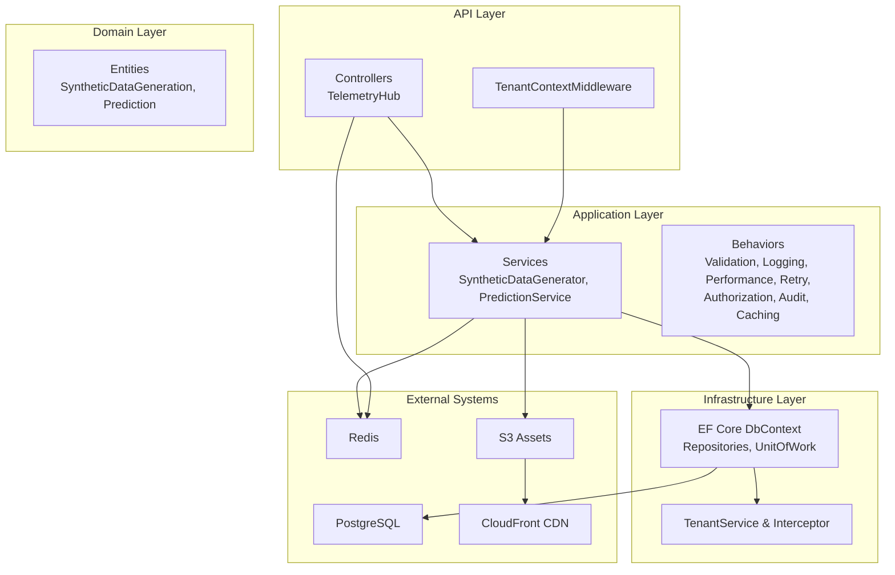
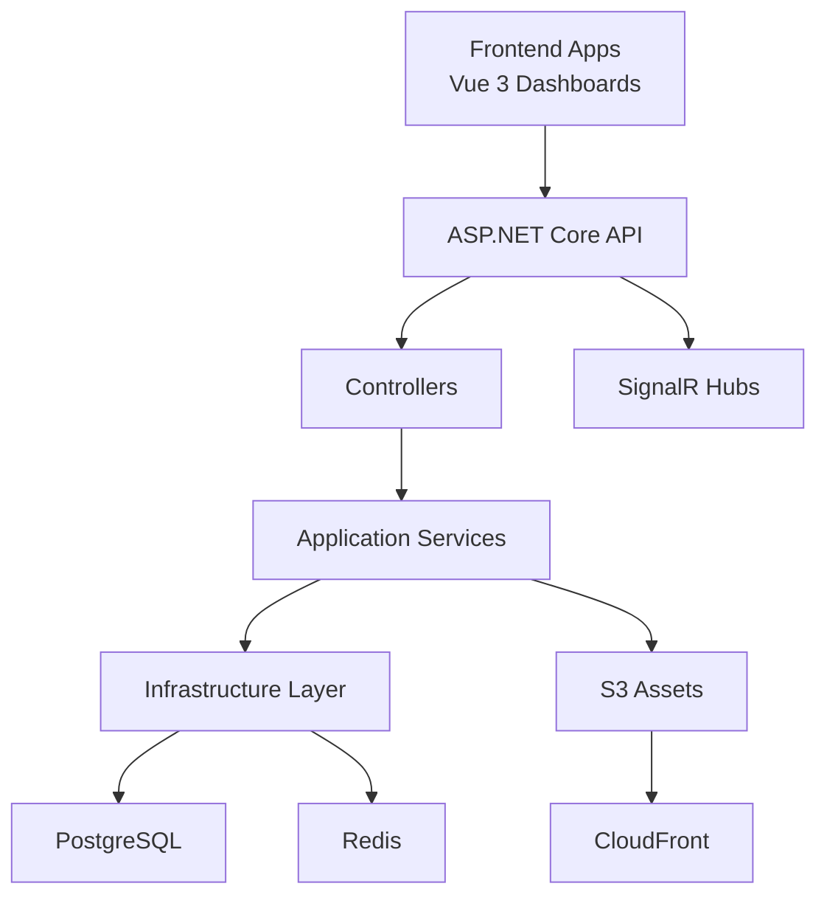
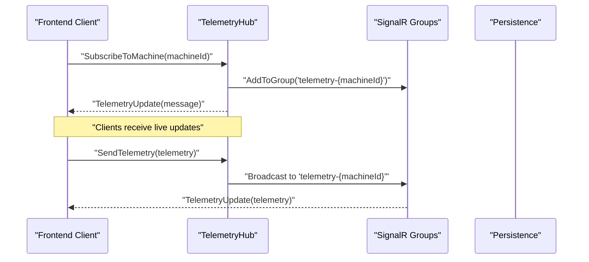
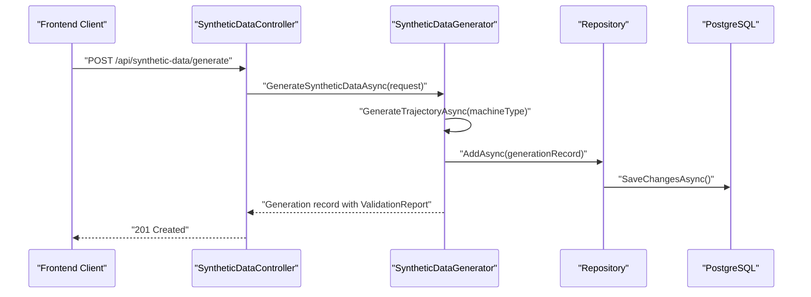
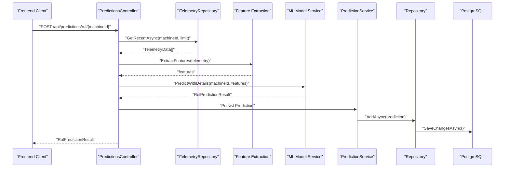
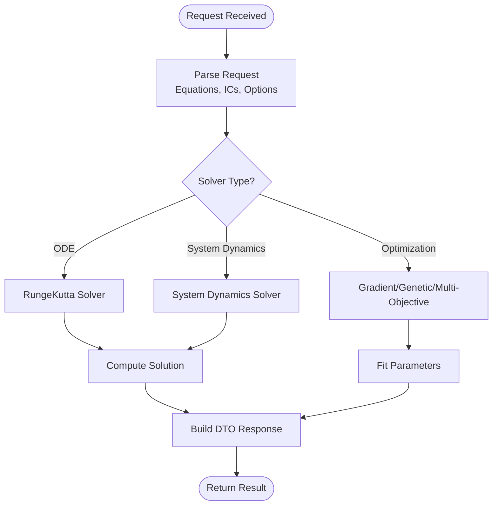
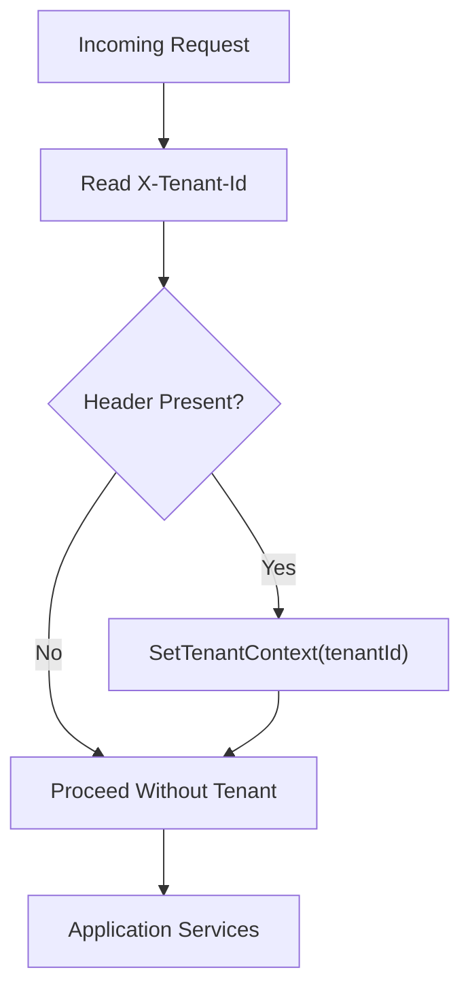
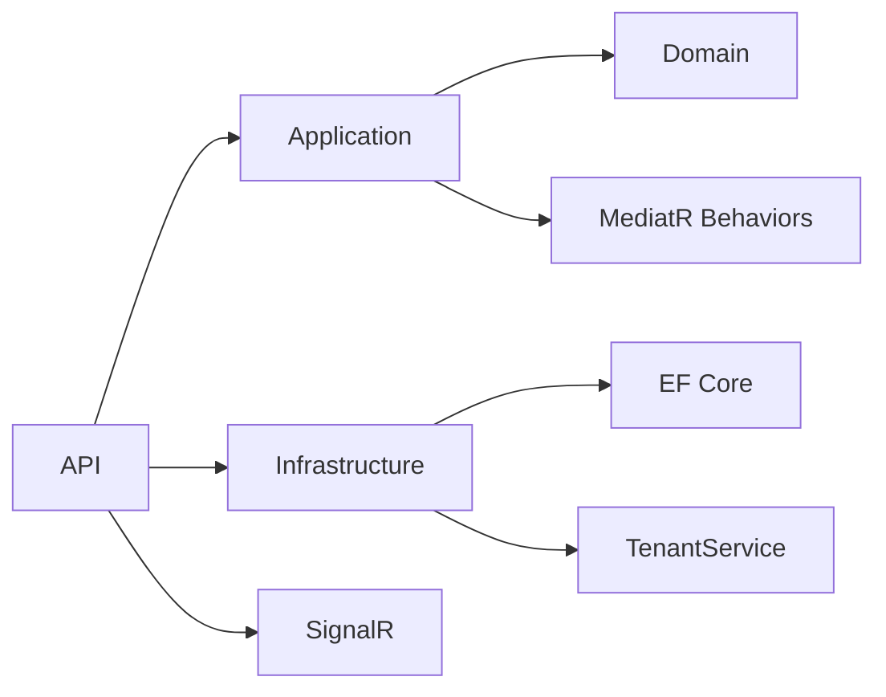
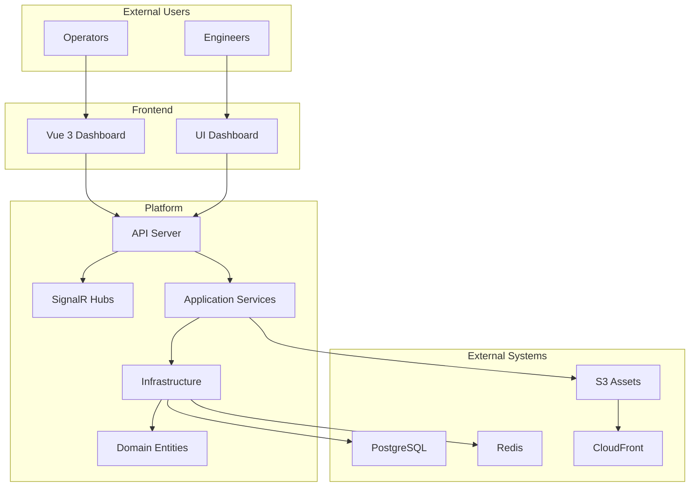

# System Architecture

<cite>
**Referenced Files in This Document**
- [ARCHITECTURE.md](file://docs/ARCHITECTURE.md)
- [Program.cs](file://src/api/DigitalTwinPlatform.API/Program.cs)
- [DigitalTwinPlatform.API.csproj](file://src/api/DigitalTwinPlatform.API/DigitalTwinPlatform.API.csproj)
- [DependencyInjection.cs (Application)](file://src/api/DigitalTwinPlatform.Application/DependencyInjection.cs)
- [DependencyInjection.cs (Infrastructure)](file://src/api/DigitalTwinPlatform.Infrastructure/DependencyInjection.cs)
- [MathematicalModelingController.cs](file://src/api/DigitalTwinPlatform.API/Controllers/MathematicalModelingController.cs)
- [SyntheticDataController.cs](file://src/api/DigitalTwinPlatform.API/Controllers/SyntheticDataController.cs)
- [PredictionsController.cs](file://src/api/DigitalTwinPlatform.API/Controllers/PredictionsController.cs)
- [TelemetryHub.cs](file://src/api/DigitalTwinPlatform.API/Hubs/TelemetryHub.cs)
- [TenantContextMiddleware.cs](file://src/api/DigitalTwinPlatform.API/Middleware/TenantContextMiddleware.cs)
- [SyntheticDataGenerator.cs](file://src/api/DigitalTwinPlatform.Application/SyntheticDataGenerator.cs)
- [PredictionService.cs](file://src/api/DigitalTwinPlatform.Application/PredictionService.cs)
- [SyntheticDataGeneration.cs](file://src/api/DigitalTwinPlatform.Domain/Entities/SyntheticDataGeneration.cs)
- [Prediction.cs](file://src/api/DigitalTwinPlatform.Domain/Entities/Prediction.cs)
- [main.tf](file://infrastructure/main.tf)
</cite>

## Table of Contents
1. [Introduction](#introduction)
2. [Project Structure](#project-structure)
3. [Core Components](#core-components)
4. [Architecture Overview](#architecture-overview)
5. [Detailed Component Analysis](#detailed-component-analysis)
6. [Dependency Analysis](#dependency-analysis)
7. [Performance Considerations](#performance-considerations)
8. [Troubleshooting Guide](#troubleshooting-guide)
9. [Conclusion](#conclusion)
10. [Appendices](#appendices)

## Introduction
This document describes the system architecture of the Digital Twin Platform, a real-time, SME-focused platform for equipment health monitoring, predictive analytics, and prescriptive insights. It integrates real-time telemetry ingestion, synthetic data generation, mathematical modeling, machine learning, and visualization layers. The platform emphasizes explainability, low-latency dashboards, and tenant isolation to serve small and medium enterprises effectively.

## Project Structure
The repository follows a layered architecture with clear separation of concerns:
- API Layer: ASP.NET Core Web API with controllers, SignalR hubs, middleware, and DI configuration.
- Application Layer: Application services, handlers, validators, and cross-cutting behaviors (validation, logging, performance, retry, authorization, audit, caching).
- Infrastructure Layer: Persistence (Entity Framework), repositories, unit of work, and tenant schema interception.
- Domain Layer: Entities, enums, and value objects representing business concepts.
- Frontend Applications: Two UIs (Vue 3 and a separate dashboard) consuming the API and SignalR.
- Infrastructure: Terraform modules provisioning AWS resources (EKS, RDS, ElastiCache, S3, CloudFront).

**Diagram sources**
- [Program.cs](file://src/api/DigitalTwinPlatform.API/Program.cs#L12-L80)
- [DependencyInjection.cs (Application)](file://src/api/DigitalTwinPlatform.Application/DependencyInjection.cs#L15-L56)
- [DependencyInjection.cs (Infrastructure)](file://src/api/DigitalTwinPlatform.Infrastructure/DependencyInjection.cs#L16-L44)
- [SyntheticDataGenerator.cs](file://src/api/DigitalTwinPlatform.Application/SyntheticDataGenerator.cs#L16-L105)
- [PredictionService.cs](file://src/api/DigitalTwinPlatform.Application/PredictionService.cs#L14-L101)
- [SyntheticDataGeneration.cs](file://src/api/DigitalTwinPlatform.Domain/Entities/SyntheticDataGeneration.cs#L10-L23)
- [Prediction.cs](file://src/api/DigitalTwinPlatform.Domain/Entities/Prediction.cs#L7-L38)
- [main.tf](file://infrastructure/main.tf#L144-L190)

**Section sources**
- [Program.cs](file://src/api/DigitalTwinPlatform.API/Program.cs#L12-L80)
- [DependencyInjection.cs (Application)](file://src/api/DigitalTwinPlatform.Application/DependencyInjection.cs#L15-L56)
- [DependencyInjection.cs (Infrastructure)](file://src/api/DigitalTwinPlatform.Infrastructure/DependencyInjection.cs#L16-L44)
- [ARCHITECTURE.md](file://docs/ARCHITECTURE.md#L1-L50)

## Core Components
- Backend API: ASP.NET Core with controllers for analytics, synthetic data, predictions, mathematical modeling, and SignalR hubs for real-time telemetry.
- Application Services: Synthetic data generation, prediction orchestration, feature extraction, ML model service integration, and tenant-aware persistence.
- Infrastructure: EF Core DbContext, repositories, unit of work, and tenant schema interceptor for multi-tenant isolation.
- Domain Entities: Synthetic data generation records, validation reports, and prediction entities with confidence and feature contributions.
- Frontend Applications: Real-time dashboards and specialized UIs for operators and engineers.
- Infrastructure Provisioning: Terraform modules for AWS EKS, RDS, ElastiCache, S3, and CloudFront.

**Section sources**
- [MathematicalModelingController.cs](file://src/api/DigitalTwinPlatform.API/Controllers/MathematicalModelingController.cs#L8-L22)
- [SyntheticDataController.cs](file://src/api/DigitalTwinPlatform.API/Controllers/SyntheticDataController.cs#L16-L27)
- [PredictionsController.cs](file://src/api/DigitalTwinPlatform.API/Controllers/PredictionsController.cs#L22-L30)
- [TelemetryHub.cs](file://src/api/DigitalTwinPlatform.API/Hubs/TelemetryHub.cs#L12-L21)
- [SyntheticDataGenerator.cs](file://src/api/DigitalTwinPlatform.Application/SyntheticDataGenerator.cs#L16-L30)
- [PredictionService.cs](file://src/api/DigitalTwinPlatform.Application/PredictionService.cs#L14-L34)
- [SyntheticDataGeneration.cs](file://src/api/DigitalTwinPlatform.Domain/Entities/SyntheticDataGeneration.cs#L10-L23)
- [Prediction.cs](file://src/api/DigitalTwinPlatform.Domain/Entities/Prediction.cs#L7-L38)
- [main.tf](file://infrastructure/main.tf#L97-L142)

## Architecture Overview
The platform adopts a hybrid Clean Architecture with bounded contexts:
- API Layer exposes controllers and SignalR hubs, orchestrating requests and real-time events.
- Application Layer encapsulates business logic, cross-cutting behaviors, and service composition.
- Infrastructure Layer abstracts persistence and tenant isolation.
- Domain Layer defines entities and value objects.

Patterns and principles:
- Clean Architecture: Separation of concerns across layers.
- CQRS-like usage: Controllers issue commands/queries via services and repositories.
- MediatR: Command and query handling with behaviors.
- Tenant Isolation: X-Tenant-Id header drives schema-based tenant scoping.
- Real-time Streaming: SignalR hubs for telemetry and analytics updates.
- Observability: Structured logging, metrics, health checks, and performance middleware.

**Diagram sources**
- [Program.cs](file://src/api/DigitalTwinPlatform.API/Program.cs#L52-L80)
- [TelemetryHub.cs](file://src/api/DigitalTwinPlatform.API/Hubs/TelemetryHub.cs#L12-L21)
- [DependencyInjection.cs (Application)](file://src/api/DigitalTwinPlatform.Application/DependencyInjection.cs#L20-L36)
- [DependencyInjection.cs (Infrastructure)](file://src/api/DigitalTwinPlatform.Infrastructure/DependencyInjection.cs#L22-L31)
- [main.tf](file://infrastructure/main.tf#L401-L448)

**Section sources**
- [ARCHITECTURE.md](file://docs/ARCHITECTURE.md#L1-L50)
- [Program.cs](file://src/api/DigitalTwinPlatform.API/Program.cs#L12-L80)
- [TenantContextMiddleware.cs](file://src/api/DigitalTwinPlatform.API/Middleware/TenantContextMiddleware.cs#L5-L17)

## Detailed Component Analysis

### Real-Time Telemetry Streaming (SignalR)
The TelemetryHub manages real-time telemetry delivery to subscribed clients per machine, supporting low-latency updates and tenant-aware groups.

**Diagram sources**
- [TelemetryHub.cs](file://src/api/DigitalTwinPlatform.API/Hubs/TelemetryHub.cs#L33-L118)

**Section sources**
- [TelemetryHub.cs](file://src/api/DigitalTwinPlatform.API/Hubs/TelemetryHub.cs#L12-L211)

### Synthetic Data Generation Pipeline
The SyntheticDataController delegates to the SyntheticDataGenerator service, which produces physics-informed trajectories, validates them against benchmarks, and persists metadata and statistics.

**Diagram sources**
- [SyntheticDataController.cs](file://src/api/DigitalTwinPlatform.API/Controllers/SyntheticDataController.cs#L35-L57)
- [SyntheticDataGenerator.cs](file://src/api/DigitalTwinPlatform.Application/SyntheticDataGenerator.cs#L34-L105)
- [SyntheticDataGeneration.cs](file://src/api/DigitalTwinPlatform.Domain/Entities/SyntheticDataGeneration.cs#L10-L23)

**Section sources**
- [SyntheticDataController.cs](file://src/api/DigitalTwinPlatform.API/Controllers/SyntheticDataController.cs#L16-L86)
- [SyntheticDataGenerator.cs](file://src/api/DigitalTwinPlatform.Application/SyntheticDataGenerator.cs#L16-L105)
- [SyntheticDataGeneration.cs](file://src/api/DigitalTwinPlatform.Domain/Entities/SyntheticDataGeneration.cs#L28-L51)

### Predictive Analytics and RUL Forecasting
The PredictionsController coordinates telemetry retrieval, feature extraction, ML prediction, and persistence of prediction results.

**Diagram sources**
- [PredictionsController.cs](file://src/api/DigitalTwinPlatform.API/Controllers/PredictionsController.cs#L45-L75)
- [PredictionService.cs](file://src/api/DigitalTwinPlatform.Application/PredictionService.cs#L39-L101)
- [Prediction.cs](file://src/api/DigitalTwinPlatform.Domain/Entities/Prediction.cs#L7-L38)

**Section sources**
- [PredictionsController.cs](file://src/api/DigitalTwinPlatform.API/Controllers/PredictionsController.cs#L22-L75)
- [PredictionService.cs](file://src/api/DigitalTwinPlatform.Application/PredictionService.cs#L14-L101)
- [Prediction.cs](file://src/api/DigitalTwinPlatform.Domain/Entities/Prediction.cs#L7-L38)

### Mathematical Modeling and Optimization
The MathematicalModelingController exposes endpoints for ODE solving, system dynamics, and parameter optimization using numerical solvers and optimization services.

**Diagram sources**
- [MathematicalModelingController.cs](file://src/api/DigitalTwinPlatform.API/Controllers/MathematicalModelingController.cs#L27-L267)

**Section sources**
- [MathematicalModelingController.cs](file://src/api/DigitalTwinPlatform.API/Controllers/MathematicalModelingController.cs#L8-L267)

### Tenant Isolation and Multi-Tenancy
TenantContextMiddleware reads the X-Tenant-Id header and sets the tenant context for downstream services and persistence.

**Diagram sources**
- [TenantContextMiddleware.cs](file://src/api/DigitalTwinPlatform.API/Middleware/TenantContextMiddleware.cs#L9-L13)

**Section sources**
- [TenantContextMiddleware.cs](file://src/api/DigitalTwinPlatform.API/Middleware/TenantContextMiddleware.cs#L5-L17)
- [DependencyInjection.cs (Infrastructure)](file://src/api/DigitalTwinPlatform.Infrastructure/DependencyInjection.cs#L19-L20)

## Dependency Analysis
The API depends on Application and Infrastructure layers, while Application depends on Domain abstractions. DI wiring configures MediatR behaviors, repositories, and tenant services.

**Diagram sources**
- [Program.cs](file://src/api/DigitalTwinPlatform.API/Program.cs#L42-L47)
- [DependencyInjection.cs (Application)](file://src/api/DigitalTwinPlatform.Application/DependencyInjection.cs#L20-L36)
- [DependencyInjection.cs (Infrastructure)](file://src/api/DigitalTwinPlatform.Infrastructure/DependencyInjection.cs#L16-L44)

**Section sources**
- [Program.cs](file://src/api/DigitalTwinPlatform.API/Program.cs#L42-L47)
- [DependencyInjection.cs (Application)](file://src/api/DigitalTwinPlatform.Application/DependencyInjection.cs#L15-L56)
- [DependencyInjection.cs (Infrastructure)](file://src/api/DigitalTwinPlatform.Infrastructure/DependencyInjection.cs#L16-L44)

## Performance Considerations
- Real-time updates: SignalR groups and connection tracking enable efficient broadcasting to subscribed clients.
- Latency targets: The platform targets sub-500ms prediction latency and sub-100ms dashboard refresh rates.
- Throughput: Synthetic data generation supports >1000 samples/second with statistical validation.
- Caching and retries: Memory caching and retry behaviors reduce transient failures and improve responsiveness.
- Database scaling: RDS provisioned with autovacuum and retention policies; consider read replicas or partitioning for growth.

[No sources needed since this section provides general guidance]

## Troubleshooting Guide
Common areas to inspect:
- Tenant isolation: Verify X-Tenant-Id header presence and TenantContextMiddleware invocation.
- SignalR connectivity: Check group membership and connection lifecycle logs.
- Prediction data quality: Ensure sufficient telemetry points before prediction; otherwise controllers return validation errors.
- Synthetic data validation: Review validation reports and recommendations for adjustments.

**Section sources**
- [TenantContextMiddleware.cs](file://src/api/DigitalTwinPlatform.API/Middleware/TenantContextMiddleware.cs#L9-L13)
- [TelemetryHub.cs](file://src/api/DigitalTwinPlatform.API/Hubs/TelemetryHub.cs#L138-L183)
- [PredictionsController.cs](file://src/api/DigitalTwinPlatform.API/Controllers/PredictionsController.cs#L55-L59)
- [SyntheticDataGenerator.cs](file://src/api/DigitalTwinPlatform.Application/SyntheticDataGenerator.cs#L401-L457)

## Conclusion
The Digital Twin Platform integrates real-time telemetry, synthetic data generation, mathematical modeling, and machine learning into a cohesive, SME-focused system. Its layered architecture, tenant isolation, and real-time streaming enable reliable, explainable insights for operational excellence.

[No sources needed since this section summarizes without analyzing specific files]

## Appendices

### System Context Diagram

**Diagram sources**
- [Program.cs](file://src/api/DigitalTwinPlatform.API/Program.cs#L77-L78)
- [DependencyInjection.cs (Application)](file://src/api/DigitalTwinPlatform.Application/DependencyInjection.cs#L15-L56)
- [DependencyInjection.cs (Infrastructure)](file://src/api/DigitalTwinPlatform.Infrastructure/DependencyInjection.cs#L16-L44)
- [main.tf](file://infrastructure/main.tf#L401-L448)

### Deployment Topology
- EKS cluster with spot and on-demand node groups for cost and performance balance.
- RDS managed PostgreSQL for relational persistence.
- ElastiCache Redis for caching and SignalR backplane.
- S3 bucket with CloudFront for asset delivery.
- KMS key for encryption at rest and in transit.

**Section sources**
- [main.tf](file://infrastructure/main.tf#L97-L142)
- [main.tf](file://infrastructure/main.tf#L144-L190)
- [main.tf](file://infrastructure/main.tf#L250-L274)
- [main.tf](file://infrastructure/main.tf#L376-L448)