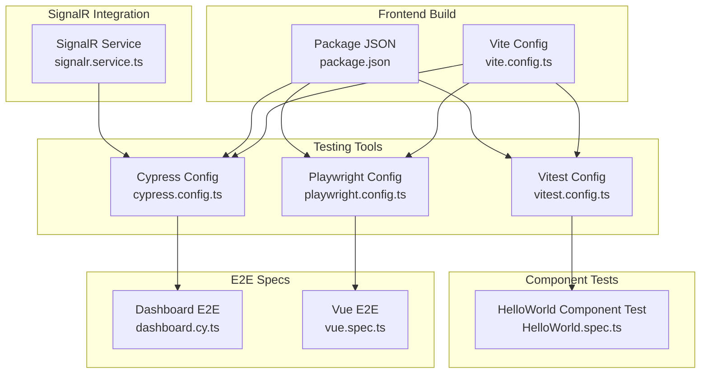
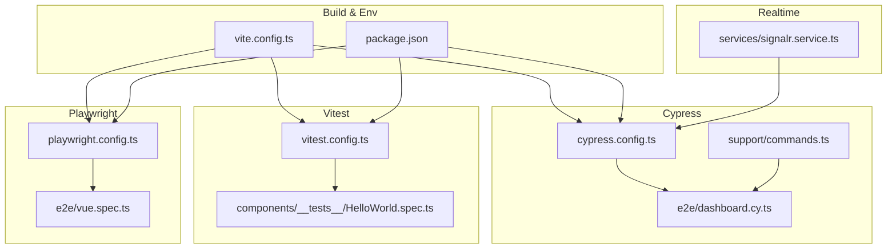
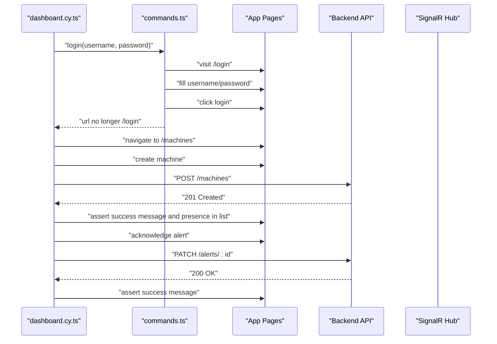
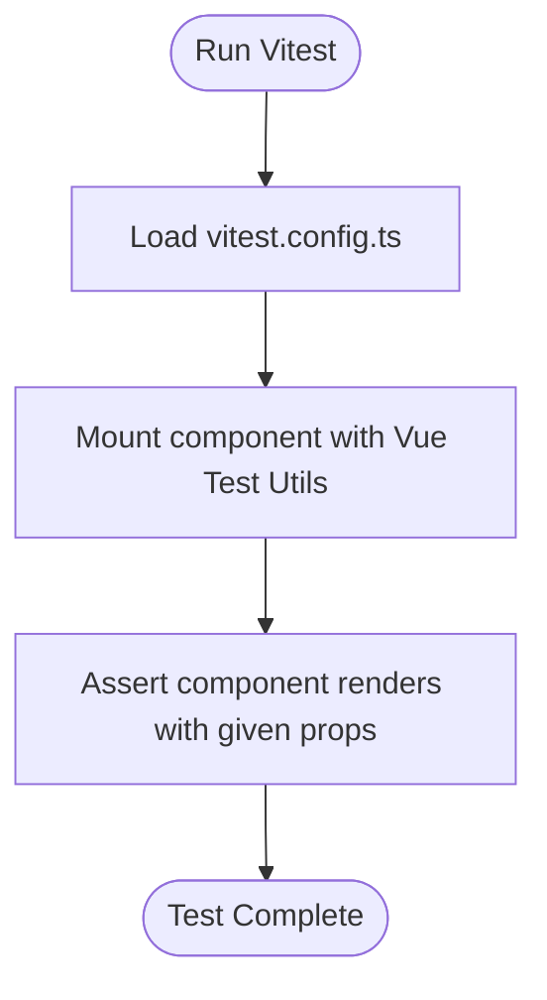
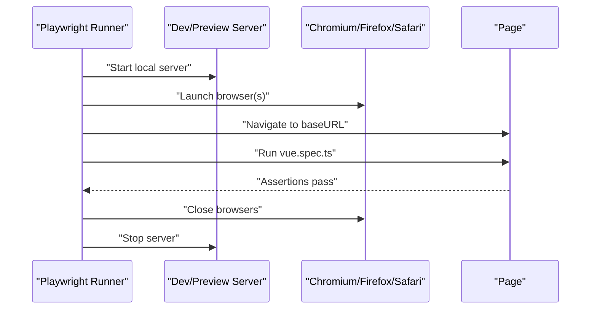
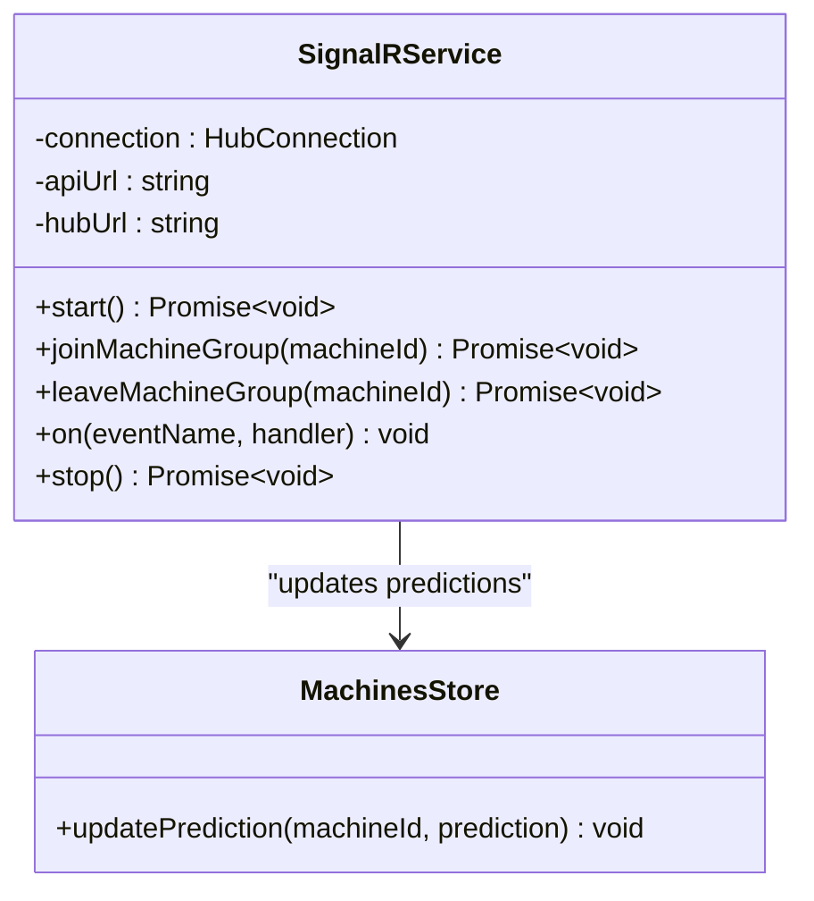
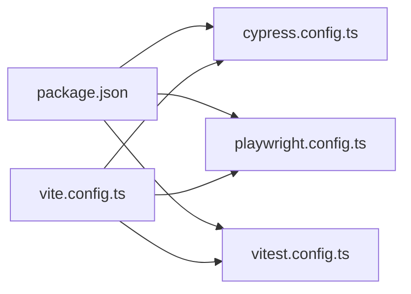

# Frontend Testing and UI Validation

<cite>
**Referenced Files in This Document**
- [package.json](file://src/frontend/package.json)
- [vite.config.ts](file://src/frontend/vite.config.ts)
- [cypress.config.ts](file://src/ui/digital-twin-dashboard/cypress.config.ts)
- [playwright.config.ts](file://src/ui/digital-twin-dashboard/playwright.config.ts)
- [vitest.config.ts](file://src/ui/digital-twin-dashboard/vitest.config.ts)
- [commands.ts](file://src/ui/digital-twin-dashboard/cypress/support/commands.ts)
- [e2e.ts](file://src/ui/digital-twin-dashboard/cypress/support/e2e.ts)
- [dashboard.cy.ts](file://src/ui/digital-twin-dashboard/cypress/e2e/dashboard.cy.ts)
- [HelloWorld.spec.ts](file://src/ui/digital-twin-dashboard/src/components/__tests__/HelloWorld.spec.ts)
- [signalr.service.ts](file://src/ui/digital-twin-dashboard/src/services/signalr.service.ts)
- [vue.spec.ts](file://src/ui/digital-twin-dashboard/e2e/vue.spec.ts)
</cite>

## Table of Contents
1. [Introduction](#introduction)
2. [Project Structure](#project-structure)
3. [Core Components](#core-components)
4. [Architecture Overview](#architecture-overview)
5. [Detailed Component Analysis](#detailed-component-analysis)
6. [Dependency Analysis](#dependency-analysis)
7. [Performance Considerations](#performance-considerations)
8. [Troubleshooting Guide](#troubleshooting-guide)
9. [Conclusion](#conclusion)
10. [Appendices](#appendices)

## Introduction
This document provides comprehensive guidance for frontend testing and UI validation tailored to industrial dashboard applications built with Vue.js. It focuses on end-to-end testing with Cypress, component testing with Vitest, cross-browser compatibility via Playwright, and specialized validation for real-time dashboards powered by SignalR. Practical examples target machine monitoring interfaces, predictive analytics dashboards, and administrative panels, while also covering accessibility, responsive design, form validation, authentication flows, and visual regression strategies.

## Project Structure
The testing stack is organized across three primary frameworks:
- Cypress for E2E testing of authentication, navigation, CRUD operations, alerts, performance monitoring, and responsive layouts.
- Vitest for unit and component tests using Vue Test Utils.
- Playwright for cross-browser compatibility and baseline E2E scenarios.

Key configuration files establish environment-specific behavior, proxying for APIs and SignalR hubs, and test runner environments.

**Diagram sources**
- [cypress.config.ts](file://src/ui/digital-twin-dashboard/cypress.config.ts#L1-L50)
- [playwright.config.ts](file://src/ui/digital-twin-dashboard/playwright.config.ts#L1-L111)
- [vitest.config.ts](file://src/ui/digital-twin-dashboard/vitest.config.ts#L1-L15)
- [vite.config.ts](file://src/frontend/vite.config.ts#L1-L48)
- [package.json](file://src/frontend/package.json#L1-L44)
- [dashboard.cy.ts](file://src/ui/digital-twin-dashboard/cypress/e2e/dashboard.cy.ts#L1-L163)
- [vue.spec.ts](file://src/ui/digital-twin-dashboard/e2e/vue.spec.ts#L1-L9)
- [HelloWorld.spec.ts](file://src/ui/digital-twin-dashboard/src/components/__tests__/HelloWorld.spec.ts#L1-L12)
- [signalr.service.ts](file://src/ui/digital-twin-dashboard/src/services/signalr.service.ts#L1-L62)

**Section sources**
- [cypress.config.ts](file://src/ui/digital-twin-dashboard/cypress.config.ts#L1-L50)
- [playwright.config.ts](file://src/ui/digital-twin-dashboard/playwright.config.ts#L1-L111)
- [vitest.config.ts](file://src/ui/digital-twin-dashboard/vitest.config.ts#L1-L15)
- [vite.config.ts](file://src/frontend/vite.config.ts#L1-L48)
- [package.json](file://src/frontend/package.json#L1-L44)

## Core Components
- Cypress E2E suite validates authentication, navigation, machine management, alerts, performance monitoring, and responsive behavior. It leverages custom commands for streamlined login and reusable assertions.
- Vitest component tests validate isolated UI components using Vue Test Utils.
- Playwright ensures cross-browser compatibility across Chromium, Firefox, and WebKit.
- SignalR service integrates real-time telemetry and predictions, enabling targeted testing strategies for live data updates.

Practical examples:
- Machine monitoring interfaces: end-to-end tests cover creation, filtering, and acknowledgment flows.
- Predictive analytics dashboards: tests validate chart visibility and status indicators.
- Administrative panels: tests cover navigation and dashboard entry points.

**Section sources**
- [dashboard.cy.ts](file://src/ui/digital-twin-dashboard/cypress/e2e/dashboard.cy.ts#L1-L163)
- [HelloWorld.spec.ts](file://src/ui/digital-twin-dashboard/src/components/__tests__/HelloWorld.spec.ts#L1-L12)
- [signalr.service.ts](file://src/ui/digital-twin-dashboard/src/services/signalr.service.ts#L1-L62)

## Architecture Overview
The testing architecture separates concerns across frameworks:
- Cypress orchestrates browser-based E2E flows with custom commands and environment variables.
- Vitest runs component tests in a jsdom environment, excluding E2E paths.
- Playwright executes tests against multiple browsers and devices, using a local dev server by default and preview server on CI.
- Vite configuration provides aliases, proxying for API and SignalR hub traffic, and chunking for performance.

**Diagram sources**
- [cypress.config.ts](file://src/ui/digital-twin-dashboard/cypress.config.ts#L1-L50)
- [commands.ts](file://src/ui/digital-twin-dashboard/cypress/support/commands.ts#L1-L21)
- [dashboard.cy.ts](file://src/ui/digital-twin-dashboard/cypress/e2e/dashboard.cy.ts#L1-L163)
- [vitest.config.ts](file://src/ui/digital-twin-dashboard/vitest.config.ts#L1-L15)
- [HelloWorld.spec.ts](file://src/ui/digital-twin-dashboard/src/components/__tests__/HelloWorld.spec.ts#L1-L12)
- [playwright.config.ts](file://src/ui/digital-twin-dashboard/playwright.config.ts#L1-L111)
- [vue.spec.ts](file://src/ui/digital-twin-dashboard/e2e/vue.spec.ts#L1-L9)
- [vite.config.ts](file://src/frontend/vite.config.ts#L1-L48)
- [package.json](file://src/frontend/package.json#L1-L44)
- [signalr.service.ts](file://src/ui/digital-twin-dashboard/src/services/signalr.service.ts#L1-L62)

## Detailed Component Analysis

### Cypress Configuration and E2E Patterns
- Centralized configuration defines timeouts, viewport, retries, environment variables, and spec discovery.
- Custom commands encapsulate repeated actions like login, reducing duplication and improving readability.
- E2E specs cover authentication, navigation, CRUD operations, alerts, performance monitoring, and responsive layouts.

**Diagram sources**
- [dashboard.cy.ts](file://src/ui/digital-twin-dashboard/cypress/e2e/dashboard.cy.ts#L1-L163)
- [commands.ts](file://src/ui/digital-twin-dashboard/cypress/support/commands.ts#L1-L21)

**Section sources**
- [cypress.config.ts](file://src/ui/digital-twin-dashboard/cypress.config.ts#L1-L50)
- [commands.ts](file://src/ui/digital-twin-dashboard/cypress/support/commands.ts#L1-L21)
- [dashboard.cy.ts](file://src/ui/digital-twin-dashboard/cypress/e2e/dashboard.cy.ts#L1-L163)

### Component Testing with Vitest
- Vitest configuration merges Vite settings and sets the jsdom environment for component isolation.
- Example component test demonstrates mounting a component with props and asserting rendered text.

**Diagram sources**
- [vitest.config.ts](file://src/ui/digital-twin-dashboard/vitest.config.ts#L1-L15)
- [HelloWorld.spec.ts](file://src/ui/digital-twin-dashboard/src/components/__tests__/HelloWorld.spec.ts#L1-L12)

**Section sources**
- [vitest.config.ts](file://src/ui/digital-twin-dashboard/vitest.config.ts#L1-L15)
- [HelloWorld.spec.ts](file://src/ui/digital-twin-dashboard/src/components/__tests__/HelloWorld.spec.ts#L1-L12)

### Cross-Browser Compatibility with Playwright
- Playwright projects target Chromium, Firefox, and WebKit, with optional mobile device emulation.
- Local development server is reused by default; CI uses the preview server for realistic builds.
- Baseline E2E scenario validates basic routing and rendering.

**Diagram sources**
- [playwright.config.ts](file://src/ui/digital-twin-dashboard/playwright.config.ts#L1-L111)
- [vue.spec.ts](file://src/ui/digital-twin-dashboard/e2e/vue.spec.ts#L1-L9)

**Section sources**
- [playwright.config.ts](file://src/ui/digital-twin-dashboard/playwright.config.ts#L1-L111)
- [vue.spec.ts](file://src/ui/digital-twin-dashboard/e2e/vue.spec.ts#L1-L9)

### SignalR Integration Testing
- SignalR service establishes a persistent connection, listens for telemetry and prediction events, and supports joining/leaving groups.
- Integration tests should simulate connection lifecycle, event reception, and group membership actions.

**Diagram sources**
- [signalr.service.ts](file://src/ui/digital-twin-dashboard/src/services/signalr.service.ts#L1-L62)

**Section sources**
- [signalr.service.ts](file://src/ui/digital-twin-dashboard/src/services/signalr.service.ts#L1-L62)

### Interactive Chart Validation
- Charts are integrated via ApexCharts and Vue ApexCharts. Tests should assert chart visibility, data rendering, and responsiveness.
- For real-time dashboards, tests should validate that new data points update existing charts without flicker or layout shifts.

Guidelines:
- Use Cypress to assert chart containers are visible after navigation.
- Validate that chart series reflect recent telemetry/predictions.
- Confirm tooltips and legends remain accessible and readable across viewport sizes.

[No sources needed since this section provides general guidance]

### Accessibility Testing
- Integrate automated accessibility checks using pa11y or axe-core in CI.
- Ensure keyboard navigation, ARIA attributes, and color contrast meet WCAG guidelines.
- Validate focus order and skip links for efficient screen reader navigation.

[No sources needed since this section provides general guidance]

### Responsive Design Testing
- Cypress viewport controls enable device-specific testing for phones and tablets.
- Validate collapsible menus, grid rearrangements, and touch-friendly controls.
- Confirm critical widgets (dashboards, alerts, forms) remain usable on smaller screens.

**Section sources**
- [cypress.config.ts](file://src/ui/digital-twin-dashboard/cypress.config.ts#L1-L50)
- [dashboard.cy.ts](file://src/ui/digital-twin-dashboard/cypress/e2e/dashboard.cy.ts#L144-L162)

### Form Validation and Authentication Flows
- Authentication tests cover successful login, error messaging, and protected route redirection.
- Form tests should validate required fields, type constraints, and submission outcomes.
- Use Cypress assertions to confirm error messages and success notifications appear as expected.

**Section sources**
- [dashboard.cy.ts](file://src/ui/digital-twin-dashboard/cypress/e2e/dashboard.cy.ts#L11-L36)
- [commands.ts](file://src/ui/digital-twin-dashboard/cypress/support/commands.ts#L1-L21)

### Real-Time Data Visualization Components
- SignalR-driven updates should trigger immediate UI refreshes; tests should verify that new data arrives and is reflected in charts and status indicators.
- Validate that reconnect logic resumes subscriptions seamlessly after transient failures.

**Section sources**
- [signalr.service.ts](file://src/ui/digital-twin-dashboard/src/services/signalr.service.ts#L1-L62)
- [dashboard.cy.ts](file://src/ui/digital-twin-dashboard/cypress/e2e/dashboard.cy.ts#L130-L142)

### Visual Regression Testing
- Implement screenshot comparisons using tools like Applitools or Percy to detect unintended UI changes.
- Focus on critical dashboard regions, alert panels, and administrative forms.
- Run visual regression tests nightly or on PRs targeting UI-heavy branches.

[No sources needed since this section provides general guidance]

### User Experience Validation
- Validate smooth transitions, loading states, and empty states for lists and charts.
- Ensure consistent spacing, typography, and color usage across pages.
- Test long-running operations with progress indicators and cancellation pathways.

[No sources needed since this section provides general guidance]

## Dependency Analysis
Testing dependencies are primarily managed via Vite and package scripts. Cypress, Playwright, and Vitest rely on Vite’s configuration for aliases and proxying, ensuring tests can reach both REST APIs and SignalR hubs during development.

**Diagram sources**
- [package.json](file://src/frontend/package.json#L1-L44)
- [vite.config.ts](file://src/frontend/vite.config.ts#L1-L48)
- [cypress.config.ts](file://src/ui/digital-twin-dashboard/cypress.config.ts#L1-L50)
- [playwright.config.ts](file://src/ui/digital-twin-dashboard/playwright.config.ts#L1-L111)
- [vitest.config.ts](file://src/ui/digital-twin-dashboard/vitest.config.ts#L1-L15)

**Section sources**
- [package.json](file://src/frontend/package.json#L1-L44)
- [vite.config.ts](file://src/frontend/vite.config.ts#L1-L48)

## Performance Considerations
- Prefer component tests for fast, isolated validations; reserve E2E tests for integration and user journeys.
- Use Cypress retries judiciously to mitigate flakiness without masking genuine issues.
- Keep test assets small and leverage Vite’s chunking to minimize bundle overhead in CI.
- For SignalR-heavy tests, simulate connection events and throttle data streams to avoid network saturation.

[No sources needed since this section provides general guidance]

## Troubleshooting Guide
Common issues and resolutions:
- Authentication loops: verify baseUrl and login command behavior; ensure cookies/session are cleared between runs.
- Proxy failures: confirm Vite proxy targets match backend ports and CORS settings.
- SignalR connectivity: validate hub URLs and automatic reconnect behavior; test fallbacks for transient errors.
- Cross-browser flakiness: reduce concurrency on CI; capture traces on failure; adjust timeouts for slower browsers.

**Section sources**
- [cypress.config.ts](file://src/ui/digital-twin-dashboard/cypress.config.ts#L1-L50)
- [playwright.config.ts](file://src/ui/digital-twin-dashboard/playwright.config.ts#L1-L111)
- [signalr.service.ts](file://src/ui/digital-twin-dashboard/src/services/signalr.service.ts#L1-L62)

## Conclusion
By combining Cypress E2E tests, Vitest component tests, and Playwright cross-browser validation, this project achieves robust coverage for industrial dashboard applications. Special attention to SignalR integration, responsive design, accessibility, and visual regression ensures reliable user experiences across diverse environments and devices.

[No sources needed since this section summarizes without analyzing specific files]

## Appendices
- Example test categories to implement:
  - Machine monitoring: create, filter, acknowledge, and delete operations.
  - Predictive analytics: render charts, update with predictions, and handle empty states.
  - Administrative panels: manage users, roles, and tenant settings with proper authorization checks.

[No sources needed since this section provides general guidance]