# Integration Testing and API Validation

<cite>
**Referenced Files in This Document**
- [IntegrationTestFixture.cs](file://src/api/DigitalTwinPlatform.Tests/Integration/IntegrationTestFixture.cs)
- [ApiIntegrationTests.cs](file://src/api/DigitalTwinPlatform.Tests/Integration/ApiIntegrationTests.cs)
- [CoreIntegrationTests.cs](file://src/api/DigitalTwinPlatform.Tests/Integration/CoreIntegrationTests.cs)
- [DigitalTwinLifecycleIntegrationTests.cs](file://src/api/DigitalTwinPlatform.Tests/Integration/DigitalTwinLifecycleIntegrationTests.cs)
- [MLPipelineIntegrationTests.cs](file://src/api/DigitalTwinPlatform.Tests/Integration/MLPipelineIntegrationTests.cs)
- [SimulationIntegrationTests.cs](file://src/api/DigitalTwinPlatform.Tests/Integration/SimulationIntegrationTests.cs)
- [TelemetryController.cs](file://src/api/DigitalTwinPlatform.API/Controllers/TelemetryController.cs)
- [PredictionsController.cs](file://src/api/DigitalTwinPlatform.API/Controllers/PredictionsController.cs)
- [MathematicalModelingController.cs](file://src/api/DigitalTwinPlatform.API/Controllers/MathematicalModelingController.cs)
- [TelemetryHub.cs](file://src/api/DigitalTwinPlatform.API/Hubs/TelemetryHub.cs)
- [RealTimeAnalyticsHub.cs](file://src/api/DigitalTwinPlatform.API/Hubs/RealTimeAnalyticsHub.cs)
- [DigitalTwinDbContext.cs](file://src/api/DigitalTwinPlatform.Infrastructure/Persistence/DigitalTwinDbContext.cs)
- [UnitOfWork.cs](file://src/api/DigitalTwinPlatform.Infrastructure/Persistence/UnitOfWork/UnitOfWork.cs)
- [IUnitOfWork.cs](file://src/api/DigitalTwinPlatform.Application/Abstractions/UnitOfWork/IUnitOfWork.cs)
- [TransactionBehavior.cs](file://src/api/DigitalTwinPlatform.Application/Behaviors/TransactionBehavior.cs)
</cite>

## Table of Contents
1. [Introduction](#introduction)
2. [Project Structure](#project-structure)
3. [Core Components](#core-components)
4. [Architecture Overview](#architecture-overview)
5. [Detailed Component Analysis](#detailed-component-analysis)
6. [Dependency Analysis](#dependency-analysis)
7. [Performance Considerations](#performance-considerations)
8. [Troubleshooting Guide](#troubleshooting-guide)
9. [Conclusion](#conclusion)

## Introduction
This document provides comprehensive guidance for integration testing and API validation across the Digital Twin Platform. It explains the integration test architecture using IntegrationTestFixture, sequential test execution patterns, and database isolation strategies. It documents API endpoint testing patterns including CRUD operations, real-time telemetry ingestion, and prediction pipeline validation. It covers test data setup, fixture management, and cleanup procedures. It includes detailed examples of testing SignalR real-time communication, mathematical modeling endpoints, and advanced analytics workflows. It addresses database integration testing, transaction handling, and data consistency validation, along with guidance on testing error handling, authentication flows, and system boundary validation across all application layers.

## Project Structure
The integration testing suite is organized under the DigitalTwinPlatform.Tests project with a dedicated Integration folder. The suite leverages a shared IntegrationTestFixture that bootstraps an in-memory database and provides a configured HttpClient for authenticated API calls. Tests are grouped by functional areas: basic API coverage, lifecycle workflows, machine learning pipelines, and simulation workflows.

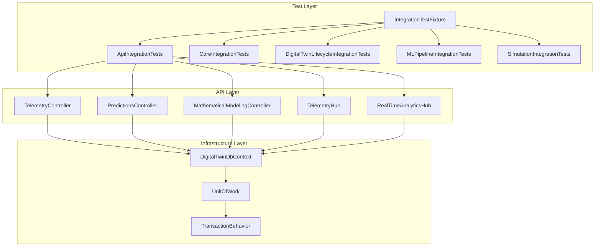

**Diagram sources**
- [IntegrationTestFixture.cs](file://src/api/DigitalTwinPlatform.Tests/Integration/IntegrationTestFixture.cs#L1-L101)
- [ApiIntegrationTests.cs](file://src/api/DigitalTwinPlatform.Tests/Integration/ApiIntegrationTests.cs#L1-L465)
- [TelemetryController.cs](file://src/api/DigitalTwinPlatform.API/Controllers/TelemetryController.cs#L1-L202)
- [PredictionsController.cs](file://src/api/DigitalTwinPlatform.API/Controllers/PredictionsController.cs#L1-L435)
- [MathematicalModelingController.cs](file://src/api/DigitalTwinPlatform.API/Controllers/MathematicalModelingController.cs#L1-L514)
- [TelemetryHub.cs](file://src/api/DigitalTwinPlatform.API/Hubs/TelemetryHub.cs#L1-L211)
- [RealTimeAnalyticsHub.cs](file://src/api/DigitalTwinPlatform.API/Hubs/RealTimeAnalyticsHub.cs#L1-L310)
- [DigitalTwinDbContext.cs](file://src/api/DigitalTwinPlatform.Infrastructure/Persistence/DigitalTwinDbContext.cs#L1-L400)
- [UnitOfWork.cs](file://src/api/DigitalTwinPlatform.Infrastructure/Persistence/UnitOfWork/UnitOfWork.cs#L1-L101)
- [TransactionBehavior.cs](file://src/api/DigitalTwinPlatform.Application/Behaviors/TransactionBehavior.cs#L1-L35)

**Section sources**
- [IntegrationTestFixture.cs](file://src/api/DigitalTwinPlatform.Tests/Integration/IntegrationTestFixture.cs#L1-L101)
- [ApiIntegrationTests.cs](file://src/api/DigitalTwinPlatform.Tests/Integration/ApiIntegrationTests.cs#L1-L465)

## Core Components
- IntegrationTestFixture: Creates a WebApplicationFactory with an in-memory database, removes interfering hosted services, and provides a configured HttpClient with default authentication headers. It exposes scoped services for test access.
- Sequential Collections: Tests are grouped in a "Sequential" collection to prevent concurrent access to shared in-memory database resources.
- Database Isolation: Uses an in-memory database per test fixture to isolate state and enable fast, repeatable tests.

Key responsibilities:
- Bootstrapping the ASP.NET Core application in a test environment
- Providing a clean, isolated database for each test fixture
- Supplying authenticated HTTP clients for API tests
- Managing test lifecycle and resource disposal

**Section sources**
- [IntegrationTestFixture.cs](file://src/api/DigitalTwinPlatform.Tests/Integration/IntegrationTestFixture.cs#L11-L93)

## Architecture Overview
The integration tests validate end-to-end flows spanning API controllers, hubs, persistence, and application services. The test architecture ensures:
- Sequential execution to avoid concurrency conflicts
- In-memory database isolation for deterministic outcomes
- Realistic HTTP and SignalR interactions
- Transactional boundaries enforced by Unit of Work and MediatR pipeline behaviors

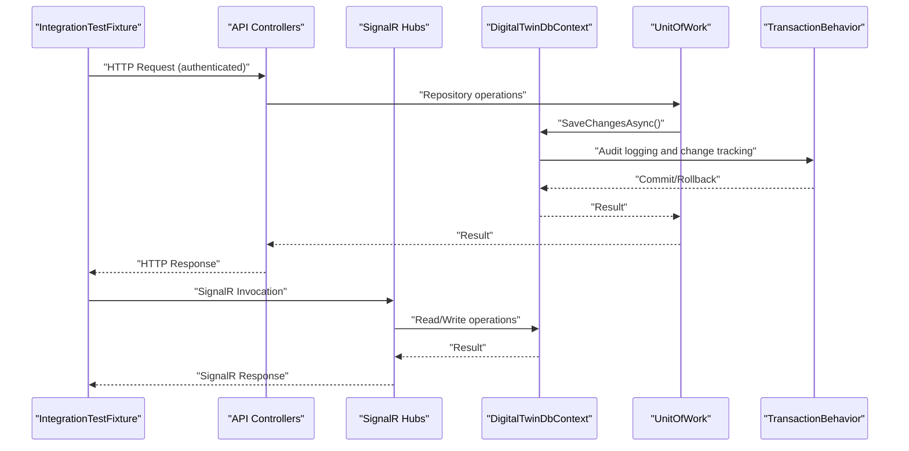

**Diagram sources**
- [IntegrationTestFixture.cs](file://src/api/DigitalTwinPlatform.Tests/Integration/IntegrationTestFixture.cs#L17-L76)
- [DigitalTwinDbContext.cs](file://src/api/DigitalTwinPlatform.Infrastructure/Persistence/DigitalTwinDbContext.cs#L47-L91)
- [UnitOfWork.cs](file://src/api/DigitalTwinPlatform.Infrastructure/Persistence/UnitOfWork/UnitOfWork.cs#L28-L87)
- [TransactionBehavior.cs](file://src/api/DigitalTwinPlatform.Application/Behaviors/TransactionBehavior.cs#L14-L33)

## Detailed Component Analysis

### Integration Test Fixture and Sequential Execution
- WebApplicationFactory bootstraps the application with the "Testing" environment and replaces the production DbContext with an in-memory provider.
- Hosted services are removed to avoid background processing interference.
- HttpClient defaults include Authorization and tenant headers for authenticated endpoints.
- Sequential collections ensure tests run one after another to prevent database contention.

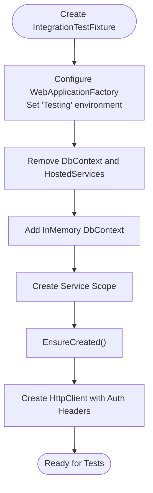

**Diagram sources**
- [IntegrationTestFixture.cs](file://src/api/DigitalTwinPlatform.Tests/Integration/IntegrationTestFixture.cs#L17-L54)

**Section sources**
- [IntegrationTestFixture.cs](file://src/api/DigitalTwinPlatform.Tests/Integration/IntegrationTestFixture.cs#L17-L76)

### API Endpoint Testing Patterns
- CRUD Operations: Machines CRUD endpoints are validated end-to-end, including creation, retrieval, updates, and deletion.
- Telemetry Ingestion and Querying: Validates ingestion acceptance and subsequent retrieval of telemetry data.
- Predictions Pipeline: Exercises prediction generation, health classification, and anomaly detection endpoints.
- Mathematical Modeling: Tests ODE solving, system dynamics, optimization endpoints, and model catalogs.
- Advanced Analytics: Verifies dashboard composition and analytics results.

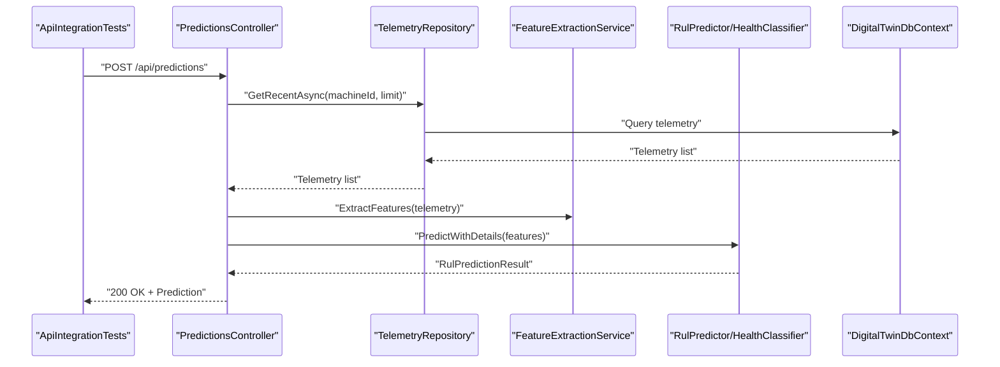

**Diagram sources**
- [ApiIntegrationTests.cs](file://src/api/DigitalTwinPlatform.Tests/Integration/ApiIntegrationTests.cs#L150-L171)
- [PredictionsController.cs](file://src/api/DigitalTwinPlatform.API/Controllers/PredictionsController.cs#L39-L75)

**Section sources**
- [ApiIntegrationTests.cs](file://src/api/DigitalTwinPlatform.Tests/Integration/ApiIntegrationTests.cs#L42-L171)
- [PredictionsController.cs](file://src/api/DigitalTwinPlatform.API/Controllers/PredictionsController.cs#L39-L120)

### Real-Time Telemetry and Analytics Streaming
- TelemetryHub: Supports subscription to machine-specific telemetry streams, broadcasting telemetry updates to subscribed clients.
- RealTimeAnalyticsHub: Manages subscriptions to predictions, alerts, and system health, broadcasting updates to groups.
- Frontend integration: The UI connects to SignalR hubs using access tokens and automatic reconnection strategies.

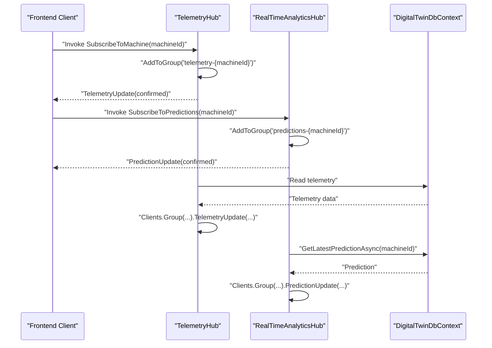

**Diagram sources**
- [TelemetryHub.cs](file://src/api/DigitalTwinPlatform.API/Hubs/TelemetryHub.cs#L33-L62)
- [RealTimeAnalyticsHub.cs](file://src/api/DigitalTwinPlatform.API/Hubs/RealTimeAnalyticsHub.cs#L37-L55)
- [RealTimeAnalyticsHub.cs](file://src/api/DigitalTwinPlatform.API/Hubs/RealTimeAnalyticsHub.cs#L196-L222)

**Section sources**
- [TelemetryHub.cs](file://src/api/DigitalTwinPlatform.API/Hubs/TelemetryHub.cs#L33-L103)
- [RealTimeAnalyticsHub.cs](file://src/api/DigitalTwinPlatform.API/Hubs/RealTimeAnalyticsHub.cs#L37-L172)

### Mathematical Modeling Endpoints
- ODE Solving: Validates request parsing, solver invocation, and response structure.
- System Dynamics: Tests catalog retrieval and dynamic model solving with derived quantities.
- Optimization: Covers gradient-based, genetic, and multi-objective optimization endpoints.
- Catalog Retrieval: Ensures predefined system models are available.

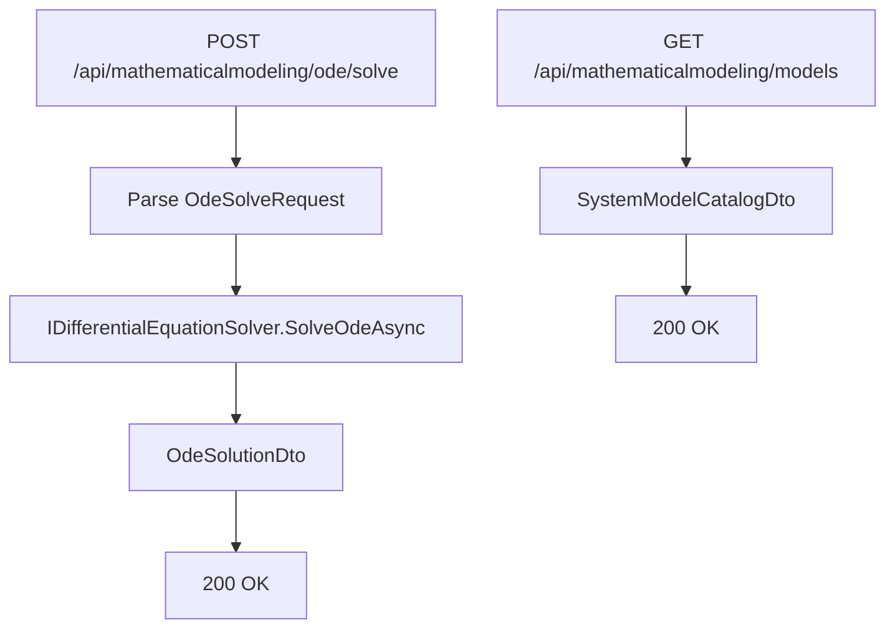

**Diagram sources**
- [MathematicalModelingController.cs](file://src/api/DigitalTwinPlatform.API/Controllers/MathematicalModelingController.cs#L27-L62)
- [MathematicalModelingController.cs](file://src/api/DigitalTwinPlatform.API/Controllers/MathematicalModelingController.cs#L272-L307)

**Section sources**
- [MathematicalModelingController.cs](file://src/api/DigitalTwinPlatform.API/Controllers/MathematicalModelingController.cs#L27-L115)
- [MathematicalModelingController.cs](file://src/api/DigitalTwinPlatform.API/Controllers/MathematicalModelingController.cs#L272-L307)

### Machine Learning Pipeline Validation
- Training and Serving: Validates model training initiation, status polling, and serving endpoints.
- Model Lifecycle: Registers, stages, and promotes models through development, staging, and production.
- XAI Explanations: Tests SHAP explanations and global feature importance.
- Synthetic Data Integration: Generates synthetic datasets and validates quality for training.
- Drift Detection and Retraining: Detects concept drift and triggers automated retraining.

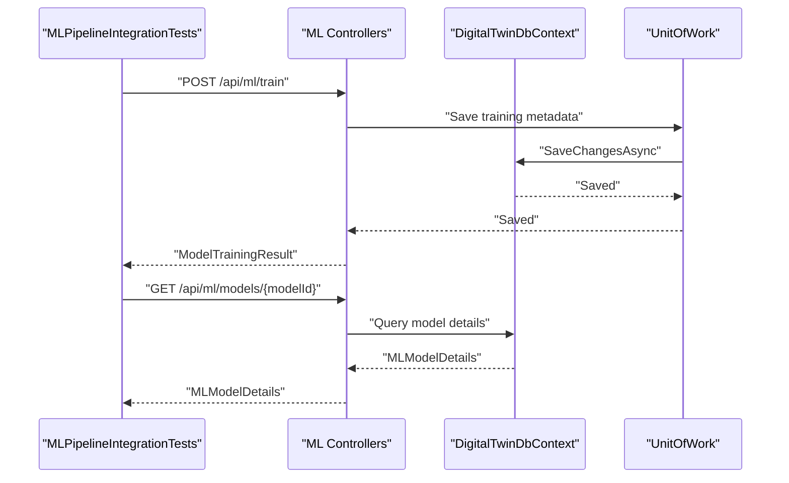

**Diagram sources**
- [MLPipelineIntegrationTests.cs](file://src/api/DigitalTwinPlatform.Tests/Integration/MLPipelineIntegrationTests.cs#L29-L113)
- [DigitalTwinDbContext.cs](file://src/api/DigitalTwinPlatform.Infrastructure/Persistence/DigitalTwinDbContext.cs#L256-L284)
- [UnitOfWork.cs](file://src/api/DigitalTwinPlatform.Infrastructure/Persistence/UnitOfWork/UnitOfWork.cs#L28-L43)

**Section sources**
- [MLPipelineIntegrationTests.cs](file://src/api/DigitalTwinPlatform.Tests/Integration/MLPipelineIntegrationTests.cs#L29-L113)
- [DigitalTwinDbContext.cs](file://src/api/DigitalTwinPlatform.Infrastructure/Persistence/DigitalTwinDbContext.cs#L256-L284)
- [UnitOfWork.cs](file://src/api/DigitalTwinPlatform.Infrastructure/Persistence/UnitOfWork/UnitOfWork.cs#L28-L43)

### Simulation Workflows
- Simulation Lifecycle: Starts simulations, monitors progress, retrieves results, and cancels when needed.
- Run-to-Failure: Generates degradation trajectories with configurable models and thresholds.
- Configuration-Driven: Uses machine configurations to drive simulation parameters.
- Telemetry Integration: Generates telemetry data and persists it for downstream analytics.
- Batch Processing: Executes multiple simulations concurrently with progress tracking.

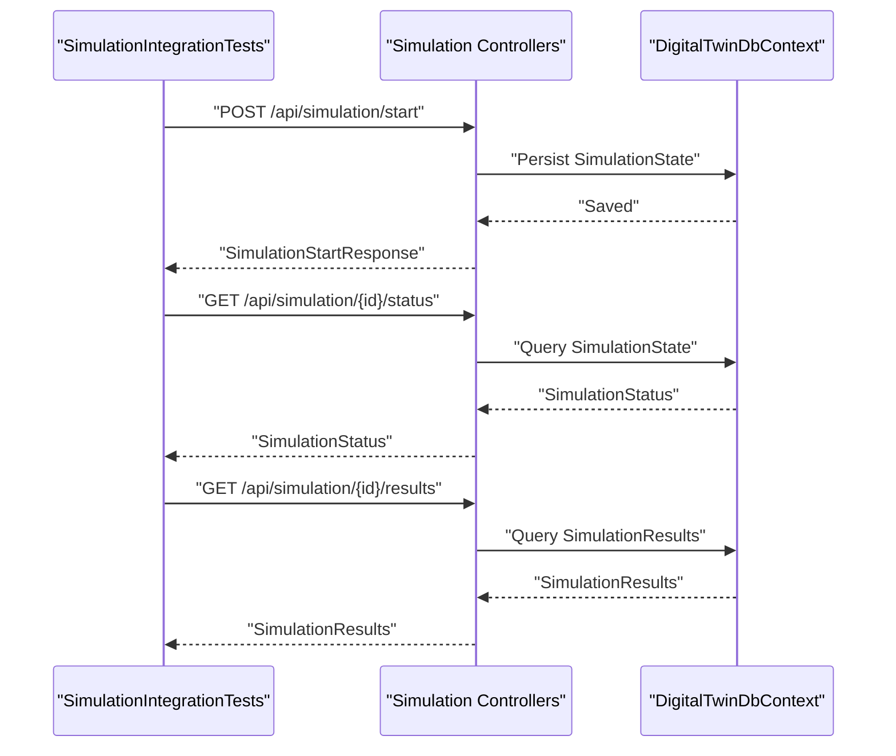

**Diagram sources**
- [SimulationIntegrationTests.cs](file://src/api/DigitalTwinPlatform.Tests/Integration/SimulationIntegrationTests.cs#L28-L88)
- [DigitalTwinDbContext.cs](file://src/api/DigitalTwinPlatform.Infrastructure/Persistence/DigitalTwinDbContext.cs#L286-L297)

**Section sources**
- [SimulationIntegrationTests.cs](file://src/api/DigitalTwinPlatform.Tests/Integration/SimulationIntegrationTests.cs#L28-L88)
- [DigitalTwinDbContext.cs](file://src/api/DigitalTwinPlatform.Infrastructure/Persistence/DigitalTwinDbContext.cs#L286-L297)

### Database Integration Testing and Transaction Handling
- Audit Logging: SaveChangesAsync intercepts entity changes and logs them to the AuditLog table.
- Unit of Work: Provides transactional boundaries, commit/rollback semantics, and concurrency handling.
- Transaction Behavior: MediatR pipeline behavior wraps command handlers in transactions, ensuring atomicity.

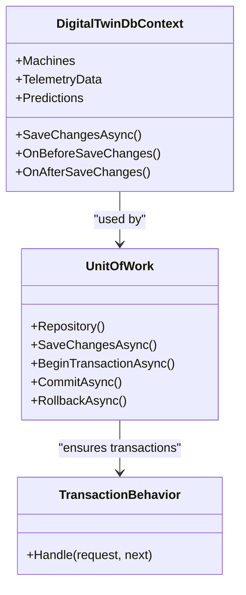

**Diagram sources**
- [DigitalTwinDbContext.cs](file://src/api/DigitalTwinPlatform.Infrastructure/Persistence/DigitalTwinDbContext.cs#L47-L91)
- [UnitOfWork.cs](file://src/api/DigitalTwinPlatform.Infrastructure/Persistence/UnitOfWork/UnitOfWork.cs#L9-L101)
- [TransactionBehavior.cs](file://src/api/DigitalTwinPlatform.Application/Behaviors/TransactionBehavior.cs#L10-L34)

**Section sources**
- [DigitalTwinDbContext.cs](file://src/api/DigitalTwinPlatform.Infrastructure/Persistence/DigitalTwinDbContext.cs#L47-L91)
- [UnitOfWork.cs](file://src/api/DigitalTwinPlatform.Infrastructure/Persistence/UnitOfWork/UnitOfWork.cs#L28-L87)
- [TransactionBehavior.cs](file://src/api/DigitalTwinPlatform.Application/Behaviors/TransactionBehavior.cs#L14-L33)

### Test Data Setup, Fixtures, and Cleanup
- Test Data Setup: Tests create machines, telemetry, and simulation data using HTTP endpoints and helper methods.
- Fixture Management: IntegrationTestFixture manages HttpClient creation, default headers, and scoped services.
- Cleanup Procedures: Lifecycle tests demonstrate deletion of telemetry, predictions, and machines to maintain isolation.

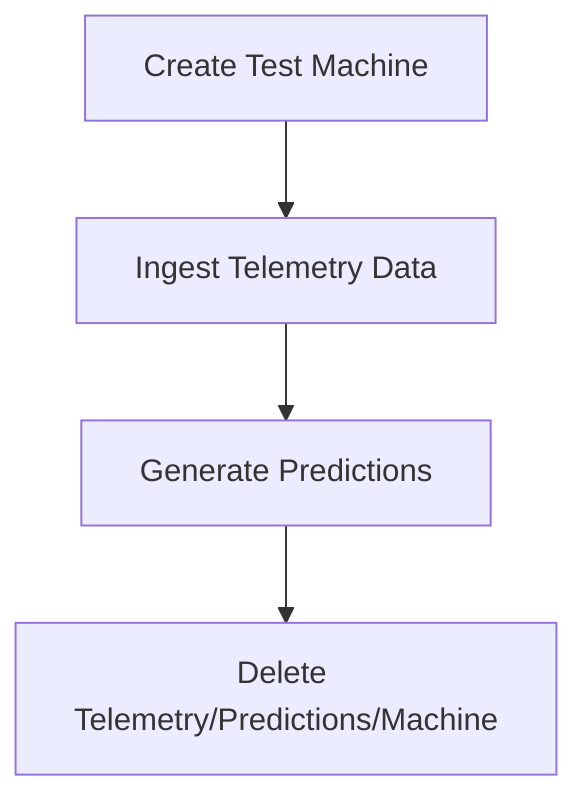

**Diagram sources**
- [ApiIntegrationTests.cs](file://src/api/DigitalTwinPlatform.Tests/Integration/ApiIntegrationTests.cs#L297-L340)
- [DigitalTwinLifecycleIntegrationTests.cs](file://src/api/DigitalTwinPlatform.Tests/Integration/DigitalTwinLifecycleIntegrationTests.cs#L332-L364)

**Section sources**
- [ApiIntegrationTests.cs](file://src/api/DigitalTwinPlatform.Tests/Integration/ApiIntegrationTests.cs#L297-L340)
- [DigitalTwinLifecycleIntegrationTests.cs](file://src/api/DigitalTwinPlatform.Tests/Integration/DigitalTwinLifecycleIntegrationTests.cs#L332-L364)

## Dependency Analysis
The integration tests depend on:
- Shared test fixture for environment and database isolation
- API controllers for endpoint validation
- SignalR hubs for real-time communication testing
- Persistence layer for data consistency checks
- Application services for business logic validation

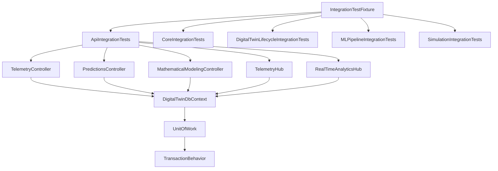

**Diagram sources**
- [IntegrationTestFixture.cs](file://src/api/DigitalTwinPlatform.Tests/Integration/IntegrationTestFixture.cs#L17-L76)
- [ApiIntegrationTests.cs](file://src/api/DigitalTwinPlatform.Tests/Integration/ApiIntegrationTests.cs#L12-L25)
- [DigitalTwinDbContext.cs](file://src/api/DigitalTwinPlatform.Infrastructure/Persistence/DigitalTwinDbContext.cs#L15-L40)
- [UnitOfWork.cs](file://src/api/DigitalTwinPlatform.Infrastructure/Persistence/UnitOfWork/UnitOfWork.cs#L9-L26)
- [TransactionBehavior.cs](file://src/api/DigitalTwinPlatform.Application/Behaviors/TransactionBehavior.cs#L10-L17)

**Section sources**
- [IntegrationTestFixture.cs](file://src/api/DigitalTwinPlatform.Tests/Integration/IntegrationTestFixture.cs#L17-L76)
- [ApiIntegrationTests.cs](file://src/api/DigitalTwinPlatform.Tests/Integration/ApiIntegrationTests.cs#L12-L25)

## Performance Considerations
- Sequential Collections: Prevents concurrent database access and reduces contention.
- In-Memory Database: Provides fast test execution with minimal overhead.
- Delayed Assertions: Allows asynchronous processing (e.g., telemetry ingestion) to complete before assertions.
- Batch Simulation Monitoring: Uses progress polling to avoid tight loops and reduce load.

## Troubleshooting Guide
Common issues and resolutions:
- Authentication Failures: Ensure HttpClient includes Authorization header and tenant context. Tests demonstrate removing default headers for unauthorized scenarios.
- Database Concurrency: Use UnitOfWork and TransactionBehavior to manage transactions and handle concurrency exceptions.
- SignalR Disconnections: Configure automatic reconnection and handle reconnection events in the frontend.
- Timeout Handling: Implement explicit waits for long-running operations (training, simulations) with timeouts.

**Section sources**
- [IntegrationTestFixture.cs](file://src/api/DigitalTwinPlatform.Tests/Integration/IntegrationTestFixture.cs#L57-L66)
- [UnitOfWork.cs](file://src/api/DigitalTwinPlatform.Infrastructure/Persistence/UnitOfWork/UnitOfWork.cs#L34-L42)
- [SimulationIntegrationTests.cs](file://src/api/DigitalTwinPlatform.Tests/Integration/SimulationIntegrationTests.cs#L391-L431)

## Conclusion
The integration testing framework provides robust, end-to-end validation of the Digital Twin Platform. By leveraging IntegrationTestFixture, sequential execution, and in-memory database isolation, it ensures reliable and repeatable tests across APIs, SignalR hubs, persistence, and application services. The documented patterns for CRUD operations, telemetry ingestion, prediction pipelines, mathematical modeling, ML lifecycle, and simulation workflows offer a comprehensive blueprint for maintaining system integrity and validating cross-layer functionality.