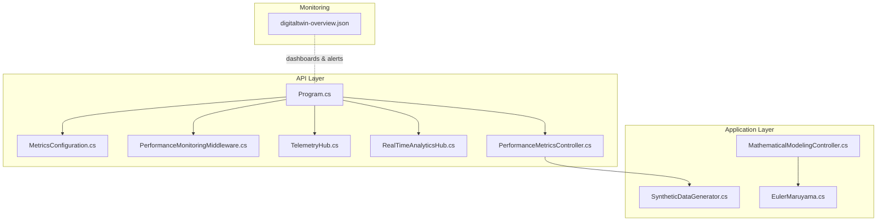
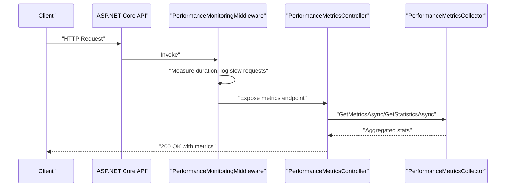
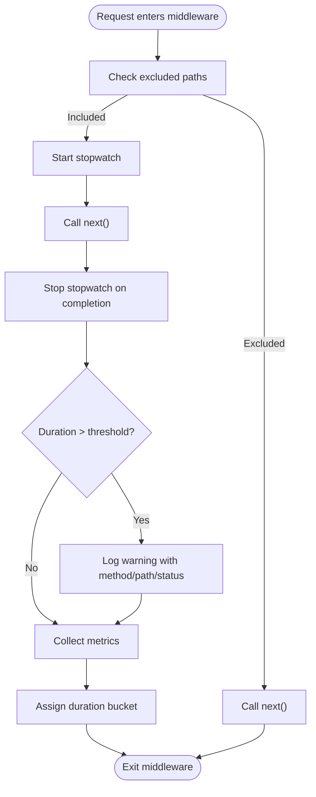
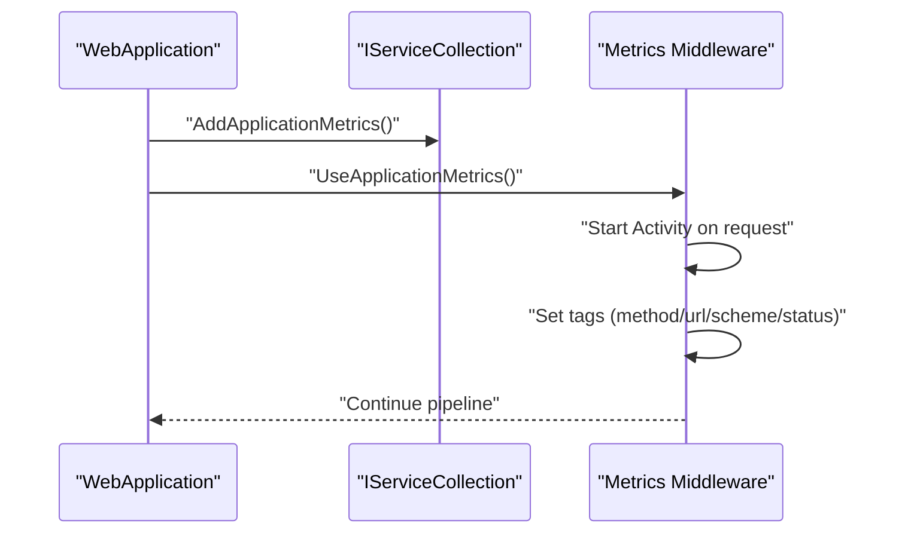
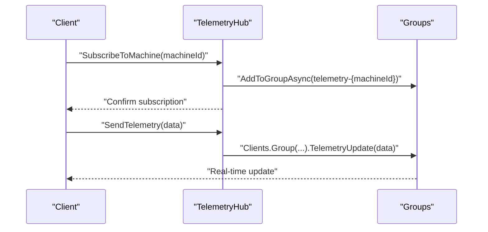
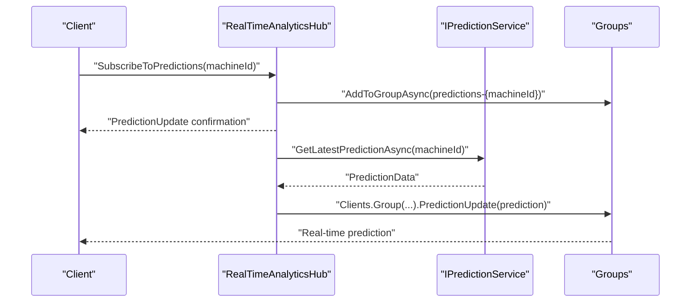
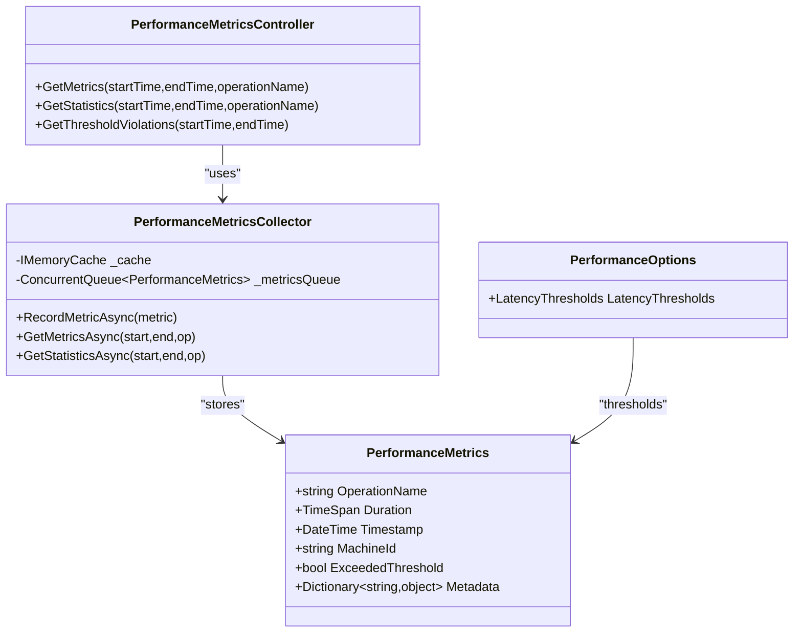
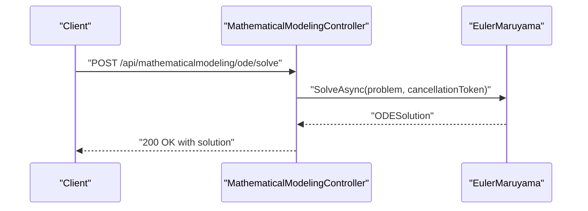
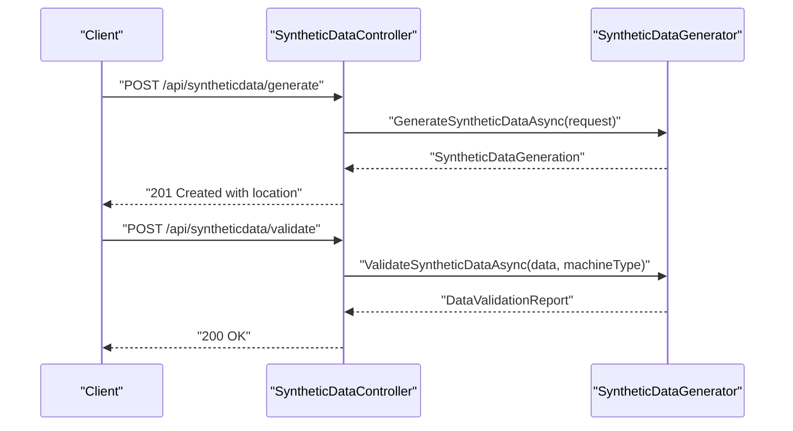
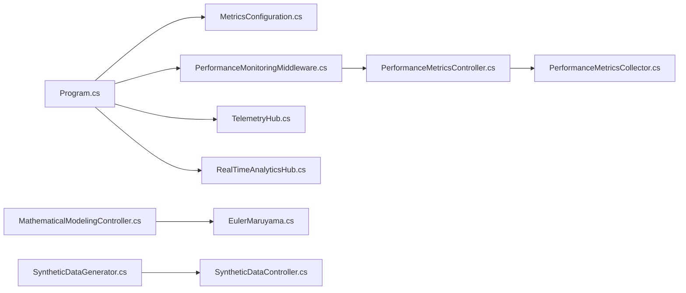

# Performance and Load Testing

<cite>
**Referenced Files in This Document**
- [Program.cs](file://src/api/DigitalTwinPlatform.API/Program.cs)
- [MetricsConfiguration.cs](file://src/api/DigitalTwinPlatform.API/Infrastructure/MetricsConfiguration.cs)
- [PerformanceMonitoringMiddleware.cs](file://src/api/DigitalTwinPlatform.API/Middleware/PerformanceMonitoringMiddleware.cs)
- [TelemetryHub.cs](file://src/api/DigitalTwinPlatform.API/Hubs/TelemetryHub.cs)
- [RealTimeAnalyticsHub.cs](file://src/api/DigitalTwinPlatform.API/Hubs/RealTimeAnalyticsHub.cs)
- [PerformanceMetricsController.cs](file://src/api/DigitalTwinPlatform.API/Controllers/PerformanceMetricsController.cs)
- [PerformanceMetricsCollector.cs](file://src/api/DigitalTwinPlatform.API/Services/Infrastructure/PerformanceMetricsCollector.cs)
- [PerformanceOptions.cs](file://src/api/DigitalTwinPlatform.API/Services/Infrastructure/PerformanceOptions.cs)
- [MathematicalModelingController.cs](file://src/api/DigitalTwinPlatform.API/Controllers/MathematicalModelingController.cs)
- [SyntheticDataController.cs](file://src/api/DigitalTwinPlatform.API/Controllers/SyntheticDataController.cs)
- [SyntheticDataGenerator.cs](file://src/api/DigitalTwinPlatform.Application/Services/SyntheticDataGenerator.cs)
- [EulerMaruyama.cs](file://src/api/DigitalTwinPlatform.Application/Mathematics/EulerMaruyama.cs)
- [digitaltwin-overview.json](file://monitoring/grafana/dashboards/digitaltwin-overview.json)
</cite>

## Table of Contents
1. [Introduction](#introduction)
2. [Project Structure](#project-structure)
3. [Core Components](#core-components)
4. [Architecture Overview](#architecture-overview)
5. [Detailed Component Analysis](#detailed-component-analysis)
6. [Dependency Analysis](#dependency-analysis)
7. [Performance Considerations](#performance-considerations)
8. [Troubleshooting Guide](#troubleshooting-guide)
9. [Conclusion](#conclusion)
10. [Appendices](#appendices)

## Introduction
This document provides a comprehensive guide to performance and load testing for the Digital Twin Platform with a focus on scalability and throughput validation. It covers strategies for real-time telemetry systems, prediction engines, concurrent user scenarios, SignalR hubs, database connections, and machine learning inference pipelines. It also documents practical examples for testing system limits, memory usage patterns, and response time validation under stress, along with performance monitoring middleware integration, metrics collection strategies, bottleneck identification techniques, mathematical modeling performance, synthetic data generation throughput, and dashboard rendering optimization. Finally, it outlines guidelines for establishing performance baselines, regression testing, and capacity planning validation tailored to industrial IoT applications.

## Project Structure
The platform consists of:
- ASP.NET Core API with SignalR hubs for real-time telemetry and analytics
- Application services for synthetic data generation, mathematical modeling, and prediction pipelines
- Infrastructure for metrics collection and middleware-based performance monitoring
- Grafana dashboards for operational visibility and alerting

**Diagram sources**
- [Program.cs](file://src/api/DigitalTwinPlatform.API/Program.cs#L1-L87)
- [MetricsConfiguration.cs](file://src/api/DigitalTwinPlatform.API/Infrastructure/MetricsConfiguration.cs#L1-L72)
- [PerformanceMonitoringMiddleware.cs](file://src/api/DigitalTwinPlatform.API/Middleware/PerformanceMonitoringMiddleware.cs#L1-L148)
- [TelemetryHub.cs](file://src/api/DigitalTwinPlatform.API/Hubs/TelemetryHub.cs#L1-L211)
- [RealTimeAnalyticsHub.cs](file://src/api/DigitalTwinPlatform.API/Hubs/RealTimeAnalyticsHub.cs#L1-L310)
- [PerformanceMetricsController.cs](file://src/api/DigitalTwinPlatform.API/Controllers/PerformanceMetricsController.cs#L1-L75)
- [SyntheticDataGenerator.cs](file://src/api/DigitalTwinPlatform.Application/Services/SyntheticDataGenerator.cs#L1-L533)
- [EulerMaruyama.cs](file://src/api/DigitalTwinPlatform.Application/Mathematics/EulerMaruyama.cs#L1-L388)
- [digitaltwin-overview.json](file://monitoring/grafana/dashboards/digitaltwin-overview.json#L1-L279)

**Section sources**
- [Program.cs](file://src/api/DigitalTwinPlatform.API/Program.cs#L1-L87)
- [MetricsConfiguration.cs](file://src/api/DigitalTwinPlatform.API/Infrastructure/MetricsConfiguration.cs#L1-L72)
- [PerformanceMonitoringMiddleware.cs](file://src/api/DigitalTwinPlatform.API/Middleware/PerformanceMonitoringMiddleware.cs#L1-L148)
- [TelemetryHub.cs](file://src/api/DigitalTwinPlatform.API/Hubs/TelemetryHub.cs#L1-L211)
- [RealTimeAnalyticsHub.cs](file://src/api/DigitalTwinPlatform.API/Hubs/RealTimeAnalyticsHub.cs#L1-L310)
- [PerformanceMetricsController.cs](file://src/api/DigitalTwinPlatform.API/Controllers/PerformanceMetricsController.cs#L1-L75)
- [SyntheticDataGenerator.cs](file://src/api/DigitalTwinPlatform.Application/Services/SyntheticDataGenerator.cs#L1-L533)
- [EulerMaruyama.cs](file://src/api/DigitalTwinPlatform.Application/Mathematics/EulerMaruyama.cs#L1-L388)
- [digitaltwin-overview.json](file://monitoring/grafana/dashboards/digitaltwin-overview.json#L1-L279)

## Core Components
- Performance Monitoring Middleware: Captures request durations, slow requests, and logs metrics for downstream collection.
- Metrics Configuration: Registers an ActivitySource and injects middleware to tag HTTP spans.
- SignalR Hubs: TelemetryHub and RealTimeAnalyticsHub manage real-time streams, groups, and broadcasting.
- Performance Metrics Controller and Collector: Stores and aggregates latency metrics with thresholds and statistics.
- Mathematical Modeling Controller and Euler-Maruyama Solver: Numerical integration for ODE/SDE systems with cancellation support.
- Synthetic Data Generator: High-throughput synthetic telemetry generation with validation and statistics.
- Grafana Dashboard: Observability panels for uptime, response time, error rate, DB connections, Redis memory, CPU/memory, and recent alerts.

**Section sources**
- [PerformanceMonitoringMiddleware.cs](file://src/api/DigitalTwinPlatform.API/Middleware/PerformanceMonitoringMiddleware.cs#L1-L148)
- [MetricsConfiguration.cs](file://src/api/DigitalTwinPlatform.API/Infrastructure/MetricsConfiguration.cs#L1-L72)
- [TelemetryHub.cs](file://src/api/DigitalTwinPlatform.API/Hubs/TelemetryHub.cs#L1-L211)
- [RealTimeAnalyticsHub.cs](file://src/api/DigitalTwinPlatform.API/Hubs/RealTimeAnalyticsHub.cs#L1-L310)
- [PerformanceMetricsController.cs](file://src/api/DigitalTwinPlatform.API/Controllers/PerformanceMetricsController.cs#L1-L75)
- [PerformanceMetricsCollector.cs](file://src/api/DigitalTwinPlatform.API/Services/Infrastructure/PerformanceMetricsCollector.cs#L1-L131)
- [PerformanceOptions.cs](file://src/api/DigitalTwinPlatform.API/Services/Infrastructure/PerformanceOptions.cs#L1-L24)
- [MathematicalModelingController.cs](file://src/api/DigitalTwinPlatform.API/Controllers/MathematicalModelingController.cs#L1-L514)
- [EulerMaruyama.cs](file://src/api/DigitalTwinPlatform.Application/Mathematics/EulerMaruyama.cs#L1-L388)
- [SyntheticDataController.cs](file://src/api/DigitalTwinPlatform.API/Controllers/SyntheticDataController.cs#L1-L143)
- [SyntheticDataGenerator.cs](file://src/api/DigitalTwinPlatform.Application/Services/SyntheticDataGenerator.cs#L1-L533)
- [digitaltwin-overview.json](file://monitoring/grafana/dashboards/digitaltwin-overview.json#L1-L279)

## Architecture Overview
The performance testing architecture integrates middleware-driven metrics capture, SignalR hubs for real-time streaming, and application services for mathematical modeling and synthetic data generation. Metrics are collected and exposed via a dedicated controller and cached for fast retrieval. Grafana dashboards visualize system health and performance.

**Diagram sources**
- [Program.cs](file://src/api/DigitalTwinPlatform.API/Program.cs#L59-L74)
- [PerformanceMonitoringMiddleware.cs](file://src/api/DigitalTwinPlatform.API/Middleware/PerformanceMonitoringMiddleware.cs#L25-L60)
- [PerformanceMetricsController.cs](file://src/api/DigitalTwinPlatform.API/Controllers/PerformanceMetricsController.cs#L26-L55)
- [PerformanceMetricsCollector.cs](file://src/api/DigitalTwinPlatform.API/Services/Infrastructure/PerformanceMetricsCollector.cs#L73-L120)

**Section sources**
- [Program.cs](file://src/api/DigitalTwinPlatform.API/Program.cs#L59-L74)
- [PerformanceMonitoringMiddleware.cs](file://src/api/DigitalTwinPlatform.API/Middleware/PerformanceMonitoringMiddleware.cs#L25-L60)
- [PerformanceMetricsController.cs](file://src/api/DigitalTwinPlatform.API/Controllers/PerformanceMetricsController.cs#L26-L55)
- [PerformanceMetricsCollector.cs](file://src/api/DigitalTwinPlatform.API/Services/Infrastructure/PerformanceMetricsCollector.cs#L73-L120)

## Detailed Component Analysis

### Performance Monitoring Middleware
- Purpose: Measure request durations, detect slow requests, and collect metrics for logging and downstream systems.
- Behavior: Skips excluded paths, measures elapsed time, logs slow requests, and organizes metrics into buckets.
- Configuration: Thresholds and excluded paths are configurable.

**Diagram sources**
- [PerformanceMonitoringMiddleware.cs](file://src/api/DigitalTwinPlatform.API/Middleware/PerformanceMonitoringMiddleware.cs#L25-L109)

**Section sources**
- [PerformanceMonitoringMiddleware.cs](file://src/api/DigitalTwinPlatform.API/Middleware/PerformanceMonitoringMiddleware.cs#L1-L148)

### Metrics Configuration and ActivitySource
- Purpose: Register an ActivitySource and attach middleware to tag HTTP requests with method, URL, scheme, and status code.
- Integration: Used during application startup to enable structured tracing.

**Diagram sources**
- [MetricsConfiguration.cs](file://src/api/DigitalTwinPlatform.API/Infrastructure/MetricsConfiguration.cs#L12-L46)

**Section sources**
- [MetricsConfiguration.cs](file://src/api/DigitalTwinPlatform.API/Infrastructure/MetricsConfiguration.cs#L1-L72)

### SignalR Hubs: Telemetry and Analytics
- TelemetryHub: Manages per-machine groups, tracks subscriptions, and broadcasts telemetry updates.
- RealTimeAnalyticsHub: Manages prediction, alert, and system health streams; supports broadcasting predictions via a service.

**Diagram sources**
- [TelemetryHub.cs](file://src/api/DigitalTwinPlatform.API/Hubs/TelemetryHub.cs#L33-L118)

**Diagram sources**
- [RealTimeAnalyticsHub.cs](file://src/api/DigitalTwinPlatform.API/Hubs/RealTimeAnalyticsHub.cs#L37-L222)

**Section sources**
- [TelemetryHub.cs](file://src/api/DigitalTwinPlatform.API/Hubs/TelemetryHub.cs#L1-L211)
- [RealTimeAnalyticsHub.cs](file://src/api/DigitalTwinPlatform.API/Hubs/RealTimeAnalyticsHub.cs#L1-L310)

### Performance Metrics Controller and Collector
- Controller: Exposes endpoints to retrieve raw metrics, aggregated statistics, and threshold violations.
- Collector: Maintains an in-memory queue and sliding window cache for recent metrics, computes percentiles, and logs threshold exceedances.

**Diagram sources**
- [PerformanceMetricsController.cs](file://src/api/DigitalTwinPlatform.API/Controllers/PerformanceMetricsController.cs#L1-L75)
- [PerformanceMetricsCollector.cs](file://src/api/DigitalTwinPlatform.API/Services/Infrastructure/PerformanceMetricsCollector.cs#L1-L131)
- [PerformanceOptions.cs](file://src/api/DigitalTwinPlatform.API/Services/Infrastructure/PerformanceOptions.cs#L1-L24)

**Section sources**
- [PerformanceMetricsController.cs](file://src/api/DigitalTwinPlatform.API/Controllers/PerformanceMetricsController.cs#L1-L75)
- [PerformanceMetricsCollector.cs](file://src/api/DigitalTwinPlatform.API/Services/Infrastructure/PerformanceMetricsCollector.cs#L1-L131)
- [PerformanceOptions.cs](file://src/api/DigitalTwinPlatform.API/Services/Infrastructure/PerformanceOptions.cs#L1-L24)

### Mathematical Modeling and Numerical Integration
- MathematicalModelingController: Exposes endpoints for ODE solving, system dynamics, and optimization (gradient, genetic, multi-objective).
- EulerMaruyama: Implements Euler-Maruyama method for deterministic and stochastic ODEs, with cancellation support and validation.

**Diagram sources**
- [MathematicalModelingController.cs](file://src/api/DigitalTwinPlatform.API/Controllers/MathematicalModelingController.cs#L27-L62)
- [EulerMaruyama.cs](file://src/api/DigitalTwinPlatform.Application/Mathematics/EulerMaruyama.cs#L26-L87)

**Section sources**
- [MathematicalModelingController.cs](file://src/api/DigitalTwinPlatform.API/Controllers/MathematicalModelingController.cs#L1-L514)
- [EulerMaruyama.cs](file://src/api/DigitalTwinPlatform.Application/Mathematics/EulerMaruyama.cs#L1-L388)

### Synthetic Data Generation and Validation
- SyntheticDataController: Endpoints for generating synthetic telemetry data, validating against benchmarks, and retrieving statistics.
- SyntheticDataGenerator: High-throughput generation of degradation trajectories with validation and statistics aggregation.

**Diagram sources**
- [SyntheticDataController.cs](file://src/api/DigitalTwinPlatform.API/Controllers/SyntheticDataController.cs#L35-L86)
- [SyntheticDataGenerator.cs](file://src/api/DigitalTwinPlatform.Application/Services/SyntheticDataGenerator.cs#L34-L105)

**Section sources**
- [SyntheticDataController.cs](file://src/api/DigitalTwinPlatform.API/Controllers/SyntheticDataController.cs#L1-L143)
- [SyntheticDataGenerator.cs](file://src/api/DigitalTwinPlatform.Application/Services/SyntheticDataGenerator.cs#L1-L533)

## Dependency Analysis
- Middleware and configuration are registered early in the pipeline to ensure all requests are instrumented.
- SignalR hubs depend on logging and group management for real-time streaming.
- Performance metrics rely on in-memory caching and queues for low-latency retrieval.
- Mathematical modeling depends on numerical solvers and cancellation tokens for responsive computation.
- Synthetic data generation integrates with persistence and validation services.

**Diagram sources**
- [Program.cs](file://src/api/DigitalTwinPlatform.API/Program.cs#L28-L78)
- [MetricsConfiguration.cs](file://src/api/DigitalTwinPlatform.API/Infrastructure/MetricsConfiguration.cs#L12-L46)
- [PerformanceMonitoringMiddleware.cs](file://src/api/DigitalTwinPlatform.API/Middleware/PerformanceMonitoringMiddleware.cs#L25-L60)
- [TelemetryHub.cs](file://src/api/DigitalTwinPlatform.API/Hubs/TelemetryHub.cs#L138-L183)
- [RealTimeAnalyticsHub.cs](file://src/api/DigitalTwinPlatform.API/Hubs/RealTimeAnalyticsHub.cs#L177-L244)
- [PerformanceMetricsController.cs](file://src/api/DigitalTwinPlatform.API/Controllers/PerformanceMetricsController.cs#L26-L55)
- [PerformanceMetricsCollector.cs](file://src/api/DigitalTwinPlatform.API/Services/Infrastructure/PerformanceMetricsCollector.cs#L22-L71)
- [MathematicalModelingController.cs](file://src/api/DigitalTwinPlatform.API/Controllers/MathematicalModelingController.cs#L27-L62)
- [EulerMaruyama.cs](file://src/api/DigitalTwinPlatform.Application/Mathematics/EulerMaruyama.cs#L26-L87)
- [SyntheticDataController.cs](file://src/api/DigitalTwinPlatform.API/Controllers/SyntheticDataController.cs#L35-L86)
- [SyntheticDataGenerator.cs](file://src/api/DigitalTwinPlatform.Application/Services/SyntheticDataGenerator.cs#L34-L105)

**Section sources**
- [Program.cs](file://src/api/DigitalTwinPlatform.API/Program.cs#L28-L78)
- [PerformanceMetricsCollector.cs](file://src/api/DigitalTwinPlatform.API/Services/Infrastructure/PerformanceMetricsCollector.cs#L22-L71)
- [EulerMaruyama.cs](file://src/api/DigitalTwinPlatform.Application/Mathematics/EulerMaruyama.cs#L26-L87)
- [SyntheticDataGenerator.cs](file://src/api/DigitalTwinPlatform.Application/Services/SyntheticDataGenerator.cs#L34-L105)

## Performance Considerations
- Middleware overhead: Keep excluded paths minimal; ensure slow request thresholds align with SLAs.
- SignalR scaling: Monitor group membership growth and connection churn; consider partitioning by tenant or region.
- Metrics storage: Tune queue size and cache expiration to balance memory usage and retrieval latency.
- Numerical stability: Validate SDE solutions and adjust step sizes; leverage cancellation tokens for responsive termination.
- Synthetic data throughput: Parallelize trajectory generation and batch writes; validate against benchmarks efficiently.
- Dashboard rendering: Use efficient queries and panel configurations; avoid heavy aggregations on hot paths.

[No sources needed since this section provides general guidance]

## Troubleshooting Guide
- Slow requests: Investigate middleware logs and metrics; review thresholds and excluded paths.
- SignalR disconnects: Check hub lifecycle hooks and group cleanup; monitor for race conditions in subscription tracking.
- Metric anomalies: Inspect collector logs and cache entries; verify threshold violations and percentile calculations.
- Mathematical solver failures: Validate initial conditions and correlation matrices; ensure cancellation propagation.
- Synthetic data validation: Review benchmark comparisons and recommendation messages; adjust generation parameters.

**Section sources**
- [PerformanceMonitoringMiddleware.cs](file://src/api/DigitalTwinPlatform.API/Middleware/PerformanceMonitoringMiddleware.cs#L46-L59)
- [TelemetryHub.cs](file://src/api/DigitalTwinPlatform.API/Hubs/TelemetryHub.cs#L166-L183)
- [RealTimeAnalyticsHub.cs](file://src/api/DigitalTwinPlatform.API/Hubs/RealTimeAnalyticsHub.cs#L227-L244)
- [PerformanceMetricsCollector.cs](file://src/api/DigitalTwinPlatform.API/Services/Infrastructure/PerformanceMetricsCollector.cs#L56-L63)
- [EulerMaruyama.cs](file://src/api/DigitalTwinPlatform.Application/Mathematics/EulerMaruyama.cs#L330-L375)
- [SyntheticDataGenerator.cs](file://src/api/DigitalTwinPlatform.Application/Services/SyntheticDataGenerator.cs#L400-L457)

## Conclusion
The Digital Twin Platform provides robust foundations for performance and load testing across real-time telemetry, prediction engines, and mathematical modeling. By leveraging middleware instrumentation, SignalR hubs, metrics collectors, and numerical solvers, teams can validate scalability, measure response times, and identify bottlenecks. Grafana dashboards offer immediate visibility into system health and resource utilization. Applying the strategies and guidelines outlined here enables reliable capacity planning and regression testing for industrial IoT deployments.

[No sources needed since this section summarizes without analyzing specific files]

## Appendices

### Practical Testing Scenarios and Examples
- Real-time telemetry hubs
  - Scale out clients subscribing to multiple machines; measure broadcast latency and group membership overhead.
  - Simulate bursty telemetry ingestion and observe hub backpressure and disconnect behavior.
- Prediction engine
  - Stress test prediction broadcasting under varying loads; track prediction generation latency and error rates.
- Database connections
  - Validate connection pooling behavior under concurrent reads/writes; monitor active connections and query durations.
- Machine learning inference pipelines
  - Benchmark Euler-Maruyama solver performance with different step sizes and correlation matrices; test cancellation responsiveness.
- Synthetic data generation
  - Measure throughput for multiple trajectories and validate against benchmark datasets; assess persistence and retrieval latency.
- Dashboard rendering
  - Evaluate panel refresh rates and query performance; optimize dashboard queries and reduce payload sizes.

[No sources needed since this section provides general guidance]

### Performance Baseline Establishment and Regression Testing
- Establish baselines for:
  - API response time percentiles (p50/p95/p99)
  - SignalR broadcast latency and connection churn
  - Database connection counts and query latencies
  - Numerical solver step sizes and validation stability
  - Synthetic data generation throughput and validation scores
- Automate regression tests:
  - Run periodic load tests and compare percentiles against baselines
  - Fail builds when thresholds are exceeded or regressions detected

[No sources needed since this section provides general guidance]

### Capacity Planning Validation
- Validate horizontal scaling of API and SignalR hubs; confirm linear throughput improvements with replicas.
- Assess memory usage trends under sustained load; tune cache sizes and queue limits.
- Confirm database scaling strategies; monitor connection saturation and query contention.
- Evaluate dashboard performance under peak user loads; optimize queries and panel configurations.

[No sources needed since this section provides general guidance]