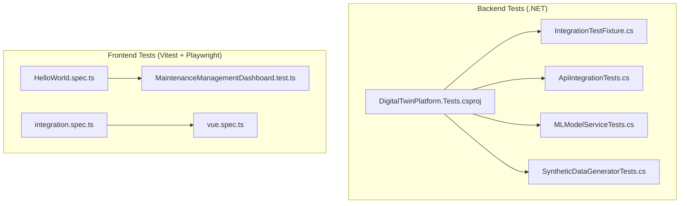
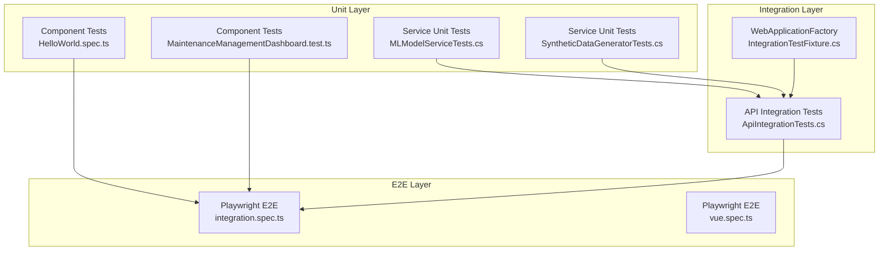
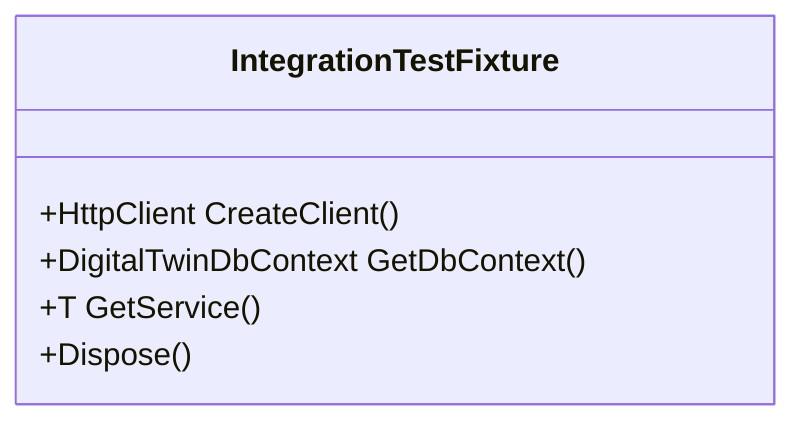
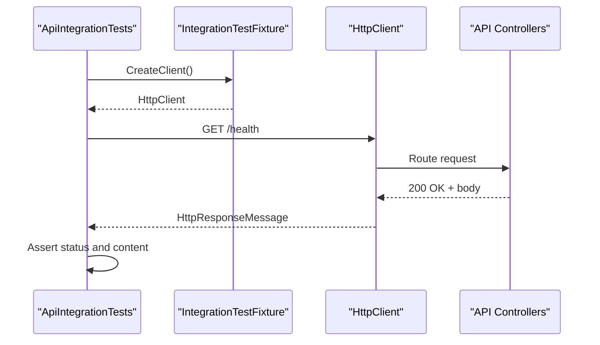
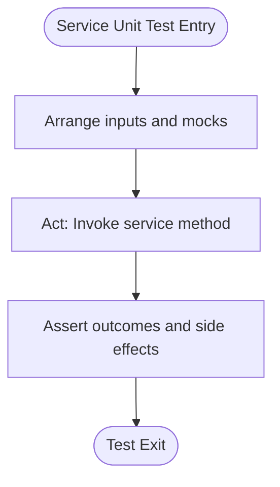
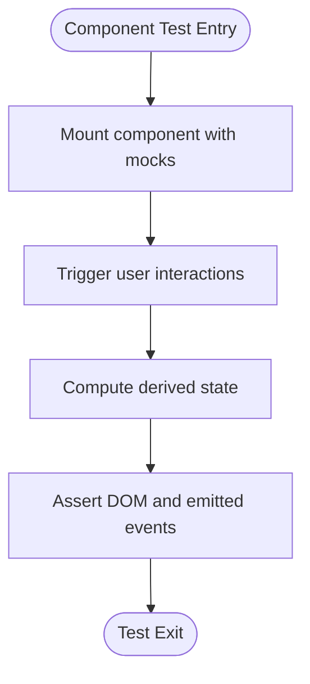
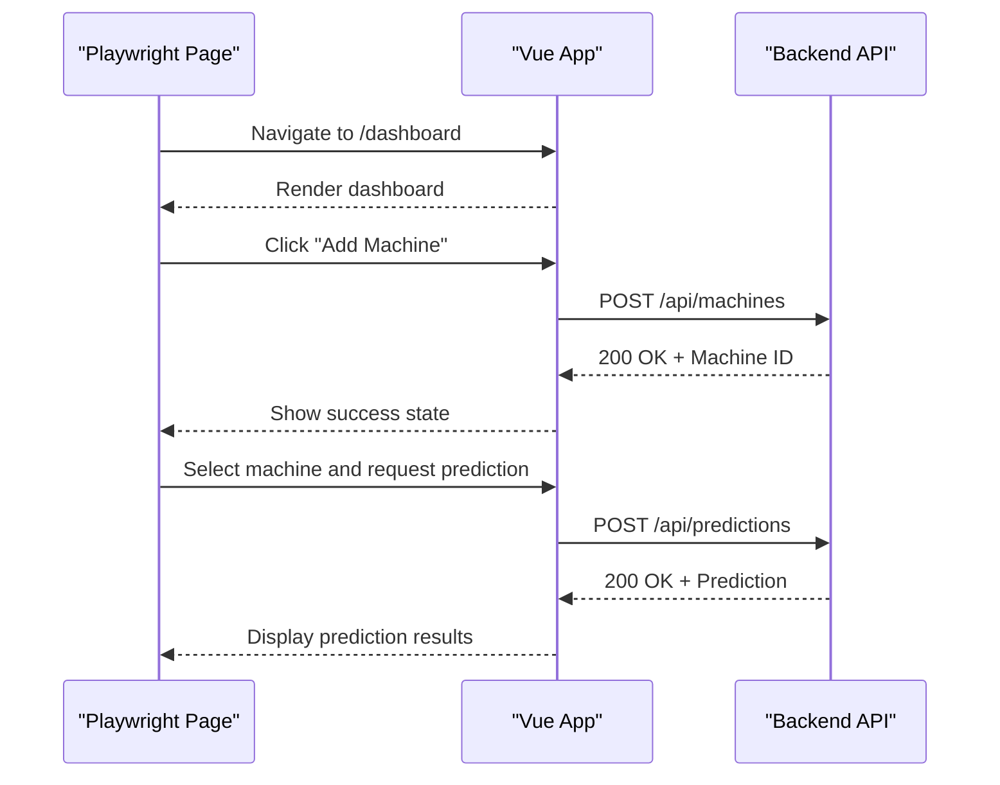
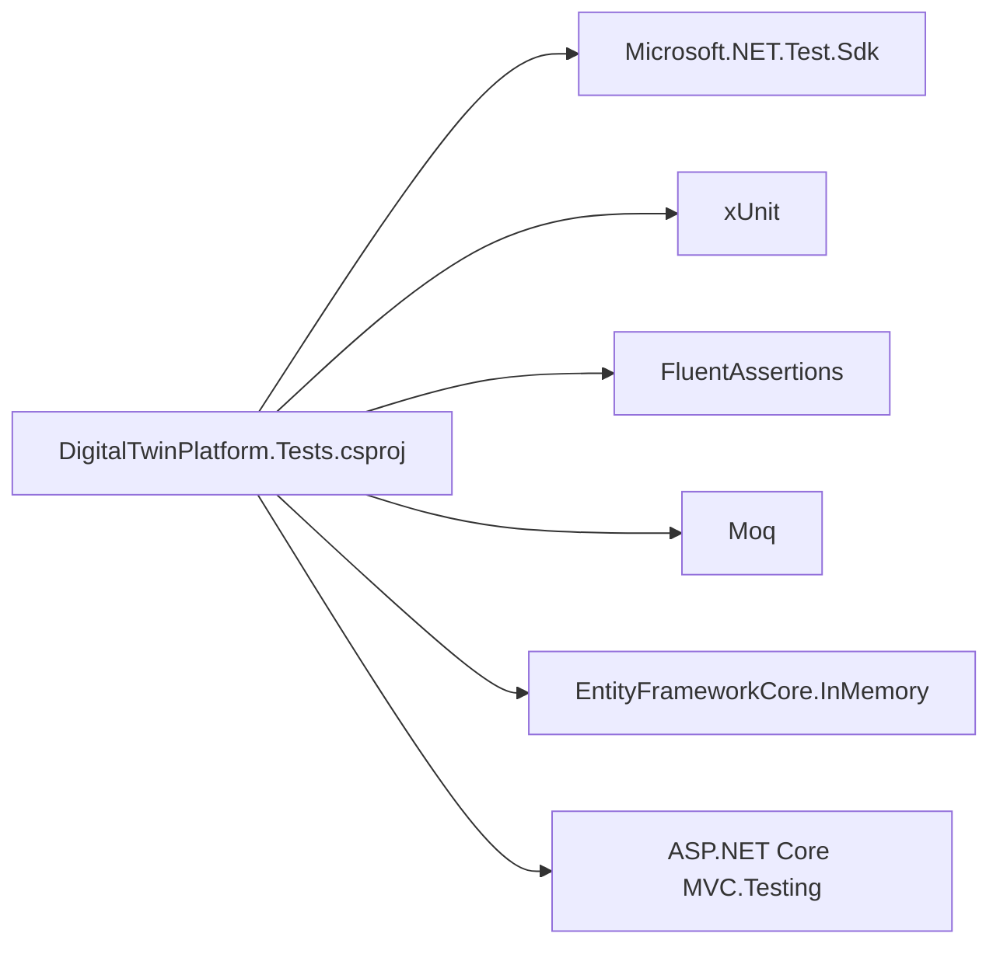

# Testing Strategy

<cite>
**Referenced Files in This Document**
- [DigitalTwinPlatform.Tests.csproj](file://src/api/DigitalTwinPlatform.Tests/DigitalTwinPlatform.Tests.csproj)
- [IntegrationTestFixture.cs](file://src/api/DigitalTwinPlatform.Tests/Integration/IntegrationTestFixture.cs)
- [ApiIntegrationTests.cs](file://src/api/DigitalTwinPlatform.Tests/Integration/ApiIntegrationTests.cs)
- [MLModelServiceTests.cs](file://src/api/DigitalTwinPlatform.Tests/Services/MLModelServiceTests.cs)
- [SyntheticDataGeneratorTests.cs](file://src/api/DigitalTwinPlatform.Tests/Services/SyntheticDataGeneratorTests.cs)
- [HelloWorld.spec.ts](file://src/ui/digital-twin-dashboard/src/components/__tests__/HelloWorld.spec.ts)
- [MaintenanceManagementDashboard.test.ts](file://src/ui/digital-twin-dashboard/src/components/maintenance/MaintenanceManagementDashboard.test.ts)
- [integration.spec.ts](file://src/ui/digital-twin-dashboard/e2e/integration.spec.ts)
- [vue.spec.ts](file://src/ui/digital-twin-dashboard/e2e/vue.spec.ts)
</cite>

## Table of Contents
1. [Introduction](#introduction)
2. [Project Structure](#project-structure)
3. [Core Components](#core-components)
4. [Architecture Overview](#architecture-overview)
5. [Detailed Component Analysis](#detailed-component-analysis)
6. [Dependency Analysis](#dependency-analysis)
7. [Performance Considerations](#performance-considerations)
8. [Troubleshooting Guide](#troubleshooting-guide)
9. [Conclusion](#conclusion)
10. [Appendices](#appendices)

## Introduction
This document defines the testing strategy for the Digital Twin Platform, covering unit testing, integration testing, and end-to-end validation across backend APIs, frontend components, and real-time analytics. It explains test organization, mock strategies, coverage expectations, database testing patterns, API validation, and testing of predictive models and mathematical algorithms. It also documents frontend testing with Playwright and component tests with Vitest, along with performance, load, and regression testing strategies, and best practices for continuous integration and quality assurance.

## Project Structure
The repository organizes tests by layer and technology:
- Backend tests live under the .NET test project and include integration tests that validate API endpoints, database interactions, and cross-cutting concerns.
- Frontend tests are split between component tests using Vitest and Playwright end-to-end tests for user workflows and cross-browser compatibility.

**Diagram sources**
- [DigitalTwinPlatform.Tests.csproj](file://src/api/DigitalTwinPlatform.Tests/DigitalTwinPlatform.Tests.csproj#L1-L30)
- [IntegrationTestFixture.cs](file://src/api/DigitalTwinPlatform.Tests/Integration/IntegrationTestFixture.cs#L1-L101)
- [ApiIntegrationTests.cs](file://src/api/DigitalTwinPlatform.Tests/Integration/ApiIntegrationTests.cs#L1-L465)
- [MLModelServiceTests.cs](file://src/api/DigitalTwinPlatform.Tests/Services/MLModelServiceTests.cs)
- [SyntheticDataGeneratorTests.cs](file://src/api/DigitalTwinPlatform.Tests/Services/SyntheticDataGeneratorTests.cs)
- [HelloWorld.spec.ts](file://src/ui/digital-twin-dashboard/src/components/__tests__/HelloWorld.spec.ts#L1-L12)
- [MaintenanceManagementDashboard.test.ts](file://src/ui/digital-twin-dashboard/src/components/maintenance/MaintenanceManagementDashboard.test.ts#L1-L348)
- [integration.spec.ts](file://src/ui/digital-twin-dashboard/e2e/integration.spec.ts#L1-L277)
- [vue.spec.ts](file://src/ui/digital-twin-dashboard/e2e/vue.spec.ts#L1-L9)

**Section sources**
- [DigitalTwinPlatform.Tests.csproj](file://src/api/DigitalTwinPlatform.Tests/DigitalTwinPlatform.Tests.csproj#L1-L30)
- [IntegrationTestFixture.cs](file://src/api/DigitalTwinPlatform.Tests/Integration/IntegrationTestFixture.cs#L1-L101)
- [ApiIntegrationTests.cs](file://src/api/DigitalTwinPlatform.Tests/Integration/ApiIntegrationTests.cs#L1-L465)
- [HelloWorld.spec.ts](file://src/ui/digital-twin-dashboard/src/components/__tests__/HelloWorld.spec.ts#L1-L12)
- [MaintenanceManagementDashboard.test.ts](file://src/ui/digital-twin-dashboard/src/components/maintenance/MaintenanceManagementDashboard.test.ts#L1-L348)
- [integration.spec.ts](file://src/ui/digital-twin-dashboard/e2e/integration.spec.ts#L1-L277)
- [vue.spec.ts](file://src/ui/digital-twin-dashboard/e2e/vue.spec.ts#L1-L9)

## Core Components
- Backend integration test harness:
  - Uses a WebApplicationFactory to spin up the API with an in-memory database and removes hosted services to avoid interference.
  - Provides a shared test fixture to create clients with tenant and authorization headers and to access scoped services and DbContext.
- API integration tests:
  - Validate health checks, CRUD operations, telemetry ingestion and querying, prediction generation, uncertainty quantification, mathematical modeling endpoints, advanced analytics dashboards, authentication gating, and error response formatting.
  - Include helper methods to create test machines and generate telemetry series.
- Service-level unit tests:
  - ML model service tests and synthetic data generator tests demonstrate unit test patterns for ML and data generation services.
- Frontend component tests:
  - Vitest-based tests for Vue components, including rendering, filtering, form handling, computed properties, accessibility, and error handling.
- End-to-end tests:
  - Playwright scenarios cover complete workflows (predictive maintenance, mathematical modeling, real-time telemetry/alerting, reporting), concurrency, error handling, cross-browser compatibility, and session management.

Coverage expectations:
- Backend: Aim for high coverage in services and controllers, with integration tests validating cross-cutting behaviors (authentication, error handling, metrics).
- Frontend: Prefer component tests for logic-heavy components; complement with targeted E2E tests for critical user journeys.
- Predictive and mathematical models: Include unit tests for numerical routines and integration tests for pipeline validation.

**Section sources**
- [IntegrationTestFixture.cs](file://src/api/DigitalTwinPlatform.Tests/Integration/IntegrationTestFixture.cs#L17-L92)
- [ApiIntegrationTests.cs](file://src/api/DigitalTwinPlatform.Tests/Integration/ApiIntegrationTests.cs#L27-L342)
- [MLModelServiceTests.cs](file://src/api/DigitalTwinPlatform.Tests/Services/MLModelServiceTests.cs)
- [SyntheticDataGeneratorTests.cs](file://src/api/DigitalTwinPlatform.Tests/Services/SyntheticDataGeneratorTests.cs)
- [MaintenanceManagementDashboard.test.ts](file://src/ui/digital-twin-dashboard/src/components/maintenance/MaintenanceManagementDashboard.test.ts#L32-L347)
- [integration.spec.ts](file://src/ui/digital-twin-dashboard/e2e/integration.spec.ts#L3-L228)

## Architecture Overview
The testing architecture separates concerns across layers and environments:
- Unit tests validate isolated logic and mocks.
- Integration tests validate API endpoints against an in-memory database and shared services.
- End-to-end tests validate complete user workflows and cross-browser compatibility.

**Diagram sources**
- [IntegrationTestFixture.cs](file://src/api/DigitalTwinPlatform.Tests/Integration/IntegrationTestFixture.cs#L17-L92)
- [ApiIntegrationTests.cs](file://src/api/DigitalTwinPlatform.Tests/Integration/ApiIntegrationTests.cs#L27-L342)
- [MLModelServiceTests.cs](file://src/api/DigitalTwinPlatform.Tests/Services/MLModelServiceTests.cs)
- [SyntheticDataGeneratorTests.cs](file://src/api/DigitalTwinPlatform.Tests/Services/SyntheticDataGeneratorTests.cs)
- [HelloWorld.spec.ts](file://src/ui/digital-twin-dashboard/src/components/__tests__/HelloWorld.spec.ts#L1-L12)
- [MaintenanceManagementDashboard.test.ts](file://src/ui/digital-twin-dashboard/src/components/maintenance/MaintenanceManagementDashboard.test.ts#L1-L348)
- [integration.spec.ts](file://src/ui/digital-twin-dashboard/e2e/integration.spec.ts#L1-L277)
- [vue.spec.ts](file://src/ui/digital-twin-dashboard/e2e/vue.spec.ts#L1-L9)

## Detailed Component Analysis

### Backend Integration Test Harness
- Purpose: Provide a deterministic, isolated environment for API tests using an in-memory database and a configured service collection.
- Key behaviors:
  - Removes hosted services to prevent background tasks from interfering.
  - Registers an in-memory database and ensures the database is created.
  - Supplies a client preconfigured with tenant and authorization headers.
  - Exposes scoped services and DbContext for test setup and assertions.

**Diagram sources**
- [IntegrationTestFixture.cs](file://src/api/DigitalTwinPlatform.Tests/Integration/IntegrationTestFixture.cs#L11-L92)

**Section sources**
- [IntegrationTestFixture.cs](file://src/api/DigitalTwinPlatform.Tests/Integration/IntegrationTestFixture.cs#L17-L92)

### API Integration Tests
- Scope: Validates core API endpoints for health, machine CRUD, telemetry ingestion/query, predictions, uncertainty analysis, mathematical modeling, advanced analytics, authentication gating, and error formatting.
- Patterns:
  - Sequential execution via a shared collection to avoid resource contention.
  - Helper methods to create machines and generate telemetry series.
  - Assertions on HTTP status codes, JSON shapes, and domain-specific constraints.

**Diagram sources**
- [ApiIntegrationTests.cs](file://src/api/DigitalTwinPlatform.Tests/Integration/ApiIntegrationTests.cs#L27-L40)
- [IntegrationTestFixture.cs](file://src/api/DigitalTwinPlatform.Tests/Integration/IntegrationTestFixture.cs#L57-L66)

**Section sources**
- [ApiIntegrationTests.cs](file://src/api/DigitalTwinPlatform.Tests/Integration/ApiIntegrationTests.cs#L27-L342)

### Service-Level Unit Tests (ML and Synthetic Data)
- ML Model Service Tests:
  - Validate ML pipeline behaviors, model invocation, and data transformations.
  - Use mocking to isolate external dependencies and assert service interactions.
- Synthetic Data Generator Tests:
  - Validate data generation logic, distribution characteristics, and schema compliance.

**Diagram sources**
- [MLModelServiceTests.cs](file://src/api/DigitalTwinPlatform.Tests/Services/MLModelServiceTests.cs)
- [SyntheticDataGeneratorTests.cs](file://src/api/DigitalTwinPlatform.Tests/Services/SyntheticDataGeneratorTests.cs)

**Section sources**
- [MLModelServiceTests.cs](file://src/api/DigitalTwinPlatform.Tests/Services/MLModelServiceTests.cs)
- [SyntheticDataGeneratorTests.cs](file://src/api/DigitalTwinPlatform.Tests/Services/SyntheticDataGeneratorTests.cs)

### Frontend Component Tests (Vitest)
- Coverage:
  - Rendering and accessibility checks.
  - Filtering, form handling, computed properties, and error handling.
  - Mocked composables and services to isolate component logic.
- Example focus areas:
  - Maintenance dashboard rendering and modal interactions.
  - Form reset and validation behavior.
  - Status color mapping and date formatting.

**Diagram sources**
- [MaintenanceManagementDashboard.test.ts](file://src/ui/digital-twin-dashboard/src/components/maintenance/MaintenanceManagementDashboard.test.ts#L39-L324)

**Section sources**
- [MaintenanceManagementDashboard.test.ts](file://src/ui/digital-twin-dashboard/src/components/maintenance/MaintenanceManagementDashboard.test.ts#L32-L347)
- [HelloWorld.spec.ts](file://src/ui/digital-twin-dashboard/src/components/__tests__/HelloWorld.spec.ts#L6-L11)

### End-to-End Tests (Playwright)
- Workflows validated:
  - Predictive maintenance lifecycle from machine creation to maintenance scheduling.
  - Mathematical degradation modeling and parameter estimation.
  - Real-time telemetry monitoring, alert triggering, and resolution.
  - Reporting generation, export, and scheduling.
- Additional validations:
  - Concurrency handling with multiple simultaneous requests.
  - Error handling for invalid input and network failures.
  - Cross-browser compatibility and responsive design.
  - Session persistence and timeout behavior.

**Diagram sources**
- [integration.spec.ts](file://src/ui/digital-twin-dashboard/e2e/integration.spec.ts#L13-L55)

**Section sources**
- [integration.spec.ts](file://src/ui/digital-twin-dashboard/e2e/integration.spec.ts#L3-L228)
- [vue.spec.ts](file://src/ui/digital-twin-dashboard/e2e/vue.spec.ts#L5-L8)

## Dependency Analysis
- Backend test project dependencies:
  - Microsoft.NET.Test.Sdk, xUnit, FluentAssertions, Moq, EntityFrameworkCore.InMemory, ASP.NET Core MVC.Testing.
  - References to API, Application, Domain, and Infrastructure projects to enable integration testing across layers.
- Frontend test dependencies:
  - Vitest for component tests, Playwright for E2E tests, Vue Test Utils for mounting components.

**Diagram sources**
- [DigitalTwinPlatform.Tests.csproj](file://src/api/DigitalTwinPlatform.Tests/DigitalTwinPlatform.Tests.csproj#L10-L22)

**Section sources**
- [DigitalTwinPlatform.Tests.csproj](file://src/api/DigitalTwinPlatform.Tests/DigitalTwinPlatform.Tests.csproj#L10-L22)

## Performance Considerations
- Backend:
  - Use in-memory database for fast, repeatable tests; avoid heavy disk I/O.
  - Minimize hosted services and background tasks in test environments.
  - Parallelize independent tests; keep integration tests sequential when they share resources.
- Frontend:
  - Prefer component tests for rapid feedback; reserve E2E tests for critical paths.
  - Use deterministic waits and avoid flaky sleeps; rely on element selectors and readiness checks.
  - Run E2E tests in headless mode and leverage browser context reuse for speed.
- Predictive and mathematical models:
  - Validate numerical stability and convergence in unit tests.
  - Use synthetic datasets for controlled performance baselines.

[No sources needed since this section provides general guidance]

## Troubleshooting Guide
- Backend API tests:
  - If authentication fails, ensure the client includes the tenant and authorization headers.
  - If endpoints return unexpected errors, verify the in-memory database seeding and controller filters.
- Frontend component tests:
  - If mocks fail, confirm that module paths match and that mocks are cleared between tests.
  - If accessibility checks fail, ensure all interactive elements have accessible names.
- End-to-end tests:
  - If workflows fail intermittently, increase timeouts and use explicit waits for dynamic content.
  - If cross-browser issues surface, verify viewport sizes and browser-specific selectors.

**Section sources**
- [IntegrationTestFixture.cs](file://src/api/DigitalTwinPlatform.Tests/Integration/IntegrationTestFixture.cs#L57-L76)
- [MaintenanceManagementDashboard.test.ts](file://src/ui/digital-twin-dashboard/src/components/maintenance/MaintenanceManagementDashboard.test.ts#L264-L291)
- [integration.spec.ts](file://src/ui/digital-twin-dashboard/e2e/integration.spec.ts#L156-L189)

## Conclusion
The testing strategy combines robust unit tests for services and components, integration tests for API validation and database interactions, and comprehensive end-to-end tests for user workflows and cross-browser compatibility. By leveraging mocks, in-memory databases, and deterministic fixtures, the suite ensures correctness, reliability, and maintainability across predictive analytics, mathematical modeling, and real-time systems.

[No sources needed since this section summarizes without analyzing specific files]

## Appendices

### Test Utilities and Fixtures
- Backend:
  - IntegrationTestFixture provides a reusable test environment with an in-memory database and scoped services.
  - Helper methods in API integration tests streamline machine creation and telemetry generation.
- Frontend:
  - Component tests use Vue Test Utils to mount components and inject mocks for composables and services.
  - Playwright tests encapsulate common user interactions and assertions for end-to-end scenarios.

**Section sources**
- [IntegrationTestFixture.cs](file://src/api/DigitalTwinPlatform.Tests/Integration/IntegrationTestFixture.cs#L17-L92)
- [ApiIntegrationTests.cs](file://src/api/DigitalTwinPlatform.Tests/Integration/ApiIntegrationTests.cs#L297-L340)
- [MaintenanceManagementDashboard.test.ts](file://src/ui/digital-twin-dashboard/src/components/maintenance/MaintenanceManagementDashboard.test.ts#L39-L60)
- [integration.spec.ts](file://src/ui/digital-twin-dashboard/e2e/integration.spec.ts#L4-L11)

### API Validation Approaches
- Health checks, CRUD operations, telemetry ingestion and querying, prediction generation, uncertainty analysis, mathematical modeling, and advanced analytics dashboards are covered by integration tests.
- Error handling and authentication gating are validated with dedicated test cases.

**Section sources**
- [ApiIntegrationTests.cs](file://src/api/DigitalTwinPlatform.Tests/Integration/ApiIntegrationTests.cs#L27-L293)

### Predictive Models and Mathematical Algorithms Testing
- Service-level unit tests validate ML logic and synthetic data generation.
- Integration tests exercise end-to-end prediction pipelines and mathematical modeling endpoints.

**Section sources**
- [MLModelServiceTests.cs](file://src/api/DigitalTwinPlatform.Tests/Services/MLModelServiceTests.cs)
- [SyntheticDataGeneratorTests.cs](file://src/api/DigitalTwinPlatform.Tests/Services/SyntheticDataGeneratorTests.cs)
- [ApiIntegrationTests.cs](file://src/api/DigitalTwinPlatform.Tests/Integration/ApiIntegrationTests.cs#L150-L240)

### Frontend Testing with Cypress, Component, and E2E
- Component testing:
  - Vitest-based tests for Vue components validate rendering, filtering, forms, computed properties, accessibility, and error handling.
- End-to-end testing:
  - Playwright tests cover complete workflows, concurrency, error handling, cross-browser compatibility, and session management.

**Section sources**
- [HelloWorld.spec.ts](file://src/ui/digital-twin-dashboard/src/components/__tests__/HelloWorld.spec.ts#L6-L11)
- [MaintenanceManagementDashboard.test.ts](file://src/ui/digital-twin-dashboard/src/components/maintenance/MaintenanceManagementDashboard.test.ts#L32-L347)
- [integration.spec.ts](file://src/ui/digital-twin-dashboard/e2e/integration.spec.ts#L3-L228)
- [vue.spec.ts](file://src/ui/digital-twin-dashboard/e2e/vue.spec.ts#L5-L8)

### Performance, Load, and Regression Testing Strategies
- Performance:
  - Use component tests for rapid feedback; reserve E2E tests for critical paths.
  - Favor deterministic waits and element readiness checks in E2E tests.
- Load:
  - Validate concurrent request handling in E2E tests using parallel navigation and actions.
- Regression:
  - Maintain a focused set of E2E tests for critical user journeys; expand unit and integration tests to cover edge cases.

[No sources needed since this section provides general guidance]

### Continuous Integration and Quality Assurance
- CI should run:
  - Unit and component tests on pull requests.
  - Integration tests against a clean in-memory database.
  - E2E tests in headless mode across target browsers.
- Quality gates:
  - Enforce minimum coverage thresholds for services and critical API endpoints.
  - Fail builds on test regressions and flaky test detection.

[No sources needed since this section provides general guidance]