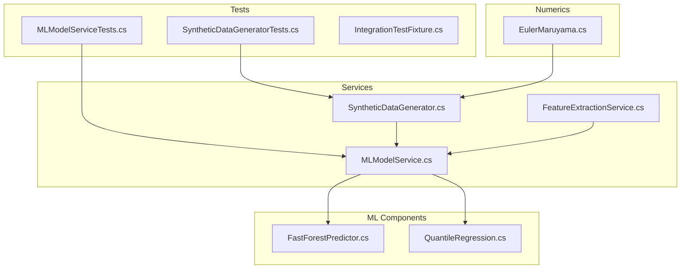
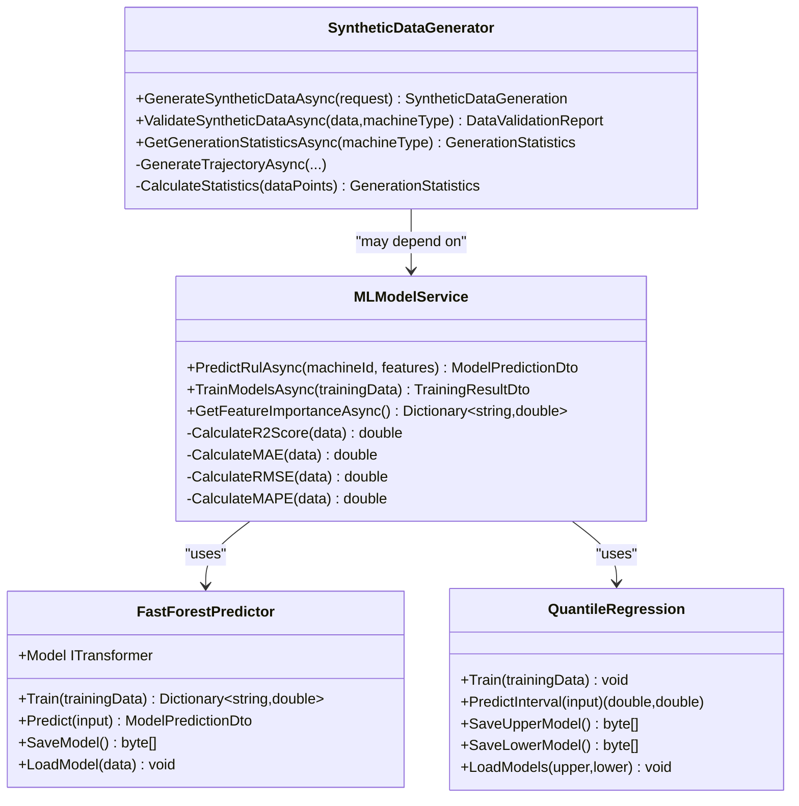
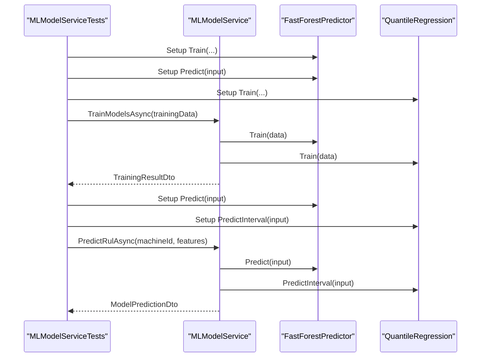
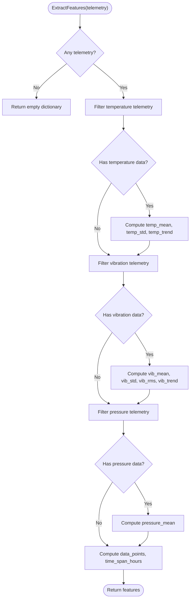
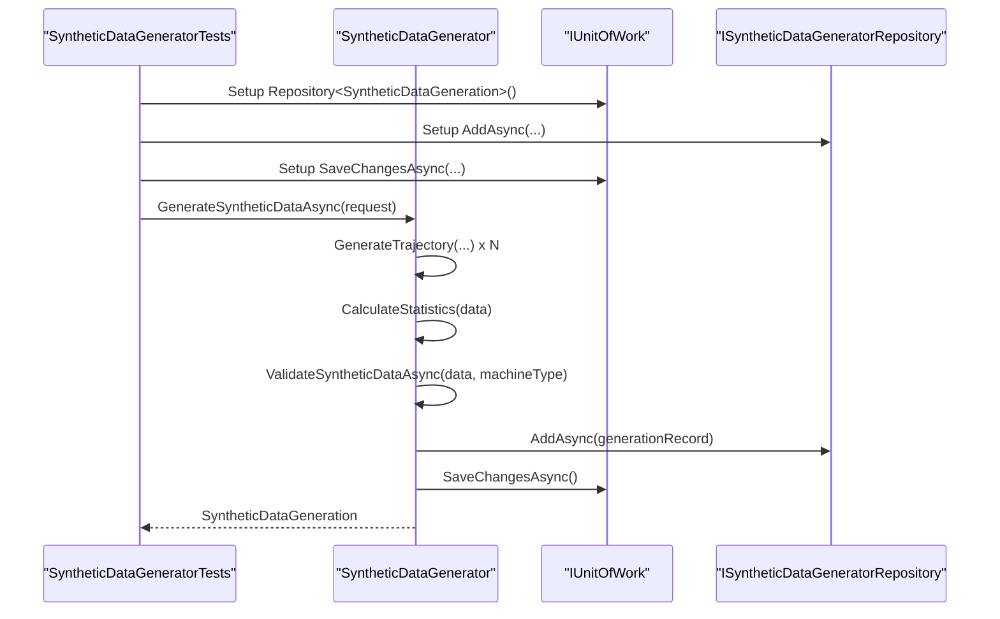
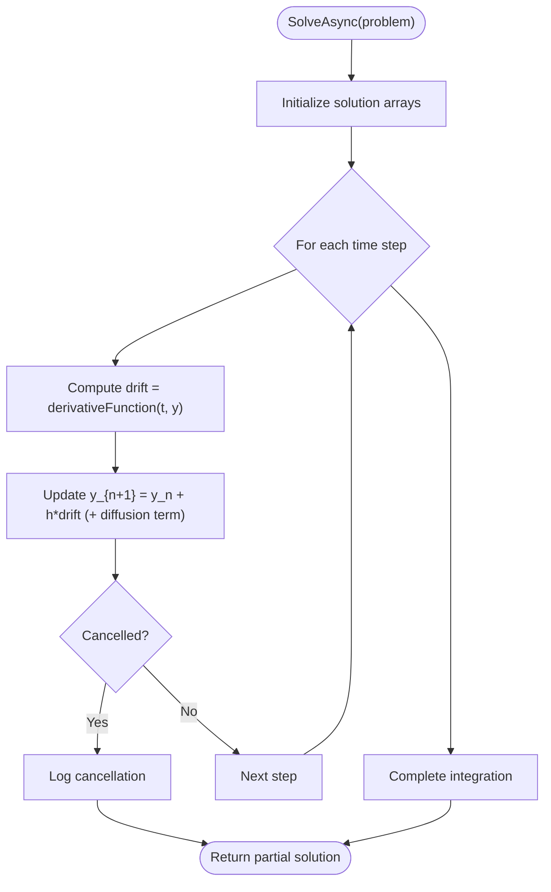
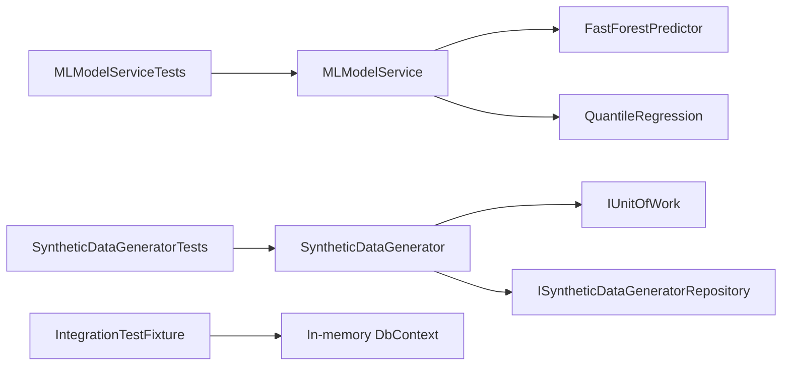

# Unit Testing and Service Testing

<cite>
**Referenced Files in This Document**
- [MLModelServiceTests.cs](file://src/api/DigitalTwinPlatform.Tests/Services/MLModelServiceTests.cs)
- [SyntheticDataGeneratorTests.cs](file://src/api/DigitalTwinPlatform.Tests/Services/SyntheticDataGeneratorTests.cs)
- [MLModelService.cs](file://src/api/DigitalTwinPlatform.Application/Services/MLModelService.cs)
- [FeatureExtractionService.cs](file://src/api/DigitalTwinPlatform.Application/Services/FeatureExtractionService.cs)
- [SyntheticDataGenerator.cs](file://src/api/DigitalTwinPlatform.Application/Services/SyntheticDataGenerator.cs)
- [FastForestPredictor.cs](file://src/api/DigitalTwinPlatform.Application/ML/FastForestPredictor.cs)
- [QuantileRegression.cs](file://src/api/DigitalTwinPlatform.Application/ML/QuantileRegression.cs)
- [EulerMaruyama.cs](file://src/api/DigitalTwinPlatform.Application/Mathematics/EulerMaruyama.cs)
- [IntegrationTestFixture.cs](file://src/api/DigitalTwinPlatform.Tests/Integration/IntegrationTestFixture.cs)
</cite>

## Table of Contents
1. [Introduction](#introduction)
2. [Project Structure](#project-structure)
3. [Core Components](#core-components)
4. [Architecture Overview](#architecture-overview)
5. [Detailed Component Analysis](#detailed-component-analysis)
6. [Dependency Analysis](#dependency-analysis)
7. [Performance Considerations](#performance-considerations)
8. [Troubleshooting Guide](#troubleshooting-guide)
9. [Conclusion](#conclusion)
10. [Appendices](#appendices)

## Introduction
This document provides a comprehensive guide to unit testing and service testing strategies for individual components in the predictive maintenance platform. It focuses on isolating services under test using mocks, preparing deterministic test data, and validating mathematical and ML logic. The primary components covered are:
- MLModelServiceTests (service tests)
- FeatureExtractionService (data processing)
- SyntheticDataGenerator (data generation and validation)
- Supporting ML components: FastForestPredictor, QuantileRegression
- Numerical methods: EulerMaruyama

The guide emphasizes Moq-based mocking, repository and unit-of-work isolation, and assertion strategies tailored to predictive maintenance scenarios.

## Project Structure
The testing and service layers are organized as follows:
- Tests reside under src/api/DigitalTwinPlatform.Tests/Services for unit tests and src/api/DigitalTwinPlatform.Tests/Integration for integration tests.
- Services under src/api/DigitalTwinPlatform.Application/Services implement core business logic.
- ML components under src/api/DigitalTwinPlatform.Application/ML provide machine learning predictors and evaluators.
- Numerical solvers under src/api/DigitalTwinPlatform.Application/Mathematics implement ODE/SDE solvers.

**Diagram sources**
- [MLModelServiceTests.cs](file://src/api/DigitalTwinPlatform.Tests/Services/MLModelServiceTests.cs#L1-L231)
- [SyntheticDataGeneratorTests.cs](file://src/api/DigitalTwinPlatform.Tests/Services/SyntheticDataGeneratorTests.cs#L1-L181)
- [MLModelService.cs](file://src/api/DigitalTwinPlatform.Application/Services/MLModelService.cs#L1-L248)
- [SyntheticDataGenerator.cs](file://src/api/DigitalTwinPlatform.Application/Services/SyntheticDataGenerator.cs#L1-L533)
- [FastForestPredictor.cs](file://src/api/DigitalTwinPlatform.Application/ML/FastForestPredictor.cs#L1-L158)
- [QuantileRegression.cs](file://src/api/DigitalTwinPlatform.Application/ML/QuantileRegression.cs#L1-L88)
- [EulerMaruyama.cs](file://src/api/DigitalTwinPlatform.Application/Mathematics/EulerMaruyama.cs#L1-L388)

**Section sources**
- [MLModelServiceTests.cs](file://src/api/DigitalTwinPlatform.Tests/Services/MLModelServiceTests.cs#L1-L231)
- [SyntheticDataGeneratorTests.cs](file://src/api/DigitalTwinPlatform.Tests/Services/SyntheticDataGeneratorTests.cs#L1-L181)
- [MLModelService.cs](file://src/api/DigitalTwinPlatform.Application/Services/MLModelService.cs#L1-L248)
- [SyntheticDataGenerator.cs](file://src/api/DigitalTwinPlatform.Application/Services/SyntheticDataGenerator.cs#L1-L533)
- [FastForestPredictor.cs](file://src/api/DigitalTwinPlatform.Application/ML/FastForestPredictor.cs#L1-L158)
- [QuantileRegression.cs](file://src/api/DigitalTwinPlatform.Application/ML/QuantileRegression.cs#L1-L88)
- [EulerMaruyama.cs](file://src/api/DigitalTwinPlatform.Application/Mathematics/EulerMaruyama.cs#L1-L388)

## Core Components
This section outlines the core services and their roles in testing:
- MLModelService: orchestrates training and prediction using FastForest and Quantile Regression, computes metrics, and aggregates SHAP/local explanations.
- FeatureExtractionService: transforms raw telemetry into structured features with robust fallbacks.
- SyntheticDataGenerator: generates synthetic trajectories per machine type, validates against benchmarks, persists via Unit of Work, and calculates statistics.

Key testing strategies:
- Use Moq to isolate dependencies (predictors, regressors, repositories, UoW).
- Generate deterministic test data with fixed seeds to ensure reproducibility.
- Validate mathematical correctness and numerical stability where applicable.

**Section sources**
- [MLModelService.cs](file://src/api/DigitalTwinPlatform.Application/Services/MLModelService.cs#L14-L127)
- [FeatureExtractionService.cs](file://src/api/DigitalTwinPlatform.Application/Services/FeatureExtractionService.cs#L12-L53)
- [SyntheticDataGenerator.cs](file://src/api/DigitalTwinPlatform.Application/Services/SyntheticDataGenerator.cs#L16-L105)

## Architecture Overview
The service layer composes ML components and numerical solvers to deliver predictive capabilities. The following diagram maps the relationships among tested components.

**Diagram sources**
- [MLModelService.cs](file://src/api/DigitalTwinPlatform.Application/Services/MLModelService.cs#L14-L127)
- [FastForestPredictor.cs](file://src/api/DigitalTwinPlatform.Application/ML/FastForestPredictor.cs#L9-L127)
- [QuantileRegression.cs](file://src/api/DigitalTwinPlatform.Application/ML/QuantileRegression.cs#L7-L86)
- [SyntheticDataGenerator.cs](file://src/api/DigitalTwinPlatform.Application/Services/SyntheticDataGenerator.cs#L16-L105)

## Detailed Component Analysis

### MLModelServiceTests
This test suite validates MLModelService behavior:
- Training pipeline correctness and metric computation.
- Prediction composition using FastForest and Quantile Regression.
- Feature importance and SHAP value aggregation.
- Private method verification via reflection for mathematical computations.

Mock strategies:
- Mock FastForestPredictor, QuantileRegression, ShapExplainer, and FeatureImportanceExtractor.
- Inject mocked dependencies into MLModelService constructor.

Test data preparation:
- Deterministic training data generator with optional perfect predictions for controlled assertions.

Assertion strategies:
- Validate DTO shapes and ranges (e.g., R2 in [0,1], MAE > 0).
- Verify feature importance sums approximately to 1.0.
- Confirm risk levels and confidence derived from combined predictors.

**Diagram sources**
- [MLModelServiceTests.cs](file://src/api/DigitalTwinPlatform.Tests/Services/MLModelServiceTests.cs#L37-L138)
- [MLModelService.cs](file://src/api/DigitalTwinPlatform.Application/Services/MLModelService.cs#L74-L113)
- [FastForestPredictor.cs](file://src/api/DigitalTwinPlatform.Application/ML/FastForestPredictor.cs#L23-L86)
- [QuantileRegression.cs](file://src/api/DigitalTwinPlatform.Application/ML/QuantileRegression.cs#L13-L60)

**Section sources**
- [MLModelServiceTests.cs](file://src/api/DigitalTwinPlatform.Tests/Services/MLModelServiceTests.cs#L1-L231)
- [MLModelService.cs](file://src/api/DigitalTwinPlatform.Application/Services/MLModelService.cs#L74-L127)
- [FastForestPredictor.cs](file://src/api/DigitalTwinPlatform.Application/ML/FastForestPredictor.cs#L23-L86)
- [QuantileRegression.cs](file://src/api/DigitalTwinPlatform.Application/ML/QuantileRegression.cs#L13-L60)

### FeatureExtractionService
Purpose:
- Convert telemetry streams into structured features (means, standard deviations, trends, counts, time spans).

Testing approach:
- Validate feature presence and ranges for each sensor type.
- Ensure fallback behavior when JSON parsing fails logs at Info level and returns zeros.

**Diagram sources**
- [FeatureExtractionService.cs](file://src/api/DigitalTwinPlatform.Application/Services/FeatureExtractionService.cs#L14-L53)

**Section sources**
- [FeatureExtractionService.cs](file://src/api/DigitalTwinPlatform.Application/Services/FeatureExtractionService.cs#L12-L105)

### SyntheticDataGeneratorTests
Focus areas:
- End-to-end synthetic data generation with multiple trajectories.
- Validation against benchmark distributions and statistics.
- Repository and Unit of Work isolation via mocks.

Mock strategies:
- Mock IUnitOfWork and repository to avoid persistence during unit tests.
- Verify persisted entities and validation reports are populated.

**Diagram sources**
- [SyntheticDataGeneratorTests.cs](file://src/api/DigitalTwinPlatform.Tests/Services/SyntheticDataGeneratorTests.cs#L34-L64)
- [SyntheticDataGenerator.cs](file://src/api/DigitalTwinPlatform.Application/Services/SyntheticDataGenerator.cs#L34-L105)

**Section sources**
- [SyntheticDataGeneratorTests.cs](file://src/api/DigitalTwinPlatform.Tests/Services/SyntheticDataGeneratorTests.cs#L1-L181)
- [SyntheticDataGenerator.cs](file://src/api/DigitalTwinPlatform.Application/Services/SyntheticDataGenerator.cs#L16-L105)

### Numerical Methods and Statistical Functions
Coverage:
- EulerMaruyama solver for deterministic and stochastic ODEs, including coupled SDEs with correlation matrices.
- Statistical helpers for trend calculation and numerical stability checks.

Testing patterns:
- Validate solution stability and detect extreme values or NaN/infs.
- Ensure step-size statistics are computed and stored in validation results.

**Diagram sources**
- [EulerMaruyama.cs](file://src/api/DigitalTwinPlatform.Application/Mathematics/EulerMaruyama.cs#L26-L87)

**Section sources**
- [EulerMaruyama.cs](file://src/api/DigitalTwinPlatform.Application/Mathematics/EulerMaruyama.cs#L12-L388)

## Dependency Analysis
This section analyzes internal and external dependencies for testing:
- MLModelService depends on FastForestPredictor and QuantileRegression for training and inference.
- SyntheticDataGenerator depends on IUnitOfWork and repository abstractions for persistence.
- Integration tests use IntegrationTestFixture to configure an in-memory database and shared service scope.

**Diagram sources**
- [MLModelServiceTests.cs](file://src/api/DigitalTwinPlatform.Tests/Services/MLModelServiceTests.cs#L1-L35)
- [SyntheticDataGeneratorTests.cs](file://src/api/DigitalTwinPlatform.Tests/Services/SyntheticDataGeneratorTests.cs#L1-L32)
- [MLModelService.cs](file://src/api/DigitalTwinPlatform.Application/Services/MLModelService.cs#L14-L34)
- [SyntheticDataGenerator.cs](file://src/api/DigitalTwinPlatform.Application/Services/SyntheticDataGenerator.cs#L16-L29)
- [IntegrationTestFixture.cs](file://src/api/DigitalTwinPlatform.Tests/Integration/IntegrationTestFixture.cs#L17-L55)

**Section sources**
- [MLModelServiceTests.cs](file://src/api/DigitalTwinPlatform.Tests/Services/MLModelServiceTests.cs#L1-L35)
- [SyntheticDataGeneratorTests.cs](file://src/api/DigitalTwinPlatform.Tests/Services/SyntheticDataGeneratorTests.cs#L1-L32)
- [IntegrationTestFixture.cs](file://src/api/DigitalTwinPlatform.Tests/Integration/IntegrationTestFixture.cs#L17-L55)

## Performance Considerations
- Prefer deterministic randomness (fixed seeds) in tests to ensure reproducibility while maintaining performance.
- Use lightweight mocks to avoid heavy ML training in unit tests; reserve full training for integration tests.
- Validate numerical stability early in ODE/SDE tests to fail fast on invalid configurations.

## Troubleshooting Guide
Common issues and resolutions:
- Training without prior model: Ensure mocks simulate trained models or initialize transformers before prediction.
- Empty telemetry input: FeatureExtractionService returns empty features; assert on absence of keys rather than values.
- Repository not configured: In unit tests, always wire IUnitOfWork to return a mock repository.
- Inconsistent metrics: Validate ranges and sum-to-one constraints for feature importance.

**Section sources**
- [MLModelService.cs](file://src/api/DigitalTwinPlatform.Application/Services/MLModelService.cs#L67-L85)
- [FeatureExtractionService.cs](file://src/api/DigitalTwinPlatform.Application/Services/FeatureExtractionService.cs#L19-L20)
- [SyntheticDataGenerator.cs](file://src/api/DigitalTwinPlatform.Application/Services/SyntheticDataGenerator.cs#L90-L92)

## Conclusion
The testing strategy emphasizes isolation via Moq, deterministic test data, and targeted assertions for ML metrics, feature engineering, and numerical stability. By structuring tests around service boundaries and mocking repositories/UoW, teams can efficiently validate predictive maintenance logic while keeping unit tests fast and reliable.

## Appendices

### Test Organization and Naming Conventions
- Group tests by service under src/api/DigitalTwinPlatform.Tests/Services.
- Use descriptive Fact names: Given_When_Then pattern (e.g., TrainModelsAsync_WithValidData_ShouldCalculateMetricsCorrectly).
- Prefix test classes with the service name followed by Tests (e.g., MLModelServiceTests).

### Assertion Strategies for Predictive Maintenance
- ML metrics: Validate ranges (R2 in [0,1], MAE > 0, RMSE > 0, MAPE >= 0).
- Feature importance: Sum ≈ 1.0 and presence of expected keys.
- Predictions: Confidence and risk level derived from combined predictors.
- Data validation: Benchmarked scores and recommendations for synthetic data.

### Integration Boundary Testing
- Use IntegrationTestFixture to spin up an in-memory database and shared service scope.
- Replace persistent dependencies with in-memory providers for integration tests.

**Section sources**
- [IntegrationTestFixture.cs](file://src/api/DigitalTwinPlatform.Tests/Integration/IntegrationTestFixture.cs#L17-L55)