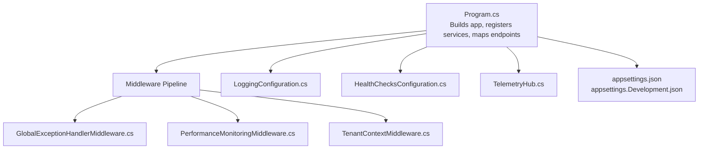
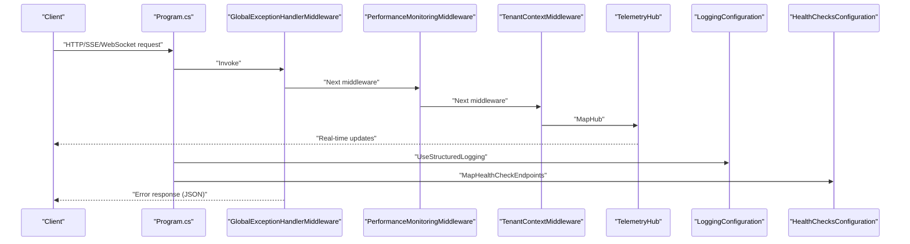
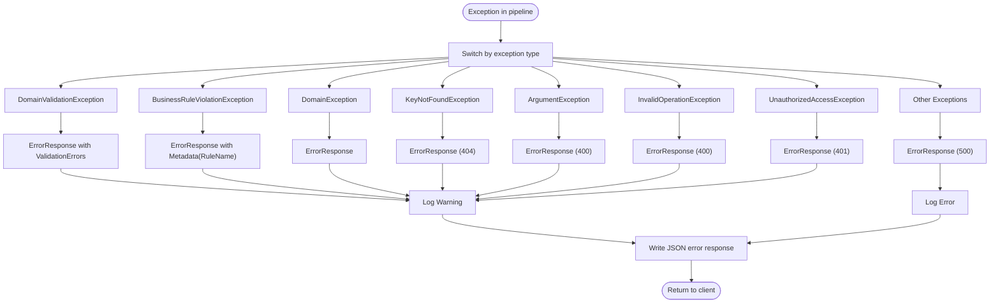
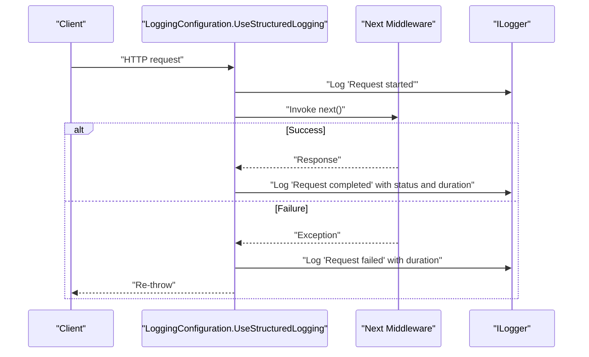
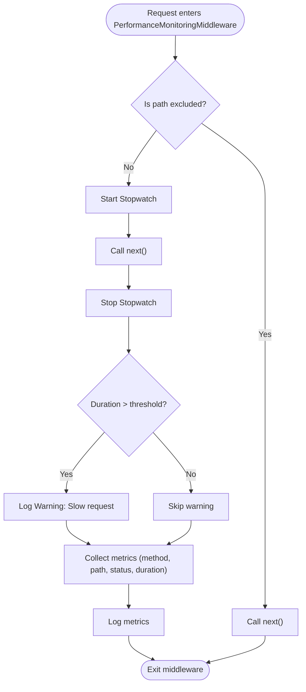
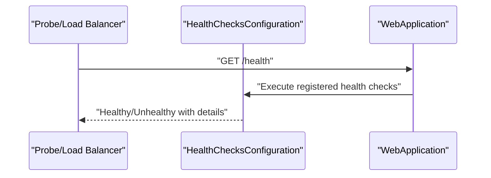
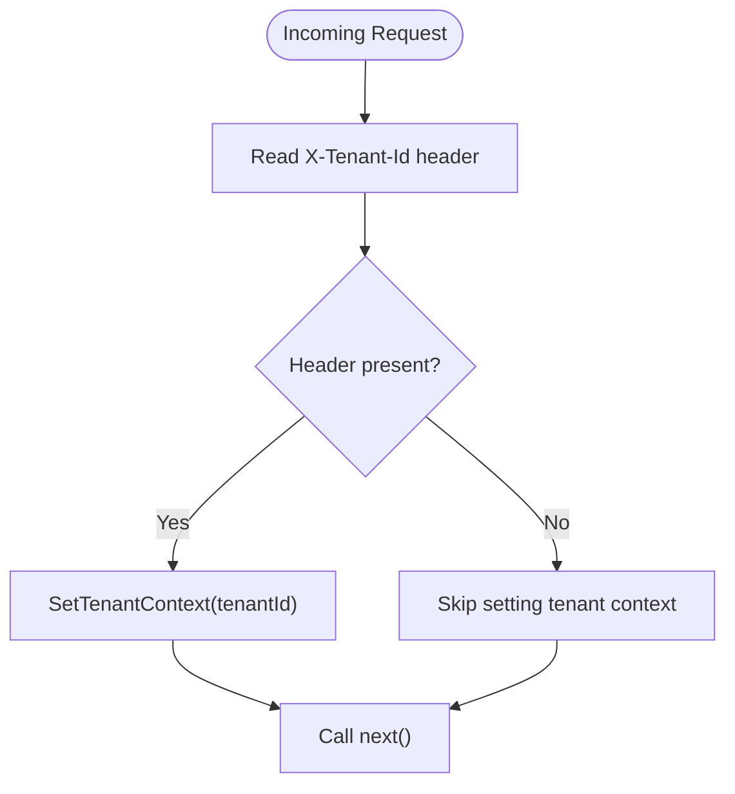
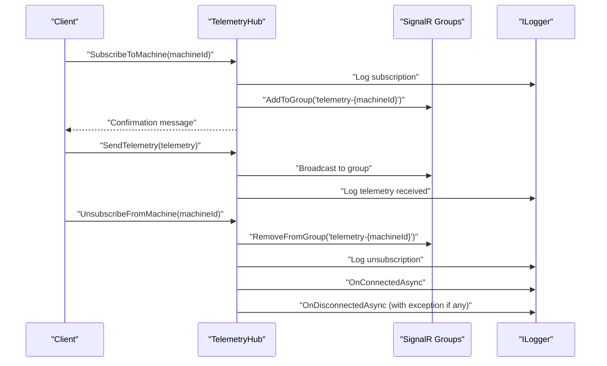
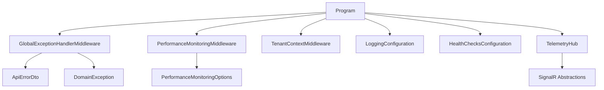

# Troubleshooting and FAQ

<cite>
**Referenced Files in This Document**
- [Program.cs](file://src/api/DigitalTwinPlatform.API/Program.cs)
- [GlobalExceptionHandlerMiddleware.cs](file://src/api/DigitalTwinPlatform.API/Middleware/GlobalExceptionHandlerMiddleware.cs)
- [LoggingConfiguration.cs](file://src/api/DigitalTwinPlatform.API/Infrastructure/LoggingConfiguration.cs)
- [PerformanceMonitoringMiddleware.cs](file://src/api/DigitalTwinPlatform.API/Middleware/PerformanceMonitoringMiddleware.cs)
- [HealthChecksConfiguration.cs](file://src/api/DigitalTwinPlatform.API/Infrastructure/HealthChecksConfiguration.cs)
- [TenantContextMiddleware.cs](file://src/api/DigitalTwinPlatform.API/Middleware/TenantContextMiddleware.cs)
- [TelemetryHub.cs](file://src/api/DigitalTwinPlatform.API/Hubs/TelemetryHub.cs)
- [ApiErrorDto.cs](file://src/api/DigitalTwinPlatform.API/Models/ApiErrorDto.cs)
- [DomainException.cs](file://src/api/DigitalTwinPlatform.Domain/Common/DomainException.cs)
- [appsettings.json](file://src/api/DigitalTwinPlatform.API/appsettings.json)
- [appsettings.Development.json](file://src/api/DigitalTwinPlatform.API/appsettings.Development.json)
</cite>

## Table of Contents
1. [Introduction](#introduction)
2. [Project Structure](#project-structure)
3. [Core Components](#core-components)
4. [Architecture Overview](#architecture-overview)
5. [Detailed Component Analysis](#detailed-component-analysis)
6. [Dependency Analysis](#dependency-analysis)
7. [Performance Considerations](#performance-considerations)
8. [Troubleshooting Guide](#troubleshooting-guide)
9. [Conclusion](#conclusion)
10. [Appendices](#appendices)

## Introduction
This document provides a comprehensive troubleshooting and FAQ guide for the Digital Twin Platform. It focuses on diagnosing and resolving common installation, runtime, and performance issues across the API, SignalR real-time communication, logging, health checks, and configuration layers. It also explains error handling strategies, logging configuration, diagnostic procedures, and operational guidance for database connectivity, API authentication, and real-time communication failures. Practical examples and step-by-step resolutions are included, along with performance profiling and optimization strategies.

## Project Structure
The API application is organized around layered concerns:
- Entry point and middleware pipeline orchestration
- Global exception handling and structured logging
- Performance monitoring and health checks
- SignalR hubs for real-time telemetry
- Configuration-driven behavior via appsettings

**Diagram sources**
- [Program.cs](file://src/api/DigitalTwinPlatform.API/Program.cs#L1-L87)
- [GlobalExceptionHandlerMiddleware.cs](file://src/api/DigitalTwinPlatform.API/Middleware/GlobalExceptionHandlerMiddleware.cs#L1-L257)
- [LoggingConfiguration.cs](file://src/api/DigitalTwinPlatform.API/Infrastructure/LoggingConfiguration.cs#L1-L58)
- [PerformanceMonitoringMiddleware.cs](file://src/api/DigitalTwinPlatform.API/Middleware/PerformanceMonitoringMiddleware.cs#L1-L148)
- [TenantContextMiddleware.cs](file://src/api/DigitalTwinPlatform.API/Middleware/TenantContextMiddleware.cs#L1-L18)
- [HealthChecksConfiguration.cs](file://src/api/DigitalTwinPlatform.API/Infrastructure/HealthChecksConfiguration.cs#L1-L76)
- [TelemetryHub.cs](file://src/api/DigitalTwinPlatform.API/Hubs/TelemetryHub.cs#L1-L211)
- [appsettings.json](file://src/api/DigitalTwinPlatform.API/appsettings.json#L1-L93)
- [appsettings.Development.json](file://src/api/DigitalTwinPlatform.API/appsettings.Development.json#L1-L71)

**Section sources**
- [Program.cs](file://src/api/DigitalTwinPlatform.API/Program.cs#L1-L87)
- [appsettings.json](file://src/api/DigitalTwinPlatform.API/appsettings.json#L1-L93)
- [appsettings.Development.json](file://src/api/DigitalTwinPlatform.API/appsettings.Development.json#L1-L71)

## Core Components
- GlobalExceptionHandlerMiddleware: Centralized error handling with typed error responses and environment-aware logging.
- LoggingConfiguration: Structured logging setup and request lifecycle logging.
- PerformanceMonitoringMiddleware: Request duration tracking, slow request detection, and metrics collection.
- HealthChecksConfiguration: Health endpoints and custom application health checks.
- TenantContextMiddleware: Multi-tenancy header propagation.
- TelemetryHub: SignalR hub for real-time telemetry streaming with subscription management and connection lifecycle logging.
- Configuration: Centralized settings for connections, JWT, SignalR, ML, performance thresholds, and feature flags.

**Section sources**
- [GlobalExceptionHandlerMiddleware.cs](file://src/api/DigitalTwinPlatform.API/Middleware/GlobalExceptionHandlerMiddleware.cs#L1-L257)
- [LoggingConfiguration.cs](file://src/api/DigitalTwinPlatform.API/Infrastructure/LoggingConfiguration.cs#L1-L58)
- [PerformanceMonitoringMiddleware.cs](file://src/api/DigitalTwinPlatform.API/Middleware/PerformanceMonitoringMiddleware.cs#L1-L148)
- [HealthChecksConfiguration.cs](file://src/api/DigitalTwinPlatform.API/Infrastructure/HealthChecksConfiguration.cs#L1-L76)
- [TenantContextMiddleware.cs](file://src/api/DigitalTwinPlatform.API/Middleware/TenantContextMiddleware.cs#L1-L18)
- [TelemetryHub.cs](file://src/api/DigitalTwinPlatform.API/Hubs/TelemetryHub.cs#L1-L211)
- [ApiErrorDto.cs](file://src/api/DigitalTwinPlatform.API/Models/ApiErrorDto.cs#L1-L44)
- [DomainException.cs](file://src/api/DigitalTwinPlatform.Domain/Common/DomainException.cs#L1-L29)
- [appsettings.json](file://src/api/DigitalTwinPlatform.API/appsettings.json#L1-L93)
- [appsettings.Development.json](file://src/api/DigitalTwinPlatform.API/appsettings.Development.json#L1-L71)

## Architecture Overview
The runtime flow integrates middleware, controllers, hubs, and external systems. The diagram below maps the actual components and their interactions.

**Diagram sources**
- [Program.cs](file://src/api/DigitalTwinPlatform.API/Program.cs#L59-L80)
- [GlobalExceptionHandlerMiddleware.cs](file://src/api/DigitalTwinPlatform.API/Middleware/GlobalExceptionHandlerMiddleware.cs#L13-L45)
- [PerformanceMonitoringMiddleware.cs](file://src/api/DigitalTwinPlatform.API/Middleware/PerformanceMonitoringMiddleware.cs#L25-L60)
- [TenantContextMiddleware.cs](file://src/api/DigitalTwinPlatform.API/Middleware/TenantContextMiddleware.cs#L7-L16)
- [TelemetryHub.cs](file://src/api/DigitalTwinPlatform.API/Hubs/TelemetryHub.cs#L12-L21)
- [LoggingConfiguration.cs](file://src/api/DigitalTwinPlatform.API/Infrastructure/LoggingConfiguration.cs#L27-L56)
- [HealthChecksConfiguration.cs](file://src/api/DigitalTwinPlatform.API/Infrastructure/HealthChecksConfiguration.cs#L23-L35)

## Detailed Component Analysis

### Global Exception Handler
- Purpose: Catches unhandled exceptions, creates typed error responses, logs with severity mapping, and returns standardized JSON.
- Key behaviors:
  - Maps domain and business rule exceptions to appropriate HTTP statuses.
  - Uses request identifiers for traceability.
  - Emits development-friendly metadata only in development.

**Diagram sources**
- [GlobalExceptionHandlerMiddleware.cs](file://src/api/DigitalTwinPlatform.API/Middleware/GlobalExceptionHandlerMiddleware.cs#L25-L249)
- [ApiErrorDto.cs](file://src/api/DigitalTwinPlatform.API/Models/ApiErrorDto.cs#L3-L19)
- [DomainException.cs](file://src/api/DigitalTwinPlatform.Domain/Common/DomainException.cs#L6-L28)

**Section sources**
- [GlobalExceptionHandlerMiddleware.cs](file://src/api/DigitalTwinPlatform.API/Middleware/GlobalExceptionHandlerMiddleware.cs#L1-L257)
- [ApiErrorDto.cs](file://src/api/DigitalTwinPlatform.API/Models/ApiErrorDto.cs#L1-L44)
- [DomainException.cs](file://src/api/DigitalTwinPlatform.Domain/Common/DomainException.cs#L1-L29)

### Logging and Request Lifecycle
- Purpose: Structured logging with configurable minimum levels and request start/completion/failure logging.
- Key behaviors:
  - Clears providers and adds console/debug providers.
  - Logs request start, completion with status and duration, and failure with stack traces.

**Diagram sources**
- [LoggingConfiguration.cs](file://src/api/DigitalTwinPlatform.API/Infrastructure/LoggingConfiguration.cs#L27-L56)

**Section sources**
- [LoggingConfiguration.cs](file://src/api/DigitalTwinPlatform.API/Infrastructure/LoggingConfiguration.cs#L1-L58)

### Performance Monitoring
- Purpose: Detects slow requests and collects request metrics for diagnostics.
- Key behaviors:
  - Skips excluded paths.
  - Measures elapsed time and logs warnings for slow requests.
  - Aggregates metrics and logs them for analysis.

**Diagram sources**
- [PerformanceMonitoringMiddleware.cs](file://src/api/DigitalTwinPlatform.API/Middleware/PerformanceMonitoringMiddleware.cs#L25-L96)

**Section sources**
- [PerformanceMonitoringMiddleware.cs](file://src/api/DigitalTwinPlatform.API/Middleware/PerformanceMonitoringMiddleware.cs#L1-L148)

### Health Checks
- Purpose: Exposes health endpoints and runs custom application health checks.
- Key behaviors:
  - Registers a custom health check.
  - Maps endpoints for readiness and liveness probes.

**Diagram sources**
- [HealthChecksConfiguration.cs](file://src/api/DigitalTwinPlatform.API/Infrastructure/HealthChecksConfiguration.cs#L23-L35)

**Section sources**
- [HealthChecksConfiguration.cs](file://src/api/DigitalTwinPlatform.API/Infrastructure/HealthChecksConfiguration.cs#L1-L76)

### Tenant Context Propagation
- Purpose: Reads tenant identifier from request headers and sets context for multi-tenant operations.
- Key behaviors:
  - Extracts X-Tenant-Id header.
  - Delegates to tenant service to set context.

**Diagram sources**
- [TenantContextMiddleware.cs](file://src/api/DigitalTwinPlatform.API/Middleware/TenantContextMiddleware.cs#L7-L16)

**Section sources**
- [TenantContextMiddleware.cs](file://src/api/DigitalTwinPlatform.API/Middleware/TenantContextMiddleware.cs#L1-L18)

### SignalR Telemetry Hub
- Purpose: Real-time telemetry streaming with per-machine grouping and lifecycle logging.
- Key behaviors:
  - Subscribes/unsubscribes clients to machine groups.
  - Broadcasts telemetry to subscribed clients.
  - Logs connection/disconnection events and errors.

**Diagram sources**
- [TelemetryHub.cs](file://src/api/DigitalTwinPlatform.API/Hubs/TelemetryHub.cs#L33-L183)

**Section sources**
- [TelemetryHub.cs](file://src/api/DigitalTwinPlatform.API/Hubs/TelemetryHub.cs#L1-L211)

## Dependency Analysis
- Program orchestrates middleware registration and endpoint mapping.
- GlobalExceptionHandlerMiddleware depends on ApiErrorDto and DomainException types for error classification.
- LoggingConfiguration depends on configuration for log levels.
- PerformanceMonitoringMiddleware depends on options for thresholds and excluded paths.
- TelemetryHub depends on SignalR abstractions and logging.

**Diagram sources**
- [Program.cs](file://src/api/DigitalTwinPlatform.API/Program.cs#L59-L80)
- [GlobalExceptionHandlerMiddleware.cs](file://src/api/DigitalTwinPlatform.API/Middleware/GlobalExceptionHandlerMiddleware.cs#L50-L63)
- [ApiErrorDto.cs](file://src/api/DigitalTwinPlatform.API/Models/ApiErrorDto.cs#L3-L19)
- [DomainException.cs](file://src/api/DigitalTwinPlatform.Domain/Common/DomainException.cs#L6-L28)
- [PerformanceMonitoringMiddleware.cs](file://src/api/DigitalTwinPlatform.API/Middleware/PerformanceMonitoringMiddleware.cs#L112-L122)
- [TelemetryHub.cs](file://src/api/DigitalTwinPlatform.API/Hubs/TelemetryHub.cs#L12-L21)

**Section sources**
- [Program.cs](file://src/api/DigitalTwinPlatform.API/Program.cs#L1-L87)
- [GlobalExceptionHandlerMiddleware.cs](file://src/api/DigitalTwinPlatform.API/Middleware/GlobalExceptionHandlerMiddleware.cs#L1-L257)
- [ApiErrorDto.cs](file://src/api/DigitalTwinPlatform.API/Models/ApiErrorDto.cs#L1-L44)
- [DomainException.cs](file://src/api/DigitalTwinPlatform.Domain/Common/DomainException.cs#L1-L29)
- [PerformanceMonitoringMiddleware.cs](file://src/api/DigitalTwinPlatform.API/Middleware/PerformanceMonitoringMiddleware.cs#L1-L148)
- [TelemetryHub.cs](file://src/api/DigitalTwinPlatform.API/Hubs/TelemetryHub.cs#L1-L211)

## Performance Considerations
- Slow request detection: Adjust slow request threshold and excluded paths in performance monitoring options.
- Request timing visibility: Use request lifecycle logging to identify latency hotspots.
- Endpoint-level profiling: Use health and metrics endpoints to assess readiness and throughput.
- Real-time overhead: Monitor SignalR hub logs for subscription churn and broadcast volume.

[No sources needed since this section provides general guidance]

## Troubleshooting Guide

### Installation Problems
- Symptom: Application fails to start or health checks report unhealthy.
  - Verify configuration keys and connection strings in appsettings.
  - Check environment-specific overrides in development settings.
  - Confirm health endpoints are mapped and accessible.
- Symptom: Missing logging output.
  - Ensure logging minimum level is set appropriately.
  - Confirm console/debug providers are enabled.

**Section sources**
- [appsettings.json](file://src/api/DigitalTwinPlatform.API/appsettings.json#L1-L93)
- [appsettings.Development.json](file://src/api/DigitalTwinPlatform.API/appsettings.Development.json#L1-L71)
- [HealthChecksConfiguration.cs](file://src/api/DigitalTwinPlatform.API/Infrastructure/HealthChecksConfiguration.cs#L23-L35)
- [LoggingConfiguration.cs](file://src/api/DigitalTwinPlatform.API/Infrastructure/LoggingConfiguration.cs#L8-L25)

### Runtime Errors and Error Handling
- Symptom: Unexpected 500 Internal Server Error.
  - Inspect global exception handler logs for the request identifier.
  - Review development metadata in error responses for stack traces.
- Symptom: Validation failures return 400 with validation errors.
  - Use the validation error payload to identify problematic properties.
- Symptom: Unauthorized access returns 401.
  - Verify authentication flow and token issuance configuration.

**Section sources**
- [GlobalExceptionHandlerMiddleware.cs](file://src/api/DigitalTwinPlatform.API/Middleware/GlobalExceptionHandlerMiddleware.cs#L25-L249)
- [ApiErrorDto.cs](file://src/api/DigitalTwinPlatform.API/Models/ApiErrorDto.cs#L3-L19)
- [DomainException.cs](file://src/api/DigitalTwinPlatform.Domain/Common/DomainException.cs#L6-L28)

### Database Connectivity Issues
- Symptom: Health checks fail or startup initialization errors occur.
  - Validate connection string in configuration.
  - Confirm database availability and credentials.
  - Check environment-specific overrides for development.
- Diagnostic steps:
  - Use health endpoints to confirm readiness.
  - Enable detailed logging for database command execution in development.
  - Review startup initialization logs.

**Section sources**
- [appsettings.json](file://src/api/DigitalTwinPlatform.API/appsettings.json#L2-L6)
- [appsettings.Development.json](file://src/api/DigitalTwinPlatform.API/appsettings.Development.json#L9-L11)
- [HealthChecksConfiguration.cs](file://src/api/DigitalTwinPlatform.API/Infrastructure/HealthChecksConfiguration.cs#L50-L74)

### API Authentication Problems
- Symptom: Requests return 401 Unauthorized.
  - Verify JWT issuer, audience, and key in configuration.
  - Confirm client-side token acquisition and inclusion in requests.
- Diagnostic steps:
  - Compare configured JWT settings with client implementation.
  - Temporarily enable debug logging for security-related messages in development.

**Section sources**
- [appsettings.json](file://src/api/DigitalTwinPlatform.API/appsettings.json#L64-L69)
- [appsettings.Development.json](file://src/api/DigitalTwinPlatform.API/appsettings.Development.json#L13-L18)

### Real-Time Communication Failures (SignalR)
- Symptom: Clients cannot subscribe or receive telemetry.
  - Verify SignalR hub endpoints are mapped.
  - Check tenant context propagation if multi-tenancy is used.
  - Review hub logs for subscription and connection events.
- Diagnostic steps:
  - Confirm client connects to the correct hub route.
  - Validate machine group names and subscription logic.
  - Inspect disconnect logs for exceptions.

**Section sources**
- [Program.cs](file://src/api/DigitalTwinPlatform.API/Program.cs#L77-L78)
- [TenantContextMiddleware.cs](file://src/api/DigitalTwinPlatform.API/Middleware/TenantContextMiddleware.cs#L7-L16)
- [TelemetryHub.cs](file://src/api/DigitalTwinPlatform.API/Hubs/TelemetryHub.cs#L33-L183)

### Performance Bottlenecks and Profiling
- Symptom: Slow response times or frequent slow request warnings.
  - Adjust slow request threshold and excluded paths in performance monitoring options.
  - Use request lifecycle logging to identify long-running operations.
  - Profile endpoint-specific workloads and reduce unnecessary processing.
- Diagnostic steps:
  - Review performance metrics logged by the middleware.
  - Use health and metrics endpoints to monitor system saturation.

**Section sources**
- [PerformanceMonitoringMiddleware.cs](file://src/api/DigitalTwinPlatform.API/Middleware/PerformanceMonitoringMiddleware.cs#L68-L96)
- [LoggingConfiguration.cs](file://src/api/DigitalTwinPlatform.API/Infrastructure/LoggingConfiguration.cs#L37-L51)

### Logging Configuration and Analysis
- Configure log levels via configuration and ensure providers are registered.
- Use request lifecycle logging to correlate start/completion/failure events with request identifiers.
- In development, review detailed error metadata; in production, rely on structured logs and correlation IDs.

**Section sources**
- [LoggingConfiguration.cs](file://src/api/DigitalTwinPlatform.API/Infrastructure/LoggingConfiguration.cs#L8-L25)
- [GlobalExceptionHandlerMiddleware.cs](file://src/api/DigitalTwinPlatform.API/Middleware/GlobalExceptionHandlerMiddleware.cs#L229-L249)

### Frequently Asked Questions
- How do I enable detailed logging in development?
  - Set the default log level to Debug and enable detailed telemetry flags in development settings.
- How do I adjust slow request thresholds?
  - Configure performance monitoring options for the slow request threshold and excluded paths.
- How do I verify system health?
  - Access the health endpoints to check readiness and liveness.
- How do I troubleshoot SignalR connectivity?
  - Confirm hub routing, tenant context propagation, and inspect hub logs for subscription and disconnect events.

**Section sources**
- [appsettings.Development.json](file://src/api/DigitalTwinPlatform.API/appsettings.Development.json#L3-L71)
- [PerformanceMonitoringMiddleware.cs](file://src/api/DigitalTwinPlatform.API/Middleware/PerformanceMonitoringMiddleware.cs#L112-L122)
- [HealthChecksConfiguration.cs](file://src/api/DigitalTwinPlatform.API/Infrastructure/HealthChecksConfiguration.cs#L23-L35)
- [TelemetryHub.cs](file://src/api/DigitalTwinPlatform.API/Hubs/TelemetryHub.cs#L138-L183)

### Escalation Procedures and Support Resources
- Capture request identifiers from error responses and logs.
- Include environment-specific configuration excerpts and recent logs.
- Provide health check outputs and performance metrics for capacity analysis.
- For SignalR issues, include hub logs and client connection details.

[No sources needed since this section provides general guidance]

## Conclusion
This guide consolidates actionable troubleshooting steps, diagnostic procedures, and operational guidance for the Digital Twin Platform. By leveraging the centralized error handling, structured logging, performance monitoring, health checks, and SignalR hub capabilities, teams can quickly isolate and resolve installation, runtime, and performance issues. Use the provided examples and configurations to tailor diagnostics to your environment and scale.

## Appendices
- Configuration reference highlights:
  - Connection strings for database and optional Redis.
  - JWT settings for authentication.
  - SignalR configuration for local or cloud backplane.
  - ML and drift detection parameters.
  - Performance thresholds and caching options.

**Section sources**
- [appsettings.json](file://src/api/DigitalTwinPlatform.API/appsettings.json#L1-L93)
- [appsettings.Development.json](file://src/api/DigitalTwinPlatform.API/appsettings.Development.json#L1-L71)